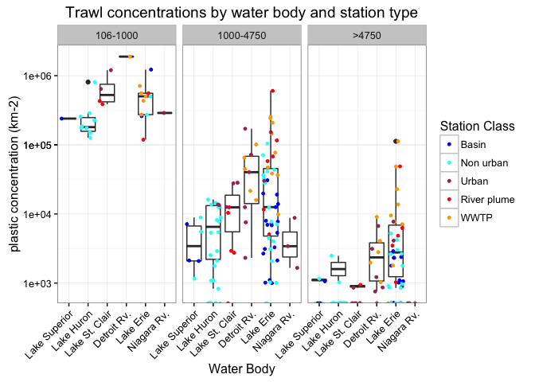
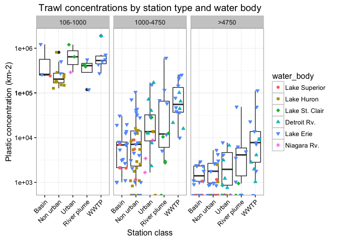
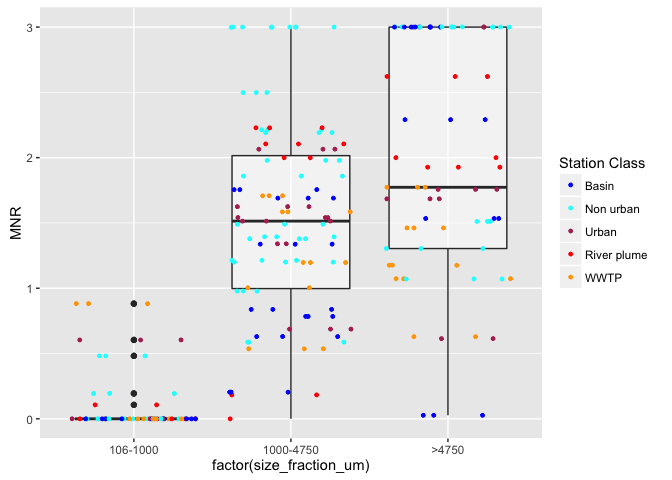

<!--BEGIN:  Set the global options and load packages-->


<!--END:  Set the global options and load packages-->

***This is an updated version from the original 2017 publication. Additional trawl metadata, such as the coordinates of each trawl, have been added and incorporated into the relevant data tables.***

# Maps and other figures generated outside of R 

## Stations sampled in 2014

```r

```


## Sample processing

```r

```


## Sample concentrations

```r

```


## SEM-EDS example images

```r

```


## Transport model outputs

```r

```


```r

```


```r

```


# Plastic concentrations

## Importing and Managing Count Data and Trawl Metadata


```r
## Read in csv
## total_conc_km2 column is summation of counts from all non-fiber plastic types: does not include fibers

gl.2014.plastics.conc.df <- 
  read.csv(file = "/Users/cabler/Box Sync/RNC_Duhaime_Lab/R_projects/gl_2014_count_data_github/final_directory/duhaime_gl_2014_plastic_concentrations.csv")

# Set factor levels for size fractions

gl.2014.plastics.conc.df$size_fraction_um <-
  factor(gl.2014.plastics.conc.df$size_fraction_um
         , levels = c('106-1000'
                      , '1000-4750'
                      , '>4750'))
```

We currently have data for 38 stations and 108 trawls.


```r
## Display data table of concentrations

datatable(gl.2014.plastics.conc.df, 
          options = list(pageLength = 10),
          caption = "Total concentrations, long format"
          )
```

<!--html_preserve--><div id="htmlwidget-fcb0a23235ad6ec5b839" style="width:100%;height:auto;" class="datatables html-widget"></div>
<script type="application/json" data-for="htmlwidget-fcb0a23235ad6ec5b839">{"x":{"filter":"none","caption":"<caption>Total concentrations, long format<\/caption>","data":[["1","2","3","4","5","6","7","8","9","10","11","12","13","14","15","16","17","18","19","20","21","22","23","24","25","26","27","28","29","30","31","32","33","34","35","36","37","38","39","40","41","42","43","44","45","46","47","48","49","50","51","52","53","54","55","56","57","58","59","60","61","62","63","64","65","66","67","68","69","70","71","72","73","74","75","76","77","78","79","80","81","82","83","84","85","86","87","88","89","90","91","92","93","94","95","96","97","98","99","100","101","102","103","104","105","106","107","108","109","110","111","112","113","114","115","116","117","118","119","120","121","122","123","124","125","126","127","128","129","130","131","132","133","134","135","136","137","138","139","140","141","142","143","144","145","146","147","148","149","150","151","152","153","154","155","156","157","158","159","160","161","162","163","164","165","166","167","168","169","170","171","172","173","174","175","176","177","178","179","180","181","182","183","184","185","186","187","188","189","190","191","192","193","194","195","196","197","198","199","200","201","202","203","204","205","206","207","208","209","210","211","212","213","214","215","216","217","218","219","220","221","222","223","224","225","226","227","228","229","230","231","232","233","234","235","236","237","238","239","240","241","242","243","244","245","246","247","248","249","250","251","252","253","254","255","256","257","258","259","260","261","262","263","264","265","266","267","268","269","270","271","272","273","274","275","276","277","278","279","280","281","282","283","284","285","286","287","288","289","290","291","292","293","294","295","296","297","298","299","300","301","302","303","304","305","306","307","308","309","310","311","312","313","314","315","316","317","318","319","320","321","322","323","324"],["AIV 0001-1","AIV 0001-2","AIV 0001-3","AIV 0002-1","AIV 0002-2","AIV 0002-3","AIV 0003-1","AIV 0003-2","AIV 0003-3","AIV 0004-1","AIV 0004-2","AIV 0004-3","AIV 0005-1","AIV 0005-2","AIV 0005-3","AIV 0006-1","AIV 0006-2","AIV 0007-1","AIV 0007-2","AIV 0007-3","AIV 0009-1","AIV 0009-2","AIV 0009-3","AIV 0010-1","AIV 0010-3","NK 0003-2","NK 0003-3","NK 0004-1","NK 0005-4","NK 0006-2","NK 0006-3","NK 0010-2","NK 0010-3","NK 0011-2","NK 0012-1","NK 0012-2","NK 0013-1","NK 0013-2","NK 0013-3","NK 0014-1","NK 0014-2","NK 0014-3","NK 0015-3","NK 0017-3","NK 0018-3","NK 0020-1","NK 0020-2","NK 0020-3","NK 0024-1","NK 0024-3","NK 0025-1","NK 0025-2","NK 0025-3","US 0001-4","US 0005-1","US 0005-2","US 0006-1","US 0006-2","NK 0007-3","NK 0022-3","NK 0006-1","NK 0023-1","US 0001-3","NK 0018-2","NK 0024-2","NK 0005-3","NK 0021-1","NK 0015-1","AIV 0010-2","NK 0009-3","NK 0008-3","NK 0015-2","US 0006-3","NK 0010-1","US 0005-3","US 0001-2","NK 0021-3","NK 0012-3","NK 0019-3","NK 0008-2","NK 0016-2","NK 0016-3","NK 0016-1","AIV 0006-3","NK 0022-2","NK 0023-2","US 0002-2","NK 0018-1","NK 0021-2","NK 0007-2","NK 0011-4","US 0002-4","US 0004-2","NK 0023-3","NK 0009-2","NK 0022-1","NK 0011-3","NK 0007-1","NK 0019-1","NK 0019-2","US 0004-1","US 0002-3","NK 0017-2","NK 0017-1","US 0003-2","US 0003-3","NK 0009-4","US 0003-1","AIV 0005-2","AIV 0006-1","AIV 0007-1","AIV 0007-2","AIV 0009-1","AIV 0010-1","NK 0013-1","NK 0013-3","AIV 0001-1","NK 0003-3","AIV 0006-2","AIV 0003-2","AIV 0006-3","NK 0014-1","NK 0013-2","NK 0015-1","NK 0024-3","AIV 0009-2","AIV 0005-3","NK 0015-3","US 0005-3","NK 0020-1","AIV 0009-3","NK 0024-1","US 0006-2","AIV 0007-3","NK 0015-2","US 0006-3","US 0001-4","AIV 0004-2","NK 0010-3","NK 0003-2","AIV 0010-3","NK 0004-1","NK 0025-1","NK 0010-2","NK 0010-1","NK 0020-2","NK 0021-2","NK 0024-2","NK 0011-2","NK 0012-3","AIV 0001-2","AIV 0005-1","US 0005-2","NK 0018-3","NK 0016-2","NK 0023-2","US 0006-1","NK 0012-1","NK 0007-3","NK 0025-2","NK 0018-1","AIV 0004-1","NK 0014-2","AIV 0010-2","NK 0020-3","AIV 0002-1","US 0005-1","NK 0019-3","NK 0005-3","NK 0011-3","NK 0025-3","AIV 0002-2","NK 0005-4","NK 0007-2","NK 0018-2","NK 0006-3","AIV 0003-1","AIV 0004-3","AIV 0003-3","NK 0014-3","AIV 0001-3","US 0002-2","AIV 0002-3","NK 0016-1","NK 0016-3","NK 0008-3","NK 0006-2","NK 0022-3","NK 0006-1","US 0004-2","NK 0012-2","NK 0022-2","NK 0023-3","NK 0019-2","NK 0017-1","NK 0007-1","NK 0023-1","NK 0021-1","US 0002-3","NK 0019-1","NK 0009-2","NK 0008-2","NK 0011-4","NK 0022-1","US 0001-3","NK 0017-3","US 0002-4","NK 0021-3","NK 0009-3","US 0003-2","US 0004-1","US 0001-2","US 0003-1","NK 0017-2","US 0003-3","NK 0009-4","AIV 0001-1","AIV 0001-2","AIV 0001-3","AIV 0002-1","AIV 0002-2","AIV 0002-3","AIV 0003-1","AIV 0003-2","AIV 0003-3","AIV 0004-1","AIV 0004-2","AIV 0004-3","AIV 0005-1","AIV 0005-2","AIV 0005-3","AIV 0006-1","AIV 0006-2","AIV 0006-3","AIV 0007-1","AIV 0007-2","AIV 0007-3","AIV 0009-1","AIV 0009-2","AIV 0009-3","AIV 0010-1","AIV 0010-2","AIV 0010-3","NK 0003-2","NK 0003-3","NK 0004-1","NK 0005-3","NK 0005-4","NK 0006-1","NK 0006-2","NK 0006-3","NK 0007-1","NK 0007-2","NK 0007-3","NK 0008-2","NK 0008-3","NK 0009-2","NK 0009-3","NK 0009-4","NK 0010-1","NK 0010-2","NK 0010-3","NK 0011-2","NK 0011-3","NK 0011-4","NK 0012-1","NK 0012-2","NK 0012-3","NK 0013-1","NK 0013-2","NK 0013-3","NK 0014-1","NK 0014-2","NK 0014-3","NK 0015-1","NK 0015-2","NK 0015-3","NK 0016-1","NK 0016-2","NK 0016-3","NK 0017-1","NK 0017-2","NK 0017-3","NK 0018-1","NK 0018-2","NK 0018-3","NK 0019-1","NK 0019-2","NK 0019-3","NK 0020-1","NK 0020-2","NK 0020-3","NK 0021-1","NK 0021-2","NK 0021-3","NK 0022-1","NK 0022-2","NK 0022-3","NK 0023-1","NK 0023-2","NK 0023-3","NK 0024-1","NK 0024-2","NK 0024-3","NK 0025-1","NK 0025-2","NK 0025-3","US 0001-2","US 0001-3","US 0001-4","US 0002-2","US 0002-3","US 0002-4","US 0003-1","US 0003-2","US 0003-3","US 0004-1","US 0004-2","US 0005-1","US 0005-2","US 0005-3","US 0006-1","US 0006-2","US 0006-3"],["AIV 0001","AIV 0001","AIV 0001","AIV 0002","AIV 0002","AIV 0002","AIV 0003","AIV 0003","AIV 0003","AIV 0004","AIV 0004","AIV 0004","AIV 0005","AIV 0005","AIV 0005","AIV 0006","AIV 0006","AIV 0007","AIV 0007","AIV 0007","AIV 0009","AIV 0009","AIV 0009","AIV 0010","AIV 0010","NK 0003","NK 0003","NK 0004","NK 0005","NK 0006","NK 0006","NK 0010","NK 0010","NK 0011","NK 0012","NK 0012","NK 0013","NK 0013","NK 0013","NK 0014","NK 0014","NK 0014","NK 0015","NK 0017","NK 0018","NK 0020","NK 0020","NK 0020","NK 0024","NK 0024","NK 0025","NK 0025","NK 0025","US 0001","US 0005","US 0005","US 0006","US 0006","NK 0007","NK 0022","NK 0006","NK 0023","US 0001","NK 0018","NK 0024","NK 0005","NK 0021","NK 0015","AIV 0010","NK 0009","NK 0008","NK 0015","US 0006","NK 0010","US 0005","US 0001","NK 0021","NK 0012","NK 0019","NK 0008","NK 0016","NK 0016","NK 0016","AIV 0006","NK 0022","NK 0023","US 0002","NK 0018","NK 0021","NK 0007","NK 0011","US 0002","US 0004","NK 0023","NK 0009","NK 0022","NK 0011","NK 0007","NK 0019","NK 0019","US 0004","US 0002","NK 0017","NK 0017","US 0003","US 0003","NK 0009","US 0003","AIV 0005","AIV 0006","AIV 0007","AIV 0007","AIV 0009","AIV 0010","NK 0013","NK 0013","AIV 0001","NK 0003","AIV 0006","AIV 0003","AIV 0006","NK 0014","NK 0013","NK 0015","NK 0024","AIV 0009","AIV 0005","NK 0015","US 0005","NK 0020","AIV 0009","NK 0024","US 0006","AIV 0007","NK 0015","US 0006","US 0001","AIV 0004","NK 0010","NK 0003","AIV 0010","NK 0004","NK 0025","NK 0010","NK 0010","NK 0020","NK 0021","NK 0024","NK 0011","NK 0012","AIV 0001","AIV 0005","US 0005","NK 0018","NK 0016","NK 0023","US 0006","NK 0012","NK 0007","NK 0025","NK 0018","AIV 0004","NK 0014","AIV 0010","NK 0020","AIV 0002","US 0005","NK 0019","NK 0005","NK 0011","NK 0025","AIV 0002","NK 0005","NK 0007","NK 0018","NK 0006","AIV 0003","AIV 0004","AIV 0003","NK 0014","AIV 0001","US 0002","AIV 0002","NK 0016","NK 0016","NK 0008","NK 0006","NK 0022","NK 0006","US 0004","NK 0012","NK 0022","NK 0023","NK 0019","NK 0017","NK 0007","NK 0023","NK 0021","US 0002","NK 0019","NK 0009","NK 0008","NK 0011","NK 0022","US 0001","NK 0017","US 0002","NK 0021","NK 0009","US 0003","US 0004","US 0001","US 0003","NK 0017","US 0003","NK 0009","AIV 0001","AIV 0001","AIV 0001","AIV 0002","AIV 0002","AIV 0002","AIV 0003","AIV 0003","AIV 0003","AIV 0004","AIV 0004","AIV 0004","AIV 0005","AIV 0005","AIV 0005","AIV 0006","AIV 0006","AIV 0006","AIV 0007","AIV 0007","AIV 0007","AIV 0009","AIV 0009","AIV 0009","AIV 0010","AIV 0010","AIV 0010","NK 0003","NK 0003","NK 0004","NK 0005","NK 0005","NK 0006","NK 0006","NK 0006","NK 0007","NK 0007","NK 0007","NK 0008","NK 0008","NK 0009","NK 0009","NK 0009","NK 0010","NK 0010","NK 0010","NK 0011","NK 0011","NK 0011","NK 0012","NK 0012","NK 0012","NK 0013","NK 0013","NK 0013","NK 0014","NK 0014","NK 0014","NK 0015","NK 0015","NK 0015","NK 0016","NK 0016","NK 0016","NK 0017","NK 0017","NK 0017","NK 0018","NK 0018","NK 0018","NK 0019","NK 0019","NK 0019","NK 0020","NK 0020","NK 0020","NK 0021","NK 0021","NK 0021","NK 0022","NK 0022","NK 0022","NK 0023","NK 0023","NK 0023","NK 0024","NK 0024","NK 0024","NK 0025","NK 0025","NK 0025","US 0001","US 0001","US 0001","US 0002","US 0002","US 0002","US 0003","US 0003","US 0003","US 0004","US 0004","US 0005","US 0005","US 0005","US 0006","US 0006","US 0006"],["&gt;4750","&gt;4750","&gt;4750","&gt;4750","&gt;4750","&gt;4750","&gt;4750","&gt;4750","&gt;4750","&gt;4750","&gt;4750","&gt;4750","&gt;4750","&gt;4750","&gt;4750","&gt;4750","&gt;4750","&gt;4750","&gt;4750","&gt;4750","&gt;4750","&gt;4750","&gt;4750","&gt;4750","&gt;4750","&gt;4750","&gt;4750","&gt;4750","&gt;4750","&gt;4750","&gt;4750","&gt;4750","&gt;4750","&gt;4750","&gt;4750","&gt;4750","&gt;4750","&gt;4750","&gt;4750","&gt;4750","&gt;4750","&gt;4750","&gt;4750","&gt;4750","&gt;4750","&gt;4750","&gt;4750","&gt;4750","&gt;4750","&gt;4750","&gt;4750","&gt;4750","&gt;4750","&gt;4750","&gt;4750","&gt;4750","&gt;4750","&gt;4750","&gt;4750","&gt;4750","&gt;4750","&gt;4750","&gt;4750","&gt;4750","&gt;4750","&gt;4750","&gt;4750","&gt;4750","&gt;4750","&gt;4750","&gt;4750","&gt;4750","&gt;4750","&gt;4750","&gt;4750","&gt;4750","&gt;4750","&gt;4750","&gt;4750","&gt;4750","&gt;4750","&gt;4750","&gt;4750","&gt;4750","&gt;4750","&gt;4750","&gt;4750","&gt;4750","&gt;4750","&gt;4750","&gt;4750","&gt;4750","&gt;4750","&gt;4750","&gt;4750","&gt;4750","&gt;4750","&gt;4750","&gt;4750","&gt;4750","&gt;4750","&gt;4750","&gt;4750","&gt;4750","&gt;4750","&gt;4750","&gt;4750","&gt;4750","1000-4750","1000-4750","1000-4750","1000-4750","1000-4750","1000-4750","1000-4750","1000-4750","1000-4750","1000-4750","1000-4750","1000-4750","1000-4750","1000-4750","1000-4750","1000-4750","1000-4750","1000-4750","1000-4750","1000-4750","1000-4750","1000-4750","1000-4750","1000-4750","1000-4750","1000-4750","1000-4750","1000-4750","1000-4750","1000-4750","1000-4750","1000-4750","1000-4750","1000-4750","1000-4750","1000-4750","1000-4750","1000-4750","1000-4750","1000-4750","1000-4750","1000-4750","1000-4750","1000-4750","1000-4750","1000-4750","1000-4750","1000-4750","1000-4750","1000-4750","1000-4750","1000-4750","1000-4750","1000-4750","1000-4750","1000-4750","1000-4750","1000-4750","1000-4750","1000-4750","1000-4750","1000-4750","1000-4750","1000-4750","1000-4750","1000-4750","1000-4750","1000-4750","1000-4750","1000-4750","1000-4750","1000-4750","1000-4750","1000-4750","1000-4750","1000-4750","1000-4750","1000-4750","1000-4750","1000-4750","1000-4750","1000-4750","1000-4750","1000-4750","1000-4750","1000-4750","1000-4750","1000-4750","1000-4750","1000-4750","1000-4750","1000-4750","1000-4750","1000-4750","1000-4750","1000-4750","1000-4750","1000-4750","1000-4750","1000-4750","1000-4750","1000-4750","1000-4750","1000-4750","1000-4750","1000-4750","1000-4750","1000-4750","106-1000","106-1000","106-1000","106-1000","106-1000","106-1000","106-1000","106-1000","106-1000","106-1000","106-1000","106-1000","106-1000","106-1000","106-1000","106-1000","106-1000","106-1000","106-1000","106-1000","106-1000","106-1000","106-1000","106-1000","106-1000","106-1000","106-1000","106-1000","106-1000","106-1000","106-1000","106-1000","106-1000","106-1000","106-1000","106-1000","106-1000","106-1000","106-1000","106-1000","106-1000","106-1000","106-1000","106-1000","106-1000","106-1000","106-1000","106-1000","106-1000","106-1000","106-1000","106-1000","106-1000","106-1000","106-1000","106-1000","106-1000","106-1000","106-1000","106-1000","106-1000","106-1000","106-1000","106-1000","106-1000","106-1000","106-1000","106-1000","106-1000","106-1000","106-1000","106-1000","106-1000","106-1000","106-1000","106-1000","106-1000","106-1000","106-1000","106-1000","106-1000","106-1000","106-1000","106-1000","106-1000","106-1000","106-1000","106-1000","106-1000","106-1000","106-1000","106-1000","106-1000","106-1000","106-1000","106-1000","106-1000","106-1000","106-1000","106-1000","106-1000","106-1000","106-1000","106-1000","106-1000","106-1000","106-1000","106-1000"],[0,0,0,0,0,0,0,0,0,0,0,0,0,0,0,0,0,0,0,0,0,0,0,0,0,0,0,0,0,0,0,0,0,0,0,0,0,0,0,0,0,0,0,0,0,0,0,0,0,0,0,0,0,0,0,0,0,0,0,0,857.6800099,0,0,0,906.1828858,0,970.7880178,0,0,0,0,1062.202583,1062.776056,0,1156.768775,1220.774655,885.0301574,0,1794.269104,985.7529131,1160.840216,1162.233907,2385.459195,0,876.7369254,2654.43503,936.7400696,0,1010.926089,1043.576629,1743.101675,1633.419768,1370.676031,0,969.6800444,2627.340632,5371.117354,0,4448.901255,2326.122354,7754.172068,6345.166162,3169.0046,2748.763057,16172.67085,26997.01413,35778.44685,75348.10347,0,0,0,0,0,0,0,0,0,0,0,0,0,998.8102542,1005.892146,0,1027.165096,1085.797039,1089.325817,0,1156.768775,0,0,2064.236023,1041.314631,2104.361484,2124.405167,2125.552112,2321.37201,0,2673.884374,0,970.7260165,976.334545,0,2080.356542,0,1710.309944,4043.705095,1812.365772,4050.013945,1783.984458,0,2720.691065,1106.395616,3917.564504,4643.360865,6193.681737,5100.016307,5452.81207,1512.923392,3092.691258,3870.279831,6239.154698,1996.051798,2049.22442,3194.686378,8856.465597,1112.428153,7177.076418,0,5371.117354,0,4132.317361,3356.336569,1043.576629,6281.508495,7750.761221,13491.83569,6865.106355,13740.26354,992.472831,2076.850681,14051.10104,5389.701379,14312.75517,8135.637346,9249.628987,16849.55963,17012.24201,23157.36027,13706.76652,9385.128471,25425.37084,9309.221884,28688.84237,16492.57834,8622.110156,26772.14315,33006.7926,28100.02157,35591.21004,27151.04124,49287.64566,17431.01675,52546.81264,48398.19267,49784.41675,66153.50062,72572.47291,114885.8168,118916.6974,125359.1151,112311.2682,71533.00962,188555.7737,147583.6772,300322.1144,null,148239.6982,null,null,null,null,null,null,null,null,null,810082.5497,255745.082,null,null,null,null,null,126933.4891,null,null,184317.3994,174813.3233,151278.6457,176486.6376,225414.6862,287334.9009,null,null,null,430325.3376,386458.1821,1199894.071,null,643313.1813,null,null,null,null,1887951.32,15968690.82,554939.4539,null,null,null,null,null,118786.8622,null,null,null,null,null,null,null,null,null,260027.8817,null,null,null,1226125.766,null,null,711929.6317,274118.8979,502822.7774,null,null,null,559671.7779,null,null,null,null,289119.1172,null,null,null,null,null,273046.4843,null,null,null,null,null,504338.0621,null,null,null,null,null,null,null,null,null,null,null,433752.027,null,null,null,null,null,239700.7664,null,null],[0,0,0,0,0,0,0,0,0,0,0,0,0,0,0,0,0,0,0,0,0,0,0,0,0,0,0,0,0,0,0,0,0,0,0,0,0,0,0,0,0,0,0,0,0,0,0,0,0,0,0,0,0,0,0,0,0,0,0,0,0,863.6175211,0,0,0,0,0,1014.48996,1024.61221,0,1027.736554,0,0,0,0,0,885.0301574,0,0,985.7529131,1160.840216,0,0,1656.483435,1753.473851,0,1873.480139,967.5699577,1010.926089,1043.576629,0,1633.419768,0,1692.585797,969.6800444,1751.560421,0,2874.036719,889.780251,3876.87059,0,2719.356926,6338.0092,10995.05223,6659.335056,16198.20848,2168.390718,20983.01616,0,0,0,0,0,0,0,0,0,0,0,0,828.2417174,0,0,0,0,0,0,0,0,1661.514485,0,0,1041.314631,0,0,0,0,2542.017462,0,1828.856429,0,0,1546.345629,0,0,0,0,0,0,0,0,0,3319.186847,0,1160.840216,0,0,908.8020117,0,0,1935.139915,0,0,1024.61221,4792.029567,0,0,0,1887.391831,0,7731.728144,0,0,0,1794.716713,0,0,6865.106355,0,992.472831,6230.552043,0,5389.701379,1192.729597,3486.70172,3083.209662,991.1505667,0,0,0,1706.386995,6137.158478,17772.15087,1550.748236,5497.526113,0,0,970.7880178,5438.713853,4448.901255,3878.720177,1971.505826,871.5508376,0,0,0,4083.549421,5310.180944,0,3805.334318,0,0,14306.60192,12676.0184,8999.00471,11926.14895,null,null,null,null,null,null,null,null,null,null,null,null,null,null,null,null,null,null,null,null,null,null,null,null,null,null,null,null,null,null,null,null,null,null,null,null,null,null,null,null,null,null,null,null,null,null,null,null,null,null,null,null,null,null,null,null,null,null,null,null,null,null,null,null,null,null,null,null,null,null,null,null,null,null,null,null,null,null,null,null,null,null,null,null,null,null,null,null,null,null,null,null,null,null,null,null,null,null,null,null,null,null,null,null,null,null,null,null],[0,0,0,0,0,0,0,0,0,0,0,0,0,0,0,0,0,0,0,0,0,0,0,0,0,0,0,0,0,0,0,0,0,0,0,0,0,0,0,0,0,0,0,0,0,0,0,0,0,0,0,0,0,0,0,0,0,0,0,850.6121005,0,0,864.2534406,897.3583565,0,0,0,0,0,0,0,0,0,0,0,0,0,1783.984458,0,0,0,1162.233907,0,0,0,0,0,1935.139915,1010.926089,0,871.5508376,0,0,2538.878696,969.6800444,875.7802107,0,0,889.780251,1550.748236,0,0,0,0,0,899.900471,1084.195359,0,0,0,0,0,0,0,0,0,0,0,0,0,0,0,0,0,0,0,0,0,0,0,0,0,0,0,0,0,0,0,0,0,1941.452033,0,0,0,0,1710.309944,0,1812.365772,0,3567.968916,0,0,0,1958.782252,0,0,2040.006523,0,0,1546.345629,0,0,0,1024.61221,0,0,0,897.1345522,0,0,0,0,0,0,4486.791782,0,0,0,0,0,6230.552043,0,5389.701379,0,0,1027.736554,991.1505667,0,0,1370.676652,1706.386995,876.7369254,6770.343189,4652.244708,0,0,6908.940169,4853.940089,1812.904618,1779.560502,1939.360089,0,871.5508376,0,864.2534406,0,4083.549421,7965.271417,1025.766222,2854.000738,6461.810056,7324.647929,4768.867308,6338.0092,4499.502355,5420.976795,null,null,null,null,null,null,null,null,null,null,null,null,null,null,null,null,null,null,null,null,null,null,null,null,null,null,null,null,null,null,null,null,null,null,null,null,null,null,null,null,null,null,null,null,null,null,null,null,null,null,null,null,null,null,null,null,null,null,null,null,null,null,null,null,null,null,null,null,null,null,null,null,null,null,null,null,null,null,null,null,null,null,null,null,null,null,null,null,null,null,null,null,null,null,null,null,null,null,null,null,null,null,null,null,null,null,null,null],[0,0,0,0,0,0,0,0,0,0,0,0,0,0,0,0,0,0,0,0,0,0,0,0,0,0,0,0,0,0,0,0,0,0,0,0,0,0,0,0,0,0,0,0,0,0,0,0,0,0,0,0,0,0,0,0,0,0,0,0,0,0,0,0,0,943.6962506,0,0,0,0,0,0,0,0,0,0,0,0,0,0,0,0,0,0,0,0,0,0,0,0,0,0,0,0,0,0,0,0,0,0,0,0,0,0,0,0,1084.195359,0,0,0,0,0,0,0,0,0,0,0,0,0,0,0,0,1014.48996,0,0,0,1106.03454,0,0,0,0,0,0,0,0,0,0,0,0,0,0,0,0,0,0,0,0,0,0,0,0,0,979.391126,0,0,0,0,756.4616958,0,0,0,0,0,0,0,0,0,1887.391831,895.1862256,0,0,5274.24318,0,0,3875.38061,0,0,0,0,0,1873.480139,0,0,0,0,3964.602267,10207.34521,3430.72004,0,853.1934973,0,846.2928986,0,5497.526113,0,0,970.7880178,6345.166162,1779.560502,3878.720177,1971.505826,6972.4067,2627.340632,11235.29473,0,17150.90757,885.0301574,0,13318.67011,15508.34414,12207.74655,44827.3527,9507.013799,16198.20848,196239.36,null,null,null,null,null,null,null,null,null,null,null,null,null,null,null,null,null,null,null,null,null,null,null,null,null,null,null,null,null,null,null,null,null,null,null,null,null,null,null,null,null,null,null,null,null,null,null,null,null,null,null,null,null,null,null,null,null,null,null,null,null,null,null,null,null,null,null,null,null,null,null,null,null,null,null,null,null,null,null,null,null,null,null,null,null,null,null,null,null,null,null,null,null,null,null,null,null,null,null,null,null,null,null,null,null,null,null,null],[0,0,0,0,0,0,0,0,0,0,0,0,0,0,0,0,0,0,0,0,0,0,0,0,0,0,0,0,0,0,0,0,0,0,0,0,0,0,0,0,0,0,0,0,0,0,0,0,0,0,0,0,0,0,0,0,0,0,0,0,0,0,0,0,0,0,0,0,0,0,0,0,0,0,0,0,0,0,0,0,0,0,0,0,0,0,0,0,0,0,0,0,0,0,0,0,0,0,0,0,0,0,0,0,0,0,0,0,0,0,0,0,0,0,0,0,0,0,0,0,0,0,0,0,0,0,0,0,0,0,0,0,0,0,0,0,0,0,0,0,0,0,0,0,0,0,0,0,0,0,0,0,0,0,0,884.8116767,0,0,0,0,0,0,0,0,0,0,0,0,0,2685.558677,0,0,0,0,0,0,0,0,0,0,0,0,0,3578.188792,0,0,0,0,0,0,0,0,0,0,2748.763057,0,7772.55769,970.7880178,0,889.780251,1939.360089,0,871.5508376,15764.04379,864.2534406,0,6533.679074,17700.60315,0,951.3335794,1292.362011,3662.323964,22890.56308,4753.5069,5399.402826,2168.390718,null,null,null,null,null,null,null,null,null,null,null,null,null,null,null,null,null,null,null,null,null,null,null,null,null,null,null,null,null,null,null,null,null,null,null,null,null,null,null,null,null,null,null,null,null,null,null,null,null,null,null,null,null,null,null,null,null,null,null,null,null,null,null,null,null,null,null,null,null,null,null,null,null,null,null,null,null,null,null,null,null,null,null,null,null,null,null,null,null,null,null,null,null,null,null,null,null,null,null,null,null,null,null,null,null,null,null,null],[0,0,0,0,0,0,0,0,0,0,0,0,0,0,0,0,0,0,0,0,0,0,0,0,0,0,0,0,0,0,0,0,0,0,0,0,0,0,0,0,0,0,0,0,0,0,0,0,0,0,0,0,0,0,0,0,0,0,756.4616958,0,0,0,0,0,0,0,0,0,0,1025.766222,0,0,0,1097.734605,0,0,0,0,0,0,0,0,0,828.2417174,0,0,0,0,0,1043.576629,871.5508376,816.7098842,2741.352062,0,1939.360089,0,895.1862256,3832.048958,889.780251,0,0,0,0,0,0,4499.502355,8673.562872,16214.14885,0,0,0,0,0,0,0,0,0,0,0,0,0,0,0,0,0,0,0,0,0,0,0,0,0,0,0,0,0,0,0,0,0,0,0,1040.178271,3293.203815,0,0,0,0,0,0,0,0,0,0,0,0,0,4538.770175,0,0,0,0,0,0,0,0,897.1345522,6605.87141,1790.372451,0,8264.634723,3835.813222,11479.34292,0,968.8451526,0,0,0,0,0,0,0,0,0,8221.892433,3964.602267,0,1715.36002,15077.44317,853.1934973,0,0,0,2748.763057,31614.40391,0,970.7880178,1812.904618,2669.340753,19393.60089,10843.28204,40962.88937,0,10371.04129,24892.20837,3266.839537,0,0,4756.667897,3877.086034,34181.69033,44827.3527,15845.023,67492.53533,86735.62872,null,null,null,null,null,null,null,null,null,null,null,null,null,null,null,null,null,null,null,null,null,null,null,null,null,null,null,null,null,null,null,null,null,null,null,null,null,null,null,null,null,null,null,null,null,null,null,null,null,null,null,null,null,null,null,null,null,null,null,null,null,null,null,null,null,null,null,null,null,null,null,null,null,null,null,null,null,null,null,null,null,null,null,null,null,null,null,null,null,null,null,null,null,null,null,null,null,null,null,null,null,null,null,null,null,null,null,null],[0,0,0,0,0,0,0,0,0,0,0,0,0,0,0,0,0,0,0,0,0,0,0,0,0,0,0,0,0,0,0,0,0,0,0,0,0,0,0,0,0,0,0,0,0,0,0,0,0,0,0,0,0,0,0,0,0,0,0,0,0,0,0,0,0,0,0,0,0,0,0,0,0,0,0,0,0,0,0,0,0,0,0,0,0,0,0,0,0,0,0,0,0,0,0,0,0,0,0,0,0,0,0,0,0,0,0,0,0,0,0,0,0,0,0,0,0,0,0,0,0,0,0,0,0,0,0,0,0,0,1769.340886,0,0,0,0,0,0,0,0,914.4282146,0,1952.66909,1546.345629,0,0,0,0,906.1828858,1012.503486,0,5358.063156,2720.691065,1106.395616,0,1160.840216,0,0,908.8020117,756.4616958,3092.691258,1935.139915,1559.788674,5988.155395,4098.44884,798.6715945,0,7786.997071,897.1345522,0,895.1862256,4639.036886,0,0,0,0,0,0,0,0,11909.67397,0,0,0,0,8135.637346,0,991.1505667,850.6121005,0,0,16210.67645,0,1692.585797,1550.748236,5497.526113,0,0,1941.576036,906.4523088,0,0,985.7529131,0,0,0,2489.220837,0,0,0,0,0,1220.774655,5722.64077,4753.5069,2699.701413,1084.195359,null,null,null,null,null,null,null,null,null,null,null,null,null,null,null,null,null,null,null,null,null,null,null,null,null,null,null,null,null,null,null,null,null,null,null,null,null,null,null,null,null,null,null,null,null,null,null,null,null,null,null,null,null,null,null,null,null,null,null,null,null,null,null,null,null,null,null,null,null,null,null,null,null,null,null,null,null,null,null,null,null,null,null,null,null,null,null,null,null,null,null,null,null,null,null,null,null,null,null,null,null,null,null,null,null,null,null,null],[0,0,0,0,0,0,0,0,0,0,0,0,0,0,0,0,0,0,0,0,0,0,0,0,0,0,0,0,0,0,0,0,0,0,0,0,0,0,0,0,0,0,0,0,0,0,0,0,0,0,0,0,0,0,0,0,0,0,756.4616958,850.6121005,857.6800099,863.6175211,864.2534406,897.3583565,906.1828858,943.6962506,970.7880178,1014.48996,1024.61221,1025.766222,1027.736554,1062.202583,1062.776056,1097.734605,1156.768775,1220.774655,1770.060315,1783.984458,1794.269104,1971.505826,2321.680432,2324.467813,2385.459195,2484.725152,2630.210776,2654.43503,2810.220209,2902.709873,3032.778268,3130.729888,3486.20335,4083.549421,4112.028093,4231.464493,4848.400222,5254.681264,6266.303579,6706.085677,7118.242008,7753.74118,7754.172068,9064.523088,9507.013799,13743.81528,22832.00591,48594.62543,48788.79115,112545.2685,0,0,0,0,0,0,0,0,0,0,0,0,828.2417174,998.8102542,1005.892146,1014.48996,1027.165096,1085.797039,1089.325817,1106.03454,1156.768775,1661.514485,1769.340886,2064.236023,2082.629263,2104.361484,2124.405167,2125.552112,2321.37201,2542.017462,2673.884374,2743.284644,2912.178049,2929.003635,3092.691258,3120.534813,3293.203815,3420.619888,4043.705095,4530.914429,5062.517432,5351.953374,5358.063156,5441.38213,5531.978078,6855.737882,6965.041297,7078.493413,7140.02283,7270.416093,7564.616958,7731.728144,7740.559662,7798.943372,7984.207193,8196.897679,8785.387539,8856.465597,8899.425224,9868.480075,10380.65507,11637.42093,12370.76503,12396.95208,12466.39297,12522.91955,12563.01699,12594.98698,13491.83569,13730.21271,13740.26354,13894.61963,14537.95477,15924.58118,16169.10414,19083.67356,19757.97641,21582.46764,27752.21587,28070.19932,28303.44033,30154.88634,30714.9659,32439.26624,36390.59464,36442.58355,38482.68279,40236.51406,41453.64101,43685.4608,44416.16313,47158.3533,58180.80266,65059.69227,67980.96533,70938.19707,71733.03557,77165.84596,101272.0256,104433.5586,115911.5831,144602.7041,152498.7173,170908.4517,208876.3881,242428.8519,252872.0324,603896.815,null,148239.6982,null,null,null,null,null,null,null,null,null,810082.5497,255745.082,null,null,null,null,null,126933.4891,null,null,184317.3994,174813.3233,151278.6457,176486.6376,225414.6862,287334.9009,null,null,null,430325.3376,386458.1821,1199894.071,null,643313.1813,null,null,null,null,1887951.32,15968690.82,554939.4539,null,null,null,null,null,118786.8622,null,null,null,null,null,null,null,null,null,260027.8817,null,null,null,1226125.766,null,null,711929.6317,274118.8979,502822.7774,null,null,null,559671.7779,null,null,null,null,289119.1172,null,null,null,null,null,273046.4843,null,null,null,null,null,504338.0621,null,null,null,null,null,null,null,null,null,null,null,433752.027,null,null,null,null,null,239700.7664,null,null],[0,0,0,0,0,0,0,0,0,0,0,0,0,0,0,0,0,0,0,0,0,0,0,0,0,0,0,0,0,0,0,0,0,0,0,0,0,0,0,0,0,0,0,0,0,0,0,0,0,0,0,0,0,0,0,0,0,0,0,0,0,0,0,0,0,0,0,0,0,0,0,0,0,0,0,0,0,0,0,0,0,0,0,0,0,0,0,0,0,0,0,0,0,0,0,0,0,0,0,0,0,0,0,0,0,0,0,953.7734616,0,0,0,0,0,0,0,0,682.6617323,1472.479062,6453.55826,6658.29896,0,0,5029.460728,0,0,0,0,0,0,1661.514485,3538.681771,0,0,0,0,1062.776056,0,2542.017462,0,914.4282146,2912.178049,0,0,0,0,0,0,0,0,0,0,0,1106.395616,1958.782252,0,0,0,1817.604023,0,3092.691258,4837.849789,0,0,3073.83663,798.6715945,61995.25918,1112.428153,0,0,0,0,0,0,0,897.3583565,0,33729.58922,0,0,0,20768.50681,936.7400696,51202.1631,0,0,0,0,0,0,0,0,0,0,1550.748236,0,0,863.6175211,970.7880178,0,0,0,1971.505826,871.5508376,2627.340632,864.2534406,0,1633.419768,1770.060315,1025.766222,951.3335794,0,0,953.7734616,7922.5115,3599.601884,2168.390718,null,51794.59336,null,null,null,null,null,null,null,null,null,61785.95718,108827.6945,null,null,null,null,null,86494.50142,null,null,52662.11411,345283.4585,126507.8733,70594.65503,37910.65177,59214.287,null,null,null,null,35960.74896,14580.55698,null,29065.35458,null,null,null,null,83246.6287,null,28721.45048,null,null,null,null,null,25197.21319,null,null,null,null,null,null,null,null,null,20841.92945,null,null,null,16698.21082,null,null,49477.73502,156865.7277,94590.42347,null,null,null,13346.70376,null,null,null,null,60699.04118,null,null,null,null,null,8506.121005,null,null,null,null,null,23624.79721,null,null,null,null,null,null,null,null,null,null,null,123286.3645,null,null,null,null,null,71400.2283,null,null],[null,null,null,null,null,null,null,null,null,null,null,null,null,null,null,null,null,null,null,null,null,null,null,null,null,null,null,null,null,null,null,null,null,null,null,null,null,null,null,null,null,null,null,null,null,null,null,null,null,null,null,null,null,null,null,null,null,null,"counted from microbes plastics","counted from microbes plastics","counted from microbes plastics","counted from microbes plastics","counted from microbes plastics","counted from microbes plastics","counted from microbes plastics","counted from microbes plastics","counted from microbes plastics","not previously counted in 1-5mm fraction","counted from microbes plastics","counted from microbes plastics","counted from microbes plastics","counted from microbes plastics","not previously counted in 1-5mm fraction","counted from microbes plastics",null,"counted from microbes plastics","counted from microbes plastics","includes counts from microbes plastics","includes counts from microbes plastics","counted from microbes plastics","includes counts from microbes plastics","includes counts from microbes plastics","counted from microbes plastics","counted from microbes plastics","includes counts from microbes plastics","counted from microbes plastics","includes counts from microbes plastics, not previously counted in 1-5mm fraction","counted from microbes plastics","counted from microbes plastics",null,"not previously counted in 1-5mm fraction, 4 nurdles 2 frags to 1-5mm","includes counts from microbes plastics, not previously counted in 1-5mm fraction, 3 nurdles 2 frags moved to 1-5mm fraction","counted from microbes plastics","includes counts from microbes plastics","includes counts from microbes plastics",null,"includes counts from microbes plastics","includes counts from microbes plastics","includes counts from microbes plastics, Fragments are possibly organic","includes counts from microbes plastics",null,"includes counts from microbes plastics, not previously counted in 1-5mm fraction","includes counts from microbes plastics, not previously counted in 1-5mm fraction","includes counts from microbes plastics","includes counts from microbes plastics, not previously counted in 1-5mm fraction, 1 nurdle to 1-5mm",null,"includes counts from microbes plastics","includes counts from microbes plastics","found no plastics, all insect pieces","no plastic was found","no plastic was found","no plastic found","no plastic found","no plastic found","no plastic was found","no plastic was found",null,null,"9 bundles of fiber",null,"includes counts from microbes plastics, Lots of little pieces, all biological looking","includes counts from microbes plastics, Green pieces were wings",null,"includes counts from microbes plastics",null,"includes counts from microbes plastics",null,"includes counts from microbes plastics",null,null,"2 of 4 fibers possibly organic material","includes counts from microbes plastics","includes counts from microbes plastics",null,"includes counts from microbes plastics",null,null,null,null,"includes counts from microbes plastics",null,"includes counts from microbes plastics",null,"includes counts from microbes plastics",null,null,"Some questionable pieces not counted",null,null,"includes counts from microbes plastics",null,null,null,"1 ball of fibers",null,null,"1 large fragment appeared \"melted\"",null,null,"includes counts from microbes plastics, Fragment may = shell, Paint pieces may be from same larger piece","one clump of fiber",null,null,"one cluster of many fibers visible w/o scope",null,null,"one paint piece possibly ceramic","includes counts from microbes plastics","includes counts from microbes plastics","includes counts from microbes plastics",null,null,null,"Very tiny blue fiber","includes counts from microbes plastics",null,null,"filament possibly organic",null,"includes counts from microbes plastics, Most paint pieces were white, probably came from same larger piece","1 bundle of filaments","includes counts from microbes plastics","includes counts from microbes plastics,ball of filament, two balls of fiber","includes counts from microbes plastics, Many clear fragments that look alike",null,"Film was split into 2 pieces",null,null,"includes counts from microbes plastics",null,"includes counts from microbes plastics",null,"includes counts from microbes plastics",null,"includes counts from microbes plastics",null,"includes counts from microbes plastics, Lost one sphere :(","1 ball of fibers",null,"includes counts from microbes plastics",null,"includes counts from microbes plastics, One fragment lost on floor",null,"2 whole counts combined - maybe jar was lost until later?","includes counts from microbes plastics",null,"includes counts from microbes plastics",null,"1 \"L\", 45 \"S\", and 1 fiber are from Melissa's counted portion",null,null,"includes counts from microbes plastics, two .333 combined - maybe whole?","includes counts from microbes plastics","includes counts from microbes plastics, 2 whole counts combined - maybe jar was lost until later?","includes counts from microbes plastics",null,null,"moved from st_850_log because all other records indicate the should be 100-1000, including vial label",null,null,null,null,null,null,null,null,null,"all non-fiber in fragment","all non-fiber in fragment",null,null,null,null,null,"all non-fiber in fragment",null,null,"all non-fiber in fragment","all non-fiber in fragment","all non-fiber in fragment, organic matter very fibrous, clumps of fibers may have been undercounted; took 4 hours to sort",null,null,"all non-fiber in fragment",null,null,null,"all non-fiber in fragment","all non-fiber in fragment","all non-fiber in fragment",null,"all non-fiber in fragment",null,null,null,null,"all non-fiber in fragment","all non-fiber in fragment, seems too high, estimated from half 100-850 count","all non-fiber in fragment",null,null,null,null,null,"all non-fiber in fragment",null,null,null,null,null,null,null,null,null,"all non-fiber in fragment",null,null,null,"all non-fiber in fragment",null,null,"1 lost fragment :(, all non-fiber in fragment","all non-fiber in fragment","all non-fiber in fragment",null,null,null,"combined 3/8 with 5/8, all non-fiber in fragment",null,null,null,null,"all non-fiber in fragment, estimated from half 100-850 count",null,null,null,null,null,"all non-fiber in fragment",null,null,null,null,null,"all non-fiber in fragment",null,null,null,null,null,null,null,null,null,null,null,"lots of small non-plastic crunchy spheres, all non-fiber in fragment",null,null,null,null,null,"all non-fiber in fragment",null,null]],"container":"<table class=\"display\">\n  <thead>\n    <tr>\n      <th> <\/th>\n      <th>trawl<\/th>\n      <th>station<\/th>\n      <th>size_fraction_um<\/th>\n      <th>fragment_conc_km2<\/th>\n      <th>film_conc_km2<\/th>\n      <th>line_conc_km2<\/th>\n      <th>nurdle_conc_km2<\/th>\n      <th>sphere_conc_km2<\/th>\n      <th>foam_conc_km2<\/th>\n      <th>paint_conc_km2<\/th>\n      <th>total_conc_km2<\/th>\n      <th>fiber_conc_km2<\/th>\n      <th>comments<\/th>\n    <\/tr>\n  <\/thead>\n<\/table>","options":{"pageLength":10,"columnDefs":[{"className":"dt-right","targets":[4,5,6,7,8,9,10,11,12]},{"orderable":false,"targets":0}],"order":[],"autoWidth":false,"orderClasses":false}},"evals":[],"jsHooks":[]}</script><!--/html_preserve-->

Note that the NK 0009-2 106-1000um fragment concentration is an order of magnitude larger than all others; this is an unreliable count on an anomalously difficult sample, so we remove this concentration from the data set.


```r
## Remove unreliable data

remove_row_num <- which(gl.2014.plastics.conc.df$'trawl' == "NK 0009-2" & gl.2014.plastics.conc.df$'size_fraction_um' == "106-1000")

gl.2014.plastics.conc.df[remove_row_num, 4:13] <- NA
```


```r
table.gl.2014.conc.by.size.comp.melt <- 
  melt(gl.2014.plastics.conc.df, 
       measure.vars = c('fragment_conc_km2', 
                        'film_conc_km2', 
                        'line_conc_km2', 
                        'nurdle_conc_km2', 
                        'sphere_conc_km2', 
                        'foam_conc_km2', 
                        'paint_conc_km2',
                        'total_conc_km2', 
                        'fiber_conc_km2'), 
       id.vars = c('station', 'trawl', 'size_fraction_um'), 
       value.name = "concentration", 
       variable.name = "conc_type", 
       na.rm = FALSE)
```

### Trawl metadata


```r
gl.2014.trawl.data <- read.csv("/Users/cabler/Box Sync/RNC_Duhaime_Lab/R_projects/gl_2014_count_data_github/final_directory/duhaime_gl_2014_trawl_metadata.csv"
                               , na.strings = "NA")

## Rearrange factor levels for station type and water body

gl.2014.trawl.data$water_body <- factor(gl.2014.trawl.data$water_body
                                        , levels = c("Lake Superior"
                                                     , "Lake Huron"
                                                     , "Lake St. Clair"
                                                     , "Detroit Rv."
                                                     , "Lake Erie"
                                                     , "Niagara Rv."))

gl.2014.trawl.data$station_class <- factor(gl.2014.trawl.data$station_class
                                           , levels = c("Basin"
                                                        , "Non urban"
                                                        , "Urban"
                                                        , "River plume"
                                                        , "WWTP"))

datatable(gl.2014.trawl.data, options = list(
  pageLength = 10,
  autoWidth = TRUE),
  caption = "Trawl metadata"
)
```

<!--html_preserve--><div id="htmlwidget-dff2a0549a9f20ffafd8" style="width:100%;height:auto;" class="datatables html-widget"></div>
<script type="application/json" data-for="htmlwidget-dff2a0549a9f20ffafd8">{"x":{"filter":"none","caption":"<caption>Trawl metadata<\/caption>","data":[["1","2","3","4","5","6","7","8","9","10","11","12","13","14","15","16","17","18","19","20","21","22","23","24","25","26","27","28","29","30","31","32","33","34","35","36","37","38","39","40","41","42","43","44","45","46","47","48","49","50","51","52","53","54","55","56","57","58","59","60","61","62","63","64","65","66","67","68","69","70","71","72","73","74","75","76","77","78","79","80","81","82","83","84","85","86","87","88","89","90","91","92","93","94","95","96","97","98","99","100","101","102","103","104","105","106","107","108","109","110","111","112","113","114","115","116"],["NK 0003","NK 0003","NK 0003","NK 0004","NK 0005","NK 0005","NK 0005","NK 0006","NK 0006","NK 0006","NK 0007","NK 0007","NK 0007","NK 0008","NK 0008","NK 0009","NK 0009","NK 0009","NK 0010","NK 0010","NK 0010","NK 0011","NK 0011","NK 0011","NK 0012","NK 0012","NK 0012","US 0001","US 0001","US 0001","US 0001","US 0002","US 0002","US 0002","US 0002","NK 0013","NK 0013","NK 0013","NK 0014","NK 0014","NK 0014","NK 0015","NK 0015","NK 0015","NK 0016","NK 0016","NK 0016","NK 0017","NK 0017","NK 0017","US 0003","US 0003","US 0003","US 0003","US 0004","US 0004","NK 0018","NK 0018","NK 0018","NK 0019","NK 0019","NK 0019","NK 0020","NK 0020","NK 0020","NK 0021","NK 0021","NK 0021","NK 0022","NK 0022","NK 0022","NK 0023","NK 0023","NK 0023","NK 0024","NK 0024","NK 0024","NK 0025","NK 0025","NK 0025","AIV 0001","AIV 0001","AIV 0001","AIV 0002","AIV 0002","AIV 0002","US 0005","US 0005","US 0005","US 0006","US 0006","US 0006","AIV 0003","AIV 0003","AIV 0003","AIV 0004","AIV 0004","AIV 0004","AIV 0005","AIV 0005","AIV 0005","AIV 0006","AIV 0006","AIV 0006","AIV 0007","AIV 0007","AIV 0007","AIV 0009","AIV 0009","AIV 0009","AIV 0010","AIV 0010","AIV 0010","Blank #1","Blank #2","Blank #3"],["NK 0003-1","NK 0003-2","NK 0003-3","NK 0004-1","NK 0005-2","NK 0005-3","NK 0005-4","NK 0006-1","NK 0006-2","NK 0006-3","NK 0007-1","NK 0007-2","NK 0007-3","NK 0008-2","NK 0008-3","NK 0009-2","NK 0009-3","NK 0009-4","NK 0010-1","NK 0010-2","NK 0010-3","NK 0011-2","NK 0011-3","NK 0011-4","NK 0012-1","NK 0012-2","NK 0012-3","US 0001-2","US 0001-3","US 0001-4","US 0001-5","US 0002-1","US 0002-2","US 0002-3","US 0002-4","NK 0013-1","NK 0013-2","NK 0013-3","NK 0014-1","NK 0014-2","NK 0014-3","NK 0015-1","NK 0015-2","NK 0015-3","NK 0016-1","NK 0016-2","NK 0016-3","NK 0017-1","NK 0017-2","NK 0017-3","US 0003-1","US 0003-2","US 0003-3","US 0003-5","US 0004-1","US 0004-2","NK 0018-1","NK 0018-2","NK 0018-3","NK 0019-1","NK 0019-2","NK 0019-3","NK 0020-1","NK 0020-2","NK 0020-3","NK 0021-1","NK 0021-2","NK 0021-3","NK 0022-1","NK 0022-2","NK 0022-3","NK 0023-1","NK 0023-2","NK 0023-3","NK 0024-1","NK 0024-2","NK 0024-3","NK 0025-1","NK 0025-2","NK 0025-3","AIV 0001-1","AIV 0001-2","AIV 0001-3","AIV 0002-1","AIV 0002-2","AIV 0002-3","US 0005-1","US 0005-2","US 0005-3","US 0006-1","US 0006-2","US 0006-3","AIV 0003-1","AIV 0003-2","AIV 0003-3","AIV 0004-1","AIV 0004-2","AIV 0004-3","AIV 0005-1","AIV 0005-2","AIV 0005-3","AIV 0006-1","AIV 0006-2","AIV 0006-3","AIV 0007-1","AIV 0007-2","AIV 0007-3","AIV 0009-1","AIV 0009-2","AIV 0009-3","AIV 0010-1","AIV 0010-2","AIV 0010-3","Blank #1","Blank #2","Blank #3"],["15-May-14","15-May-14","15-May-14","15-May-14","16-May-14","16-May-14","16-May-14","16-May-14","16-May-14","16-May-14","23-May-14","23-May-14","23-May-14","23-May-14","23-May-14","27-May-14","27-May-14","27-May-14","30-May-14","30-May-14","30-May-14","3-Jun-14","3-Jun-14","3-Jun-14","4-Jun-14","4-Jun-14","4-Jun-14","10-Jun-14","10-Jun-14","10-Jun-14","10-Jun-14","10-Jun-14","10-Jun-14","10-Jun-14","10-Jun-14","11-Jun-14","11-Jun-14","11-Jun-14","12-Jun-14","12-Jun-14","12-Jun-14","17-Jun-14","17-Jun-14","17-Jun-14","17-Jun-14","17-Jun-14","17-Jun-14","18-Jun-14","18-Jun-14","18-Jun-14","19-Jun-14","19-Jun-14","19-Jun-14","19-Jun-14","19-Jun-14","19-Jun-14","25-Jun-14","25-Jun-14","25-Jun-14","25-Jun-14","25-Jun-14","25-Jun-14","26-Jun-14","26-Jun-14","26-Jun-14","27-Jun-14","27-Jun-14","27-Jun-14","28-Jun-14","28-Jun-14","28-Jun-14","28-Jun-14","28-Jun-14","28-Jun-14","29-Jun-14","29-Jun-14","29-Jun-14","30-Jun-14","30-Jun-14","30-Jun-14","8-Jul-14","8-Jul-14","8-Jul-14","9-Jul-14","9-Jul-14","9-Jul-14","30-Jul-14","30-Jul-14","30-Jul-14","30-Jul-14","30-Jul-14","30-Jul-14","2-Aug-14","2-Aug-14","2-Aug-14","3-Aug-14","3-Aug-14","3-Aug-14","5-Aug-14","5-Aug-14","5-Aug-14","6-Aug-14","6-Aug-14","6-Aug-14","8-Aug-14","8-Aug-14","8-Aug-14","10-Aug-14","10-Aug-14","10-Aug-14","11-Aug-14","11-Aug-14","11-Aug-14",null,null,null],["Lake St. Clair","Lake St. Clair","Lake St. Clair","Lake St. Clair","Lake St. Clair","Lake St. Clair","Lake St. Clair","Lake St. Clair","Lake St. Clair","Lake St. Clair","Detroit Rv.","Detroit Rv.","Detroit Rv.","Detroit Rv.","Detroit Rv.","Lake Erie","Lake Erie","Lake Erie","Lake Erie","Lake Erie","Lake Erie","Lake Erie","Lake Erie","Lake Erie","Lake Erie","Lake Erie","Lake Erie","Detroit Rv.","Detroit Rv.","Detroit Rv.","Detroit Rv.","Detroit Rv.","Detroit Rv.","Detroit Rv.","Detroit Rv.","Lake Erie","Lake Erie","Lake Erie","Lake Erie","Lake Erie","Lake Erie","Lake Erie","Lake Erie","Lake Erie","Lake Erie","Lake Erie","Lake Erie","Lake Erie","Lake Erie","Lake Erie","Lake Erie","Lake Erie","Lake Erie","Lake Erie","Lake Erie","Lake Erie","Lake Erie","Lake Erie","Lake Erie","Lake Erie","Lake Erie","Lake Erie","Niagara Rv.","Niagara Rv.","Niagara Rv.","Lake Erie","Lake Erie","Lake Erie","Lake Erie","Lake Erie","Lake Erie","Lake Erie","Lake Erie","Lake Erie","Lake Erie","Lake Erie","Lake Erie","Lake Erie","Lake Erie","Lake Erie","Lake Huron","Lake Huron","Lake Huron","Lake Huron","Lake Huron","Lake Huron","Lake Superior","Lake Superior","Lake Superior","Lake Superior","Lake Superior","Lake Superior","Lake Huron","Lake Huron","Lake Huron","Lake Huron","Lake Huron","Lake Huron","Lake Huron","Lake Huron","Lake Huron","Lake Huron","Lake Huron","Lake Huron","Lake Huron","Lake Huron","Lake Huron","Lake Huron","Lake Huron","Lake Huron","Lake Huron","Lake Huron","Lake Huron",null,null,null],["Lake St. Clair","Lake St. Clair","Lake St. Clair","Lake St. Clair","Lake St. Clair","Lake St. Clair","Lake St. Clair","Lake St. Clair","Lake St. Clair","Lake St. Clair","Upstream of Detroit WWTP","Upstream of Detroit WWTP","Upstream of Detroit WWTP","Detroit WWTP","Detroit WWTP","Detroit Rv. Plume into Erie","Detroit Rv. Plume into Erie","Detroit Rv. Plume into Erie","East Western Basin","East Western Basin","East Western Basin","Cuyahoga Rv. Plume","Cuyahoga Rv. Plume","Cuyahoga Rv. Plume","West Central Basin","West Central Basin","West Central Basin","Upstream of Detroit WWTP","Upstream of Detroit WWTP","Upstream of Detroit WWTP","Upstream of Detroit WWTP","Detroit WWTP","Detroit WWTP","Detroit WWTP","Detroit WWTP","Nearshore Geneva, OH","Nearshore Geneva, OH","Nearshore Geneva, OH","Middle of Central Basin","Middle of Central Basin","Middle of Central Basin","Between Central and Eastern Basin","Between Central and Eastern Basin","Between Central and Eastern Basin","Eastern Basin deepest point","Eastern Basin deepest point","Eastern Basin deepest point","Erie, PA WWTP","Erie, PA WWTP","Erie, PA WWTP","Cleveland Easterly WWTP","Cleveland Easterly WWTP","Cleveland Easterly WWTP","Cleveland Easterly WWTP","Offshore Cleveland Easterly WWTP","Offshore Cleveland Easterly WWTP","East Eastern Basin","East Eastern Basin","East Eastern Basin","Buffalo WWTP","Buffalo WWTP","Buffalo WWTP","Headwaters Niagara Rv.","Headwaters Niagara Rv.","Headwaters Niagara Rv.","Tecumseh Reef","Tecumseh Reef","Tecumseh Reef","Base of Long Point","Base of Long Point","Base of Long Point","Port Burwell","Port Burwell","Port Burwell","Port Glasgow","Port Glasgow","Port Glasgow","Port Alma","Port Alma","Port Alma","Pt. Lookout","Pt. Lookout","Pt. Lookout","Tawas Pt.","Tawas Pt.","Tawas Pt.","Entrance to Keweenaw Bay","Entrance to Keweenaw Bay","Entrance to Keweenaw Bay","Middle of Keweenaw Bay","Middle of Keweenaw Bay","Middle of Keweenaw Bay","Saginaw Bay","Saginaw Bay","Saginaw Bay","Near Gravvely Pt.","Near Gravvely Pt.","Near Gravvely Pt.","Drummond Island","Drummond Island","Drummond Island","De Tour Channel","De Tour Channel","De Tour Channel","Straits of Mackinac","Straits of Mackinac","Straits of Mackinac","En Route to Presque Ile","En Route to Presque Ile","En Route to Presque Ile","Near Alpena","Near Alpena","Near Alpena",null,null,null],["River plume","River plume","River plume","River plume","River plume","River plume","River plume","Urban","Urban","Urban","Urban","Urban","Urban","WWTP","WWTP","River plume","River plume","River plume","Basin","Basin","Basin","River plume","River plume","River plume","Basin","Basin","Basin","Urban","Urban","Urban","Urban","WWTP","WWTP","WWTP","WWTP","Non urban","Non urban","Non urban","Basin","Basin","Basin","Basin","Basin","Basin","Basin","Basin","Basin","WWTP","WWTP","WWTP","WWTP","WWTP","WWTP","WWTP","Urban","Urban","Basin","Basin","Basin","WWTP","WWTP","WWTP","Urban","Urban","Urban","Non urban","Non urban","Non urban","Non urban","Non urban","Non urban","Non urban","Non urban","Non urban","Non urban","Non urban","Non urban","Non urban","Non urban","Non urban","Non urban","Non urban","Non urban","Non urban","Non urban","Non urban","Non urban","Non urban","Non urban","Basin","Basin","Basin","Urban","Urban","Urban","Non urban","Non urban","Non urban","Non urban","Non urban","Non urban","Non urban","Non urban","Non urban","Non urban","Non urban","Non urban","Non urban","Non urban","Non urban","Non urban","Non urban","Non urban",null,null,null],["-82.739120","-82.759216","-82.739979","-82.711555","-82.782166","-82.759926","-82.734103","-82.703621","-82.690208","-82.701302","-83.048900","-83.042198","-83.082077","-83.106598","-83.116585","-83.120789","-83.130824","-83.138720","-82.397476","-82.389854","-82.396202","-81.737727","-81.716627","-81.715615","-81.924798","-81.943657","-81.951334","-83.079883","-83.098727","-83.080727","-83.097970","-83.106852","-83.106932","-83.121302","-83.116082","-80.936306","-80.940483","-80.956322","-81.135582","-81.137047","-81.135925","-80.151000","-80.172000","-80.153000","-79.889000","-79.896000","-79.888000","-80.062000","-80.047000","-80.059000","-81.588360","-81.594842","-81.593922","-81.593723","-81.604267","-81.594933","-79.027635","-79.045000","-79.024892","-78.867958","-78.881058","-78.864685","-78.909669","-78.907806","-78.909225","-79.717758","-79.738976","-79.729591","-80.455900","-80.477515","-80.475040","-80.867142","-80.895805","-80.873802","-81.484886","-81.506778","-81.483200","-82.251615","-82.254349","-82.235563","-83.533583","-83.523333","-83.514667","-83.491233","-83.490600","-83.483733","-88.414533","-88.393017","-88.409633","-87.995367","-87.987800","-87.990650","-83.809783","-83.781217","-83.761700","-83.622267","-83.570717","-83.532700","-83.506017","-83.529617","-83.561233","-83.884833","-83.897400","-83.895583","-84.578583","-84.541233","-84.487483","-","-83.652283","-83.640350","-83.259450","-83.249483","-83.236167",null,null,null],["42.486580","42.478024","42.488525","42.556496","42.471820","42.473690","42.462555","42.412777","42.398563","42.407745","42.324009","42.325611","42.307514","42.278366","42.258755","41.948616","41.970198","41.986520","41.679165","41.695938","41.678909","41.534317","41.511150","41.508772","41.914432","41.932867","41.942932","42.311233","42.291443","42.309643","42.292375","42.272385","42.275575","42.252618","42.260823","41.871731","41.876671","41.872089","42.279808","42.292885","42.284145","42.356000","42.357000","42.360000","42.510000","42.448000","42.510000","42.153000","42.164000","42.154000","41.578305","41.572412","41.571805","41.573678","41.589600","41.599550","42.780766","42.771800","42.781075","42.788887","42.768318","42.784126","42.926071","42.925739","42.920242","42.789875","42.800175","42.795876","42.560253","42.564217","42.562897","42.603844","42.639579","42.633247","42.468002","42.461391","42.472771","42.140109","42.136944","42.160954","44.109267","44.138333","44.166683","44.263600","44.254050","44.253117","46.954717","46.964733","46.959283","47.114433","47.125467","47.108900","43.702400","43.736750","43.762217","43.974083","43.997767","44.028817","46.047433","46.075583","46.100217","45.990517","45.861350","45.907617","45.852817","45.863917","45.879183","-","45.483717","45.447550","45.222000","45.227767","45.197833",null,null,null],["-82.754710","-82.742142","-82.752296","-82.696762","-82.766550","-82.778473","-82.767760","-82.693405","-82.701668","-82.690300","-83.041470","-83.067635","-83.075256","-83.116821","-83.113579","-83.126328","-83.135368","-83.140602","-82.392403","-82.395821","-82.389763","-","-81.711143","-81.714390","-81.937800","-81.955397","-81.937853","-83.096702","-83.093138","-83.098675","-83.090712","-83.103337","-83.121020","-83.116022","-83.110283","-80.939903","-80.956856","-80.939514","-81.136940","-81.135338","-81.137856","-","-80.152000","-80.169000","-79.895000","-79.890000","-79.890000","-80.046000","-80.054000","-80.040000","-81.592948","-81.593922","-81.593487","-81.593067","-","-81.589833","-79.043600","-79.027220","-79.037574","-78.873474","-78.865608","-78.859940","-78.909271","-78.910378","-78.905330","-79.734840","-79.721900","-79.747309","-80.476819","-80.465538","-80.496513","-80.887154","-80.877457","-80.894836","-81.499702","-81.485543","-81.495811","-82.296353","-82.240112","-82.241005","-","-83.518700","-83.509883","-83.491117","-83.488867","-83.471633","-88.390500","-88.414300","-88.393017","-87.986983","-87.994767","-87.983017","-83.797900","-83.770033","-83.746533","-83.586400","-83.552167","-83.528367","-83.515467","-83.547633","-83.585900","-83.889300","-83.893733","-83.892550","-84.555533","-84.510933","-84.461167","-83.653400","-","-","-83.253700","-83.242700","-83.226983",null,null,null],["42.481440","42.487399","42.485200","42.555866","42.473438","42.465530","42.467216","42.399967","42.407872","42.397888","42.325649","42.317375","42.312759","42.258652","42.263320","41.960896","41.984507","41.997082","41.690037","41.683167","41.688049","-","41.502748","41.507820","41.925405","41.947225","41.927905","42.293833","42.296923","42.291258","42.299218","42.283880","42.253470","42.260550","42.269845","41.877010","41.871349","41.877018","42.293335","42.285557","42.298660","-","42.359000","42.359000","42.479000","42.506000","42.486000","42.165000","42.157000","42.163000","41.572430","41.571813","41.571828","41.572450","-","41.607800","42.781500","42.779870","42.773800","42.775126","42.781963","42.797999","42.926685","42.926819","42.919300","42.798222","42.793678","42.804115","42.563335","42.561583","42.565754","42.636688","42.634627","42.639103","42.460579","42.471199","42.463779","42.134193","42.154958","42.155334","-","44.156050","44.182483","44.256383","44.250517","44.259900","46.963583","46.957067","46.964733","47.130100","47.107500","47.123167","43.718450","43.752650","43.780700","43.991367","44.008167","44.045750","46.064267","46.089600","46.109117","45.975150","45.934600","45.879433","45.861017","45.872750","45.887500","45.496933","-","45.425500","45.238700","45.210783","45.180050",null,null,null],["12:07","12:58","13:31","15:13","12:18","12:50","13:25","14:32","15:15","15:50","11:28","11:57","12:35","15:18","15:48","13:07","13:42","14:10","09:08","09:44","10:20","17:54","18:28","19:06","10:10","10:44","11:17","11:00","11:32","12:12","12:56","02:08","03:16","03:39","04:07","03:53","04:26","05:01","08:46","09:17","09:48","07:58","08:34","09:16","11:29","11:59","12:36","07:45","08:17","08:50","08:41","09:10","09:38","11:11","12:25","12:50","12:52","13:26","13:58","16:34","17:10","17:43","07:56","08:35","09:11","12:33","13:04","13:56","10:07","10:42","11:22","13:39","14:16","14:46","10:34","11:07","11:38","08:39","09:14","09:47","10:43","11:22","12:01","09:35","10:07","10:49","09:28","10:00","10:29","14:21","14:54","15:27","13:44","14:27","15:11","12:22","12:56","13:37","13:06","13:38","14:11","12:08","12:50","13:28","16:29","17:04","17:37","14:40","15:13","15:49","13:31","16:04","16:39",null,null,null],["12:27","13:18","13:54","15:34","12:38","13:10","13:45","14:52","15:35","16:10","11:48","12:17","12:55","15:38","16:08","13:27","14:02","14:30","09:28","10:04","10:40","18:14","18:50","19:27","10:30","11:04","11:37","11:21","11:52","12:32","01:26","02:38","03:36","03:59","04:27","04:13","04:46","05:21","09:06","09:37","10:08","08:18","08:55","09:38","11:50","12:19","12:56","08:07","08:38","09:13","09:01","09:30","09:59","11:41","12:45","13:10","13:12","13:46","14:18","16:55","17:31","18:03","08:17","08:56","09:33","12:53","13:24","14:16","10:27","10:02","11:42","13:59","14:36","15:07","10:54","11:27","11:58","08:59","09:34","10:07","11:04","11:45","12:22","09:52","10:27","11:09","09:50","10:20","10:50","14:43","15:14","15:47","14:06","14:47","15:31","12:42","13:20","13:57","13:26","13:58","14:22","12:28","13:13","13:50","16:49","17:25","17:57","15:00","15:33","16:09","13:51","16:24","16:59",null,null,null],[null,null,null,null,null,null,null,null,null,null,0.9,3.7,1.3,3.9,0.9,2.4,1.9,2,2.4,2.5,2.1,2.9,2.7,2.5,3.1,2.6,3.2,2.8,1.2,4.4,1,0.1,3.5,2,1.9,2.7,2.8,2.7,3.3,1.7,2.6,2,2.7,1.9,2.3,2.6,2.3,2.5,2.3,2.3,2.3,2.4,2.6,null,1.3,1.7,2.8,0,1.7,2.4,3.2,3,0.6,0.1,1.3,2.8,2.7,2.8,2.7,2.9,2.5,3,2.7,2.9,2.7,2.9,2.8,1.7,3.9,1.5,2.5,2.4,2.3,0.9,0.9,1.2,3.5,3,2,3,3.4,2.8,2.8,3,2.3,2.3,2.3,3.4,3.9,3.9,4.4,2.7,4.8,4.8,2.9,3.8,4.1,3.6,2.8,3,3,3.3,3.2,null,null,null],[2,2,2,1,null,null,null,null,null,null,1.6,4.3,1.7,4,1.1,1.1,2.4,2.7,2.1,3,2.5,0,3.3,3.1,2.9,3,3.1,2.8,1.1,3,0.9,1,2.8,0.5,0.6,2.3,2.3,2.7,2.5,1.6,2.4,null,2.3,1.9,2.2,3,1.8,3,2.2,3,3.4,2.4,2.7,null,null,null,0,3.7,1.8,2.8,2.1,2.4,0.3,0.6,0.2,3.2,2.9,3,3,2.7,2.8,3.3,2.4,3.6,2.8,3.4,2.1,1.5,3.8,1.5,3,null,2.9,1,1,1.5,3.5,3,2,3,3.4,2.8,3,3,3,2.3,2.3,3.5,3.8,3,2.2,2.8,4,4,2.3,3.5,3.5,4.5,3,3.3,3.6,3.4,3.3,null,null,null],["000000","058963","125675","167145","466229","527973","529616","656835","727961","789509","852498","916175","974631","244821","306706","542811","605759","665230","721496","777068","835715","019706","079959","148105","234553","301678","373178","648885","698860","769970","972046, 907835","062517, 994519","822543","887666","955131","029892","094340","154986","220119","281196","311758","462903","523034","580468","635612","686753","739307","945907","968098","006594","066282","130266","194389","161606, 089257","364539","411750","459090","522141","591289","851699","920260","998934","179225","252659","324051","628051","690889","782942","858102","927759","997332","069065","139711","208659","287801","346912","416956","479602","519605",null,"016033","105394","139550","168942","175830","176130","198767","253605","308742","438505","498394","556972","720577","729638","738801","757492","796602","782380","791278","836125","893676","949699","982229","063079","136730","191037","252340","451740","505026","561209","630162","694123","753660",null,null,null],["058963","125675","167104","229627","527973","592616","656845","727961","789509","852474","916175","974631","055274","306706","366063","605759","665230","721496","777068","835715","881344","079956","148105","218099","301678","373178","441568","698856","769445","822528","062493, 994497","158153, 911980","887666","954965","029825","094339","154986","218128","281195","311758","373224","523035","580465","635623","686758","739304","791795","968100","006598","031101","130242","194390","262178","202027, 160407","411742","456256","522138","590122","653576","920259","998936","066932","252656","323995","400432","690890","751233","851870","927758","997339","069049","139702","208656","280742","346906","414231","476346","519052",null,null,"105394","139550","168923","175830","176122","198767","253605","308742","361478","498312","556977","614372","729620","738800","756560","796602","782380","791266","836122","893680","949677","982226","067303","136733","191037","252336","310318","505026","561209","630165","694108","753661","816503",null,null,null],[1584.514284,1792.753369,1113.32263,1679.080465,1659.248171,1737.153076,3419.028336,1911.370909,1653.981058,1692.060137,1711.193732,1570.889659,2167.121506,1663.037268,1595.102256,1690.603296,1598.165781,1512.03773,1493.387849,1576.022407,1226.189343,1619.099869,1831.289289,1880.950643,1803.851929,1921.421421,1837.846308,1342.872026,1896.832602,1412.392546,null,null,1750.052129,1808.527836,2007.253869,1731.885963,1629.741588,1696.816663,1641.296989,821.2934473,1651.77747,1615.928852,1543.344806,1482.181797,1374.447832,1412.204435,1410.511435,596.3930854,1034.611535,658.5772696,1718.798799,1723.205975,1821.695619,null,1268.487487,1196.010934,1694.290598,1826.85524,1673.840225,1842.414722,2114.262262,1827.312081,1973.313236,1917.014245,2052.588666,1688.674136,1621.625934,1852.303996,1871.86756,1869.82521,1927.252868,1898.229999,1852.760838,1937.088396,1588.330253,1809.065296,1595.989066,1060.14091,null,null,2401.400554,917.8751059,789.3414183,185.1014091,7.846923847,608.3247093,1473.663048,1481.698083,1417.175945,1607.195118,1574.302533,1542.511743,243.012782,246.2106722,477.2380842,1051.004081,-382.1881882,238.7937168,1205.094017,1546.677062,1504.916378,874.0989451,2286.195888,1979.305921,1459.39347,1647.289674,1558.044352,1431.95611,1509.807269,1853.056441,1718.422576,1599.966274,1688.781628,null,null,null],[0.000966554,0.00109358,0.000679127,0.001024239,0.001012141,0.001059663,0.002085607,0.001165936,0.001008928,0.001032157,0.001043828,0.000958243,0.001321944,0.001014453,0.000973012,0.001031268,0.000974881,0.000922343,0.000910967,0.000961374,0.000747975,0.000987651,0.001117086,0.00114738,0.00110035,0.001172067,0.001121086,0.000819152,0.001157068,0.000861559,null,null,0.001067532,0.001103202,0.001224425,0.00105645,0.000994142,0.001035058,0.001001191,0.000500989,0.001007584,0.000985717,0.00094144,0.000904131,0.000838413,0.000861445,0.000860412,0.0003638,0.000631113,0.000401732,0.001048467,0.001051156,0.001111234,null,0.000773777,0.000729567,0.001033517,0.001114382,0.001021043,0.001123873,0.0012897,0.00111466,0.001203721,0.001169379,0.001252079,0.001030091,0.000989192,0.001129905,0.001141839,0.001140593,0.001175624,0.00115792,0.001130184,0.001181624,0.000968881,0.00110353,0.000973553,0.000646686,0.000646686,0.000646686,0.001464854,0.000559904,0.000481498,0.000112912,4.79e-06,0.000371078,0.000898934,0.000903836,0.000864477,0.000980389,0.000960325,0.000940932,0.000148238,0.000150189,0.000291115,0.000641112,-0.000233135,0.000145664,0.000735107,0.000943473,0.000917999,0.0005332,0.001394579,0.001207377,0.00089023,0.001004847,0.000950407,0.000873493,0.000920982,0.001130364,0.001048238,0.000975979,0.001030157,null,null,null],["Greg, Sarah, Rachel, Melissa D.","Greg, Sarah, Rachel, Melissa D.","Greg, Sarah, Rachel, Melissa D.","Greg, Sarah, Rachel, Melissa D.","Greg, Sarah, Rachel, Melissa D.","Greg, Sarah, Rachel, Melissa D.","Greg, Sarah, Rachel, Melissa D.","Greg, Sarah, Rachel, Melissa D.","Greg, Sarah, Rachel, Melissa D.","Greg, Sarah, Rachel, Melissa D.","Greg, Sarah, Emma, Rachel, Melissa D.","Greg, Sarah, Emma, Rachel, Melissa D.","Greg, Sarah, Emma, Rachel, Melissa D.","Greg, Sarah, Emma, Rachel, Melissa D.","Greg, Sarah, Emma, Rachel, Melissa D.","Greg, Sarah, Rachel","Greg, Sarah, Rachel","Greg, Sarah, Rachel","Greg, Sarah, Rachel","Greg, Sarah, Rachel","Greg, Sarah, Rachel","Lauren, Rachel, Melissa","Lauren, Rachel, Melissa","Lauren, Rachel, Melissa","Lauren, Rachel, Melissa","Lauren, Rachel, Melissa","Lauren, Rachel, Melissa","Emma, Greg, Rachel, Melissa","Emma, Greg, Rachel, Melissa","Emma, Greg, Rachel, Melissa","Emma, Greg, Rachel, Melissa","Emma, Greg, Rachel, Melissa","Emma, Greg, Rachel, Melissa","Emma, Greg, Rachel, Melissa","Emma, Greg, Rachel, Melissa","Emma, Greg, Rachel","Emma, Greg, Rachel","Emma, Greg, Rachel","Emma, Greg, Rachel","Emma, Greg, Rachel","Emma, Greg, Rachel","Caitlin, Greg, Rachel","Caitlin, Greg, Rachel","Caitlin, Greg, Rachel","Caitlin, Greg, Rachel","Caitlin, Greg, Rachel","Caitlin, Greg, Rachel","Caitlin, Greg, Rachel","Caitlin, Greg, Rachel","Caitlin, Greg, Rachel","Kat, Greg, Rachel, Melissa D.","Kat, Greg, Rachel, Melissa D.","Kat, Greg, Rachel, Melissa D.","Kat, Greg, Rachel, Melissa D.","Kat, Greg, Rachel, Melissa D.","Kat, Greg, Rachel, Melissa D.","Kat, Greg, Rachel","Kat, Greg, Rachel","Kat, Greg, Rachel","Kat, Greg, Rachel","Kat, Greg, Rachel","Kat, Greg, Rachel","Steve, Melissa F., Kat, Greg, Rachel","Steve, Melissa F., Kat, Greg, Rachel","Steve, Melissa F., Kat, Greg, Rachel","Steve, Melissa F., Greg","Steve, Melissa F., Greg","Steve, Melissa F., Greg","Steve, Melissa F., Greg","Steve, Melissa F., Greg","Steve, Melissa F., Greg","Steve, Melissa F., Greg","Steve, Melissa F., Greg","Steve, Melissa F., Greg","Steve, Melissa F., Greg","Steve, Melissa F., Greg","Steve, Melissa F., Greg","Steve, Melissa F., Greg","Steve, Melissa F., Greg","Steve, Melissa F., Greg","Greg, Rachel, BaySail","Greg, Rachel, BaySail","Greg, Rachel, BaySail","Greg, Rachel, BaySail","Greg, Rachel, BaySail","Greg, Rachel, BaySail","Greg, Rachel","Greg, Rachel","Greg, Rachel","Greg, Rachel","Greg, Rachel","Greg, Rachel","Greg, Rachel, BaySail","Greg, Rachel, BaySail","Greg, Rachel, BaySail","Greg, Rachel, BaySail","Greg, Rachel, BaySail","Greg, Rachel, BaySail","Greg, Rachel, BaySail","Greg, Rachel, BaySail","Greg, Rachel, BaySail","Greg, Rachel, BaySail","Greg, Rachel, BaySail","Greg, Rachel, BaySail","Greg, Rachel, BaySail","Greg, Rachel, BaySail","Greg, Rachel, BaySail","Greg, Rachel, BaySail","Greg, Rachel, BaySail","Greg, Rachel, BaySail","Greg, Rachel, BaySail","Greg, Rachel, BaySail","Greg, Rachel, BaySail",null,null,null],["1-2","2","3","1","0","0","0","0","0","0","0","0","0","0","0","0","0","0","1","0","0","1","1","1","0","0","0","1","0","1","0","0","0","0","0","1","1","1","2","2","2","1","1","1","1-2","1-2","1","0","1","1","2","1-2","2","2","3","3","1","1","1","1","1","1","0","0","0","0","0","0","1","1","1","1","1","1","2","2","2","3","3","3","0-1","0-1","0-1","0","0","0","1","1","1","1","1","1","0","0-1","0-1","0","0","0","0","0-1","0-1","0-1","2","2","0","0","0","1-2","1-2","1-2","2","2","2",null,null,null],[4.9,7.81,5.71,17.23,null,33.96,113.25,16.52,22.35,17.43,33.11,39.66,43.27,59.37,24.5,351.19,110.36,null,61.07,37.34,35.37,217.06,158.47,162.14,420.52,522.38,533.86,610.35,null,46.17,88.51,62.2,203.1,413.99,322.21,56.02,143.89,99.31,83.71,46.2,49.19,52.79,22.38,24.72,16.98,15.77,11.17,105.56,496.17,112.65,null,201.79,440.62,58.13,341.19,182.96,16.52,20.74,20.36,117.08,149.46,179.14,172.63,195.3,132.95,65.82,42.33,95.14,438.19,361.5,308.93,37.35,56,59.41,45.93,45.63,63.64,60.37,60.83,26.15,89.81,77.59,53.71,7.72,30.08,67.18,85.53,89.8,92.91,61.59,47,81.26,737.65,568.2,540.57,413.61,308.76,353.08,45.49,46.99,19.43,109.3,74.69,216.24,50.4,55.06,64.9,4.7,14.63,23.72,10.37,37.38,84.77,0.24,1.05,0.73],[0.15,0.24,0.16,1.65,1.16,2.48,14.56,1.21,1.41,1.53,2.51,3.11,2.28,9.18,2.49,36.2,26.11,196.38,3.31,1.58,1.62,12.7,29.34,13.77,30.25,35.92,36.03,43.56,77.11,2.49,5.18,6.31,12.42,34.95,30.37,5.12,14.3,6.56,4.13,2.29,3.15,2.57,1.4,1.61,0.67,0.47,0.45,5.94,104.64,7.76,199.67,39.26,75.78,2.28,20.87,4.35,0.83,0.83,2.02,8.95,7.74,9.49,7.57,9.58,7.22,2.43,1.2,3.12,29.45,27.78,16.36,1.56,1.63,3.19,2.49,9.16,2.11,2.51,2.16,0.63,6.79,3.84,2.96,0.21,1.29,3.32,3.25,4.05,4.13,3.29,2.12,8.38,25.25,20.87,18.63,10.53,8.85,7.87,2.45,1.92,0.93,5.48,2.84,8.73,1.78,2.1,2.79,0.26,0.14,0.26,0.21,0.25,0.33,-0.01,0.03,0.02],[null,null,null,null,null,null,null,null,null,null,null,null,null,null,null,8.953806667,9.08962,11.39095,7.88508,6.82996,8.142466667,12.34641,11.55874667,2.20318,5.3592,6.325126667,6.828388333,null,null,null,null,null,null,null,null,11.04495,8.260993333,7.314868333,10.67458,9.573978333,9.81426,8.574303333,10.99347333,11.55514,null,11.94175333,13.75408,8.95425,11.94765167,9.59755,12.951035,14.7548,56.70505333,18.80030167,18.34286667,-14.97985,4.334173333,5.44585,4.022943333,9.95201,11.41933333,10.74613667,null,null,null,5.17532,6.977093333,5.687406667,5.033853333,5.07712,5.348693333,6.9944,6.434366667,6.22562,11.11300667,11.29384333,11.26735667,12.39599,11.88843333,12.13806167,6.185668333,8.23209,12.28782167,8.7147,3.690666667,7.292866667,10.54738,11.4384,11.34492333,8.84886,9.50864,8.087445,6.97784,7.2725,7.818051667,2.09495,2.007226667,2.270926667,6.17063,6.077286667,7.07546,7.435226667,10.77743333,6.874473333,6.057561667,6.323346667,6.295581667,null,7.120066667,6.561615,8.909856667,6.787846667,6.31199,null,null,null],[null,null,null,null,null,null,null,null,null,null,null,null,null,null,null,0.616191667,0.52342,0.543366667,0.173386667,0.17982,0.3092,0.21013,0.029653333,0.22214,0.807683333,0.658573333,0.907665,null,null,null,null,null,null,null,null,0.516588333,0.60882,0.95853,0.74422,0.925,0.925,0.516293333,0.515373333,0.402606667,null,0.388921667,0.30598,0.278475,0.771883333,0.76295,0.997761667,0.994366667,0.997073333,0.689581667,0.452091667,0.614783333,0.9665,0.927856667,0.97685,0.866033333,0.824683333,0.938906667,null,null,null,0.267555,0.150993333,0.254906667,0.36105,0.3408,0.374763333,0.73025,0.537326667,0.6044,0.695036667,0.70458,0.714606667,0.669925,0.710146667,0.732556667,0.804011667,0.84354,0.96204,0.324025,0.519858333,0.385808333,0.066306667,0,0.028033333,0.470745,0.25773,0.82144,0.15218,0.27059,0.3236,0.015006667,0.005186667,0.09393,0.28785,0.264836667,0.052175,0.002386667,0.003333333,0,0.030981667,0.033033333,0.090931667,null,0,0,0.182683333,0.13612,0.21207,null,null,null],[null,null,null,null,null,null,null,null,null,null,null,null,null,null,null,19.84715741,18.97242222,20.10900926,14.81129259,14.81965926,14.88079629,19.2796,18.08385555,17.49937222,17.74203704,17.73065185,17.21723889,null,null,null,null,null,null,null,null,20.48239629,20.4410963,20.25933056,18.31719815,18.62556574,18.40635556,20.23956111,21.08878889,21.60716296,null,22.08511666,22.74838889,19.16902778,18.69091852,18.88720371,19.29597593,19.52371296,19.41386482,19.39417777,19.57529167,19.50933333,20.00544074,19.97180185,20.00198518,21.2268963,21.17916667,21.32784166,null,null,null,21.17747222,22.18022592,21.45877408,23.62945834,23.14148889,24.01304629,23.63080555,23.93937037,23.84965,22.93233704,23.13679444,23.02780926,23.07861389,23.00849815,23.04526111,18.74413055,18.12762963,18.83649445,15.13648148,17.95412685,16.01788796,12.19414074,13.75827778,13.36186389,13.24879722,12.88216111,13.94299722,20.18515185,20.39356111,20.44539815,24.86508334,21.92066296,21.7280287,20.43122222,20.16911667,20.72097315,19.57701482,19.61909259,19.76202963,21.12866759,21.02486667,21.103175,null,21.13580556,20.97279074,20.74511852,20.74594815,20.72900278,null,null,null],[null,null,null,null,null,null,null,null,null,null,null,null,null,null,null,18.41345,18.14719445,17.67179629,15.88164445,15.40984815,15.78727778,18.02628334,16.62135185,16.54547222,16.53316666,16.44271111,16.58520926,null,null,null,null,null,null,null,null,16.13806389,16.47773889,18.12666204,17.86202592,18.43928055,18.17517777,16.70967963,16.82116852,17.4200074,null,15.11614352,15.76131111,18.54670833,18.99398148,18.52237963,20.53588704,20.41284259,20.3957574,20.4122324,20.70759722,20.53886112,20.83667778,21.27911482,20.74771112,20.54642037,20.69182408,20.5909287,null,null,null,21.04958056,21.43905556,20.94216666,22.28228518,21.44212778,21.91807222,22.26981111,22.1236963,21.96001111,22.07708148,22.06445278,22.05205185,22.50679444,23.03815555,22.63820741,18.54622963,18.35948704,17.29398982,15.12118519,15.14917408,14.68655185,11.08324815,11.33677778,11.07419352,12.81350278,12.71642778,12.68810556,22.16927778,22.19690556,22.38248333,22.40952037,21.50264444,20.88668796,19.10814445,18.72640926,19.38936945,20.93096666,15.67020371,16.93116667,20.78201203,19.95768519,20.19131574,null,20.41956296,19.89492777,20.02039537,19.52871852,20.04354723,null,null,null],[null,null,null,null,null,null,null,null,null,null,null,null,null,null,null,0.156831667,0.07796,0.087483333,-0.097666667,-0.08676,-0.112333333,0.2408,0.159773333,0.13839,0.27425,0.356246667,0.238158333,null,null,null,null,null,null,null,null,0.146893333,0.14451,0.139191667,0.23259,0.189843333,0.20524,0.144053333,0.16343,0.157633333,null,0.319451667,0.29964,0.0535,0.017126667,0.040666667,-0.12507,-0.092883333,-0.082756667,-0.110183333,-0.2503,-0.257483333,-0.081033333,-0.060906667,-0.083783333,-0.025346667,-0.018583333,-0.036283333,null,null,null,0.139275,0.049873333,0.098926667,0.039211667,0.03216,0.049136667,0.08793,-0.066346667,0.077476667,0.08322,0.04119,0.060863333,0.141385,0.14151,0.262233333,0.025915,0.118466667,0.114611667,0.038358333,0.055496667,0.062076667,0.010833333,0.0298,0.024241667,0.03072,0.05558,-0.02489,-0.09014,-0.1319,-0.106883333,-0.072639667,-0.087633333,-0.03629,-0.01174,-0.01151,-0.031041667,-0.070466667,0.034616667,-0.044786667,0.005481667,0.010873333,-0.029886667,null,-0.206091667,-0.147776667,-0.0651,0.03144,-0.04957,null,null,null],[null,null,null,null,null,null,null,null,null,null,null,null,null,null,null,-0.145515,-0.19986,-0.280716667,-0.029926667,0.005273333,-0.016166667,-0.04227,0.091693333,0.08176,-0.220916667,-0.152146667,-0.303231667,null,null,null,null,null,null,null,null,0.007788333,0.005716667,0.020213333,0.043946667,-0.021196667,0.00598,0.082576667,0.046786667,0.024733333,null,0.030111667,-0.0039,-0.041925,0.028326667,-0.033066667,-0.089836667,-0.062016667,-0.058143333,0.050876667,-0.1041,-0.118883333,0.048693333,0.04228,0.046983333,-0.04758,-0.059416667,-0.057893333,null,null,null,0.026805,-0.075873333,0.033886667,0.023368333,0.03819,0.027823333,0.085425,0.042286667,0.061816667,-0.125133333,-0.071261667,-0.11241,0.076705,0.118986667,-0.002936667,-0.12267,-0.006206667,0.115966667,0.014216667,0.028166667,0.035166667,0.01406,0.0346,0.028123333,-0.174245,-0.16363,-0.14223,-0.059166667,-0.027585,0.025438333,0.044673333,-0.022666667,0.053076667,0.09368,0.10988,0.030083333,-0.266486667,0.049766667,-0.017533333,0.034,0.10708,0.099853333,null,0.009355,-0.039205,0.108031667,0.16074,0.148125,null,null,null],[null,null,null,null,null,null,null,null,null,null,null,null,null,null,null,53.441205,48.22432,46.97716667,241.07548,242.0339867,240.6923333,88.91066,112.17224,112.74063,341.2736333,341.5859133,342.1427283,null,null,null,null,null,null,null,null,58.12835333,25.88417667,42.05090933,349.2690233,352.239415,351.08296,37.08972,35.03498667,33.20521333,null,20.643885,15.99454,132.583,261.9036383,149.9303667,216.098845,207.3814333,209.20067,203.1321617,211.2392583,177.5370667,76.24053333,70.74807,76.95263333,199.2684533,199.6501167,204.8764983,null,null,null,277.312335,238.66212,259.48058,327.7612383,325.57148,333.48259,326.643295,333.2030267,331.7826,333.80883,335.5451683,335.1352,18.208685,18.04164,18.61334,14.757545,13.80295,16.42602,121.5612333,69.29244,84.04788,59.16444,40.2756,46.36013833,104.95748,106.98082,98.00767,185.6143467,194.13417,211.5504,223.0556833,210.73374,204.7698217,237.41501,240.42196,240.5286333,159.8938667,151.6827,163.51692,262.9843367,314.41084,290.4921717,null,271.40226,265.80202,288.2798033,2694511.467,288.49928,null,null,null],[null,null,null,null,null,null,null,null,null,null,null,null,null,null,null,1.466325,1.43638,1.5337,1.786673333,1.825413333,1.803366667,2.61324,2.405966667,2.40644,2.532116667,2.595966667,2.304186667,null,null,null,null,null,null,null,null,0.83487,1.109546667,1.158021667,3.316186667,3.147328333,3.20318,2.328946667,2.14169,2.15196,null,2.481203333,2.55432,1.4473,0.711006667,1.327583333,2.394363333,2.631916667,2.506523333,3.297941667,3.73415,3.653883333,2.319853333,2.22948,2.338863333,1.262296667,1.639633333,1.40623,null,null,null,1.165705,1.22458,1.13462,3.017675,3.21868,2.771133333,2.73282,2.60866,2.60312,3.027513333,3.045296667,3.055833333,2.958925,3.148593333,3.070838333,2.10256,1.804933333,1.773581667,1.33595,0.79449,1.23843,1.588106667,1.7548,1.708448333,1.663605,1.62527,1.831265,1.171213333,1.327455,1.739205,1.466826667,1.652993333,1.239886667,2.4471,2.364593333,1.870623333,1.997866667,2.482666667,1.562893333,1.15264,1.150633333,1.26777,null,1.331758333,1.307603333,2.27926,2.925313333,2.876365,null,null,null],[null,null,null,null,null,null,null,null,null,null,null,null,null,null,null,0.11830651,0.111414899,0.130125782,0.544584654,0.162017394,0.175810778,0.383077298,0.331906852,0.318800292,0.267140128,0.280783142,0.221763493,null,null,null,null,null,null,null,null,0.044400248,0.080183695,0.065686723,0.585727058,0.507701374,0.532583516,0.252949484,0.248275827,0.262106803,null,0.344060899,0.369989027,0.126173494,0.054051349,0.112274445,0.358095078,0.419023816,0.383036658,0.629500426,0.84212692,0.804371901,0.247405104,0.213586118,0.253123222,0.10689974,0.176237503,0.133965293,null,null,null,0.061442331,0.092300658,0.065039015,0.379781354,0.432297001,0.321137121,0.335165204,0.294099,0.310796147,0.465755304,0.491486324,0.485122531,0.501229883,0.560635617,0.539783488,0.193335467,0.170175974,0.179121454,0.123163558,0.041924734,0.10217833,0.148500366,0.179224579,0.169943306,0.151885211,0.150259084,0.167325043,0.070135333,0.089057547,0.150809762,0.091013371,0.114100219,0.064638706,0.280096318,0.274461513,0.153040417,0.243082988,0.356945461,0.146309843,0.056631005,0.055376738,0.066942006,null,0.102364261,0.095207978,0.2878109,0.362234821,0.362506096,null,null,null]],"container":"<table class=\"display\">\n  <thead>\n    <tr>\n      <th> <\/th>\n      <th>station<\/th>\n      <th>trawl<\/th>\n      <th>trawl_date<\/th>\n      <th>water_body<\/th>\n      <th>location<\/th>\n      <th>station_class<\/th>\n      <th>lon_start<\/th>\n      <th>lat_start<\/th>\n      <th>lon_end<\/th>\n      <th>lat_end<\/th>\n      <th>time_start<\/th>\n      <th>time_end<\/th>\n      <th>vessel_speed_start_knts<\/th>\n      <th>vessel_speed_end_knts<\/th>\n      <th>flowm_read_start<\/th>\n      <th>flowm_read_end<\/th>\n      <th>flowm_dist_m<\/th>\n      <th>flowm_area_km2<\/th>\n      <th>team<\/th>\n      <th>sea_state<\/th>\n      <th>wet_mass<\/th>\n      <th>dry_mass<\/th>\n      <th>air_vel_avg_kt<\/th>\n      <th>cloud_cover_avg<\/th>\n      <th>air_temp_avg_C<\/th>\n      <th>water_temp_avg_C<\/th>\n      <th>E_wtr_vel_surf_avg_kt<\/th>\n      <th>N_wtr_vel_surf_avg_kt<\/th>\n      <th>wv_drctn_avg<\/th>\n      <th>wv_prd_avg<\/th>\n      <th>sig_wv_ht_avg_m<\/th>\n    <\/tr>\n  <\/thead>\n<\/table>","options":{"pageLength":10,"autoWidth":true,"columnDefs":[{"className":"dt-right","targets":[13,14,17,18,21,22,23,24,25,26,27,28,29,30,31]},{"orderable":false,"targets":0}],"order":[],"orderClasses":false}},"evals":[],"jsHooks":[]}</script><!--/html_preserve-->


```r
## Merge trawl datasets for correlations and plotting

gl.2014.all.data <- 
  merge(gl.2014.plastics.conc.df
        , gl.2014.trawl.data
        , by = c("trawl"
                 ,"station")
        , all.x = TRUE
        , suffixes = c(".x"
                       , ".y"))

write.csv(gl.2014.all.data, 
          file = "./outfiles_final/final_data_sheet_1_all_data_merged.csv", 
          na = "NA",
          row.names = FALSE)
```


```r
## Create dataframe of only nonnumeric trawl metadata

gl.2014.trawl.data.nonnumeric<- 
  gl.2014.trawl.data[
    sapply(
      gl.2014.trawl.data, 
      function(x) !is.numeric(x))]

# Merge with per-trawl concentration data

gl.2014.all.data.nonnumeric <- merge(gl.2014.plastics.conc.df, 
                                     gl.2014.trawl.data.nonnumeric, 
                                     by = c("trawl","station"), 
                                     all.x = TRUE, 
                                     suffixes = c(".x", ".y"))

datatable(gl.2014.all.data.nonnumeric, 
          options = list(pageLength = 10),
          caption = "Trawl concentrations and non-numeric metadata"
          )
```

<!--html_preserve--><div id="htmlwidget-5c49f430868dd3af1de9" style="width:100%;height:auto;" class="datatables html-widget"></div>
<script type="application/json" data-for="htmlwidget-5c49f430868dd3af1de9">{"x":{"filter":"none","caption":"<caption>Trawl concentrations and non-numeric metadata<\/caption>","data":[["1","2","3","4","5","6","7","8","9","10","11","12","13","14","15","16","17","18","19","20","21","22","23","24","25","26","27","28","29","30","31","32","33","34","35","36","37","38","39","40","41","42","43","44","45","46","47","48","49","50","51","52","53","54","55","56","57","58","59","60","61","62","63","64","65","66","67","68","69","70","71","72","73","74","75","76","77","78","79","80","81","82","83","84","85","86","87","88","89","90","91","92","93","94","95","96","97","98","99","100","101","102","103","104","105","106","107","108","109","110","111","112","113","114","115","116","117","118","119","120","121","122","123","124","125","126","127","128","129","130","131","132","133","134","135","136","137","138","139","140","141","142","143","144","145","146","147","148","149","150","151","152","153","154","155","156","157","158","159","160","161","162","163","164","165","166","167","168","169","170","171","172","173","174","175","176","177","178","179","180","181","182","183","184","185","186","187","188","189","190","191","192","193","194","195","196","197","198","199","200","201","202","203","204","205","206","207","208","209","210","211","212","213","214","215","216","217","218","219","220","221","222","223","224","225","226","227","228","229","230","231","232","233","234","235","236","237","238","239","240","241","242","243","244","245","246","247","248","249","250","251","252","253","254","255","256","257","258","259","260","261","262","263","264","265","266","267","268","269","270","271","272","273","274","275","276","277","278","279","280","281","282","283","284","285","286","287","288","289","290","291","292","293","294","295","296","297","298","299","300","301","302","303","304","305","306","307","308","309","310","311","312","313","314","315","316","317","318","319","320","321","322","323","324"],["AIV 0001-1","AIV 0001-1","AIV 0001-1","AIV 0001-2","AIV 0001-2","AIV 0001-2","AIV 0001-3","AIV 0001-3","AIV 0001-3","AIV 0002-1","AIV 0002-1","AIV 0002-1","AIV 0002-2","AIV 0002-2","AIV 0002-2","AIV 0002-3","AIV 0002-3","AIV 0002-3","AIV 0003-1","AIV 0003-1","AIV 0003-1","AIV 0003-2","AIV 0003-2","AIV 0003-2","AIV 0003-3","AIV 0003-3","AIV 0003-3","AIV 0004-1","AIV 0004-1","AIV 0004-1","AIV 0004-2","AIV 0004-2","AIV 0004-2","AIV 0004-3","AIV 0004-3","AIV 0004-3","AIV 0005-1","AIV 0005-1","AIV 0005-1","AIV 0005-2","AIV 0005-2","AIV 0005-2","AIV 0005-3","AIV 0005-3","AIV 0005-3","AIV 0006-1","AIV 0006-1","AIV 0006-1","AIV 0006-2","AIV 0006-2","AIV 0006-2","AIV 0006-3","AIV 0006-3","AIV 0006-3","AIV 0007-1","AIV 0007-1","AIV 0007-1","AIV 0007-2","AIV 0007-2","AIV 0007-2","AIV 0007-3","AIV 0007-3","AIV 0007-3","AIV 0009-1","AIV 0009-1","AIV 0009-1","AIV 0009-2","AIV 0009-2","AIV 0009-2","AIV 0009-3","AIV 0009-3","AIV 0009-3","AIV 0010-1","AIV 0010-1","AIV 0010-1","AIV 0010-2","AIV 0010-2","AIV 0010-2","AIV 0010-3","AIV 0010-3","AIV 0010-3","NK 0003-2","NK 0003-2","NK 0003-2","NK 0003-3","NK 0003-3","NK 0003-3","NK 0004-1","NK 0004-1","NK 0004-1","NK 0005-3","NK 0005-3","NK 0005-3","NK 0005-4","NK 0005-4","NK 0005-4","NK 0006-1","NK 0006-1","NK 0006-1","NK 0006-2","NK 0006-2","NK 0006-2","NK 0006-3","NK 0006-3","NK 0006-3","NK 0007-1","NK 0007-1","NK 0007-1","NK 0007-2","NK 0007-2","NK 0007-2","NK 0007-3","NK 0007-3","NK 0007-3","NK 0008-2","NK 0008-2","NK 0008-2","NK 0008-3","NK 0008-3","NK 0008-3","NK 0009-2","NK 0009-2","NK 0009-2","NK 0009-3","NK 0009-3","NK 0009-3","NK 0009-4","NK 0009-4","NK 0009-4","NK 0010-1","NK 0010-1","NK 0010-1","NK 0010-2","NK 0010-2","NK 0010-2","NK 0010-3","NK 0010-3","NK 0010-3","NK 0011-2","NK 0011-2","NK 0011-2","NK 0011-3","NK 0011-3","NK 0011-3","NK 0011-4","NK 0011-4","NK 0011-4","NK 0012-1","NK 0012-1","NK 0012-1","NK 0012-2","NK 0012-2","NK 0012-2","NK 0012-3","NK 0012-3","NK 0012-3","NK 0013-1","NK 0013-1","NK 0013-1","NK 0013-2","NK 0013-2","NK 0013-2","NK 0013-3","NK 0013-3","NK 0013-3","NK 0014-1","NK 0014-1","NK 0014-1","NK 0014-2","NK 0014-2","NK 0014-2","NK 0014-3","NK 0014-3","NK 0014-3","NK 0015-1","NK 0015-1","NK 0015-1","NK 0015-2","NK 0015-2","NK 0015-2","NK 0015-3","NK 0015-3","NK 0015-3","NK 0016-1","NK 0016-1","NK 0016-1","NK 0016-2","NK 0016-2","NK 0016-2","NK 0016-3","NK 0016-3","NK 0016-3","NK 0017-1","NK 0017-1","NK 0017-1","NK 0017-2","NK 0017-2","NK 0017-2","NK 0017-3","NK 0017-3","NK 0017-3","NK 0018-1","NK 0018-1","NK 0018-1","NK 0018-2","NK 0018-2","NK 0018-2","NK 0018-3","NK 0018-3","NK 0018-3","NK 0019-1","NK 0019-1","NK 0019-1","NK 0019-2","NK 0019-2","NK 0019-2","NK 0019-3","NK 0019-3","NK 0019-3","NK 0020-1","NK 0020-1","NK 0020-1","NK 0020-2","NK 0020-2","NK 0020-2","NK 0020-3","NK 0020-3","NK 0020-3","NK 0021-1","NK 0021-1","NK 0021-1","NK 0021-2","NK 0021-2","NK 0021-2","NK 0021-3","NK 0021-3","NK 0021-3","NK 0022-1","NK 0022-1","NK 0022-1","NK 0022-2","NK 0022-2","NK 0022-2","NK 0022-3","NK 0022-3","NK 0022-3","NK 0023-1","NK 0023-1","NK 0023-1","NK 0023-2","NK 0023-2","NK 0023-2","NK 0023-3","NK 0023-3","NK 0023-3","NK 0024-1","NK 0024-1","NK 0024-1","NK 0024-2","NK 0024-2","NK 0024-2","NK 0024-3","NK 0024-3","NK 0024-3","NK 0025-1","NK 0025-1","NK 0025-1","NK 0025-2","NK 0025-2","NK 0025-2","NK 0025-3","NK 0025-3","NK 0025-3","US 0001-2","US 0001-2","US 0001-2","US 0001-3","US 0001-3","US 0001-3","US 0001-4","US 0001-4","US 0001-4","US 0002-2","US 0002-2","US 0002-2","US 0002-3","US 0002-3","US 0002-3","US 0002-4","US 0002-4","US 0002-4","US 0003-1","US 0003-1","US 0003-1","US 0003-2","US 0003-2","US 0003-2","US 0003-3","US 0003-3","US 0003-3","US 0004-1","US 0004-1","US 0004-1","US 0004-2","US 0004-2","US 0004-2","US 0005-1","US 0005-1","US 0005-1","US 0005-2","US 0005-2","US 0005-2","US 0005-3","US 0005-3","US 0005-3","US 0006-1","US 0006-1","US 0006-1","US 0006-2","US 0006-2","US 0006-2","US 0006-3","US 0006-3","US 0006-3"],["AIV 0001","AIV 0001","AIV 0001","AIV 0001","AIV 0001","AIV 0001","AIV 0001","AIV 0001","AIV 0001","AIV 0002","AIV 0002","AIV 0002","AIV 0002","AIV 0002","AIV 0002","AIV 0002","AIV 0002","AIV 0002","AIV 0003","AIV 0003","AIV 0003","AIV 0003","AIV 0003","AIV 0003","AIV 0003","AIV 0003","AIV 0003","AIV 0004","AIV 0004","AIV 0004","AIV 0004","AIV 0004","AIV 0004","AIV 0004","AIV 0004","AIV 0004","AIV 0005","AIV 0005","AIV 0005","AIV 0005","AIV 0005","AIV 0005","AIV 0005","AIV 0005","AIV 0005","AIV 0006","AIV 0006","AIV 0006","AIV 0006","AIV 0006","AIV 0006","AIV 0006","AIV 0006","AIV 0006","AIV 0007","AIV 0007","AIV 0007","AIV 0007","AIV 0007","AIV 0007","AIV 0007","AIV 0007","AIV 0007","AIV 0009","AIV 0009","AIV 0009","AIV 0009","AIV 0009","AIV 0009","AIV 0009","AIV 0009","AIV 0009","AIV 0010","AIV 0010","AIV 0010","AIV 0010","AIV 0010","AIV 0010","AIV 0010","AIV 0010","AIV 0010","NK 0003","NK 0003","NK 0003","NK 0003","NK 0003","NK 0003","NK 0004","NK 0004","NK 0004","NK 0005","NK 0005","NK 0005","NK 0005","NK 0005","NK 0005","NK 0006","NK 0006","NK 0006","NK 0006","NK 0006","NK 0006","NK 0006","NK 0006","NK 0006","NK 0007","NK 0007","NK 0007","NK 0007","NK 0007","NK 0007","NK 0007","NK 0007","NK 0007","NK 0008","NK 0008","NK 0008","NK 0008","NK 0008","NK 0008","NK 0009","NK 0009","NK 0009","NK 0009","NK 0009","NK 0009","NK 0009","NK 0009","NK 0009","NK 0010","NK 0010","NK 0010","NK 0010","NK 0010","NK 0010","NK 0010","NK 0010","NK 0010","NK 0011","NK 0011","NK 0011","NK 0011","NK 0011","NK 0011","NK 0011","NK 0011","NK 0011","NK 0012","NK 0012","NK 0012","NK 0012","NK 0012","NK 0012","NK 0012","NK 0012","NK 0012","NK 0013","NK 0013","NK 0013","NK 0013","NK 0013","NK 0013","NK 0013","NK 0013","NK 0013","NK 0014","NK 0014","NK 0014","NK 0014","NK 0014","NK 0014","NK 0014","NK 0014","NK 0014","NK 0015","NK 0015","NK 0015","NK 0015","NK 0015","NK 0015","NK 0015","NK 0015","NK 0015","NK 0016","NK 0016","NK 0016","NK 0016","NK 0016","NK 0016","NK 0016","NK 0016","NK 0016","NK 0017","NK 0017","NK 0017","NK 0017","NK 0017","NK 0017","NK 0017","NK 0017","NK 0017","NK 0018","NK 0018","NK 0018","NK 0018","NK 0018","NK 0018","NK 0018","NK 0018","NK 0018","NK 0019","NK 0019","NK 0019","NK 0019","NK 0019","NK 0019","NK 0019","NK 0019","NK 0019","NK 0020","NK 0020","NK 0020","NK 0020","NK 0020","NK 0020","NK 0020","NK 0020","NK 0020","NK 0021","NK 0021","NK 0021","NK 0021","NK 0021","NK 0021","NK 0021","NK 0021","NK 0021","NK 0022","NK 0022","NK 0022","NK 0022","NK 0022","NK 0022","NK 0022","NK 0022","NK 0022","NK 0023","NK 0023","NK 0023","NK 0023","NK 0023","NK 0023","NK 0023","NK 0023","NK 0023","NK 0024","NK 0024","NK 0024","NK 0024","NK 0024","NK 0024","NK 0024","NK 0024","NK 0024","NK 0025","NK 0025","NK 0025","NK 0025","NK 0025","NK 0025","NK 0025","NK 0025","NK 0025","US 0001","US 0001","US 0001","US 0001","US 0001","US 0001","US 0001","US 0001","US 0001","US 0002","US 0002","US 0002","US 0002","US 0002","US 0002","US 0002","US 0002","US 0002","US 0003","US 0003","US 0003","US 0003","US 0003","US 0003","US 0003","US 0003","US 0003","US 0004","US 0004","US 0004","US 0004","US 0004","US 0004","US 0005","US 0005","US 0005","US 0005","US 0005","US 0005","US 0005","US 0005","US 0005","US 0006","US 0006","US 0006","US 0006","US 0006","US 0006","US 0006","US 0006","US 0006"],["&gt;4750","1000-4750","106-1000","&gt;4750","106-1000","1000-4750","&gt;4750","1000-4750","106-1000","&gt;4750","106-1000","1000-4750","1000-4750","106-1000","&gt;4750","1000-4750","&gt;4750","106-1000","&gt;4750","106-1000","1000-4750","&gt;4750","1000-4750","106-1000","&gt;4750","1000-4750","106-1000","&gt;4750","1000-4750","106-1000","&gt;4750","106-1000","1000-4750","&gt;4750","106-1000","1000-4750","106-1000","1000-4750","&gt;4750","&gt;4750","106-1000","1000-4750","&gt;4750","1000-4750","106-1000","106-1000","1000-4750","&gt;4750","1000-4750","106-1000","&gt;4750","&gt;4750","1000-4750","106-1000","106-1000","1000-4750","&gt;4750","1000-4750","106-1000","&gt;4750","1000-4750","106-1000","&gt;4750","106-1000","&gt;4750","1000-4750","1000-4750","106-1000","&gt;4750","1000-4750","&gt;4750","106-1000","106-1000","1000-4750","&gt;4750","106-1000","1000-4750","&gt;4750","1000-4750","106-1000","&gt;4750","&gt;4750","1000-4750","106-1000","&gt;4750","106-1000","1000-4750","&gt;4750","1000-4750","106-1000","1000-4750","&gt;4750","106-1000","1000-4750","&gt;4750","106-1000","&gt;4750","106-1000","1000-4750","106-1000","1000-4750","&gt;4750","106-1000","1000-4750","&gt;4750","&gt;4750","1000-4750","106-1000","&gt;4750","106-1000","1000-4750","&gt;4750","106-1000","1000-4750","106-1000","1000-4750","&gt;4750","1000-4750","&gt;4750","106-1000","&gt;4750","1000-4750","106-1000","1000-4750","106-1000","&gt;4750","1000-4750","106-1000","&gt;4750","1000-4750","106-1000","&gt;4750","&gt;4750","106-1000","1000-4750","&gt;4750","1000-4750","106-1000","&gt;4750","106-1000","1000-4750","&gt;4750","106-1000","1000-4750","106-1000","&gt;4750","1000-4750","&gt;4750","1000-4750","106-1000","106-1000","1000-4750","&gt;4750","106-1000","&gt;4750","1000-4750","106-1000","1000-4750","&gt;4750","1000-4750","106-1000","&gt;4750","1000-4750","&gt;4750","106-1000","&gt;4750","106-1000","1000-4750","&gt;4750","1000-4750","106-1000","&gt;4750","1000-4750","106-1000","106-1000","&gt;4750","1000-4750","1000-4750","106-1000","&gt;4750","106-1000","&gt;4750","1000-4750","106-1000","1000-4750","&gt;4750","106-1000","1000-4750","&gt;4750","&gt;4750","1000-4750","106-1000","106-1000","1000-4750","&gt;4750","&gt;4750","1000-4750","106-1000","&gt;4750","1000-4750","106-1000","&gt;4750","1000-4750","106-1000","1000-4750","&gt;4750","106-1000","1000-4750","&gt;4750","106-1000","106-1000","&gt;4750","1000-4750","106-1000","1000-4750","&gt;4750","&gt;4750","106-1000","1000-4750","106-1000","1000-4750","&gt;4750","&gt;4750","106-1000","1000-4750","1000-4750","&gt;4750","106-1000","&gt;4750","1000-4750","106-1000","106-1000","&gt;4750","1000-4750","&gt;4750","1000-4750","106-1000","&gt;4750","106-1000","1000-4750","&gt;4750","106-1000","1000-4750","1000-4750","106-1000","&gt;4750","1000-4750","&gt;4750","106-1000","1000-4750","&gt;4750","106-1000","&gt;4750","106-1000","1000-4750","1000-4750","106-1000","&gt;4750","&gt;4750","1000-4750","106-1000","&gt;4750","106-1000","1000-4750","&gt;4750","106-1000","1000-4750","1000-4750","106-1000","&gt;4750","1000-4750","106-1000","&gt;4750","&gt;4750","1000-4750","106-1000","106-1000","&gt;4750","1000-4750","1000-4750","106-1000","&gt;4750","&gt;4750","1000-4750","106-1000","&gt;4750","106-1000","1000-4750","&gt;4750","1000-4750","106-1000","&gt;4750","106-1000","1000-4750","&gt;4750","1000-4750","106-1000","1000-4750","&gt;4750","106-1000","1000-4750","&gt;4750","106-1000","&gt;4750","106-1000","1000-4750","106-1000","&gt;4750","1000-4750","&gt;4750","106-1000","1000-4750","1000-4750","&gt;4750","106-1000","106-1000","&gt;4750","1000-4750","1000-4750","106-1000","&gt;4750","&gt;4750","106-1000","1000-4750"],[0,0,null,0,148239.6982,0,0,2076.850681,null,0,null,8856.465597,4132.317361,null,0,5389.701379,0,null,0,null,13491.83569,0,0,null,0,13740.26354,null,0,6239.154698,null,0,null,0,0,810082.5497,6865.106355,255745.082,2720.691065,0,0,null,0,0,1089.325817,null,null,0,0,0,null,0,0,0,null,126933.4891,0,0,0,null,0,2104.361484,null,0,184317.3994,0,0,1085.797039,174813.3233,0,0,0,151278.6457,176486.6376,0,0,225414.6862,2049.22442,0,970.7260165,287334.9009,0,0,0,null,0,null,0,0,976.334545,null,0,0,430325.3376,3356.336569,0,386458.1821,857.6800099,1199894.071,23157.36027,null,16849.55963,0,643313.1813,7750.761221,0,0,8622.110156,null,1043.576629,null,1043.576629,0,null,1512.923392,null,49287.64566,985.7529131,9249.628987,0,1887951.32,969.6800444,27151.04124,null,114885.8168,554939.4539,0,300322.1144,null,35778.44685,0,null,0,0,null,2080.356542,0,2673.884374,null,0,null,4050.013945,5371.117354,118786.8622,5371.117354,null,1743.101675,17431.01675,0,5452.81207,null,null,9385.128471,0,null,0,1783.984458,null,0,0,1005.892146,null,0,0,0,null,0,null,998.8102542,0,1996.051798,null,0,992.472831,260027.8817,null,0,0,2124.405167,null,1062.202583,null,0,0,1226125.766,14312.75517,2385.459195,null,4643.360865,1160.840216,1162.233907,8135.637346,null,711929.6317,16492.57834,2748.763057,3169.0046,188555.7737,274118.8979,0,49784.41675,502822.7774,0,3870.279831,null,6281.508495,0,null,3917.564504,0,null,559671.7779,4448.901255,35591.21004,null,28688.84237,2326.122354,1794.269104,null,7177.076418,null,0,0,0,null,1710.309944,3194.686378,0,289119.1172,970.7880178,33006.7926,null,null,1010.926089,4043.705095,885.0301574,72572.47291,null,2627.340632,null,52546.81264,876.7369254,null,25425.37084,17012.24201,273046.4843,0,26772.14315,0,null,6193.681737,2654.43503,null,0,null,9309.221884,2064.236023,null,0,906.1828858,1812.365772,null,0,504338.0621,1027.165096,0,null,0,3092.691258,null,0,0,null,0,1220.774655,112311.2682,null,null,0,48398.19267,2321.37201,null,0,936.7400696,14051.10104,null,6345.166162,null,28100.02157,1633.419768,66153.50062,null,75348.10347,null,71533.00962,16172.67085,118916.6974,null,147583.6772,26997.01413,433752.027,125359.1151,7754.172068,null,1370.676031,null,13706.76652,null,0,1112.428153,0,null,1106.395616,1156.768775,1156.768775,null,239700.7664,0,5100.016307,1041.314631,null,0,1062.776056,null,2125.552112],[0,0,null,0,null,0,0,6230.552043,null,0,null,0,0,null,0,5389.701379,0,null,0,null,0,0,0,null,0,0,null,0,0,null,0,null,2542.017462,0,null,6865.106355,null,0,0,0,null,0,0,0,null,null,0,0,0,null,0,1656.483435,828.2417174,null,null,0,0,0,null,0,0,null,0,null,0,0,0,null,0,0,0,null,null,0,0,null,1024.61221,1024.61221,0,null,0,0,1828.856429,null,0,null,0,0,0,null,1887.391831,0,null,0,0,null,0,null,0,null,991.1505667,0,null,0,0,2874.036719,0,null,1043.576629,null,0,0,null,0,null,1971.505826,985.7529131,3083.209662,1027.736554,null,969.6800444,3878.720177,null,0,null,0,11926.14895,null,2168.390718,0,null,0,0,null,0,0,0,null,0,null,0,0,null,0,null,0,871.5508376,0,908.8020117,null,null,1706.386995,0,null,0,0,null,0,0,0,null,0,0,0,null,0,null,0,0,0,null,0,992.472831,null,null,1014.48996,0,0,null,0,null,0,0,null,1192.729597,0,null,1160.840216,1160.840216,0,3486.70172,null,null,5497.526113,10995.05223,6338.0092,12676.0184,null,0,0,null,967.5699577,1935.139915,null,1794.716713,0,null,0,0,null,null,889.780251,4448.901255,null,1550.748236,3876.87059,0,null,0,null,1661.514485,0,0,null,0,4792.029567,0,null,0,970.7880178,null,null,1010.926089,0,885.0301574,5310.180944,null,1751.560421,null,0,1753.473851,null,6137.158478,0,null,0,0,863.6175211,null,0,0,null,1692.585797,null,17772.15087,0,null,0,0,0,null,0,null,0,0,null,1546.345629,0,null,0,7731.728144,null,0,0,0,null,null,0,0,0,null,0,1873.480139,0,null,2719.356926,null,5438.713853,1633.419768,4083.549421,null,20983.01616,null,14306.60192,6659.335056,3805.334318,null,8999.00471,16198.20848,null,0,0,null,0,null,0,null,0,0,0,null,3319.186847,0,0,null,null,0,0,1041.314631,null,0,0,null,0],[0,0,null,0,null,0,0,6230.552043,null,0,null,0,0,null,0,5389.701379,0,null,0,null,0,0,0,null,0,0,null,0,0,null,0,null,0,0,null,0,null,0,0,0,null,0,0,0,null,null,0,0,0,null,0,0,0,null,null,0,0,0,null,0,0,null,0,null,0,0,0,null,0,0,0,null,null,0,0,null,1024.61221,0,1941.452033,null,0,0,0,null,0,null,0,0,0,null,0,0,null,0,0,null,0,null,0,null,991.1505667,0,null,0,0,0,0,null,0,null,0,0,null,0,null,0,0,1027.736554,0,null,969.6800444,1939.360089,null,1025.766222,null,0,5420.976795,null,1084.195359,0,null,0,0,null,0,0,0,null,0,null,0,0,null,0,null,871.5508376,871.5508376,0,0,null,null,1706.386995,0,null,1783.984458,3567.968916,null,0,0,0,null,0,0,0,null,0,null,0,0,0,null,0,0,null,null,0,0,0,null,0,null,0,0,null,0,0,null,0,0,1162.233907,0,null,null,0,0,0,6338.0092,null,0,0,null,1935.139915,0,null,4486.791782,897.3583565,null,1958.782252,0,null,null,889.780251,1779.560502,null,4652.244708,1550.748236,0,null,897.1345522,null,0,0,0,null,1710.309944,0,0,null,0,4853.940089,null,null,1010.926089,0,0,7965.271417,null,875.7802107,null,0,0,null,876.7369254,0,null,850.6121005,6908.940169,0,null,0,0,null,2538.878696,null,6770.343189,0,null,0,0,1812.365772,null,0,null,0,0,null,0,1546.345629,null,0,0,null,0,0,7324.647929,null,null,864.2534406,864.2534406,0,null,0,0,0,null,0,null,1812.904618,0,4083.549421,null,0,null,4768.867308,0,2854.000738,null,4499.502355,899.900471,null,6461.810056,0,null,0,null,1370.676652,null,0,0,0,null,0,0,0,null,null,0,2040.006523,0,null,0,0,null,0],[0,0,null,0,null,0,0,0,null,0,null,0,0,null,0,0,0,null,0,null,0,0,0,null,0,0,null,0,0,null,0,null,0,0,null,0,null,0,0,0,null,0,0,0,null,null,0,0,0,null,0,0,0,null,null,0,0,0,null,0,0,null,0,null,0,0,0,null,0,0,0,null,null,0,0,null,0,0,0,null,0,0,0,null,0,null,0,0,0,null,1887.391831,943.6962506,null,5274.24318,0,null,0,null,3430.72004,null,3964.602267,0,null,3875.38061,0,0,0,null,0,null,0,0,null,756.4616958,null,1971.505826,0,0,0,null,0,3878.720177,null,0,null,0,196239.36,null,1084.195359,0,null,0,0,null,0,0,0,null,0,null,0,0,null,895.1862256,null,0,6972.4067,0,0,null,null,853.1934973,0,null,0,0,null,0,0,0,null,0,0,0,null,0,null,0,0,0,null,0,0,null,null,0,1014.48996,0,null,0,null,0,1106.03454,null,0,0,null,0,0,0,0,null,null,5497.526113,0,0,9507.013799,null,0,0,null,0,0,null,0,0,null,979.391126,0,null,null,0,1779.560502,null,0,0,0,null,0,null,0,0,0,null,0,0,0,null,0,970.7880178,null,null,0,0,0,885.0301574,null,0,null,2627.340632,0,null,0,10207.34521,null,0,0,0,null,0,0,null,0,null,846.2928986,0,null,0,0,0,null,0,null,0,0,null,0,0,null,0,0,null,0,0,12207.74655,null,null,0,11235.29473,0,null,0,0,1873.480139,null,0,null,6345.166162,0,17150.90757,null,0,null,44827.3527,0,13318.67011,null,16198.20848,0,null,15508.34414,0,null,0,null,0,null,0,0,0,null,0,0,0,null,null,0,0,0,null,0,0,null,0],[0,0,null,0,null,0,0,0,null,0,null,0,0,null,0,0,0,null,0,null,0,0,0,null,0,0,null,0,0,null,0,null,0,0,null,0,null,0,0,0,null,0,0,0,null,null,0,0,0,null,0,0,0,null,null,0,0,0,null,0,0,null,0,null,0,0,0,null,0,0,0,null,null,0,0,null,0,0,0,null,0,0,0,null,0,null,0,0,0,null,0,0,null,0,0,null,0,null,0,null,0,0,null,0,0,0,0,null,0,null,0,0,null,0,null,0,0,0,0,null,0,1939.360089,null,0,null,0,2168.390718,null,0,0,null,0,0,null,0,0,0,null,0,null,0,0,null,2685.558677,null,0,871.5508376,0,0,null,null,0,0,null,0,0,null,0,0,0,null,0,0,0,null,0,null,0,0,0,null,0,0,null,null,0,0,0,null,0,null,0,0,null,3578.188792,0,null,0,0,0,0,null,null,2748.763057,0,0,4753.5069,null,0,0,null,0,0,null,0,0,null,0,0,null,null,0,889.780251,null,0,0,0,null,0,null,0,0,0,null,0,0,0,null,0,970.7880178,null,null,0,0,0,17700.60315,null,0,null,15764.04379,0,null,0,0,null,0,7772.55769,0,null,884.8116767,0,null,0,null,0,0,null,0,0,0,null,0,null,0,0,null,0,0,null,0,0,null,0,0,3662.323964,null,null,0,864.2534406,0,null,0,0,0,null,0,null,0,0,6533.679074,null,0,null,22890.56308,0,951.3335794,null,5399.402826,0,null,1292.362011,0,null,0,null,0,null,0,0,0,null,0,0,0,null,null,0,0,0,null,0,0,null,0],[0,0,null,0,null,0,0,0,null,0,null,0,8264.634723,null,0,0,0,null,0,null,0,0,0,null,0,0,null,0,0,null,0,null,0,0,null,0,null,0,0,0,null,0,0,0,null,null,0,0,0,null,0,828.2417174,0,null,null,0,0,0,null,0,0,null,0,null,0,0,0,null,0,0,0,null,null,0,0,null,0,0,0,null,0,0,0,null,0,null,0,0,0,null,6605.87141,0,null,3835.813222,0,null,0,null,1715.36002,null,3964.602267,0,null,968.8451526,0,3832.048958,31614.40391,null,1043.576629,null,11479.34292,756.4616958,null,4538.770175,null,10843.28204,0,8221.892433,0,null,1939.360089,19393.60089,null,0,null,1025.766222,86735.62872,null,8673.562872,3293.203815,null,1097.734605,0,null,1040.178271,0,0,null,0,null,0,895.1862256,null,1790.372451,null,871.5508376,40962.88937,0,0,null,null,853.1934973,0,null,0,0,null,0,0,0,null,0,0,0,null,0,null,0,0,0,null,0,0,null,null,0,0,0,null,0,null,0,0,null,0,0,null,0,0,0,0,null,null,2748.763057,0,0,15845.023,null,0,24892.20837,null,0,0,null,0,0,null,0,0,null,null,889.780251,2669.340753,null,0,0,0,null,897.1345522,null,0,0,0,null,0,0,0,null,0,970.7880178,null,null,0,0,0,0,null,0,null,0,0,null,0,0,null,0,0,0,null,0,0,null,0,null,0,0,null,0,0,0,null,0,null,0,0,null,0,0,null,0,0,null,0,0,34181.69033,null,null,0,10371.04129,0,null,0,0,0,null,0,null,1812.904618,816.7098842,3266.839537,null,16214.14885,null,44827.3527,0,4756.667897,null,67492.53533,4499.502355,null,3877.086034,0,null,2741.352062,null,15077.44317,null,0,0,0,null,0,0,0,null,null,0,0,0,null,0,0,null,0],[0,0,null,0,null,5358.063156,0,0,null,0,null,0,0,null,0,0,0,null,0,null,0,0,0,null,0,0,null,0,1559.788674,null,0,null,0,0,null,0,null,2720.691065,0,0,null,0,0,0,null,null,0,0,0,null,0,0,0,null,null,0,0,0,null,0,0,null,0,null,0,0,0,null,0,1769.340886,0,null,null,0,0,null,4098.44884,0,0,null,0,0,914.4282146,null,0,null,0,0,1952.66909,null,0,0,null,0,0,null,0,null,0,null,991.1505667,0,null,0,0,0,0,null,0,null,0,0,null,756.4616958,null,985.7529131,0,0,0,null,0,0,null,0,null,0,1084.195359,null,0,0,null,0,0,null,0,0,0,null,0,null,1012.503486,0,null,895.1862256,null,0,0,0,908.8020117,null,null,16210.67645,0,null,0,0,null,0,0,0,null,0,0,0,null,0,null,0,0,5988.155395,null,0,11909.67397,null,null,0,0,0,null,0,null,0,0,null,0,0,null,1160.840216,0,0,8135.637346,null,null,5497.526113,0,0,4753.5069,null,0,2489.220837,null,0,1935.139915,null,0,0,null,0,0,null,null,0,0,null,1550.748236,0,0,null,897.1345522,null,0,0,0,null,0,798.6715945,0,null,0,1941.576036,null,null,0,0,0,0,null,0,null,0,0,null,0,850.6121005,null,0,0,0,null,0,0,null,0,null,1692.585797,0,null,0,0,906.1828858,null,0,null,0,0,null,1546.345629,3092.691258,null,0,4639.036886,null,0,0,1220.774655,null,null,0,0,0,null,0,0,0,null,0,null,906.4523088,0,0,null,0,null,5722.64077,0,0,null,2699.701413,0,null,0,0,null,0,null,0,null,0,7786.997071,0,null,1106.395616,0,0,null,null,0,0,0,null,0,0,null,0],[0,0,null,0,148239.6982,5358.063156,0,14537.95477,null,0,null,8856.465597,12396.95208,null,0,16169.10414,0,null,0,null,13491.83569,0,0,null,0,13740.26354,null,0,7798.943372,null,0,null,2542.017462,0,810082.5497,13730.21271,255745.082,5441.38213,0,0,null,0,0,1089.325817,null,null,0,0,0,null,0,2484.725152,828.2417174,null,126933.4891,0,0,0,null,0,2104.361484,null,0,184317.3994,0,0,1085.797039,174813.3233,0,1769.340886,0,151278.6457,176486.6376,0,0,225414.6862,8196.897679,1024.61221,2912.178049,287334.9009,0,0,2743.284644,null,0,null,0,0,2929.003635,null,10380.65507,943.6962506,430325.3376,12466.39297,0,386458.1821,857.6800099,1199894.071,28303.44033,null,27752.21587,0,643313.1813,12594.98698,0,6706.085677,40236.51406,null,3130.729888,null,12522.91955,756.4616958,null,7564.616958,null,65059.69227,1971.505826,21582.46764,1027.736554,1887951.32,4848.400222,58180.80266,null,115911.5831,554939.4539,1025.766222,603896.815,null,48788.79115,3293.203815,null,1097.734605,0,null,3120.534813,0,2673.884374,null,0,null,5062.517432,6266.303579,118786.8622,11637.42093,null,3486.20335,67980.96533,0,7270.416093,null,null,30714.9659,0,null,1783.984458,5351.953374,null,0,0,1005.892146,null,0,0,0,null,0,null,998.8102542,0,7984.207193,null,0,13894.61963,260027.8817,null,1014.48996,1014.48996,2124.405167,null,1062.202583,null,0,1106.03454,1226125.766,19083.67356,2385.459195,null,6965.041297,2321.680432,2324.467813,19757.97641,null,711929.6317,38482.68279,13743.81528,9507.013799,242428.8519,274118.8979,0,77165.84596,502822.7774,2902.709873,7740.559662,null,12563.01699,897.3583565,null,6855.737882,0,null,559671.7779,7118.242008,47158.3533,null,36442.58355,7753.74118,1794.269104,null,9868.480075,null,1661.514485,0,0,null,3420.619888,8785.387539,0,289119.1172,970.7880178,43685.4608,null,null,3032.778268,4043.705095,1770.060315,104433.5586,null,5254.681264,null,70938.19707,2630.210776,null,32439.26624,28070.19932,273046.4843,850.6121005,41453.64101,863.6175211,null,7078.493413,2654.43503,null,4231.464493,null,36390.59464,2064.236023,null,0,906.1828858,4530.914429,null,0,504338.0621,1027.165096,0,null,3092.691258,7731.728144,null,0,12370.76503,null,0,1220.774655,170908.4517,null,null,864.2534406,71733.03557,2321.37201,null,0,2810.220209,15924.58118,null,9064.523088,null,44416.16313,4083.549421,101272.0256,null,112545.2685,null,208876.3881,22832.00591,144602.7041,null,252872.0324,48594.62543,433752.027,152498.7173,7754.172068,null,4112.028093,null,30154.88634,null,0,8899.425224,0,null,5531.978078,1156.768775,1156.768775,null,239700.7664,0,7140.02283,2082.629263,null,0,1062.776056,null,2125.552112],[0,682.6617323,null,0,51794.59336,0,0,20768.50681,null,0,null,61995.25918,0,null,0,51202.1631,0,null,0,null,33729.58922,0,6658.29896,null,0,0,null,0,0,null,0,null,2542.017462,0,61785.95718,0,108827.6945,0,0,0,null,0,0,0,null,null,0,0,6453.55826,null,0,0,0,null,86494.50142,0,0,0,null,0,0,null,0,52662.11411,0,0,0,345283.4585,0,3538.681771,0,126507.8733,70594.65503,0,0,37910.65177,3073.83663,0,2912.178049,59214.287,0,0,914.4282146,null,0,null,1472.479062,0,0,null,0,0,null,0,0,35960.74896,0,14580.55698,0,null,0,0,29065.35458,0,0,0,0,null,0,null,0,0,null,0,null,1971.505826,0,0,0,83246.6287,0,0,null,1025.766222,28721.45048,0,2168.390718,null,0,0,null,0,0,null,0,0,0,null,0,null,0,0,25197.21319,0,null,0,871.5508376,0,1817.604023,null,null,0,0,null,0,0,null,0,0,5029.460728,null,0,0,0,null,0,null,0,0,0,null,0,0,20841.92945,null,0,0,0,null,0,null,0,0,16698.21082,0,0,null,0,0,0,0,null,49477.73502,0,0,0,7922.5115,156865.7277,0,0,94590.42347,0,4837.849789,null,897.3583565,0,null,1958.782252,0,null,13346.70376,0,0,null,1550.748236,0,0,null,0,null,1661.514485,0,0,null,0,798.6715945,0,60699.04118,0,970.7880178,null,null,0,0,0,1770.060315,null,0,null,2627.340632,0,null,0,0,8506.121005,0,863.6175211,0,null,0,0,null,0,null,0,0,null,0,0,0,null,0,23624.79721,0,0,null,0,3092.691258,null,0,0,null,0,0,0,null,null,0,864.2534406,0,null,0,0,936.7400696,null,0,null,0,0,1633.419768,null,953.7734616,null,953.7734616,0,951.3335794,null,3599.601884,0,123286.3645,0,0,null,0,null,0,null,0,1112.428153,0,null,1106.395616,0,0,null,71400.2283,0,0,0,null,0,0,null,1062.776056],[null,null,null,null,"moved from st_850_log because all other records indicate the should be 100-1000, including vial label",null,null,"1 bundle of filaments",null,null,null,null,null,null,null,"includes counts from microbes plastics,ball of filament, two balls of fiber",null,null,null,null,null,null,null,null,null,null,null,null,null,null,null,null,null,null,"all non-fiber in fragment","filament possibly organic","all non-fiber in fragment",null,null,null,null,"found no plastics, all insect pieces",null,null,null,null,"no plastic was found",null,"9 bundles of fiber",null,null,"counted from microbes plastics","includes counts from microbes plastics, Lots of little pieces, all biological looking",null,"all non-fiber in fragment","no plastic was found",null,"no plastic found",null,null,null,null,null,"all non-fiber in fragment",null,"no plastic found","includes counts from microbes plastics","all non-fiber in fragment",null,"2 of 4 fibers possibly organic material",null,"all non-fiber in fragment, organic matter very fibrous, clumps of fibers may have been undercounted; took 4 hours to sort",null,"no plastic found",null,null,"one cluster of many fibers visible w/o scope","counted from microbes plastics",null,"all non-fiber in fragment",null,null,"includes counts from microbes plastics",null,null,null,null,null,"includes counts from microbes plastics",null,"includes counts from microbes plastics","counted from microbes plastics","all non-fiber in fragment",null,null,"all non-fiber in fragment","counted from microbes plastics","all non-fiber in fragment","includes counts from microbes plastics",null,null,null,"all non-fiber in fragment",null,null,"includes counts from microbes plastics",null,null,null,null,"Very tiny blue fiber","counted from microbes plastics",null,null,null,"includes counts from microbes plastics, One fragment lost on floor","counted from microbes plastics","Film was split into 2 pieces","counted from microbes plastics","all non-fiber in fragment","includes counts from microbes plastics",null,null,"1 \"L\", 45 \"S\", and 1 fiber are from Melissa's counted portion","all non-fiber in fragment","counted from microbes plastics",null,null,"includes counts from microbes plastics",null,null,"counted from microbes plastics",null,null,"includes counts from microbes plastics",null,null,null,null,null,null,"includes counts from microbes plastics","all non-fiber in fragment","includes counts from microbes plastics",null,"not previously counted in 1-5mm fraction, 4 nurdles 2 frags to 1-5mm",null,null,null,null,null,"includes counts from microbes plastics",null,null,"includes counts from microbes plastics","includes counts from microbes plastics",null,"no plastic was found",null,null,null,null,"no plastic was found",null,null,null,null,"includes counts from microbes plastics, Green pieces were wings",null,null,null,null,"includes counts from microbes plastics, Most paint pieces were white, probably came from same larger piece","all non-fiber in fragment",null,"not previously counted in 1-5mm fraction","includes counts from microbes plastics","includes counts from microbes plastics",null,"counted from microbes plastics",null,null,"includes counts from microbes plastics","all non-fiber in fragment","includes counts from microbes plastics, Many clear fragments that look alike","counted from microbes plastics",null,null,"includes counts from microbes plastics","includes counts from microbes plastics",null,null,"1 lost fragment :(, all non-fiber in fragment","includes counts from microbes plastics","includes counts from microbes plastics","includes counts from microbes plastics, not previously counted in 1-5mm fraction","includes counts from microbes plastics, 2 whole counts combined - maybe jar was lost until later?","all non-fiber in fragment",null,null,"all non-fiber in fragment","counted from microbes plastics","one clump of fiber",null,"includes counts from microbes plastics","counted from microbes plastics",null,"1 ball of fibers",null,null,"combined 3/8 with 5/8, all non-fiber in fragment","includes counts from microbes plastics, Fragments are possibly organic","includes counts from microbes plastics",null,null,"includes counts from microbes plastics","includes counts from microbes plastics",null,"includes counts from microbes plastics",null,null,null,null,null,null,null,null,"all non-fiber in fragment, estimated from half 100-850 count","counted from microbes plastics","1 ball of fibers",null,null,"counted from microbes plastics","Some questionable pieces not counted","counted from microbes plastics",null,null,null,null,"2 whole counts combined - maybe jar was lost until later?","includes counts from microbes plastics",null,null,null,"all non-fiber in fragment","counted from microbes plastics","includes counts from microbes plastics, Lost one sphere :(","counted from microbes plastics",null,null,"counted from microbes plastics",null,"includes counts from microbes plastics",null,"includes counts from microbes plastics","includes counts from microbes plastics",null,null,"counted from microbes plastics",null,null,null,"all non-fiber in fragment",null,null,null,null,"includes counts from microbes plastics, Fragment may = shell, Paint pieces may be from same larger piece",null,null,null,null,null,"counted from microbes plastics","includes counts from microbes plastics, two .333 combined - maybe whole?",null,null,"counted from microbes plastics","includes counts from microbes plastics",null,null,null,"includes counts from microbes plastics, not previously counted in 1-5mm fraction","includes counts from microbes plastics",null,"includes counts from microbes plastics, not previously counted in 1-5mm fraction",null,null,"includes counts from microbes plastics, not previously counted in 1-5mm fraction, 3 nurdles 2 frags moved to 1-5mm fraction","includes counts from microbes plastics",null,"includes counts from microbes plastics",null,"includes counts from microbes plastics","includes counts from microbes plastics, not previously counted in 1-5mm fraction, 1 nurdle to 1-5mm",null,null,"includes counts from microbes plastics",null,"lots of small non-plastic crunchy spheres, all non-fiber in fragment",null,null,null,"counted from microbes plastics",null,null,null,null,"one paint piece possibly ceramic",null,null,null,null,null,null,"all non-fiber in fragment",null,"1 large fragment appeared \"melted\"","includes counts from microbes plastics",null,null,"not previously counted in 1-5mm fraction",null,null],["8-Jul-14","8-Jul-14","8-Jul-14","8-Jul-14","8-Jul-14","8-Jul-14","8-Jul-14","8-Jul-14","8-Jul-14","9-Jul-14","9-Jul-14","9-Jul-14","9-Jul-14","9-Jul-14","9-Jul-14","9-Jul-14","9-Jul-14","9-Jul-14","2-Aug-14","2-Aug-14","2-Aug-14","2-Aug-14","2-Aug-14","2-Aug-14","2-Aug-14","2-Aug-14","2-Aug-14","3-Aug-14","3-Aug-14","3-Aug-14","3-Aug-14","3-Aug-14","3-Aug-14","3-Aug-14","3-Aug-14","3-Aug-14","5-Aug-14","5-Aug-14","5-Aug-14","5-Aug-14","5-Aug-14","5-Aug-14","5-Aug-14","5-Aug-14","5-Aug-14","6-Aug-14","6-Aug-14","6-Aug-14","6-Aug-14","6-Aug-14","6-Aug-14","6-Aug-14","6-Aug-14","6-Aug-14","8-Aug-14","8-Aug-14","8-Aug-14","8-Aug-14","8-Aug-14","8-Aug-14","8-Aug-14","8-Aug-14","8-Aug-14","10-Aug-14","10-Aug-14","10-Aug-14","10-Aug-14","10-Aug-14","10-Aug-14","10-Aug-14","10-Aug-14","10-Aug-14","11-Aug-14","11-Aug-14","11-Aug-14","11-Aug-14","11-Aug-14","11-Aug-14","11-Aug-14","11-Aug-14","11-Aug-14","15-May-14","15-May-14","15-May-14","15-May-14","15-May-14","15-May-14","15-May-14","15-May-14","15-May-14","16-May-14","16-May-14","16-May-14","16-May-14","16-May-14","16-May-14","16-May-14","16-May-14","16-May-14","16-May-14","16-May-14","16-May-14","16-May-14","16-May-14","16-May-14","23-May-14","23-May-14","23-May-14","23-May-14","23-May-14","23-May-14","23-May-14","23-May-14","23-May-14","23-May-14","23-May-14","23-May-14","23-May-14","23-May-14","23-May-14","27-May-14","27-May-14","27-May-14","27-May-14","27-May-14","27-May-14","27-May-14","27-May-14","27-May-14","30-May-14","30-May-14","30-May-14","30-May-14","30-May-14","30-May-14","30-May-14","30-May-14","30-May-14","3-Jun-14","3-Jun-14","3-Jun-14","3-Jun-14","3-Jun-14","3-Jun-14","3-Jun-14","3-Jun-14","3-Jun-14","4-Jun-14","4-Jun-14","4-Jun-14","4-Jun-14","4-Jun-14","4-Jun-14","4-Jun-14","4-Jun-14","4-Jun-14","11-Jun-14","11-Jun-14","11-Jun-14","11-Jun-14","11-Jun-14","11-Jun-14","11-Jun-14","11-Jun-14","11-Jun-14","12-Jun-14","12-Jun-14","12-Jun-14","12-Jun-14","12-Jun-14","12-Jun-14","12-Jun-14","12-Jun-14","12-Jun-14","17-Jun-14","17-Jun-14","17-Jun-14","17-Jun-14","17-Jun-14","17-Jun-14","17-Jun-14","17-Jun-14","17-Jun-14","17-Jun-14","17-Jun-14","17-Jun-14","17-Jun-14","17-Jun-14","17-Jun-14","17-Jun-14","17-Jun-14","17-Jun-14","18-Jun-14","18-Jun-14","18-Jun-14","18-Jun-14","18-Jun-14","18-Jun-14","18-Jun-14","18-Jun-14","18-Jun-14","25-Jun-14","25-Jun-14","25-Jun-14","25-Jun-14","25-Jun-14","25-Jun-14","25-Jun-14","25-Jun-14","25-Jun-14","25-Jun-14","25-Jun-14","25-Jun-14","25-Jun-14","25-Jun-14","25-Jun-14","25-Jun-14","25-Jun-14","25-Jun-14","26-Jun-14","26-Jun-14","26-Jun-14","26-Jun-14","26-Jun-14","26-Jun-14","26-Jun-14","26-Jun-14","26-Jun-14","27-Jun-14","27-Jun-14","27-Jun-14","27-Jun-14","27-Jun-14","27-Jun-14","27-Jun-14","27-Jun-14","27-Jun-14","28-Jun-14","28-Jun-14","28-Jun-14","28-Jun-14","28-Jun-14","28-Jun-14","28-Jun-14","28-Jun-14","28-Jun-14","28-Jun-14","28-Jun-14","28-Jun-14","28-Jun-14","28-Jun-14","28-Jun-14","28-Jun-14","28-Jun-14","28-Jun-14","29-Jun-14","29-Jun-14","29-Jun-14","29-Jun-14","29-Jun-14","29-Jun-14","29-Jun-14","29-Jun-14","29-Jun-14","30-Jun-14","30-Jun-14","30-Jun-14","30-Jun-14","30-Jun-14","30-Jun-14","30-Jun-14","30-Jun-14","30-Jun-14","10-Jun-14","10-Jun-14","10-Jun-14","10-Jun-14","10-Jun-14","10-Jun-14","10-Jun-14","10-Jun-14","10-Jun-14","10-Jun-14","10-Jun-14","10-Jun-14","10-Jun-14","10-Jun-14","10-Jun-14","10-Jun-14","10-Jun-14","10-Jun-14","19-Jun-14","19-Jun-14","19-Jun-14","19-Jun-14","19-Jun-14","19-Jun-14","19-Jun-14","19-Jun-14","19-Jun-14","19-Jun-14","19-Jun-14","19-Jun-14","19-Jun-14","19-Jun-14","19-Jun-14","30-Jul-14","30-Jul-14","30-Jul-14","30-Jul-14","30-Jul-14","30-Jul-14","30-Jul-14","30-Jul-14","30-Jul-14","30-Jul-14","30-Jul-14","30-Jul-14","30-Jul-14","30-Jul-14","30-Jul-14","30-Jul-14","30-Jul-14","30-Jul-14"],["Lake Huron","Lake Huron","Lake Huron","Lake Huron","Lake Huron","Lake Huron","Lake Huron","Lake Huron","Lake Huron","Lake Huron","Lake Huron","Lake Huron","Lake Huron","Lake Huron","Lake Huron","Lake Huron","Lake Huron","Lake Huron","Lake Huron","Lake Huron","Lake Huron","Lake Huron","Lake Huron","Lake Huron","Lake Huron","Lake Huron","Lake Huron","Lake Huron","Lake Huron","Lake Huron","Lake Huron","Lake Huron","Lake Huron","Lake Huron","Lake Huron","Lake Huron","Lake Huron","Lake Huron","Lake Huron","Lake Huron","Lake Huron","Lake Huron","Lake Huron","Lake Huron","Lake Huron","Lake Huron","Lake Huron","Lake Huron","Lake Huron","Lake Huron","Lake Huron","Lake Huron","Lake Huron","Lake Huron","Lake Huron","Lake Huron","Lake Huron","Lake Huron","Lake Huron","Lake Huron","Lake Huron","Lake Huron","Lake Huron","Lake Huron","Lake Huron","Lake Huron","Lake Huron","Lake Huron","Lake Huron","Lake Huron","Lake Huron","Lake Huron","Lake Huron","Lake Huron","Lake Huron","Lake Huron","Lake Huron","Lake Huron","Lake Huron","Lake Huron","Lake Huron","Lake St. Clair","Lake St. Clair","Lake St. Clair","Lake St. Clair","Lake St. Clair","Lake St. Clair","Lake St. Clair","Lake St. Clair","Lake St. Clair","Lake St. Clair","Lake St. Clair","Lake St. Clair","Lake St. Clair","Lake St. Clair","Lake St. Clair","Lake St. Clair","Lake St. Clair","Lake St. Clair","Lake St. Clair","Lake St. Clair","Lake St. Clair","Lake St. Clair","Lake St. Clair","Lake St. Clair","Detroit Rv.","Detroit Rv.","Detroit Rv.","Detroit Rv.","Detroit Rv.","Detroit Rv.","Detroit Rv.","Detroit Rv.","Detroit Rv.","Detroit Rv.","Detroit Rv.","Detroit Rv.","Detroit Rv.","Detroit Rv.","Detroit Rv.","Lake Erie","Lake Erie","Lake Erie","Lake Erie","Lake Erie","Lake Erie","Lake Erie","Lake Erie","Lake Erie","Lake Erie","Lake Erie","Lake Erie","Lake Erie","Lake Erie","Lake Erie","Lake Erie","Lake Erie","Lake Erie","Lake Erie","Lake Erie","Lake Erie","Lake Erie","Lake Erie","Lake Erie","Lake Erie","Lake Erie","Lake Erie","Lake Erie","Lake Erie","Lake Erie","Lake Erie","Lake Erie","Lake Erie","Lake Erie","Lake Erie","Lake Erie","Lake Erie","Lake Erie","Lake Erie","Lake Erie","Lake Erie","Lake Erie","Lake Erie","Lake Erie","Lake Erie","Lake Erie","Lake Erie","Lake Erie","Lake Erie","Lake Erie","Lake Erie","Lake Erie","Lake Erie","Lake Erie","Lake Erie","Lake Erie","Lake Erie","Lake Erie","Lake Erie","Lake Erie","Lake Erie","Lake Erie","Lake Erie","Lake Erie","Lake Erie","Lake Erie","Lake Erie","Lake Erie","Lake Erie","Lake Erie","Lake Erie","Lake Erie","Lake Erie","Lake Erie","Lake Erie","Lake Erie","Lake Erie","Lake Erie","Lake Erie","Lake Erie","Lake Erie","Lake Erie","Lake Erie","Lake Erie","Lake Erie","Lake Erie","Lake Erie","Lake Erie","Lake Erie","Lake Erie","Lake Erie","Lake Erie","Lake Erie","Lake Erie","Lake Erie","Lake Erie","Lake Erie","Lake Erie","Lake Erie","Niagara Rv.","Niagara Rv.","Niagara Rv.","Niagara Rv.","Niagara Rv.","Niagara Rv.","Niagara Rv.","Niagara Rv.","Niagara Rv.","Lake Erie","Lake Erie","Lake Erie","Lake Erie","Lake Erie","Lake Erie","Lake Erie","Lake Erie","Lake Erie","Lake Erie","Lake Erie","Lake Erie","Lake Erie","Lake Erie","Lake Erie","Lake Erie","Lake Erie","Lake Erie","Lake Erie","Lake Erie","Lake Erie","Lake Erie","Lake Erie","Lake Erie","Lake Erie","Lake Erie","Lake Erie","Lake Erie","Lake Erie","Lake Erie","Lake Erie","Lake Erie","Lake Erie","Lake Erie","Lake Erie","Lake Erie","Lake Erie","Lake Erie","Lake Erie","Lake Erie","Lake Erie","Lake Erie","Lake Erie","Lake Erie","Lake Erie","Detroit Rv.","Detroit Rv.","Detroit Rv.","Detroit Rv.","Detroit Rv.","Detroit Rv.","Detroit Rv.","Detroit Rv.","Detroit Rv.","Detroit Rv.","Detroit Rv.","Detroit Rv.","Detroit Rv.","Detroit Rv.","Detroit Rv.","Detroit Rv.","Detroit Rv.","Detroit Rv.","Lake Erie","Lake Erie","Lake Erie","Lake Erie","Lake Erie","Lake Erie","Lake Erie","Lake Erie","Lake Erie","Lake Erie","Lake Erie","Lake Erie","Lake Erie","Lake Erie","Lake Erie","Lake Superior","Lake Superior","Lake Superior","Lake Superior","Lake Superior","Lake Superior","Lake Superior","Lake Superior","Lake Superior","Lake Superior","Lake Superior","Lake Superior","Lake Superior","Lake Superior","Lake Superior","Lake Superior","Lake Superior","Lake Superior"],["Pt. Lookout","Pt. Lookout","Pt. Lookout","Pt. Lookout","Pt. Lookout","Pt. Lookout","Pt. Lookout","Pt. Lookout","Pt. Lookout","Tawas Pt.","Tawas Pt.","Tawas Pt.","Tawas Pt.","Tawas Pt.","Tawas Pt.","Tawas Pt.","Tawas Pt.","Tawas Pt.","Saginaw Bay","Saginaw Bay","Saginaw Bay","Saginaw Bay","Saginaw Bay","Saginaw Bay","Saginaw Bay","Saginaw Bay","Saginaw Bay","Near Gravvely Pt.","Near Gravvely Pt.","Near Gravvely Pt.","Near Gravvely Pt.","Near Gravvely Pt.","Near Gravvely Pt.","Near Gravvely Pt.","Near Gravvely Pt.","Near Gravvely Pt.","Drummond Island","Drummond Island","Drummond Island","Drummond Island","Drummond Island","Drummond Island","Drummond Island","Drummond Island","Drummond Island","De Tour Channel","De Tour Channel","De Tour Channel","De Tour Channel","De Tour Channel","De Tour Channel","De Tour Channel","De Tour Channel","De Tour Channel","Straits of Mackinac","Straits of Mackinac","Straits of Mackinac","Straits of Mackinac","Straits of Mackinac","Straits of Mackinac","Straits of Mackinac","Straits of Mackinac","Straits of Mackinac","En Route to Presque Ile","En Route to Presque Ile","En Route to Presque Ile","En Route to Presque Ile","En Route to Presque Ile","En Route to Presque Ile","En Route to Presque Ile","En Route to Presque Ile","En Route to Presque Ile","Near Alpena","Near Alpena","Near Alpena","Near Alpena","Near Alpena","Near Alpena","Near Alpena","Near Alpena","Near Alpena","Lake St. Clair","Lake St. Clair","Lake St. Clair","Lake St. Clair","Lake St. Clair","Lake St. Clair","Lake St. Clair","Lake St. Clair","Lake St. Clair","Lake St. Clair","Lake St. Clair","Lake St. Clair","Lake St. Clair","Lake St. Clair","Lake St. Clair","Lake St. Clair","Lake St. Clair","Lake St. Clair","Lake St. Clair","Lake St. Clair","Lake St. Clair","Lake St. Clair","Lake St. Clair","Lake St. Clair","Upstream of Detroit WWTP","Upstream of Detroit WWTP","Upstream of Detroit WWTP","Upstream of Detroit WWTP","Upstream of Detroit WWTP","Upstream of Detroit WWTP","Upstream of Detroit WWTP","Upstream of Detroit WWTP","Upstream of Detroit WWTP","Detroit WWTP","Detroit WWTP","Detroit WWTP","Detroit WWTP","Detroit WWTP","Detroit WWTP","Detroit Rv. Plume into Erie","Detroit Rv. Plume into Erie","Detroit Rv. Plume into Erie","Detroit Rv. Plume into Erie","Detroit Rv. Plume into Erie","Detroit Rv. Plume into Erie","Detroit Rv. Plume into Erie","Detroit Rv. Plume into Erie","Detroit Rv. Plume into Erie","East Western Basin","East Western Basin","East Western Basin","East Western Basin","East Western Basin","East Western Basin","East Western Basin","East Western Basin","East Western Basin","Cuyahoga Rv. Plume","Cuyahoga Rv. Plume","Cuyahoga Rv. Plume","Cuyahoga Rv. Plume","Cuyahoga Rv. Plume","Cuyahoga Rv. Plume","Cuyahoga Rv. Plume","Cuyahoga Rv. Plume","Cuyahoga Rv. Plume","West Central Basin","West Central Basin","West Central Basin","West Central Basin","West Central Basin","West Central Basin","West Central Basin","West Central Basin","West Central Basin","Nearshore Geneva, OH","Nearshore Geneva, OH","Nearshore Geneva, OH","Nearshore Geneva, OH","Nearshore Geneva, OH","Nearshore Geneva, OH","Nearshore Geneva, OH","Nearshore Geneva, OH","Nearshore Geneva, OH","Middle of Central Basin","Middle of Central Basin","Middle of Central Basin","Middle of Central Basin","Middle of Central Basin","Middle of Central Basin","Middle of Central Basin","Middle of Central Basin","Middle of Central Basin","Between Central and Eastern Basin","Between Central and Eastern Basin","Between Central and Eastern Basin","Between Central and Eastern Basin","Between Central and Eastern Basin","Between Central and Eastern Basin","Between Central and Eastern Basin","Between Central and Eastern Basin","Between Central and Eastern Basin","Eastern Basin deepest point","Eastern Basin deepest point","Eastern Basin deepest point","Eastern Basin deepest point","Eastern Basin deepest point","Eastern Basin deepest point","Eastern Basin deepest point","Eastern Basin deepest point","Eastern Basin deepest point","Erie, PA WWTP","Erie, PA WWTP","Erie, PA WWTP","Erie, PA WWTP","Erie, PA WWTP","Erie, PA WWTP","Erie, PA WWTP","Erie, PA WWTP","Erie, PA WWTP","East Eastern Basin","East Eastern Basin","East Eastern Basin","East Eastern Basin","East Eastern Basin","East Eastern Basin","East Eastern Basin","East Eastern Basin","East Eastern Basin","Buffalo WWTP","Buffalo WWTP","Buffalo WWTP","Buffalo WWTP","Buffalo WWTP","Buffalo WWTP","Buffalo WWTP","Buffalo WWTP","Buffalo WWTP","Headwaters Niagara Rv.","Headwaters Niagara Rv.","Headwaters Niagara Rv.","Headwaters Niagara Rv.","Headwaters Niagara Rv.","Headwaters Niagara Rv.","Headwaters Niagara Rv.","Headwaters Niagara Rv.","Headwaters Niagara Rv.","Tecumseh Reef","Tecumseh Reef","Tecumseh Reef","Tecumseh Reef","Tecumseh Reef","Tecumseh Reef","Tecumseh Reef","Tecumseh Reef","Tecumseh Reef","Base of Long Point","Base of Long Point","Base of Long Point","Base of Long Point","Base of Long Point","Base of Long Point","Base of Long Point","Base of Long Point","Base of Long Point","Port Burwell","Port Burwell","Port Burwell","Port Burwell","Port Burwell","Port Burwell","Port Burwell","Port Burwell","Port Burwell","Port Glasgow","Port Glasgow","Port Glasgow","Port Glasgow","Port Glasgow","Port Glasgow","Port Glasgow","Port Glasgow","Port Glasgow","Port Alma","Port Alma","Port Alma","Port Alma","Port Alma","Port Alma","Port Alma","Port Alma","Port Alma","Upstream of Detroit WWTP","Upstream of Detroit WWTP","Upstream of Detroit WWTP","Upstream of Detroit WWTP","Upstream of Detroit WWTP","Upstream of Detroit WWTP","Upstream of Detroit WWTP","Upstream of Detroit WWTP","Upstream of Detroit WWTP","Detroit WWTP","Detroit WWTP","Detroit WWTP","Detroit WWTP","Detroit WWTP","Detroit WWTP","Detroit WWTP","Detroit WWTP","Detroit WWTP","Cleveland Easterly WWTP","Cleveland Easterly WWTP","Cleveland Easterly WWTP","Cleveland Easterly WWTP","Cleveland Easterly WWTP","Cleveland Easterly WWTP","Cleveland Easterly WWTP","Cleveland Easterly WWTP","Cleveland Easterly WWTP","Offshore Cleveland Easterly WWTP","Offshore Cleveland Easterly WWTP","Offshore Cleveland Easterly WWTP","Offshore Cleveland Easterly WWTP","Offshore Cleveland Easterly WWTP","Offshore Cleveland Easterly WWTP","Entrance to Keweenaw Bay","Entrance to Keweenaw Bay","Entrance to Keweenaw Bay","Entrance to Keweenaw Bay","Entrance to Keweenaw Bay","Entrance to Keweenaw Bay","Entrance to Keweenaw Bay","Entrance to Keweenaw Bay","Entrance to Keweenaw Bay","Middle of Keweenaw Bay","Middle of Keweenaw Bay","Middle of Keweenaw Bay","Middle of Keweenaw Bay","Middle of Keweenaw Bay","Middle of Keweenaw Bay","Middle of Keweenaw Bay","Middle of Keweenaw Bay","Middle of Keweenaw Bay"],["Non urban","Non urban","Non urban","Non urban","Non urban","Non urban","Non urban","Non urban","Non urban","Non urban","Non urban","Non urban","Non urban","Non urban","Non urban","Non urban","Non urban","Non urban","Urban","Urban","Urban","Urban","Urban","Urban","Urban","Urban","Urban","Non urban","Non urban","Non urban","Non urban","Non urban","Non urban","Non urban","Non urban","Non urban","Non urban","Non urban","Non urban","Non urban","Non urban","Non urban","Non urban","Non urban","Non urban","Non urban","Non urban","Non urban","Non urban","Non urban","Non urban","Non urban","Non urban","Non urban","Non urban","Non urban","Non urban","Non urban","Non urban","Non urban","Non urban","Non urban","Non urban","Non urban","Non urban","Non urban","Non urban","Non urban","Non urban","Non urban","Non urban","Non urban","Non urban","Non urban","Non urban","Non urban","Non urban","Non urban","Non urban","Non urban","Non urban","River plume","River plume","River plume","River plume","River plume","River plume","River plume","River plume","River plume","River plume","River plume","River plume","River plume","River plume","River plume","Urban","Urban","Urban","Urban","Urban","Urban","Urban","Urban","Urban","Urban","Urban","Urban","Urban","Urban","Urban","Urban","Urban","Urban","WWTP","WWTP","WWTP","WWTP","WWTP","WWTP","River plume","River plume","River plume","River plume","River plume","River plume","River plume","River plume","River plume","Basin","Basin","Basin","Basin","Basin","Basin","Basin","Basin","Basin","River plume","River plume","River plume","River plume","River plume","River plume","River plume","River plume","River plume","Basin","Basin","Basin","Basin","Basin","Basin","Basin","Basin","Basin","Non urban","Non urban","Non urban","Non urban","Non urban","Non urban","Non urban","Non urban","Non urban","Basin","Basin","Basin","Basin","Basin","Basin","Basin","Basin","Basin","Basin","Basin","Basin","Basin","Basin","Basin","Basin","Basin","Basin","Basin","Basin","Basin","Basin","Basin","Basin","Basin","Basin","Basin","WWTP","WWTP","WWTP","WWTP","WWTP","WWTP","WWTP","WWTP","WWTP","Basin","Basin","Basin","Basin","Basin","Basin","Basin","Basin","Basin","WWTP","WWTP","WWTP","WWTP","WWTP","WWTP","WWTP","WWTP","WWTP","Urban","Urban","Urban","Urban","Urban","Urban","Urban","Urban","Urban","Non urban","Non urban","Non urban","Non urban","Non urban","Non urban","Non urban","Non urban","Non urban","Non urban","Non urban","Non urban","Non urban","Non urban","Non urban","Non urban","Non urban","Non urban","Non urban","Non urban","Non urban","Non urban","Non urban","Non urban","Non urban","Non urban","Non urban","Non urban","Non urban","Non urban","Non urban","Non urban","Non urban","Non urban","Non urban","Non urban","Non urban","Non urban","Non urban","Non urban","Non urban","Non urban","Non urban","Non urban","Non urban","Urban","Urban","Urban","Urban","Urban","Urban","Urban","Urban","Urban","WWTP","WWTP","WWTP","WWTP","WWTP","WWTP","WWTP","WWTP","WWTP","WWTP","WWTP","WWTP","WWTP","WWTP","WWTP","WWTP","WWTP","WWTP","Urban","Urban","Urban","Urban","Urban","Urban","Non urban","Non urban","Non urban","Non urban","Non urban","Non urban","Non urban","Non urban","Non urban","Basin","Basin","Basin","Basin","Basin","Basin","Basin","Basin","Basin"],["-83.533583","-83.533583","-83.533583","-83.523333","-83.523333","-83.523333","-83.514667","-83.514667","-83.514667","-83.491233","-83.491233","-83.491233","-83.490600","-83.490600","-83.490600","-83.483733","-83.483733","-83.483733","-83.809783","-83.809783","-83.809783","-83.781217","-83.781217","-83.781217","-83.761700","-83.761700","-83.761700","-83.622267","-83.622267","-83.622267","-83.570717","-83.570717","-83.570717","-83.532700","-83.532700","-83.532700","-83.506017","-83.506017","-83.506017","-83.529617","-83.529617","-83.529617","-83.561233","-83.561233","-83.561233","-83.884833","-83.884833","-83.884833","-83.897400","-83.897400","-83.897400","-83.895583","-83.895583","-83.895583","-84.578583","-84.578583","-84.578583","-84.541233","-84.541233","-84.541233","-84.487483","-84.487483","-84.487483","-","-","-","-83.652283","-83.652283","-83.652283","-83.640350","-83.640350","-83.640350","-83.259450","-83.259450","-83.259450","-83.249483","-83.249483","-83.249483","-83.236167","-83.236167","-83.236167","-82.759216","-82.759216","-82.759216","-82.739979","-82.739979","-82.739979","-82.711555","-82.711555","-82.711555","-82.759926","-82.759926","-82.759926","-82.734103","-82.734103","-82.734103","-82.703621","-82.703621","-82.703621","-82.690208","-82.690208","-82.690208","-82.701302","-82.701302","-82.701302","-83.048900","-83.048900","-83.048900","-83.042198","-83.042198","-83.042198","-83.082077","-83.082077","-83.082077","-83.106598","-83.106598","-83.106598","-83.116585","-83.116585","-83.116585","-83.120789","-83.120789","-83.120789","-83.130824","-83.130824","-83.130824","-83.138720","-83.138720","-83.138720","-82.397476","-82.397476","-82.397476","-82.389854","-82.389854","-82.389854","-82.396202","-82.396202","-82.396202","-81.737727","-81.737727","-81.737727","-81.716627","-81.716627","-81.716627","-81.715615","-81.715615","-81.715615","-81.924798","-81.924798","-81.924798","-81.943657","-81.943657","-81.943657","-81.951334","-81.951334","-81.951334","-80.936306","-80.936306","-80.936306","-80.940483","-80.940483","-80.940483","-80.956322","-80.956322","-80.956322","-81.135582","-81.135582","-81.135582","-81.137047","-81.137047","-81.137047","-81.135925","-81.135925","-81.135925","-80.151000","-80.151000","-80.151000","-80.172000","-80.172000","-80.172000","-80.153000","-80.153000","-80.153000","-79.889000","-79.889000","-79.889000","-79.896000","-79.896000","-79.896000","-79.888000","-79.888000","-79.888000","-80.062000","-80.062000","-80.062000","-80.047000","-80.047000","-80.047000","-80.059000","-80.059000","-80.059000","-79.027635","-79.027635","-79.027635","-79.045000","-79.045000","-79.045000","-79.024892","-79.024892","-79.024892","-78.867958","-78.867958","-78.867958","-78.881058","-78.881058","-78.881058","-78.864685","-78.864685","-78.864685","-78.909669","-78.909669","-78.909669","-78.907806","-78.907806","-78.907806","-78.909225","-78.909225","-78.909225","-79.717758","-79.717758","-79.717758","-79.738976","-79.738976","-79.738976","-79.729591","-79.729591","-79.729591","-80.455900","-80.455900","-80.455900","-80.477515","-80.477515","-80.477515","-80.475040","-80.475040","-80.475040","-80.867142","-80.867142","-80.867142","-80.895805","-80.895805","-80.895805","-80.873802","-80.873802","-80.873802","-81.484886","-81.484886","-81.484886","-81.506778","-81.506778","-81.506778","-81.483200","-81.483200","-81.483200","-82.251615","-82.251615","-82.251615","-82.254349","-82.254349","-82.254349","-82.235563","-82.235563","-82.235563","-83.079883","-83.079883","-83.079883","-83.098727","-83.098727","-83.098727","-83.080727","-83.080727","-83.080727","-83.106932","-83.106932","-83.106932","-83.121302","-83.121302","-83.121302","-83.116082","-83.116082","-83.116082","-81.588360","-81.588360","-81.588360","-81.594842","-81.594842","-81.594842","-81.593922","-81.593922","-81.593922","-81.604267","-81.604267","-81.604267","-81.594933","-81.594933","-81.594933","-88.414533","-88.414533","-88.414533","-88.393017","-88.393017","-88.393017","-88.409633","-88.409633","-88.409633","-87.995367","-87.995367","-87.995367","-87.987800","-87.987800","-87.987800","-87.990650","-87.990650","-87.990650"],["44.109267","44.109267","44.109267","44.138333","44.138333","44.138333","44.166683","44.166683","44.166683","44.263600","44.263600","44.263600","44.254050","44.254050","44.254050","44.253117","44.253117","44.253117","43.702400","43.702400","43.702400","43.736750","43.736750","43.736750","43.762217","43.762217","43.762217","43.974083","43.974083","43.974083","43.997767","43.997767","43.997767","44.028817","44.028817","44.028817","46.047433","46.047433","46.047433","46.075583","46.075583","46.075583","46.100217","46.100217","46.100217","45.990517","45.990517","45.990517","45.861350","45.861350","45.861350","45.907617","45.907617","45.907617","45.852817","45.852817","45.852817","45.863917","45.863917","45.863917","45.879183","45.879183","45.879183","-","-","-","45.483717","45.483717","45.483717","45.447550","45.447550","45.447550","45.222000","45.222000","45.222000","45.227767","45.227767","45.227767","45.197833","45.197833","45.197833","42.478024","42.478024","42.478024","42.488525","42.488525","42.488525","42.556496","42.556496","42.556496","42.473690","42.473690","42.473690","42.462555","42.462555","42.462555","42.412777","42.412777","42.412777","42.398563","42.398563","42.398563","42.407745","42.407745","42.407745","42.324009","42.324009","42.324009","42.325611","42.325611","42.325611","42.307514","42.307514","42.307514","42.278366","42.278366","42.278366","42.258755","42.258755","42.258755","41.948616","41.948616","41.948616","41.970198","41.970198","41.970198","41.986520","41.986520","41.986520","41.679165","41.679165","41.679165","41.695938","41.695938","41.695938","41.678909","41.678909","41.678909","41.534317","41.534317","41.534317","41.511150","41.511150","41.511150","41.508772","41.508772","41.508772","41.914432","41.914432","41.914432","41.932867","41.932867","41.932867","41.942932","41.942932","41.942932","41.871731","41.871731","41.871731","41.876671","41.876671","41.876671","41.872089","41.872089","41.872089","42.279808","42.279808","42.279808","42.292885","42.292885","42.292885","42.284145","42.284145","42.284145","42.356000","42.356000","42.356000","42.357000","42.357000","42.357000","42.360000","42.360000","42.360000","42.510000","42.510000","42.510000","42.448000","42.448000","42.448000","42.510000","42.510000","42.510000","42.153000","42.153000","42.153000","42.164000","42.164000","42.164000","42.154000","42.154000","42.154000","42.780766","42.780766","42.780766","42.771800","42.771800","42.771800","42.781075","42.781075","42.781075","42.788887","42.788887","42.788887","42.768318","42.768318","42.768318","42.784126","42.784126","42.784126","42.926071","42.926071","42.926071","42.925739","42.925739","42.925739","42.920242","42.920242","42.920242","42.789875","42.789875","42.789875","42.800175","42.800175","42.800175","42.795876","42.795876","42.795876","42.560253","42.560253","42.560253","42.564217","42.564217","42.564217","42.562897","42.562897","42.562897","42.603844","42.603844","42.603844","42.639579","42.639579","42.639579","42.633247","42.633247","42.633247","42.468002","42.468002","42.468002","42.461391","42.461391","42.461391","42.472771","42.472771","42.472771","42.140109","42.140109","42.140109","42.136944","42.136944","42.136944","42.160954","42.160954","42.160954","42.311233","42.311233","42.311233","42.291443","42.291443","42.291443","42.309643","42.309643","42.309643","42.275575","42.275575","42.275575","42.252618","42.252618","42.252618","42.260823","42.260823","42.260823","41.578305","41.578305","41.578305","41.572412","41.572412","41.572412","41.571805","41.571805","41.571805","41.589600","41.589600","41.589600","41.599550","41.599550","41.599550","46.954717","46.954717","46.954717","46.964733","46.964733","46.964733","46.959283","46.959283","46.959283","47.114433","47.114433","47.114433","47.125467","47.125467","47.125467","47.108900","47.108900","47.108900"],["-","-","-","-83.518700","-83.518700","-83.518700","-83.509883","-83.509883","-83.509883","-83.491117","-83.491117","-83.491117","-83.488867","-83.488867","-83.488867","-83.471633","-83.471633","-83.471633","-83.797900","-83.797900","-83.797900","-83.770033","-83.770033","-83.770033","-83.746533","-83.746533","-83.746533","-83.586400","-83.586400","-83.586400","-83.552167","-83.552167","-83.552167","-83.528367","-83.528367","-83.528367","-83.515467","-83.515467","-83.515467","-83.547633","-83.547633","-83.547633","-83.585900","-83.585900","-83.585900","-83.889300","-83.889300","-83.889300","-83.893733","-83.893733","-83.893733","-83.892550","-83.892550","-83.892550","-84.555533","-84.555533","-84.555533","-84.510933","-84.510933","-84.510933","-84.461167","-84.461167","-84.461167","-83.653400","-83.653400","-83.653400","-","-","-","-","-","-","-83.253700","-83.253700","-83.253700","-83.242700","-83.242700","-83.242700","-83.226983","-83.226983","-83.226983","-82.742142","-82.742142","-82.742142","-82.752296","-82.752296","-82.752296","-82.696762","-82.696762","-82.696762","-82.778473","-82.778473","-82.778473","-82.767760","-82.767760","-82.767760","-82.693405","-82.693405","-82.693405","-82.701668","-82.701668","-82.701668","-82.690300","-82.690300","-82.690300","-83.041470","-83.041470","-83.041470","-83.067635","-83.067635","-83.067635","-83.075256","-83.075256","-83.075256","-83.116821","-83.116821","-83.116821","-83.113579","-83.113579","-83.113579","-83.126328","-83.126328","-83.126328","-83.135368","-83.135368","-83.135368","-83.140602","-83.140602","-83.140602","-82.392403","-82.392403","-82.392403","-82.395821","-82.395821","-82.395821","-82.389763","-82.389763","-82.389763","-","-","-","-81.711143","-81.711143","-81.711143","-81.714390","-81.714390","-81.714390","-81.937800","-81.937800","-81.937800","-81.955397","-81.955397","-81.955397","-81.937853","-81.937853","-81.937853","-80.939903","-80.939903","-80.939903","-80.956856","-80.956856","-80.956856","-80.939514","-80.939514","-80.939514","-81.136940","-81.136940","-81.136940","-81.135338","-81.135338","-81.135338","-81.137856","-81.137856","-81.137856","-","-","-","-80.152000","-80.152000","-80.152000","-80.169000","-80.169000","-80.169000","-79.895000","-79.895000","-79.895000","-79.890000","-79.890000","-79.890000","-79.890000","-79.890000","-79.890000","-80.046000","-80.046000","-80.046000","-80.054000","-80.054000","-80.054000","-80.040000","-80.040000","-80.040000","-79.043600","-79.043600","-79.043600","-79.027220","-79.027220","-79.027220","-79.037574","-79.037574","-79.037574","-78.873474","-78.873474","-78.873474","-78.865608","-78.865608","-78.865608","-78.859940","-78.859940","-78.859940","-78.909271","-78.909271","-78.909271","-78.910378","-78.910378","-78.910378","-78.905330","-78.905330","-78.905330","-79.734840","-79.734840","-79.734840","-79.721900","-79.721900","-79.721900","-79.747309","-79.747309","-79.747309","-80.476819","-80.476819","-80.476819","-80.465538","-80.465538","-80.465538","-80.496513","-80.496513","-80.496513","-80.887154","-80.887154","-80.887154","-80.877457","-80.877457","-80.877457","-80.894836","-80.894836","-80.894836","-81.499702","-81.499702","-81.499702","-81.485543","-81.485543","-81.485543","-81.495811","-81.495811","-81.495811","-82.296353","-82.296353","-82.296353","-82.240112","-82.240112","-82.240112","-82.241005","-82.241005","-82.241005","-83.096702","-83.096702","-83.096702","-83.093138","-83.093138","-83.093138","-83.098675","-83.098675","-83.098675","-83.121020","-83.121020","-83.121020","-83.116022","-83.116022","-83.116022","-83.110283","-83.110283","-83.110283","-81.592948","-81.592948","-81.592948","-81.593922","-81.593922","-81.593922","-81.593487","-81.593487","-81.593487","-","-","-","-81.589833","-81.589833","-81.589833","-88.390500","-88.390500","-88.390500","-88.414300","-88.414300","-88.414300","-88.393017","-88.393017","-88.393017","-87.986983","-87.986983","-87.986983","-87.994767","-87.994767","-87.994767","-87.983017","-87.983017","-87.983017"],["-","-","-","44.156050","44.156050","44.156050","44.182483","44.182483","44.182483","44.256383","44.256383","44.256383","44.250517","44.250517","44.250517","44.259900","44.259900","44.259900","43.718450","43.718450","43.718450","43.752650","43.752650","43.752650","43.780700","43.780700","43.780700","43.991367","43.991367","43.991367","44.008167","44.008167","44.008167","44.045750","44.045750","44.045750","46.064267","46.064267","46.064267","46.089600","46.089600","46.089600","46.109117","46.109117","46.109117","45.975150","45.975150","45.975150","45.934600","45.934600","45.934600","45.879433","45.879433","45.879433","45.861017","45.861017","45.861017","45.872750","45.872750","45.872750","45.887500","45.887500","45.887500","45.496933","45.496933","45.496933","-","-","-","45.425500","45.425500","45.425500","45.238700","45.238700","45.238700","45.210783","45.210783","45.210783","45.180050","45.180050","45.180050","42.487399","42.487399","42.487399","42.485200","42.485200","42.485200","42.555866","42.555866","42.555866","42.465530","42.465530","42.465530","42.467216","42.467216","42.467216","42.399967","42.399967","42.399967","42.407872","42.407872","42.407872","42.397888","42.397888","42.397888","42.325649","42.325649","42.325649","42.317375","42.317375","42.317375","42.312759","42.312759","42.312759","42.258652","42.258652","42.258652","42.263320","42.263320","42.263320","41.960896","41.960896","41.960896","41.984507","41.984507","41.984507","41.997082","41.997082","41.997082","41.690037","41.690037","41.690037","41.683167","41.683167","41.683167","41.688049","41.688049","41.688049","-","-","-","41.502748","41.502748","41.502748","41.507820","41.507820","41.507820","41.925405","41.925405","41.925405","41.947225","41.947225","41.947225","41.927905","41.927905","41.927905","41.877010","41.877010","41.877010","41.871349","41.871349","41.871349","41.877018","41.877018","41.877018","42.293335","42.293335","42.293335","42.285557","42.285557","42.285557","42.298660","42.298660","42.298660","-","-","-","42.359000","42.359000","42.359000","42.359000","42.359000","42.359000","42.479000","42.479000","42.479000","42.506000","42.506000","42.506000","42.486000","42.486000","42.486000","42.165000","42.165000","42.165000","42.157000","42.157000","42.157000","42.163000","42.163000","42.163000","42.781500","42.781500","42.781500","42.779870","42.779870","42.779870","42.773800","42.773800","42.773800","42.775126","42.775126","42.775126","42.781963","42.781963","42.781963","42.797999","42.797999","42.797999","42.926685","42.926685","42.926685","42.926819","42.926819","42.926819","42.919300","42.919300","42.919300","42.798222","42.798222","42.798222","42.793678","42.793678","42.793678","42.804115","42.804115","42.804115","42.563335","42.563335","42.563335","42.561583","42.561583","42.561583","42.565754","42.565754","42.565754","42.636688","42.636688","42.636688","42.634627","42.634627","42.634627","42.639103","42.639103","42.639103","42.460579","42.460579","42.460579","42.471199","42.471199","42.471199","42.463779","42.463779","42.463779","42.134193","42.134193","42.134193","42.154958","42.154958","42.154958","42.155334","42.155334","42.155334","42.293833","42.293833","42.293833","42.296923","42.296923","42.296923","42.291258","42.291258","42.291258","42.253470","42.253470","42.253470","42.260550","42.260550","42.260550","42.269845","42.269845","42.269845","41.572430","41.572430","41.572430","41.571813","41.571813","41.571813","41.571828","41.571828","41.571828","-","-","-","41.607800","41.607800","41.607800","46.963583","46.963583","46.963583","46.957067","46.957067","46.957067","46.964733","46.964733","46.964733","47.130100","47.130100","47.130100","47.107500","47.107500","47.107500","47.123167","47.123167","47.123167"],["10:43","10:43","10:43","11:22","11:22","11:22","12:01","12:01","12:01","09:35","09:35","09:35","10:07","10:07","10:07","10:49","10:49","10:49","13:44","13:44","13:44","14:27","14:27","14:27","15:11","15:11","15:11","12:22","12:22","12:22","12:56","12:56","12:56","13:37","13:37","13:37","13:06","13:06","13:06","13:38","13:38","13:38","14:11","14:11","14:11","12:08","12:08","12:08","12:50","12:50","12:50","13:28","13:28","13:28","16:29","16:29","16:29","17:04","17:04","17:04","17:37","17:37","17:37","14:40","14:40","14:40","15:13","15:13","15:13","15:49","15:49","15:49","13:31","13:31","13:31","16:04","16:04","16:04","16:39","16:39","16:39","12:58","12:58","12:58","13:31","13:31","13:31","15:13","15:13","15:13","12:50","12:50","12:50","13:25","13:25","13:25","14:32","14:32","14:32","15:15","15:15","15:15","15:50","15:50","15:50","11:28","11:28","11:28","11:57","11:57","11:57","12:35","12:35","12:35","15:18","15:18","15:18","15:48","15:48","15:48","13:07","13:07","13:07","13:42","13:42","13:42","14:10","14:10","14:10","09:08","09:08","09:08","09:44","09:44","09:44","10:20","10:20","10:20","17:54","17:54","17:54","18:28","18:28","18:28","19:06","19:06","19:06","10:10","10:10","10:10","10:44","10:44","10:44","11:17","11:17","11:17","03:53","03:53","03:53","04:26","04:26","04:26","05:01","05:01","05:01","08:46","08:46","08:46","09:17","09:17","09:17","09:48","09:48","09:48","07:58","07:58","07:58","08:34","08:34","08:34","09:16","09:16","09:16","11:29","11:29","11:29","11:59","11:59","11:59","12:36","12:36","12:36","07:45","07:45","07:45","08:17","08:17","08:17","08:50","08:50","08:50","12:52","12:52","12:52","13:26","13:26","13:26","13:58","13:58","13:58","16:34","16:34","16:34","17:10","17:10","17:10","17:43","17:43","17:43","07:56","07:56","07:56","08:35","08:35","08:35","09:11","09:11","09:11","12:33","12:33","12:33","13:04","13:04","13:04","13:56","13:56","13:56","10:07","10:07","10:07","10:42","10:42","10:42","11:22","11:22","11:22","13:39","13:39","13:39","14:16","14:16","14:16","14:46","14:46","14:46","10:34","10:34","10:34","11:07","11:07","11:07","11:38","11:38","11:38","08:39","08:39","08:39","09:14","09:14","09:14","09:47","09:47","09:47","11:00","11:00","11:00","11:32","11:32","11:32","12:12","12:12","12:12","03:16","03:16","03:16","03:39","03:39","03:39","04:07","04:07","04:07","08:41","08:41","08:41","09:10","09:10","09:10","09:38","09:38","09:38","12:25","12:25","12:25","12:50","12:50","12:50","09:28","09:28","09:28","10:00","10:00","10:00","10:29","10:29","10:29","14:21","14:21","14:21","14:54","14:54","14:54","15:27","15:27","15:27"],["11:04","11:04","11:04","11:45","11:45","11:45","12:22","12:22","12:22","09:52","09:52","09:52","10:27","10:27","10:27","11:09","11:09","11:09","14:06","14:06","14:06","14:47","14:47","14:47","15:31","15:31","15:31","12:42","12:42","12:42","13:20","13:20","13:20","13:57","13:57","13:57","13:26","13:26","13:26","13:58","13:58","13:58","14:22","14:22","14:22","12:28","12:28","12:28","13:13","13:13","13:13","13:50","13:50","13:50","16:49","16:49","16:49","17:25","17:25","17:25","17:57","17:57","17:57","15:00","15:00","15:00","15:33","15:33","15:33","16:09","16:09","16:09","13:51","13:51","13:51","16:24","16:24","16:24","16:59","16:59","16:59","13:18","13:18","13:18","13:54","13:54","13:54","15:34","15:34","15:34","13:10","13:10","13:10","13:45","13:45","13:45","14:52","14:52","14:52","15:35","15:35","15:35","16:10","16:10","16:10","11:48","11:48","11:48","12:17","12:17","12:17","12:55","12:55","12:55","15:38","15:38","15:38","16:08","16:08","16:08","13:27","13:27","13:27","14:02","14:02","14:02","14:30","14:30","14:30","09:28","09:28","09:28","10:04","10:04","10:04","10:40","10:40","10:40","18:14","18:14","18:14","18:50","18:50","18:50","19:27","19:27","19:27","10:30","10:30","10:30","11:04","11:04","11:04","11:37","11:37","11:37","04:13","04:13","04:13","04:46","04:46","04:46","05:21","05:21","05:21","09:06","09:06","09:06","09:37","09:37","09:37","10:08","10:08","10:08","08:18","08:18","08:18","08:55","08:55","08:55","09:38","09:38","09:38","11:50","11:50","11:50","12:19","12:19","12:19","12:56","12:56","12:56","08:07","08:07","08:07","08:38","08:38","08:38","09:13","09:13","09:13","13:12","13:12","13:12","13:46","13:46","13:46","14:18","14:18","14:18","16:55","16:55","16:55","17:31","17:31","17:31","18:03","18:03","18:03","08:17","08:17","08:17","08:56","08:56","08:56","09:33","09:33","09:33","12:53","12:53","12:53","13:24","13:24","13:24","14:16","14:16","14:16","10:27","10:27","10:27","10:02","10:02","10:02","11:42","11:42","11:42","13:59","13:59","13:59","14:36","14:36","14:36","15:07","15:07","15:07","10:54","10:54","10:54","11:27","11:27","11:27","11:58","11:58","11:58","08:59","08:59","08:59","09:34","09:34","09:34","10:07","10:07","10:07","11:21","11:21","11:21","11:52","11:52","11:52","12:32","12:32","12:32","03:36","03:36","03:36","03:59","03:59","03:59","04:27","04:27","04:27","09:01","09:01","09:01","09:30","09:30","09:30","09:59","09:59","09:59","12:45","12:45","12:45","13:10","13:10","13:10","09:50","09:50","09:50","10:20","10:20","10:20","10:50","10:50","10:50","14:43","14:43","14:43","15:14","15:14","15:14","15:47","15:47","15:47"],["016033","016033","016033","105394","105394","105394","139550","139550","139550","168942","168942","168942","175830","175830","175830","176130","176130","176130","720577","720577","720577","729638","729638","729638","738801","738801","738801","757492","757492","757492","796602","796602","796602","782380","782380","782380","791278","791278","791278","836125","836125","836125","893676","893676","893676","949699","949699","949699","982229","982229","982229","063079","063079","063079","136730","136730","136730","191037","191037","191037","252340","252340","252340","451740","451740","451740","505026","505026","505026","561209","561209","561209","630162","630162","630162","694123","694123","694123","753660","753660","753660","058963","058963","058963","125675","125675","125675","167145","167145","167145","527973","527973","527973","529616","529616","529616","656835","656835","656835","727961","727961","727961","789509","789509","789509","852498","852498","852498","916175","916175","916175","974631","974631","974631","244821","244821","244821","306706","306706","306706","542811","542811","542811","605759","605759","605759","665230","665230","665230","721496","721496","721496","777068","777068","777068","835715","835715","835715","019706","019706","019706","079959","079959","079959","148105","148105","148105","234553","234553","234553","301678","301678","301678","373178","373178","373178","029892","029892","029892","094340","094340","094340","154986","154986","154986","220119","220119","220119","281196","281196","281196","311758","311758","311758","462903","462903","462903","523034","523034","523034","580468","580468","580468","635612","635612","635612","686753","686753","686753","739307","739307","739307","945907","945907","945907","968098","968098","968098","006594","006594","006594","459090","459090","459090","522141","522141","522141","591289","591289","591289","851699","851699","851699","920260","920260","920260","998934","998934","998934","179225","179225","179225","252659","252659","252659","324051","324051","324051","628051","628051","628051","690889","690889","690889","782942","782942","782942","858102","858102","858102","927759","927759","927759","997332","997332","997332","069065","069065","069065","139711","139711","139711","208659","208659","208659","287801","287801","287801","346912","346912","346912","416956","416956","416956","479602","479602","479602","519605","519605","519605",null,null,null,"648885","648885","648885","698860","698860","698860","769970","769970","769970","822543","822543","822543","887666","887666","887666","955131","955131","955131","066282","066282","066282","130266","130266","130266","194389","194389","194389","364539","364539","364539","411750","411750","411750","198767","198767","198767","253605","253605","253605","308742","308742","308742","438505","438505","438505","498394","498394","498394","556972","556972","556972"],["105394","105394","105394","139550","139550","139550","168923","168923","168923","175830","175830","175830","176122","176122","176122","198767","198767","198767","729620","729620","729620","738800","738800","738800","756560","756560","756560","796602","796602","796602","782380","782380","782380","791266","791266","791266","836122","836122","836122","893680","893680","893680","949677","949677","949677","982226","982226","982226","067303","067303","067303","136733","136733","136733","191037","191037","191037","252336","252336","252336","310318","310318","310318","505026","505026","505026","561209","561209","561209","630165","630165","630165","694108","694108","694108","753661","753661","753661","816503","816503","816503","125675","125675","125675","167104","167104","167104","229627","229627","229627","592616","592616","592616","656845","656845","656845","727961","727961","727961","789509","789509","789509","852474","852474","852474","916175","916175","916175","974631","974631","974631","055274","055274","055274","306706","306706","306706","366063","366063","366063","605759","605759","605759","665230","665230","665230","721496","721496","721496","777068","777068","777068","835715","835715","835715","881344","881344","881344","079956","079956","079956","148105","148105","148105","218099","218099","218099","301678","301678","301678","373178","373178","373178","441568","441568","441568","094339","094339","094339","154986","154986","154986","218128","218128","218128","281195","281195","281195","311758","311758","311758","373224","373224","373224","523035","523035","523035","580465","580465","580465","635623","635623","635623","686758","686758","686758","739304","739304","739304","791795","791795","791795","968100","968100","968100","006598","006598","006598","031101","031101","031101","522138","522138","522138","590122","590122","590122","653576","653576","653576","920259","920259","920259","998936","998936","998936","066932","066932","066932","252656","252656","252656","323995","323995","323995","400432","400432","400432","690890","690890","690890","751233","751233","751233","851870","851870","851870","927758","927758","927758","997339","997339","997339","069049","069049","069049","139702","139702","139702","208656","208656","208656","280742","280742","280742","346906","346906","346906","414231","414231","414231","476346","476346","476346","519052","519052","519052",null,null,null,null,null,null,"698856","698856","698856","769445","769445","769445","822528","822528","822528","887666","887666","887666","954965","954965","954965","029825","029825","029825","130242","130242","130242","194390","194390","194390","262178","262178","262178","411742","411742","411742","456256","456256","456256","253605","253605","253605","308742","308742","308742","361478","361478","361478","498312","498312","498312","556977","556977","556977","614372","614372","614372"],["Greg, Rachel, BaySail","Greg, Rachel, BaySail","Greg, Rachel, BaySail","Greg, Rachel, BaySail","Greg, Rachel, BaySail","Greg, Rachel, BaySail","Greg, Rachel, BaySail","Greg, Rachel, BaySail","Greg, Rachel, BaySail","Greg, Rachel, BaySail","Greg, Rachel, BaySail","Greg, Rachel, BaySail","Greg, Rachel, BaySail","Greg, Rachel, BaySail","Greg, Rachel, BaySail","Greg, Rachel, BaySail","Greg, Rachel, BaySail","Greg, Rachel, BaySail","Greg, Rachel, BaySail","Greg, Rachel, BaySail","Greg, Rachel, BaySail","Greg, Rachel, BaySail","Greg, Rachel, BaySail","Greg, Rachel, BaySail","Greg, Rachel, BaySail","Greg, Rachel, BaySail","Greg, Rachel, BaySail","Greg, Rachel, BaySail","Greg, Rachel, BaySail","Greg, Rachel, BaySail","Greg, Rachel, BaySail","Greg, Rachel, BaySail","Greg, Rachel, BaySail","Greg, Rachel, BaySail","Greg, Rachel, BaySail","Greg, Rachel, BaySail","Greg, Rachel, BaySail","Greg, Rachel, BaySail","Greg, Rachel, BaySail","Greg, Rachel, BaySail","Greg, Rachel, BaySail","Greg, Rachel, BaySail","Greg, Rachel, BaySail","Greg, Rachel, BaySail","Greg, Rachel, BaySail","Greg, Rachel, BaySail","Greg, Rachel, BaySail","Greg, Rachel, BaySail","Greg, Rachel, BaySail","Greg, Rachel, BaySail","Greg, Rachel, BaySail","Greg, Rachel, BaySail","Greg, Rachel, BaySail","Greg, Rachel, BaySail","Greg, Rachel, BaySail","Greg, Rachel, BaySail","Greg, Rachel, BaySail","Greg, Rachel, BaySail","Greg, Rachel, BaySail","Greg, Rachel, BaySail","Greg, Rachel, BaySail","Greg, Rachel, BaySail","Greg, Rachel, BaySail","Greg, Rachel, BaySail","Greg, Rachel, BaySail","Greg, Rachel, BaySail","Greg, Rachel, BaySail","Greg, Rachel, BaySail","Greg, Rachel, BaySail","Greg, Rachel, BaySail","Greg, Rachel, BaySail","Greg, Rachel, BaySail","Greg, Rachel, BaySail","Greg, Rachel, BaySail","Greg, Rachel, BaySail","Greg, Rachel, BaySail","Greg, Rachel, BaySail","Greg, Rachel, BaySail","Greg, Rachel, BaySail","Greg, Rachel, BaySail","Greg, Rachel, BaySail","Greg, Sarah, Rachel, Melissa D.","Greg, Sarah, Rachel, Melissa D.","Greg, Sarah, Rachel, Melissa D.","Greg, Sarah, Rachel, Melissa D.","Greg, Sarah, Rachel, Melissa D.","Greg, Sarah, Rachel, Melissa D.","Greg, Sarah, Rachel, Melissa D.","Greg, Sarah, Rachel, Melissa D.","Greg, Sarah, Rachel, Melissa D.","Greg, Sarah, Rachel, Melissa D.","Greg, Sarah, Rachel, Melissa D.","Greg, Sarah, Rachel, Melissa D.","Greg, Sarah, Rachel, Melissa D.","Greg, Sarah, Rachel, Melissa D.","Greg, Sarah, Rachel, Melissa D.","Greg, Sarah, Rachel, Melissa D.","Greg, Sarah, Rachel, Melissa D.","Greg, Sarah, Rachel, Melissa D.","Greg, Sarah, Rachel, Melissa D.","Greg, Sarah, Rachel, Melissa D.","Greg, Sarah, Rachel, Melissa D.","Greg, Sarah, Rachel, Melissa D.","Greg, Sarah, Rachel, Melissa D.","Greg, Sarah, Rachel, Melissa D.","Greg, Sarah, Emma, Rachel, Melissa D.","Greg, Sarah, Emma, Rachel, Melissa D.","Greg, Sarah, Emma, Rachel, Melissa D.","Greg, Sarah, Emma, Rachel, Melissa D.","Greg, Sarah, Emma, Rachel, Melissa D.","Greg, Sarah, Emma, Rachel, Melissa D.","Greg, Sarah, Emma, Rachel, Melissa D.","Greg, Sarah, Emma, Rachel, Melissa D.","Greg, Sarah, Emma, Rachel, Melissa D.","Greg, Sarah, Emma, Rachel, Melissa D.","Greg, Sarah, Emma, Rachel, Melissa D.","Greg, Sarah, Emma, Rachel, Melissa D.","Greg, Sarah, Emma, Rachel, Melissa D.","Greg, Sarah, Emma, Rachel, Melissa D.","Greg, Sarah, Emma, Rachel, Melissa D.","Greg, Sarah, Rachel","Greg, Sarah, Rachel","Greg, Sarah, Rachel","Greg, Sarah, Rachel","Greg, Sarah, Rachel","Greg, Sarah, Rachel","Greg, Sarah, Rachel","Greg, Sarah, Rachel","Greg, Sarah, Rachel","Greg, Sarah, Rachel","Greg, Sarah, Rachel","Greg, Sarah, Rachel","Greg, Sarah, Rachel","Greg, Sarah, Rachel","Greg, Sarah, Rachel","Greg, Sarah, Rachel","Greg, Sarah, Rachel","Greg, Sarah, Rachel","Lauren, Rachel, Melissa","Lauren, Rachel, Melissa","Lauren, Rachel, Melissa","Lauren, Rachel, Melissa","Lauren, Rachel, Melissa","Lauren, Rachel, Melissa","Lauren, Rachel, Melissa","Lauren, Rachel, Melissa","Lauren, Rachel, Melissa","Lauren, Rachel, Melissa","Lauren, Rachel, Melissa","Lauren, Rachel, Melissa","Lauren, Rachel, Melissa","Lauren, Rachel, Melissa","Lauren, Rachel, Melissa","Lauren, Rachel, Melissa","Lauren, Rachel, Melissa","Lauren, Rachel, Melissa","Emma, Greg, Rachel","Emma, Greg, Rachel","Emma, Greg, Rachel","Emma, Greg, Rachel","Emma, Greg, Rachel","Emma, Greg, Rachel","Emma, Greg, Rachel","Emma, Greg, Rachel","Emma, Greg, Rachel","Emma, Greg, Rachel","Emma, Greg, Rachel","Emma, Greg, Rachel","Emma, Greg, Rachel","Emma, Greg, Rachel","Emma, Greg, Rachel","Emma, Greg, Rachel","Emma, Greg, Rachel","Emma, Greg, Rachel","Caitlin, Greg, Rachel","Caitlin, Greg, Rachel","Caitlin, Greg, Rachel","Caitlin, Greg, Rachel","Caitlin, Greg, Rachel","Caitlin, Greg, Rachel","Caitlin, Greg, Rachel","Caitlin, Greg, Rachel","Caitlin, Greg, Rachel","Caitlin, Greg, Rachel","Caitlin, Greg, Rachel","Caitlin, Greg, Rachel","Caitlin, Greg, Rachel","Caitlin, Greg, Rachel","Caitlin, Greg, Rachel","Caitlin, Greg, Rachel","Caitlin, Greg, Rachel","Caitlin, Greg, Rachel","Caitlin, Greg, Rachel","Caitlin, Greg, Rachel","Caitlin, Greg, Rachel","Caitlin, Greg, Rachel","Caitlin, Greg, Rachel","Caitlin, Greg, Rachel","Caitlin, Greg, Rachel","Caitlin, Greg, Rachel","Caitlin, Greg, Rachel","Kat, Greg, Rachel","Kat, Greg, Rachel","Kat, Greg, Rachel","Kat, Greg, Rachel","Kat, Greg, Rachel","Kat, Greg, Rachel","Kat, Greg, Rachel","Kat, Greg, Rachel","Kat, Greg, Rachel","Kat, Greg, Rachel","Kat, Greg, Rachel","Kat, Greg, Rachel","Kat, Greg, Rachel","Kat, Greg, Rachel","Kat, Greg, Rachel","Kat, Greg, Rachel","Kat, Greg, Rachel","Kat, Greg, Rachel","Steve, Melissa F., Kat, Greg, Rachel","Steve, Melissa F., Kat, Greg, Rachel","Steve, Melissa F., Kat, Greg, Rachel","Steve, Melissa F., Kat, Greg, Rachel","Steve, Melissa F., Kat, Greg, Rachel","Steve, Melissa F., Kat, Greg, Rachel","Steve, Melissa F., Kat, Greg, Rachel","Steve, Melissa F., Kat, Greg, Rachel","Steve, Melissa F., Kat, Greg, Rachel","Steve, Melissa F., Greg","Steve, Melissa F., Greg","Steve, Melissa F., Greg","Steve, Melissa F., Greg","Steve, Melissa F., Greg","Steve, Melissa F., Greg","Steve, Melissa F., Greg","Steve, Melissa F., Greg","Steve, Melissa F., Greg","Steve, Melissa F., Greg","Steve, Melissa F., Greg","Steve, Melissa F., Greg","Steve, Melissa F., Greg","Steve, Melissa F., Greg","Steve, Melissa F., Greg","Steve, Melissa F., Greg","Steve, Melissa F., Greg","Steve, Melissa F., Greg","Steve, Melissa F., Greg","Steve, Melissa F., Greg","Steve, Melissa F., Greg","Steve, Melissa F., Greg","Steve, Melissa F., Greg","Steve, Melissa F., Greg","Steve, Melissa F., Greg","Steve, Melissa F., Greg","Steve, Melissa F., Greg","Steve, Melissa F., Greg","Steve, Melissa F., Greg","Steve, Melissa F., Greg","Steve, Melissa F., Greg","Steve, Melissa F., Greg","Steve, Melissa F., Greg","Steve, Melissa F., Greg","Steve, Melissa F., Greg","Steve, Melissa F., Greg","Steve, Melissa F., Greg","Steve, Melissa F., Greg","Steve, Melissa F., Greg","Steve, Melissa F., Greg","Steve, Melissa F., Greg","Steve, Melissa F., Greg","Steve, Melissa F., Greg","Steve, Melissa F., Greg","Steve, Melissa F., Greg","Emma, Greg, Rachel, Melissa","Emma, Greg, Rachel, Melissa","Emma, Greg, Rachel, Melissa","Emma, Greg, Rachel, Melissa","Emma, Greg, Rachel, Melissa","Emma, Greg, Rachel, Melissa","Emma, Greg, Rachel, Melissa","Emma, Greg, Rachel, Melissa","Emma, Greg, Rachel, Melissa","Emma, Greg, Rachel, Melissa","Emma, Greg, Rachel, Melissa","Emma, Greg, Rachel, Melissa","Emma, Greg, Rachel, Melissa","Emma, Greg, Rachel, Melissa","Emma, Greg, Rachel, Melissa","Emma, Greg, Rachel, Melissa","Emma, Greg, Rachel, Melissa","Emma, Greg, Rachel, Melissa","Kat, Greg, Rachel, Melissa D.","Kat, Greg, Rachel, Melissa D.","Kat, Greg, Rachel, Melissa D.","Kat, Greg, Rachel, Melissa D.","Kat, Greg, Rachel, Melissa D.","Kat, Greg, Rachel, Melissa D.","Kat, Greg, Rachel, Melissa D.","Kat, Greg, Rachel, Melissa D.","Kat, Greg, Rachel, Melissa D.","Kat, Greg, Rachel, Melissa D.","Kat, Greg, Rachel, Melissa D.","Kat, Greg, Rachel, Melissa D.","Kat, Greg, Rachel, Melissa D.","Kat, Greg, Rachel, Melissa D.","Kat, Greg, Rachel, Melissa D.","Greg, Rachel","Greg, Rachel","Greg, Rachel","Greg, Rachel","Greg, Rachel","Greg, Rachel","Greg, Rachel","Greg, Rachel","Greg, Rachel","Greg, Rachel","Greg, Rachel","Greg, Rachel","Greg, Rachel","Greg, Rachel","Greg, Rachel","Greg, Rachel","Greg, Rachel","Greg, Rachel"],["0-1","0-1","0-1","0-1","0-1","0-1","0-1","0-1","0-1","0","0","0","0","0","0","0","0","0","0","0","0","0-1","0-1","0-1","0-1","0-1","0-1","0","0","0","0","0","0","0","0","0","0","0","0","0-1","0-1","0-1","0-1","0-1","0-1","0-1","0-1","0-1","2","2","2","2","2","2","0","0","0","0","0","0","0","0","0","1-2","1-2","1-2","1-2","1-2","1-2","1-2","1-2","1-2","2","2","2","2","2","2","2","2","2","2","2","2","3","3","3","1","1","1","0","0","0","0","0","0","0","0","0","0","0","0","0","0","0","0","0","0","0","0","0","0","0","0","0","0","0","0","0","0","0","0","0","0","0","0","0","0","0","1","1","1","0","0","0","0","0","0","1","1","1","1","1","1","1","1","1","0","0","0","0","0","0","0","0","0","1","1","1","1","1","1","1","1","1","2","2","2","2","2","2","2","2","2","1","1","1","1","1","1","1","1","1","1-2","1-2","1-2","1-2","1-2","1-2","1","1","1","0","0","0","1","1","1","1","1","1","1","1","1","1","1","1","1","1","1","1","1","1","1","1","1","1","1","1","0","0","0","0","0","0","0","0","0","0","0","0","0","0","0","0","0","0","1","1","1","1","1","1","1","1","1","1","1","1","1","1","1","1","1","1","2","2","2","2","2","2","2","2","2","3","3","3","3","3","3","3","3","3","1","1","1","0","0","0","1","1","1","0","0","0","0","0","0","0","0","0","2","2","2","1-2","1-2","1-2","2","2","2","3","3","3","3","3","3","1","1","1","1","1","1","1","1","1","1","1","1","1","1","1","1","1","1"]],"container":"<table class=\"display\">\n  <thead>\n    <tr>\n      <th> <\/th>\n      <th>trawl<\/th>\n      <th>station<\/th>\n      <th>size_fraction_um<\/th>\n      <th>fragment_conc_km2<\/th>\n      <th>film_conc_km2<\/th>\n      <th>line_conc_km2<\/th>\n      <th>nurdle_conc_km2<\/th>\n      <th>sphere_conc_km2<\/th>\n      <th>foam_conc_km2<\/th>\n      <th>paint_conc_km2<\/th>\n      <th>total_conc_km2<\/th>\n      <th>fiber_conc_km2<\/th>\n      <th>comments<\/th>\n      <th>trawl_date<\/th>\n      <th>water_body<\/th>\n      <th>location<\/th>\n      <th>station_class<\/th>\n      <th>lon_start<\/th>\n      <th>lat_start<\/th>\n      <th>lon_end<\/th>\n      <th>lat_end<\/th>\n      <th>time_start<\/th>\n      <th>time_end<\/th>\n      <th>flowm_read_start<\/th>\n      <th>flowm_read_end<\/th>\n      <th>team<\/th>\n      <th>sea_state<\/th>\n    <\/tr>\n  <\/thead>\n<\/table>","options":{"pageLength":10,"columnDefs":[{"className":"dt-right","targets":[4,5,6,7,8,9,10,11,12]},{"orderable":false,"targets":0}],"order":[],"autoWidth":false,"orderClasses":false}},"evals":[],"jsHooks":[]}</script><!--/html_preserve-->


```r
# Transform trawl data into long format by concentrations for plotting and stats

gl.all.trawl.data.nonnumeric.long <-
  melt(gl.2014.all.data.nonnumeric, 
       measure.vars = c('fragment_conc_km2', 
                        'film_conc_km2', 
                        'line_conc_km2', 
                        'nurdle_conc_km2', 
                        'sphere_conc_km2', 
                        'foam_conc_km2', 
                        'paint_conc_km2', 
                        'total_conc_km2', 
                        'fiber_conc_km2'), 
       id.vars = c('trawl', 
                   'station', 
                   'size_fraction_um', 
                   'trawl_date', 
                   'time_start', 
                   'time_end',
                   'water_body',
                   'location', 
                   'station_class'), 
       value.name = "concentration",
       variable.name = "conc_type", 
       na.rm = FALSE)

gl.all.trawl.data.nonnumeric.long$conc_type <- 
  factor(gl.all.trawl.data.nonnumeric.long$conc_type, 
         levels = c("fragment_conc_km2",
                    "line_conc_km2",
                    "film_conc_km2",
                    "foam_conc_km2",
                    "nurdle_conc_km2",
                    "sphere_conc_km2",
                    "paint_conc_km2",
                    "total_conc_km2",
                    "fiber_conc_km2"))
```


```r
#fix instances of gl.all.trawl.data.nonnumeric.long.tot
gl.all.trawl.data.nonnumeric.long.tot <- 
  subset(
    gl.all.trawl.data.nonnumeric.long, 
    conc_type == 'total_conc_km2')

gl.all.trawl.data.nonnumeric.long.tot.noNA <-
  subset(gl.all.trawl.data.nonnumeric.long.tot,
         !is.na(concentration))

#View(gl.all.trawl.data.nonnumeric.long.tot)

gl.all.trawl.data.nonnumeric.long.comp <- 
  subset(
    gl.all.trawl.data.nonnumeric.long, 
    conc_type != 'total_conc_km2' & conc_type != 'fiber_conc_km2')
#View(gl.all.trawl.data.nonnumeric.long.comp)

gl.all.trawl.data.nonnumeric.long.comp.wfiber <- 
  subset(
    gl.all.trawl.data.nonnumeric.long, 
    conc_type != 'total_conc_km2')

gl.all.trawl.data.nonnumeric.long.comp.wfiber.noNA <- 
  subset(gl.all.trawl.data.nonnumeric.long.comp.wfiber,
         !is.na(concentration))

dim(gl.all.trawl.data.nonnumeric.long.comp)
```

```
## [1] 2268   11
```

```r
gl.all.trawl.data.nonnumeric.long.comp.noNA <-
  subset(gl.all.trawl.data.nonnumeric.long.comp, 
         !is.na(concentration))
dim(gl.all.trawl.data.nonnumeric.long.comp.noNA)
```

```
## [1] 1540   11
```

```r
#View(gl.all.trawl.data.nonnumeric.long.comp.noNA)
```

#### Trawl totals across all size fractions


```r
gl.2014.plastics.tot.conc <- 
  as.data.frame(gl.2014.plastics.conc.df[,c('trawl', 
                              'station', 
                              'size_fraction_um', 
                              'total_conc_km2')])

gl.2014.plastics.tot.conc.nona <- 
  na.omit(gl.2014.plastics.tot.conc)

gl.2014.plastics.tot.wide <-
  dcast(data = gl.2014.plastics.tot.conc.nona,
        formula = trawl + station ~ size_fraction_um,
        value.var = 'total_conc_km2',
        fill = NA_real_)

gl.2014.plastics.tot.wide.complete.only <-
  as.data.frame(na.omit(gl.2014.plastics.tot.wide))

gl.2014.plastics.tot.wide.complete.only$total_concentration <- 
  gl.2014.plastics.tot.wide.complete.only$'106-1000' + 
  gl.2014.plastics.tot.wide.complete.only$'1000-4750' +
  gl.2014.plastics.tot.wide.complete.only$'>4750'

gl.2014.plastics.tot.wide.all.data <-
  merge(gl.2014.plastics.tot.wide.complete.only, 
        gl.2014.trawl.data, 
        by = c("trawl","station"), 
        all.x = TRUE, 
        suffixes = c(".x", ".y"))

gl.2014.plastics.tot.wide.all.data.colnames <- c(colnames(gl.2014.plastics.tot.wide.all.data))

gl.2014.plastics.tot.wide.all.data <-
gl.2014.plastics.tot.wide.all.data[ , gl.2014.plastics.tot.wide.all.data.colnames]

# gl.2014.plastics.tot.wide.all.data <-
# gl.2014.plastics.tot.wide.all.data[,c("trawl", 
#   "station",
#   "water_body",
#   "location",
#   "station_class",
#   "106-1000",
#   "1000-4750",
#   ">4750",
#   "total_concentration",
#   "trawl_date",
#   "trawl_start_time",
#   "flowm_dist_m",
#   "flowm_area_km2",
#   "wet_mass",
#   "dry_mass",
#   "air_vel_avg_kt",
#   "cloud_cover_avg",
#   "air_temp_avg_C",
#   "water_temp_avg_C",
#   "E_wtr_vel_surf_avg_kt",
#   "N_wtr_vel_surf_avg_kt",
#   "wv_drctn_avg",
#   "wv_prd_avg",
#   "sig_wv_ht_avg_m")]

datatable(gl.2014.plastics.tot.wide.all.data,
          options = list(pageLength = 25),
          caption = "Total of all fractions for complete trawls (km-2)")
```

<!--html_preserve--><div id="htmlwidget-229c164781b891f6b8fb" style="width:100%;height:auto;" class="datatables html-widget"></div>
<script type="application/json" data-for="htmlwidget-229c164781b891f6b8fb">{"x":{"filter":"none","caption":"<caption>Total of all fractions for complete trawls (km-2)<\/caption>","data":[["1","2","3","4","5","6","7","8","9","10","11","12","13","14","15","16","17","18","19","20","21","22","23","24","25","26","27","28"],["AIV 0001-2","AIV 0004-3","AIV 0005-1","AIV 0007-1","AIV 0009-1","AIV 0009-2","AIV 0009-3","AIV 0010-1","AIV 0010-2","AIV 0010-3","NK 0005-3","NK 0005-4","NK 0006-1","NK 0006-3","NK 0008-3","NK 0009-3","NK 0011-3","NK 0014-3","NK 0016-1","NK 0017-1","NK 0017-2","NK 0017-3","NK 0019-1","NK 0020-3","NK 0022-3","NK 0024-3","US 0003-3","US 0006-1"],["AIV 0001","AIV 0004","AIV 0005","AIV 0007","AIV 0009","AIV 0009","AIV 0009","AIV 0010","AIV 0010","AIV 0010","NK 0005","NK 0005","NK 0006","NK 0006","NK 0008","NK 0009","NK 0011","NK 0014","NK 0016","NK 0017","NK 0017","NK 0017","NK 0019","NK 0020","NK 0022","NK 0024","US 0003","US 0006"],[148239.6982,810082.5497,255745.082,126933.4891,184317.3994,174813.3233,151278.6457,176486.6376,225414.6862,287334.9009,430325.3376,386458.1821,1199894.071,643313.1813,1887951.32,554939.4539,118786.8622,260027.8817,1226125.766,711929.6317,274118.8979,502822.7774,559671.7779,289119.1172,273046.4843,504338.0621,433752.027,239700.7664],[5358.063156,13730.21271,5441.38213,0,0,1085.797039,1769.340886,0,8196.897679,2912.178049,10380.65507,12466.39297,28303.44033,12594.98698,21582.46764,115911.5831,11637.42093,13894.61963,19083.67356,38482.68279,242428.8519,77165.84596,47158.3533,8785.387539,28070.19932,1027.165096,252872.0324,7140.02283],[0,0,0,0,0,0,0,0,1024.61221,0,943.6962506,0,857.6800099,0,1027.736554,1025.766222,6266.303579,0,2385.459195,13743.81528,9507.013799,0,7118.242008,0,850.6121005,0,48594.62543,0],[153597.761356,823812.76241,261186.46413,126933.4891,184317.3994,175899.120339,153047.986586,176486.6376,234636.196089,290247.078949,441649.6889206,398924.57507,1229055.1913399,655908.16828,1910561.524194,671876.803222,136690.586709,273922.50133,1247594.898755,764156.12977,526054.763599,579988.62336,613948.373208,297904.504739,301967.2957205,505365.227196,735218.68483,246840.78923],["8-Jul-14","3-Aug-14","5-Aug-14","8-Aug-14","10-Aug-14","10-Aug-14","10-Aug-14","11-Aug-14","11-Aug-14","11-Aug-14","16-May-14","16-May-14","16-May-14","16-May-14","23-May-14","27-May-14","3-Jun-14","12-Jun-14","17-Jun-14","18-Jun-14","18-Jun-14","18-Jun-14","25-Jun-14","26-Jun-14","28-Jun-14","29-Jun-14","19-Jun-14","30-Jul-14"],["Lake Huron","Lake Huron","Lake Huron","Lake Huron","Lake Huron","Lake Huron","Lake Huron","Lake Huron","Lake Huron","Lake Huron","Lake St. Clair","Lake St. Clair","Lake St. Clair","Lake St. Clair","Detroit Rv.","Lake Erie","Lake Erie","Lake Erie","Lake Erie","Lake Erie","Lake Erie","Lake Erie","Lake Erie","Niagara Rv.","Lake Erie","Lake Erie","Lake Erie","Lake Superior"],["Pt. Lookout","Near Gravvely Pt.","Drummond Island","Straits of Mackinac","En Route to Presque Ile","En Route to Presque Ile","En Route to Presque Ile","Near Alpena","Near Alpena","Near Alpena","Lake St. Clair","Lake St. Clair","Lake St. Clair","Lake St. Clair","Detroit WWTP","Detroit Rv. Plume into Erie","Cuyahoga Rv. Plume","Middle of Central Basin","Eastern Basin deepest point","Erie, PA WWTP","Erie, PA WWTP","Erie, PA WWTP","Buffalo WWTP","Headwaters Niagara Rv.","Base of Long Point","Port Glasgow","Cleveland Easterly WWTP","Middle of Keweenaw Bay"],["Non urban","Non urban","Non urban","Non urban","Non urban","Non urban","Non urban","Non urban","Non urban","Non urban","River plume","River plume","Urban","Urban","WWTP","River plume","River plume","Basin","Basin","WWTP","WWTP","WWTP","WWTP","Urban","Non urban","Non urban","WWTP","Basin"],["-83.523333","-83.532700","-83.506017","-84.578583","-","-83.652283","-83.640350","-83.259450","-83.249483","-83.236167","-82.759926","-82.734103","-82.703621","-82.701302","-83.116585","-83.130824","-81.716627","-81.135925","-79.889000","-80.062000","-80.047000","-80.059000","-78.867958","-78.909225","-80.475040","-81.483200","-81.593922","-87.995367"],["44.138333","44.028817","46.047433","45.852817","-","45.483717","45.447550","45.222000","45.227767","45.197833","42.473690","42.462555","42.412777","42.407745","42.258755","41.970198","41.511150","42.284145","42.510000","42.153000","42.164000","42.154000","42.788887","42.920242","42.562897","42.472771","41.571805","47.114433"],["-83.518700","-83.528367","-83.515467","-84.555533","-83.653400","-","-","-83.253700","-83.242700","-83.226983","-82.778473","-82.767760","-82.693405","-82.690300","-83.113579","-83.135368","-81.711143","-81.137856","-79.895000","-80.046000","-80.054000","-80.040000","-78.873474","-78.905330","-80.496513","-81.495811","-81.593487","-87.986983"],["44.156050","44.045750","46.064267","45.861017","45.496933","-","45.425500","45.238700","45.210783","45.180050","42.465530","42.467216","42.399967","42.397888","42.263320","41.984507","41.502748","42.298660","42.479000","42.165000","42.157000","42.163000","42.775126","42.919300","42.565754","42.463779","41.571828","47.130100"],["11:22","13:37","13:06","16:29","14:40","15:13","15:49","13:31","16:04","16:39","12:50","13:25","14:32","15:50","15:48","13:42","18:28","09:48","11:29","07:45","08:17","08:50","16:34","09:11","11:22","11:38","09:38","14:21"],["11:45","13:57","13:26","16:49","15:00","15:33","16:09","13:51","16:24","16:59","13:10","13:45","14:52","16:10","16:08","14:02","18:50","10:08","11:50","08:07","08:38","09:13","16:55","09:33","11:42","11:58","09:59","14:43"],[2.4,3.4,3.9,2.9,3.6,2.8,3,3,3.3,3.2,null,null,null,null,0.9,1.9,2.7,2.6,2.3,2.5,2.3,2.3,2.4,1.3,2.5,2.8,2.6,3],[null,3.5,3.8,2.3,4.5,3,3.3,3.6,3.4,3.3,null,null,null,null,1.1,2.4,3.3,2.4,2.2,3,2.2,3,2.8,0.2,2.8,2.1,2.7,3],["105394","782380","791278","136730","451740","505026","561209","630162","694123","753660","527973","529616","656835","789509","306706","605759","079959","311758","635612","945907","968098","006594","851699","324051","997332","416956","194389","438505"],["139550","791266","836122","191037","505026","561209","630165","694108","753661","816503","592616","656845","727961","852474","366063","665230","148105","373224","686758","968100","006598","031101","920259","400432","069049","476346","262178","498312"],[917.8751059,238.7937168,1205.094017,1459.39347,1431.95611,1509.807269,1853.056441,1718.422576,1599.966274,1688.781628,1737.153076,3419.028336,1911.370909,1692.060137,1595.102256,1598.165781,1831.289289,1651.77747,1374.447832,596.3930854,1034.611535,658.5772696,1842.414722,2052.588666,1927.252868,1595.989066,1821.695619,1607.195118],[0.000559904,0.000145664,0.000735107,0.00089023,0.000873493,0.000920982,0.001130364,0.001048238,0.000975979,0.001030157,0.001059663,0.002085607,0.001165936,0.001032157,0.000973012,0.000974881,0.001117086,0.001007584,0.000838413,0.0003638,0.000631113,0.000401732,0.001123873,0.001252079,0.001175624,0.000973553,0.001111234,0.000980389],["Greg, Rachel, BaySail","Greg, Rachel, BaySail","Greg, Rachel, BaySail","Greg, Rachel, BaySail","Greg, Rachel, BaySail","Greg, Rachel, BaySail","Greg, Rachel, BaySail","Greg, Rachel, BaySail","Greg, Rachel, BaySail","Greg, Rachel, BaySail","Greg, Sarah, Rachel, Melissa D.","Greg, Sarah, Rachel, Melissa D.","Greg, Sarah, Rachel, Melissa D.","Greg, Sarah, Rachel, Melissa D.","Greg, Sarah, Emma, Rachel, Melissa D.","Greg, Sarah, Rachel","Lauren, Rachel, Melissa","Emma, Greg, Rachel","Caitlin, Greg, Rachel","Caitlin, Greg, Rachel","Caitlin, Greg, Rachel","Caitlin, Greg, Rachel","Kat, Greg, Rachel","Steve, Melissa F., Kat, Greg, Rachel","Steve, Melissa F., Greg","Steve, Melissa F., Greg","Kat, Greg, Rachel, Melissa D.","Greg, Rachel"],["0-1","0","0","0","1-2","1-2","1-2","2","2","2","0","0","0","0","0","0","1","2","1-2","0","1","1","1","0","1","2","2","1"],[77.59,353.08,45.49,50.4,4.7,14.63,23.72,10.37,37.38,84.77,33.96,113.25,16.52,17.43,24.5,110.36,158.47,49.19,16.98,105.56,496.17,112.65,117.08,132.95,308.93,63.64,440.62,61.59],[3.84,7.87,2.45,1.78,0.26,0.14,0.26,0.21,0.25,0.33,2.48,14.56,1.21,1.53,2.49,26.11,29.34,3.15,0.67,5.94,104.64,7.76,8.95,7.22,16.36,2.11,75.78,3.29],[8.23209,2.270926667,6.17063,6.057561667,null,7.120066667,6.561615,8.909856667,6.787846667,6.31199,null,null,null,null,null,9.08962,11.55874667,9.81426,null,8.95425,11.94765167,9.59755,9.95201,null,5.348693333,11.26735667,56.70505333,8.84886],[0.84354,0.09393,0.28785,0.030981667,null,0,0,0.182683333,0.13612,0.21207,null,null,null,null,null,0.52342,0.029653333,0.925,null,0.278475,0.771883333,0.76295,0.866033333,null,0.374763333,0.714606667,0.997073333,0.470745],[18.12762963,21.7280287,20.43122222,21.12866759,null,21.13580556,20.97279074,20.74511852,20.74594815,20.72900278,null,null,null,null,null,18.97242222,18.08385555,18.40635556,null,19.16902778,18.69091852,18.88720371,21.2268963,null,24.01304629,23.02780926,19.41386482,13.24879722],[18.35948704,20.88668796,19.10814445,20.78201203,null,20.41956296,19.89492777,20.02039537,19.52871852,20.04354723,null,null,null,null,null,18.14719445,16.62135185,18.17517777,null,18.54670833,18.99398148,18.52237963,20.54642037,null,21.91807222,22.05205185,20.3957574,12.81350278],[0.118466667,-0.03629,-0.01174,0.005481667,null,-0.206091667,-0.147776667,-0.0651,0.03144,-0.04957,null,null,null,null,null,0.07796,0.159773333,0.20524,null,0.0535,0.017126667,0.040666667,-0.025346667,null,0.049136667,0.060863333,-0.082756667,0.03072],[-0.006206667,0.053076667,0.09368,0.034,null,0.009355,-0.039205,0.108031667,0.16074,0.148125,null,null,null,null,null,-0.19986,0.091693333,0.00598,null,-0.041925,0.028326667,-0.033066667,-0.04758,null,0.027823333,-0.11241,-0.058143333,-0.174245],[13.80295,204.7698217,237.41501,262.9843367,null,271.40226,265.80202,288.2798033,2694511.467,288.49928,null,null,null,null,null,48.22432,112.17224,351.08296,null,132.583,261.9036383,149.9303667,199.2684533,null,333.48259,335.1352,209.20067,104.95748],[1.804933333,1.239886667,2.4471,1.15264,null,1.331758333,1.307603333,2.27926,2.925313333,2.876365,null,null,null,null,null,1.43638,2.405966667,3.20318,null,1.4473,0.711006667,1.327583333,1.262296667,null,2.771133333,3.055833333,2.506523333,1.663605],[0.170175974,0.064638706,0.280096318,0.056631005,null,0.102364261,0.095207978,0.2878109,0.362234821,0.362506096,null,null,null,null,null,0.111414899,0.331906852,0.532583516,null,0.126173494,0.054051349,0.112274445,0.10689974,null,0.321137121,0.485122531,0.383036658,0.151885211]],"container":"<table class=\"display\">\n  <thead>\n    <tr>\n      <th> <\/th>\n      <th>trawl<\/th>\n      <th>station<\/th>\n      <th>106-1000<\/th>\n      <th>1000-4750<\/th>\n      <th>&gt;4750<\/th>\n      <th>total_concentration<\/th>\n      <th>trawl_date<\/th>\n      <th>water_body<\/th>\n      <th>location<\/th>\n      <th>station_class<\/th>\n      <th>lon_start<\/th>\n      <th>lat_start<\/th>\n      <th>lon_end<\/th>\n      <th>lat_end<\/th>\n      <th>time_start<\/th>\n      <th>time_end<\/th>\n      <th>vessel_speed_start_knts<\/th>\n      <th>vessel_speed_end_knts<\/th>\n      <th>flowm_read_start<\/th>\n      <th>flowm_read_end<\/th>\n      <th>flowm_dist_m<\/th>\n      <th>flowm_area_km2<\/th>\n      <th>team<\/th>\n      <th>sea_state<\/th>\n      <th>wet_mass<\/th>\n      <th>dry_mass<\/th>\n      <th>air_vel_avg_kt<\/th>\n      <th>cloud_cover_avg<\/th>\n      <th>air_temp_avg_C<\/th>\n      <th>water_temp_avg_C<\/th>\n      <th>E_wtr_vel_surf_avg_kt<\/th>\n      <th>N_wtr_vel_surf_avg_kt<\/th>\n      <th>wv_drctn_avg<\/th>\n      <th>wv_prd_avg<\/th>\n      <th>sig_wv_ht_avg_m<\/th>\n    <\/tr>\n  <\/thead>\n<\/table>","options":{"pageLength":25,"columnDefs":[{"className":"dt-right","targets":[3,4,5,6,17,18,21,22,25,26,27,28,29,30,31,32,33,34,35]},{"orderable":false,"targets":0}],"order":[],"autoWidth":false,"orderClasses":false}},"evals":[],"jsHooks":[]}</script><!--/html_preserve-->

```r
write.csv(gl.2014.plastics.tot.wide.all.data, 
          file = "./outfiles_final/final_total_concentration_all_sizes_all_data.csv", 
          na = "NA",
          row.names = FALSE)
```


### Station metadata


```r
# Create a wide dataframe of trawl mean concentrations by size class, maintaining nonnumeric metadata and concentration components

gl.all.trawl.data.nonnumeric.long.nona <- 
  na.omit(gl.all.trawl.data.nonnumeric.long)

gl.all.data.nonnnumeric.mean.stn.wide <- 
  dcast(
    data=gl.all.trawl.data.nonnumeric.long.nona,
    station_class+water_body+location+trawl_date +station+size_fraction_um ~ conc_type,
    mean,
    value.var = 'concentration'
    )
```


```r
# Create a long dataframe of trawl mean concentrations by size class for plotting and stats, maintaining nonnumeric metadata and concentration components

gl.all.data.nonnumeric.mean.stn.long <- 
  melt(
    gl.all.data.nonnnumeric.mean.stn.wide,
    measure.vars = c('fragment_conc_km2',
                     'film_conc_km2', 
                     'line_conc_km2', 
                     'nurdle_conc_km2', 
                     'sphere_conc_km2', 
                     'foam_conc_km2', 
                     'paint_conc_km2', 
                     'total_conc_km2', 
                     'fiber_conc_km2'), 
    id.vars = c('station', 
                'size_fraction_um', 
                'trawl_date', 
                'water_body', 
                'location', 
                'station_class'), 
   value.name = "mean_concentration", 
   variable.name = "conc_type"
   )

datatable(gl.all.data.nonnumeric.mean.stn.long, 
          options = list(pageLength = 10),
          caption = "Mean concentrations and nonnumeric metadata, long format"
          )
```

<!--html_preserve--><div id="htmlwidget-6880c4aa2b4b9f398619" style="width:100%;height:auto;" class="datatables html-widget"></div>
<script type="application/json" data-for="htmlwidget-6880c4aa2b4b9f398619">{"x":{"filter":"none","caption":"<caption>Mean concentrations and nonnumeric metadata, long format<\/caption>","data":[["1","2","3","4","5","6","7","8","9","10","11","12","13","14","15","16","17","18","19","20","21","22","23","24","25","26","27","28","29","30","31","32","33","34","35","36","37","38","39","40","41","42","43","44","45","46","47","48","49","50","51","52","53","54","55","56","57","58","59","60","61","62","63","64","65","66","67","68","69","70","71","72","73","74","75","76","77","78","79","80","81","82","83","84","85","86","87","88","89","90","91","92","93","94","95","96","97","98","99","100","101","102","103","104","105","106","107","108","109","110","111","112","113","114","115","116","117","118","119","120","121","122","123","124","125","126","127","128","129","130","131","132","133","134","135","136","137","138","139","140","141","142","143","144","145","146","147","148","149","150","151","152","153","154","155","156","157","158","159","160","161","162","163","164","165","166","167","168","169","170","171","172","173","174","175","176","177","178","179","180","181","182","183","184","185","186","187","188","189","190","191","192","193","194","195","196","197","198","199","200","201","202","203","204","205","206","207","208","209","210","211","212","213","214","215","216","217","218","219","220","221","222","223","224","225","226","227","228","229","230","231","232","233","234","235","236","237","238","239","240","241","242","243","244","245","246","247","248","249","250","251","252","253","254","255","256","257","258","259","260","261","262","263","264","265","266","267","268","269","270","271","272","273","274","275","276","277","278","279","280","281","282","283","284","285","286","287","288","289","290","291","292","293","294","295","296","297","298","299","300","301","302","303","304","305","306","307","308","309","310","311","312","313","314","315","316","317","318","319","320","321","322","323","324","325","326","327","328","329","330","331","332","333","334","335","336","337","338","339","340","341","342","343","344","345","346","347","348","349","350","351","352","353","354","355","356","357","358","359","360","361","362","363","364","365","366","367","368","369","370","371","372","373","374","375","376","377","378","379","380","381","382","383","384","385","386","387","388","389","390","391","392","393","394","395","396","397","398","399","400","401","402","403","404","405","406","407","408","409","410","411","412","413","414","415","416","417","418","419","420","421","422","423","424","425","426","427","428","429","430","431","432","433","434","435","436","437","438","439","440","441","442","443","444","445","446","447","448","449","450","451","452","453","454","455","456","457","458","459","460","461","462","463","464","465","466","467","468","469","470","471","472","473","474","475","476","477","478","479","480","481","482","483","484","485","486","487","488","489","490","491","492","493","494","495","496","497","498","499","500","501","502","503","504","505","506","507","508","509","510","511","512","513","514","515","516","517","518","519","520","521","522","523","524","525","526","527","528","529","530","531","532","533","534","535","536","537","538","539","540","541","542","543","544","545","546","547","548","549","550","551","552","553","554","555","556","557","558","559","560","561","562","563","564","565","566","567","568","569","570","571","572","573","574","575","576","577","578","579","580","581","582","583","584","585","586","587","588","589","590","591","592","593","594","595","596","597","598","599","600","601","602","603","604","605","606","607","608","609","610","611","612","613","614","615","616","617","618","619","620","621","622","623","624","625","626","627","628","629","630","631","632","633","634","635","636","637","638","639","640","641","642","643","644","645","646","647","648","649","650","651","652","653","654","655","656","657","658","659","660","661","662","663","664","665","666","667","668","669","670","671","672","673","674","675","676","677","678","679","680","681","682","683","684","685","686","687","688","689","690","691","692","693","694","695","696","697","698","699","700","701","702","703","704","705","706","707","708","709","710","711","712","713","714","715","716","717","718","719","720","721","722","723","724","725","726","727","728","729","730","731","732","733","734","735","736","737","738","739","740","741","742","743","744","745","746","747","748","749","750","751","752","753","754","755","756","757","758","759","760","761","762","763","764","765","766","767","768","769","770","771","772","773","774","775","776","777","778","779","780","781","782","783","784","785","786","787","788","789","790","791","792","793","794","795","796","797","798","799","800","801","802","803","804","805","806","807","808","809","810","811","812","813","814","815","816","817","818","819","820","821","822","823","824","825","826","827","828","829","830","831","832","833","834","835","836","837","838","839","840","841","842","843","844","845","846","847","848","849","850","851","852","853","854","855","856","857","858","859","860","861","862","863","864"],["US 0006","US 0006","US 0006","NK 0015","NK 0015","NK 0018","NK 0018","NK 0010","NK 0010","NK 0016","NK 0016","NK 0016","NK 0014","NK 0014","NK 0014","NK 0012","NK 0012","US 0005","US 0005","AIV 0006","AIV 0006","AIV 0005","AIV 0005","AIV 0005","AIV 0009","AIV 0009","AIV 0009","AIV 0010","AIV 0010","AIV 0010","AIV 0004","AIV 0004","AIV 0004","AIV 0001","AIV 0001","AIV 0001","AIV 0007","AIV 0007","AIV 0007","AIV 0002","AIV 0002","NK 0022","NK 0022","NK 0022","NK 0013","NK 0013","NK 0025","NK 0025","NK 0023","NK 0023","NK 0024","NK 0024","NK 0024","NK 0021","NK 0021","AIV 0003","AIV 0003","NK 0006","NK 0006","NK 0006","US 0001","US 0001","NK 0007","NK 0007","US 0004","US 0004","NK 0020","NK 0020","NK 0020","NK 0003","NK 0003","NK 0004","NK 0004","NK 0005","NK 0005","NK 0005","NK 0011","NK 0011","NK 0011","NK 0009","NK 0009","NK 0009","US 0002","US 0002","NK 0008","NK 0008","NK 0008","NK 0019","NK 0019","NK 0019","US 0003","US 0003","US 0003","NK 0017","NK 0017","NK 0017","US 0006","US 0006","US 0006","NK 0015","NK 0015","NK 0018","NK 0018","NK 0010","NK 0010","NK 0016","NK 0016","NK 0016","NK 0014","NK 0014","NK 0014","NK 0012","NK 0012","US 0005","US 0005","AIV 0006","AIV 0006","AIV 0005","AIV 0005","AIV 0005","AIV 0009","AIV 0009","AIV 0009","AIV 0010","AIV 0010","AIV 0010","AIV 0004","AIV 0004","AIV 0004","AIV 0001","AIV 0001","AIV 0001","AIV 0007","AIV 0007","AIV 0007","AIV 0002","AIV 0002","NK 0022","NK 0022","NK 0022","NK 0013","NK 0013","NK 0025","NK 0025","NK 0023","NK 0023","NK 0024","NK 0024","NK 0024","NK 0021","NK 0021","AIV 0003","AIV 0003","NK 0006","NK 0006","NK 0006","US 0001","US 0001","NK 0007","NK 0007","US 0004","US 0004","NK 0020","NK 0020","NK 0020","NK 0003","NK 0003","NK 0004","NK 0004","NK 0005","NK 0005","NK 0005","NK 0011","NK 0011","NK 0011","NK 0009","NK 0009","NK 0009","US 0002","US 0002","NK 0008","NK 0008","NK 0008","NK 0019","NK 0019","NK 0019","US 0003","US 0003","US 0003","NK 0017","NK 0017","NK 0017","US 0006","US 0006","US 0006","NK 0015","NK 0015","NK 0018","NK 0018","NK 0010","NK 0010","NK 0016","NK 0016","NK 0016","NK 0014","NK 0014","NK 0014","NK 0012","NK 0012","US 0005","US 0005","AIV 0006","AIV 0006","AIV 0005","AIV 0005","AIV 0005","AIV 0009","AIV 0009","AIV 0009","AIV 0010","AIV 0010","AIV 0010","AIV 0004","AIV 0004","AIV 0004","AIV 0001","AIV 0001","AIV 0001","AIV 0007","AIV 0007","AIV 0007","AIV 0002","AIV 0002","NK 0022","NK 0022","NK 0022","NK 0013","NK 0013","NK 0025","NK 0025","NK 0023","NK 0023","NK 0024","NK 0024","NK 0024","NK 0021","NK 0021","AIV 0003","AIV 0003","NK 0006","NK 0006","NK 0006","US 0001","US 0001","NK 0007","NK 0007","US 0004","US 0004","NK 0020","NK 0020","NK 0020","NK 0003","NK 0003","NK 0004","NK 0004","NK 0005","NK 0005","NK 0005","NK 0011","NK 0011","NK 0011","NK 0009","NK 0009","NK 0009","US 0002","US 0002","NK 0008","NK 0008","NK 0008","NK 0019","NK 0019","NK 0019","US 0003","US 0003","US 0003","NK 0017","NK 0017","NK 0017","US 0006","US 0006","US 0006","NK 0015","NK 0015","NK 0018","NK 0018","NK 0010","NK 0010","NK 0016","NK 0016","NK 0016","NK 0014","NK 0014","NK 0014","NK 0012","NK 0012","US 0005","US 0005","AIV 0006","AIV 0006","AIV 0005","AIV 0005","AIV 0005","AIV 0009","AIV 0009","AIV 0009","AIV 0010","AIV 0010","AIV 0010","AIV 0004","AIV 0004","AIV 0004","AIV 0001","AIV 0001","AIV 0001","AIV 0007","AIV 0007","AIV 0007","AIV 0002","AIV 0002","NK 0022","NK 0022","NK 0022","NK 0013","NK 0013","NK 0025","NK 0025","NK 0023","NK 0023","NK 0024","NK 0024","NK 0024","NK 0021","NK 0021","AIV 0003","AIV 0003","NK 0006","NK 0006","NK 0006","US 0001","US 0001","NK 0007","NK 0007","US 0004","US 0004","NK 0020","NK 0020","NK 0020","NK 0003","NK 0003","NK 0004","NK 0004","NK 0005","NK 0005","NK 0005","NK 0011","NK 0011","NK 0011","NK 0009","NK 0009","NK 0009","US 0002","US 0002","NK 0008","NK 0008","NK 0008","NK 0019","NK 0019","NK 0019","US 0003","US 0003","US 0003","NK 0017","NK 0017","NK 0017","US 0006","US 0006","US 0006","NK 0015","NK 0015","NK 0018","NK 0018","NK 0010","NK 0010","NK 0016","NK 0016","NK 0016","NK 0014","NK 0014","NK 0014","NK 0012","NK 0012","US 0005","US 0005","AIV 0006","AIV 0006","AIV 0005","AIV 0005","AIV 0005","AIV 0009","AIV 0009","AIV 0009","AIV 0010","AIV 0010","AIV 0010","AIV 0004","AIV 0004","AIV 0004","AIV 0001","AIV 0001","AIV 0001","AIV 0007","AIV 0007","AIV 0007","AIV 0002","AIV 0002","NK 0022","NK 0022","NK 0022","NK 0013","NK 0013","NK 0025","NK 0025","NK 0023","NK 0023","NK 0024","NK 0024","NK 0024","NK 0021","NK 0021","AIV 0003","AIV 0003","NK 0006","NK 0006","NK 0006","US 0001","US 0001","NK 0007","NK 0007","US 0004","US 0004","NK 0020","NK 0020","NK 0020","NK 0003","NK 0003","NK 0004","NK 0004","NK 0005","NK 0005","NK 0005","NK 0011","NK 0011","NK 0011","NK 0009","NK 0009","NK 0009","US 0002","US 0002","NK 0008","NK 0008","NK 0008","NK 0019","NK 0019","NK 0019","US 0003","US 0003","US 0003","NK 0017","NK 0017","NK 0017","US 0006","US 0006","US 0006","NK 0015","NK 0015","NK 0018","NK 0018","NK 0010","NK 0010","NK 0016","NK 0016","NK 0016","NK 0014","NK 0014","NK 0014","NK 0012","NK 0012","US 0005","US 0005","AIV 0006","AIV 0006","AIV 0005","AIV 0005","AIV 0005","AIV 0009","AIV 0009","AIV 0009","AIV 0010","AIV 0010","AIV 0010","AIV 0004","AIV 0004","AIV 0004","AIV 0001","AIV 0001","AIV 0001","AIV 0007","AIV 0007","AIV 0007","AIV 0002","AIV 0002","NK 0022","NK 0022","NK 0022","NK 0013","NK 0013","NK 0025","NK 0025","NK 0023","NK 0023","NK 0024","NK 0024","NK 0024","NK 0021","NK 0021","AIV 0003","AIV 0003","NK 0006","NK 0006","NK 0006","US 0001","US 0001","NK 0007","NK 0007","US 0004","US 0004","NK 0020","NK 0020","NK 0020","NK 0003","NK 0003","NK 0004","NK 0004","NK 0005","NK 0005","NK 0005","NK 0011","NK 0011","NK 0011","NK 0009","NK 0009","NK 0009","US 0002","US 0002","NK 0008","NK 0008","NK 0008","NK 0019","NK 0019","NK 0019","US 0003","US 0003","US 0003","NK 0017","NK 0017","NK 0017","US 0006","US 0006","US 0006","NK 0015","NK 0015","NK 0018","NK 0018","NK 0010","NK 0010","NK 0016","NK 0016","NK 0016","NK 0014","NK 0014","NK 0014","NK 0012","NK 0012","US 0005","US 0005","AIV 0006","AIV 0006","AIV 0005","AIV 0005","AIV 0005","AIV 0009","AIV 0009","AIV 0009","AIV 0010","AIV 0010","AIV 0010","AIV 0004","AIV 0004","AIV 0004","AIV 0001","AIV 0001","AIV 0001","AIV 0007","AIV 0007","AIV 0007","AIV 0002","AIV 0002","NK 0022","NK 0022","NK 0022","NK 0013","NK 0013","NK 0025","NK 0025","NK 0023","NK 0023","NK 0024","NK 0024","NK 0024","NK 0021","NK 0021","AIV 0003","AIV 0003","NK 0006","NK 0006","NK 0006","US 0001","US 0001","NK 0007","NK 0007","US 0004","US 0004","NK 0020","NK 0020","NK 0020","NK 0003","NK 0003","NK 0004","NK 0004","NK 0005","NK 0005","NK 0005","NK 0011","NK 0011","NK 0011","NK 0009","NK 0009","NK 0009","US 0002","US 0002","NK 0008","NK 0008","NK 0008","NK 0019","NK 0019","NK 0019","US 0003","US 0003","US 0003","NK 0017","NK 0017","NK 0017","US 0006","US 0006","US 0006","NK 0015","NK 0015","NK 0018","NK 0018","NK 0010","NK 0010","NK 0016","NK 0016","NK 0016","NK 0014","NK 0014","NK 0014","NK 0012","NK 0012","US 0005","US 0005","AIV 0006","AIV 0006","AIV 0005","AIV 0005","AIV 0005","AIV 0009","AIV 0009","AIV 0009","AIV 0010","AIV 0010","AIV 0010","AIV 0004","AIV 0004","AIV 0004","AIV 0001","AIV 0001","AIV 0001","AIV 0007","AIV 0007","AIV 0007","AIV 0002","AIV 0002","NK 0022","NK 0022","NK 0022","NK 0013","NK 0013","NK 0025","NK 0025","NK 0023","NK 0023","NK 0024","NK 0024","NK 0024","NK 0021","NK 0021","AIV 0003","AIV 0003","NK 0006","NK 0006","NK 0006","US 0001","US 0001","NK 0007","NK 0007","US 0004","US 0004","NK 0020","NK 0020","NK 0020","NK 0003","NK 0003","NK 0004","NK 0004","NK 0005","NK 0005","NK 0005","NK 0011","NK 0011","NK 0011","NK 0009","NK 0009","NK 0009","US 0002","US 0002","NK 0008","NK 0008","NK 0008","NK 0019","NK 0019","NK 0019","US 0003","US 0003","US 0003","NK 0017","NK 0017","NK 0017","US 0006","US 0006","US 0006","NK 0015","NK 0015","NK 0018","NK 0018","NK 0010","NK 0010","NK 0016","NK 0016","NK 0016","NK 0014","NK 0014","NK 0014","NK 0012","NK 0012","US 0005","US 0005","AIV 0006","AIV 0006","AIV 0005","AIV 0005","AIV 0005","AIV 0009","AIV 0009","AIV 0009","AIV 0010","AIV 0010","AIV 0010","AIV 0004","AIV 0004","AIV 0004","AIV 0001","AIV 0001","AIV 0001","AIV 0007","AIV 0007","AIV 0007","AIV 0002","AIV 0002","NK 0022","NK 0022","NK 0022","NK 0013","NK 0013","NK 0025","NK 0025","NK 0023","NK 0023","NK 0024","NK 0024","NK 0024","NK 0021","NK 0021","AIV 0003","AIV 0003","NK 0006","NK 0006","NK 0006","US 0001","US 0001","NK 0007","NK 0007","US 0004","US 0004","NK 0020","NK 0020","NK 0020","NK 0003","NK 0003","NK 0004","NK 0004","NK 0005","NK 0005","NK 0005","NK 0011","NK 0011","NK 0011","NK 0009","NK 0009","NK 0009","US 0002","US 0002","NK 0008","NK 0008","NK 0008","NK 0019","NK 0019","NK 0019","US 0003","US 0003","US 0003","NK 0017","NK 0017","NK 0017"],["106-1000","1000-4750","&gt;4750","1000-4750","&gt;4750","1000-4750","&gt;4750","1000-4750","&gt;4750","106-1000","1000-4750","&gt;4750","106-1000","1000-4750","&gt;4750","1000-4750","&gt;4750","1000-4750","&gt;4750","1000-4750","&gt;4750","106-1000","1000-4750","&gt;4750","106-1000","1000-4750","&gt;4750","106-1000","1000-4750","&gt;4750","106-1000","1000-4750","&gt;4750","106-1000","1000-4750","&gt;4750","106-1000","1000-4750","&gt;4750","1000-4750","&gt;4750","106-1000","1000-4750","&gt;4750","1000-4750","&gt;4750","1000-4750","&gt;4750","1000-4750","&gt;4750","106-1000","1000-4750","&gt;4750","1000-4750","&gt;4750","1000-4750","&gt;4750","106-1000","1000-4750","&gt;4750","1000-4750","&gt;4750","1000-4750","&gt;4750","1000-4750","&gt;4750","106-1000","1000-4750","&gt;4750","1000-4750","&gt;4750","1000-4750","&gt;4750","106-1000","1000-4750","&gt;4750","106-1000","1000-4750","&gt;4750","106-1000","1000-4750","&gt;4750","1000-4750","&gt;4750","106-1000","1000-4750","&gt;4750","106-1000","1000-4750","&gt;4750","106-1000","1000-4750","&gt;4750","106-1000","1000-4750","&gt;4750","106-1000","1000-4750","&gt;4750","1000-4750","&gt;4750","1000-4750","&gt;4750","1000-4750","&gt;4750","106-1000","1000-4750","&gt;4750","106-1000","1000-4750","&gt;4750","1000-4750","&gt;4750","1000-4750","&gt;4750","1000-4750","&gt;4750","106-1000","1000-4750","&gt;4750","106-1000","1000-4750","&gt;4750","106-1000","1000-4750","&gt;4750","106-1000","1000-4750","&gt;4750","106-1000","1000-4750","&gt;4750","106-1000","1000-4750","&gt;4750","1000-4750","&gt;4750","106-1000","1000-4750","&gt;4750","1000-4750","&gt;4750","1000-4750","&gt;4750","1000-4750","&gt;4750","106-1000","1000-4750","&gt;4750","1000-4750","&gt;4750","1000-4750","&gt;4750","106-1000","1000-4750","&gt;4750","1000-4750","&gt;4750","1000-4750","&gt;4750","1000-4750","&gt;4750","106-1000","1000-4750","&gt;4750","1000-4750","&gt;4750","1000-4750","&gt;4750","106-1000","1000-4750","&gt;4750","106-1000","1000-4750","&gt;4750","106-1000","1000-4750","&gt;4750","1000-4750","&gt;4750","106-1000","1000-4750","&gt;4750","106-1000","1000-4750","&gt;4750","106-1000","1000-4750","&gt;4750","106-1000","1000-4750","&gt;4750","106-1000","1000-4750","&gt;4750","1000-4750","&gt;4750","1000-4750","&gt;4750","1000-4750","&gt;4750","106-1000","1000-4750","&gt;4750","106-1000","1000-4750","&gt;4750","1000-4750","&gt;4750","1000-4750","&gt;4750","1000-4750","&gt;4750","106-1000","1000-4750","&gt;4750","106-1000","1000-4750","&gt;4750","106-1000","1000-4750","&gt;4750","106-1000","1000-4750","&gt;4750","106-1000","1000-4750","&gt;4750","106-1000","1000-4750","&gt;4750","1000-4750","&gt;4750","106-1000","1000-4750","&gt;4750","1000-4750","&gt;4750","1000-4750","&gt;4750","1000-4750","&gt;4750","106-1000","1000-4750","&gt;4750","1000-4750","&gt;4750","1000-4750","&gt;4750","106-1000","1000-4750","&gt;4750","1000-4750","&gt;4750","1000-4750","&gt;4750","1000-4750","&gt;4750","106-1000","1000-4750","&gt;4750","1000-4750","&gt;4750","1000-4750","&gt;4750","106-1000","1000-4750","&gt;4750","106-1000","1000-4750","&gt;4750","106-1000","1000-4750","&gt;4750","1000-4750","&gt;4750","106-1000","1000-4750","&gt;4750","106-1000","1000-4750","&gt;4750","106-1000","1000-4750","&gt;4750","106-1000","1000-4750","&gt;4750","106-1000","1000-4750","&gt;4750","1000-4750","&gt;4750","1000-4750","&gt;4750","1000-4750","&gt;4750","106-1000","1000-4750","&gt;4750","106-1000","1000-4750","&gt;4750","1000-4750","&gt;4750","1000-4750","&gt;4750","1000-4750","&gt;4750","106-1000","1000-4750","&gt;4750","106-1000","1000-4750","&gt;4750","106-1000","1000-4750","&gt;4750","106-1000","1000-4750","&gt;4750","106-1000","1000-4750","&gt;4750","106-1000","1000-4750","&gt;4750","1000-4750","&gt;4750","106-1000","1000-4750","&gt;4750","1000-4750","&gt;4750","1000-4750","&gt;4750","1000-4750","&gt;4750","106-1000","1000-4750","&gt;4750","1000-4750","&gt;4750","1000-4750","&gt;4750","106-1000","1000-4750","&gt;4750","1000-4750","&gt;4750","1000-4750","&gt;4750","1000-4750","&gt;4750","106-1000","1000-4750","&gt;4750","1000-4750","&gt;4750","1000-4750","&gt;4750","106-1000","1000-4750","&gt;4750","106-1000","1000-4750","&gt;4750","106-1000","1000-4750","&gt;4750","1000-4750","&gt;4750","106-1000","1000-4750","&gt;4750","106-1000","1000-4750","&gt;4750","106-1000","1000-4750","&gt;4750","106-1000","1000-4750","&gt;4750","106-1000","1000-4750","&gt;4750","1000-4750","&gt;4750","1000-4750","&gt;4750","1000-4750","&gt;4750","106-1000","1000-4750","&gt;4750","106-1000","1000-4750","&gt;4750","1000-4750","&gt;4750","1000-4750","&gt;4750","1000-4750","&gt;4750","106-1000","1000-4750","&gt;4750","106-1000","1000-4750","&gt;4750","106-1000","1000-4750","&gt;4750","106-1000","1000-4750","&gt;4750","106-1000","1000-4750","&gt;4750","106-1000","1000-4750","&gt;4750","1000-4750","&gt;4750","106-1000","1000-4750","&gt;4750","1000-4750","&gt;4750","1000-4750","&gt;4750","1000-4750","&gt;4750","106-1000","1000-4750","&gt;4750","1000-4750","&gt;4750","1000-4750","&gt;4750","106-1000","1000-4750","&gt;4750","1000-4750","&gt;4750","1000-4750","&gt;4750","1000-4750","&gt;4750","106-1000","1000-4750","&gt;4750","1000-4750","&gt;4750","1000-4750","&gt;4750","106-1000","1000-4750","&gt;4750","106-1000","1000-4750","&gt;4750","106-1000","1000-4750","&gt;4750","1000-4750","&gt;4750","106-1000","1000-4750","&gt;4750","106-1000","1000-4750","&gt;4750","106-1000","1000-4750","&gt;4750","106-1000","1000-4750","&gt;4750","106-1000","1000-4750","&gt;4750","1000-4750","&gt;4750","1000-4750","&gt;4750","1000-4750","&gt;4750","106-1000","1000-4750","&gt;4750","106-1000","1000-4750","&gt;4750","1000-4750","&gt;4750","1000-4750","&gt;4750","1000-4750","&gt;4750","106-1000","1000-4750","&gt;4750","106-1000","1000-4750","&gt;4750","106-1000","1000-4750","&gt;4750","106-1000","1000-4750","&gt;4750","106-1000","1000-4750","&gt;4750","106-1000","1000-4750","&gt;4750","1000-4750","&gt;4750","106-1000","1000-4750","&gt;4750","1000-4750","&gt;4750","1000-4750","&gt;4750","1000-4750","&gt;4750","106-1000","1000-4750","&gt;4750","1000-4750","&gt;4750","1000-4750","&gt;4750","106-1000","1000-4750","&gt;4750","1000-4750","&gt;4750","1000-4750","&gt;4750","1000-4750","&gt;4750","106-1000","1000-4750","&gt;4750","1000-4750","&gt;4750","1000-4750","&gt;4750","106-1000","1000-4750","&gt;4750","106-1000","1000-4750","&gt;4750","106-1000","1000-4750","&gt;4750","1000-4750","&gt;4750","106-1000","1000-4750","&gt;4750","106-1000","1000-4750","&gt;4750","106-1000","1000-4750","&gt;4750","106-1000","1000-4750","&gt;4750","106-1000","1000-4750","&gt;4750","1000-4750","&gt;4750","1000-4750","&gt;4750","1000-4750","&gt;4750","106-1000","1000-4750","&gt;4750","106-1000","1000-4750","&gt;4750","1000-4750","&gt;4750","1000-4750","&gt;4750","1000-4750","&gt;4750","106-1000","1000-4750","&gt;4750","106-1000","1000-4750","&gt;4750","106-1000","1000-4750","&gt;4750","106-1000","1000-4750","&gt;4750","106-1000","1000-4750","&gt;4750","106-1000","1000-4750","&gt;4750","1000-4750","&gt;4750","106-1000","1000-4750","&gt;4750","1000-4750","&gt;4750","1000-4750","&gt;4750","1000-4750","&gt;4750","106-1000","1000-4750","&gt;4750","1000-4750","&gt;4750","1000-4750","&gt;4750","106-1000","1000-4750","&gt;4750","1000-4750","&gt;4750","1000-4750","&gt;4750","1000-4750","&gt;4750","106-1000","1000-4750","&gt;4750","1000-4750","&gt;4750","1000-4750","&gt;4750","106-1000","1000-4750","&gt;4750","106-1000","1000-4750","&gt;4750","106-1000","1000-4750","&gt;4750","1000-4750","&gt;4750","106-1000","1000-4750","&gt;4750","106-1000","1000-4750","&gt;4750","106-1000","1000-4750","&gt;4750","106-1000","1000-4750","&gt;4750","106-1000","1000-4750","&gt;4750","1000-4750","&gt;4750","1000-4750","&gt;4750","1000-4750","&gt;4750","106-1000","1000-4750","&gt;4750","106-1000","1000-4750","&gt;4750","1000-4750","&gt;4750","1000-4750","&gt;4750","1000-4750","&gt;4750","106-1000","1000-4750","&gt;4750","106-1000","1000-4750","&gt;4750","106-1000","1000-4750","&gt;4750","106-1000","1000-4750","&gt;4750","106-1000","1000-4750","&gt;4750","106-1000","1000-4750","&gt;4750","1000-4750","&gt;4750","106-1000","1000-4750","&gt;4750","1000-4750","&gt;4750","1000-4750","&gt;4750","1000-4750","&gt;4750","106-1000","1000-4750","&gt;4750","1000-4750","&gt;4750","1000-4750","&gt;4750","106-1000","1000-4750","&gt;4750","1000-4750","&gt;4750","1000-4750","&gt;4750","1000-4750","&gt;4750","106-1000","1000-4750","&gt;4750","1000-4750","&gt;4750","1000-4750","&gt;4750","106-1000","1000-4750","&gt;4750","106-1000","1000-4750","&gt;4750","106-1000","1000-4750","&gt;4750","1000-4750","&gt;4750","106-1000","1000-4750","&gt;4750","106-1000","1000-4750","&gt;4750","106-1000","1000-4750","&gt;4750","106-1000","1000-4750","&gt;4750","106-1000","1000-4750","&gt;4750","1000-4750","&gt;4750","1000-4750","&gt;4750","1000-4750","&gt;4750","106-1000","1000-4750","&gt;4750","106-1000","1000-4750","&gt;4750","1000-4750","&gt;4750","1000-4750","&gt;4750","1000-4750","&gt;4750","106-1000","1000-4750","&gt;4750","106-1000","1000-4750","&gt;4750","106-1000","1000-4750","&gt;4750","106-1000","1000-4750","&gt;4750","106-1000","1000-4750","&gt;4750","106-1000","1000-4750","&gt;4750","1000-4750","&gt;4750","106-1000","1000-4750","&gt;4750","1000-4750","&gt;4750","1000-4750","&gt;4750","1000-4750","&gt;4750","106-1000","1000-4750","&gt;4750","1000-4750","&gt;4750","1000-4750","&gt;4750","106-1000","1000-4750","&gt;4750","1000-4750","&gt;4750","1000-4750","&gt;4750","1000-4750","&gt;4750","106-1000","1000-4750","&gt;4750","1000-4750","&gt;4750","1000-4750","&gt;4750","106-1000","1000-4750","&gt;4750","106-1000","1000-4750","&gt;4750","106-1000","1000-4750","&gt;4750","1000-4750","&gt;4750","106-1000","1000-4750","&gt;4750","106-1000","1000-4750","&gt;4750","106-1000","1000-4750","&gt;4750","106-1000","1000-4750","&gt;4750"],["30-Jul-14","30-Jul-14","30-Jul-14","17-Jun-14","17-Jun-14","25-Jun-14","25-Jun-14","30-May-14","30-May-14","17-Jun-14","17-Jun-14","17-Jun-14","12-Jun-14","12-Jun-14","12-Jun-14","4-Jun-14","4-Jun-14","30-Jul-14","30-Jul-14","6-Aug-14","6-Aug-14","5-Aug-14","5-Aug-14","5-Aug-14","10-Aug-14","10-Aug-14","10-Aug-14","11-Aug-14","11-Aug-14","11-Aug-14","3-Aug-14","3-Aug-14","3-Aug-14","8-Jul-14","8-Jul-14","8-Jul-14","8-Aug-14","8-Aug-14","8-Aug-14","9-Jul-14","9-Jul-14","28-Jun-14","28-Jun-14","28-Jun-14","11-Jun-14","11-Jun-14","30-Jun-14","30-Jun-14","28-Jun-14","28-Jun-14","29-Jun-14","29-Jun-14","29-Jun-14","27-Jun-14","27-Jun-14","2-Aug-14","2-Aug-14","16-May-14","16-May-14","16-May-14","10-Jun-14","10-Jun-14","23-May-14","23-May-14","19-Jun-14","19-Jun-14","26-Jun-14","26-Jun-14","26-Jun-14","15-May-14","15-May-14","15-May-14","15-May-14","16-May-14","16-May-14","16-May-14","3-Jun-14","3-Jun-14","3-Jun-14","27-May-14","27-May-14","27-May-14","10-Jun-14","10-Jun-14","23-May-14","23-May-14","23-May-14","25-Jun-14","25-Jun-14","25-Jun-14","19-Jun-14","19-Jun-14","19-Jun-14","18-Jun-14","18-Jun-14","18-Jun-14","30-Jul-14","30-Jul-14","30-Jul-14","17-Jun-14","17-Jun-14","25-Jun-14","25-Jun-14","30-May-14","30-May-14","17-Jun-14","17-Jun-14","17-Jun-14","12-Jun-14","12-Jun-14","12-Jun-14","4-Jun-14","4-Jun-14","30-Jul-14","30-Jul-14","6-Aug-14","6-Aug-14","5-Aug-14","5-Aug-14","5-Aug-14","10-Aug-14","10-Aug-14","10-Aug-14","11-Aug-14","11-Aug-14","11-Aug-14","3-Aug-14","3-Aug-14","3-Aug-14","8-Jul-14","8-Jul-14","8-Jul-14","8-Aug-14","8-Aug-14","8-Aug-14","9-Jul-14","9-Jul-14","28-Jun-14","28-Jun-14","28-Jun-14","11-Jun-14","11-Jun-14","30-Jun-14","30-Jun-14","28-Jun-14","28-Jun-14","29-Jun-14","29-Jun-14","29-Jun-14","27-Jun-14","27-Jun-14","2-Aug-14","2-Aug-14","16-May-14","16-May-14","16-May-14","10-Jun-14","10-Jun-14","23-May-14","23-May-14","19-Jun-14","19-Jun-14","26-Jun-14","26-Jun-14","26-Jun-14","15-May-14","15-May-14","15-May-14","15-May-14","16-May-14","16-May-14","16-May-14","3-Jun-14","3-Jun-14","3-Jun-14","27-May-14","27-May-14","27-May-14","10-Jun-14","10-Jun-14","23-May-14","23-May-14","23-May-14","25-Jun-14","25-Jun-14","25-Jun-14","19-Jun-14","19-Jun-14","19-Jun-14","18-Jun-14","18-Jun-14","18-Jun-14","30-Jul-14","30-Jul-14","30-Jul-14","17-Jun-14","17-Jun-14","25-Jun-14","25-Jun-14","30-May-14","30-May-14","17-Jun-14","17-Jun-14","17-Jun-14","12-Jun-14","12-Jun-14","12-Jun-14","4-Jun-14","4-Jun-14","30-Jul-14","30-Jul-14","6-Aug-14","6-Aug-14","5-Aug-14","5-Aug-14","5-Aug-14","10-Aug-14","10-Aug-14","10-Aug-14","11-Aug-14","11-Aug-14","11-Aug-14","3-Aug-14","3-Aug-14","3-Aug-14","8-Jul-14","8-Jul-14","8-Jul-14","8-Aug-14","8-Aug-14","8-Aug-14","9-Jul-14","9-Jul-14","28-Jun-14","28-Jun-14","28-Jun-14","11-Jun-14","11-Jun-14","30-Jun-14","30-Jun-14","28-Jun-14","28-Jun-14","29-Jun-14","29-Jun-14","29-Jun-14","27-Jun-14","27-Jun-14","2-Aug-14","2-Aug-14","16-May-14","16-May-14","16-May-14","10-Jun-14","10-Jun-14","23-May-14","23-May-14","19-Jun-14","19-Jun-14","26-Jun-14","26-Jun-14","26-Jun-14","15-May-14","15-May-14","15-May-14","15-May-14","16-May-14","16-May-14","16-May-14","3-Jun-14","3-Jun-14","3-Jun-14","27-May-14","27-May-14","27-May-14","10-Jun-14","10-Jun-14","23-May-14","23-May-14","23-May-14","25-Jun-14","25-Jun-14","25-Jun-14","19-Jun-14","19-Jun-14","19-Jun-14","18-Jun-14","18-Jun-14","18-Jun-14","30-Jul-14","30-Jul-14","30-Jul-14","17-Jun-14","17-Jun-14","25-Jun-14","25-Jun-14","30-May-14","30-May-14","17-Jun-14","17-Jun-14","17-Jun-14","12-Jun-14","12-Jun-14","12-Jun-14","4-Jun-14","4-Jun-14","30-Jul-14","30-Jul-14","6-Aug-14","6-Aug-14","5-Aug-14","5-Aug-14","5-Aug-14","10-Aug-14","10-Aug-14","10-Aug-14","11-Aug-14","11-Aug-14","11-Aug-14","3-Aug-14","3-Aug-14","3-Aug-14","8-Jul-14","8-Jul-14","8-Jul-14","8-Aug-14","8-Aug-14","8-Aug-14","9-Jul-14","9-Jul-14","28-Jun-14","28-Jun-14","28-Jun-14","11-Jun-14","11-Jun-14","30-Jun-14","30-Jun-14","28-Jun-14","28-Jun-14","29-Jun-14","29-Jun-14","29-Jun-14","27-Jun-14","27-Jun-14","2-Aug-14","2-Aug-14","16-May-14","16-May-14","16-May-14","10-Jun-14","10-Jun-14","23-May-14","23-May-14","19-Jun-14","19-Jun-14","26-Jun-14","26-Jun-14","26-Jun-14","15-May-14","15-May-14","15-May-14","15-May-14","16-May-14","16-May-14","16-May-14","3-Jun-14","3-Jun-14","3-Jun-14","27-May-14","27-May-14","27-May-14","10-Jun-14","10-Jun-14","23-May-14","23-May-14","23-May-14","25-Jun-14","25-Jun-14","25-Jun-14","19-Jun-14","19-Jun-14","19-Jun-14","18-Jun-14","18-Jun-14","18-Jun-14","30-Jul-14","30-Jul-14","30-Jul-14","17-Jun-14","17-Jun-14","25-Jun-14","25-Jun-14","30-May-14","30-May-14","17-Jun-14","17-Jun-14","17-Jun-14","12-Jun-14","12-Jun-14","12-Jun-14","4-Jun-14","4-Jun-14","30-Jul-14","30-Jul-14","6-Aug-14","6-Aug-14","5-Aug-14","5-Aug-14","5-Aug-14","10-Aug-14","10-Aug-14","10-Aug-14","11-Aug-14","11-Aug-14","11-Aug-14","3-Aug-14","3-Aug-14","3-Aug-14","8-Jul-14","8-Jul-14","8-Jul-14","8-Aug-14","8-Aug-14","8-Aug-14","9-Jul-14","9-Jul-14","28-Jun-14","28-Jun-14","28-Jun-14","11-Jun-14","11-Jun-14","30-Jun-14","30-Jun-14","28-Jun-14","28-Jun-14","29-Jun-14","29-Jun-14","29-Jun-14","27-Jun-14","27-Jun-14","2-Aug-14","2-Aug-14","16-May-14","16-May-14","16-May-14","10-Jun-14","10-Jun-14","23-May-14","23-May-14","19-Jun-14","19-Jun-14","26-Jun-14","26-Jun-14","26-Jun-14","15-May-14","15-May-14","15-May-14","15-May-14","16-May-14","16-May-14","16-May-14","3-Jun-14","3-Jun-14","3-Jun-14","27-May-14","27-May-14","27-May-14","10-Jun-14","10-Jun-14","23-May-14","23-May-14","23-May-14","25-Jun-14","25-Jun-14","25-Jun-14","19-Jun-14","19-Jun-14","19-Jun-14","18-Jun-14","18-Jun-14","18-Jun-14","30-Jul-14","30-Jul-14","30-Jul-14","17-Jun-14","17-Jun-14","25-Jun-14","25-Jun-14","30-May-14","30-May-14","17-Jun-14","17-Jun-14","17-Jun-14","12-Jun-14","12-Jun-14","12-Jun-14","4-Jun-14","4-Jun-14","30-Jul-14","30-Jul-14","6-Aug-14","6-Aug-14","5-Aug-14","5-Aug-14","5-Aug-14","10-Aug-14","10-Aug-14","10-Aug-14","11-Aug-14","11-Aug-14","11-Aug-14","3-Aug-14","3-Aug-14","3-Aug-14","8-Jul-14","8-Jul-14","8-Jul-14","8-Aug-14","8-Aug-14","8-Aug-14","9-Jul-14","9-Jul-14","28-Jun-14","28-Jun-14","28-Jun-14","11-Jun-14","11-Jun-14","30-Jun-14","30-Jun-14","28-Jun-14","28-Jun-14","29-Jun-14","29-Jun-14","29-Jun-14","27-Jun-14","27-Jun-14","2-Aug-14","2-Aug-14","16-May-14","16-May-14","16-May-14","10-Jun-14","10-Jun-14","23-May-14","23-May-14","19-Jun-14","19-Jun-14","26-Jun-14","26-Jun-14","26-Jun-14","15-May-14","15-May-14","15-May-14","15-May-14","16-May-14","16-May-14","16-May-14","3-Jun-14","3-Jun-14","3-Jun-14","27-May-14","27-May-14","27-May-14","10-Jun-14","10-Jun-14","23-May-14","23-May-14","23-May-14","25-Jun-14","25-Jun-14","25-Jun-14","19-Jun-14","19-Jun-14","19-Jun-14","18-Jun-14","18-Jun-14","18-Jun-14","30-Jul-14","30-Jul-14","30-Jul-14","17-Jun-14","17-Jun-14","25-Jun-14","25-Jun-14","30-May-14","30-May-14","17-Jun-14","17-Jun-14","17-Jun-14","12-Jun-14","12-Jun-14","12-Jun-14","4-Jun-14","4-Jun-14","30-Jul-14","30-Jul-14","6-Aug-14","6-Aug-14","5-Aug-14","5-Aug-14","5-Aug-14","10-Aug-14","10-Aug-14","10-Aug-14","11-Aug-14","11-Aug-14","11-Aug-14","3-Aug-14","3-Aug-14","3-Aug-14","8-Jul-14","8-Jul-14","8-Jul-14","8-Aug-14","8-Aug-14","8-Aug-14","9-Jul-14","9-Jul-14","28-Jun-14","28-Jun-14","28-Jun-14","11-Jun-14","11-Jun-14","30-Jun-14","30-Jun-14","28-Jun-14","28-Jun-14","29-Jun-14","29-Jun-14","29-Jun-14","27-Jun-14","27-Jun-14","2-Aug-14","2-Aug-14","16-May-14","16-May-14","16-May-14","10-Jun-14","10-Jun-14","23-May-14","23-May-14","19-Jun-14","19-Jun-14","26-Jun-14","26-Jun-14","26-Jun-14","15-May-14","15-May-14","15-May-14","15-May-14","16-May-14","16-May-14","16-May-14","3-Jun-14","3-Jun-14","3-Jun-14","27-May-14","27-May-14","27-May-14","10-Jun-14","10-Jun-14","23-May-14","23-May-14","23-May-14","25-Jun-14","25-Jun-14","25-Jun-14","19-Jun-14","19-Jun-14","19-Jun-14","18-Jun-14","18-Jun-14","18-Jun-14","30-Jul-14","30-Jul-14","30-Jul-14","17-Jun-14","17-Jun-14","25-Jun-14","25-Jun-14","30-May-14","30-May-14","17-Jun-14","17-Jun-14","17-Jun-14","12-Jun-14","12-Jun-14","12-Jun-14","4-Jun-14","4-Jun-14","30-Jul-14","30-Jul-14","6-Aug-14","6-Aug-14","5-Aug-14","5-Aug-14","5-Aug-14","10-Aug-14","10-Aug-14","10-Aug-14","11-Aug-14","11-Aug-14","11-Aug-14","3-Aug-14","3-Aug-14","3-Aug-14","8-Jul-14","8-Jul-14","8-Jul-14","8-Aug-14","8-Aug-14","8-Aug-14","9-Jul-14","9-Jul-14","28-Jun-14","28-Jun-14","28-Jun-14","11-Jun-14","11-Jun-14","30-Jun-14","30-Jun-14","28-Jun-14","28-Jun-14","29-Jun-14","29-Jun-14","29-Jun-14","27-Jun-14","27-Jun-14","2-Aug-14","2-Aug-14","16-May-14","16-May-14","16-May-14","10-Jun-14","10-Jun-14","23-May-14","23-May-14","19-Jun-14","19-Jun-14","26-Jun-14","26-Jun-14","26-Jun-14","15-May-14","15-May-14","15-May-14","15-May-14","16-May-14","16-May-14","16-May-14","3-Jun-14","3-Jun-14","3-Jun-14","27-May-14","27-May-14","27-May-14","10-Jun-14","10-Jun-14","23-May-14","23-May-14","23-May-14","25-Jun-14","25-Jun-14","25-Jun-14","19-Jun-14","19-Jun-14","19-Jun-14","18-Jun-14","18-Jun-14","18-Jun-14","30-Jul-14","30-Jul-14","30-Jul-14","17-Jun-14","17-Jun-14","25-Jun-14","25-Jun-14","30-May-14","30-May-14","17-Jun-14","17-Jun-14","17-Jun-14","12-Jun-14","12-Jun-14","12-Jun-14","4-Jun-14","4-Jun-14","30-Jul-14","30-Jul-14","6-Aug-14","6-Aug-14","5-Aug-14","5-Aug-14","5-Aug-14","10-Aug-14","10-Aug-14","10-Aug-14","11-Aug-14","11-Aug-14","11-Aug-14","3-Aug-14","3-Aug-14","3-Aug-14","8-Jul-14","8-Jul-14","8-Jul-14","8-Aug-14","8-Aug-14","8-Aug-14","9-Jul-14","9-Jul-14","28-Jun-14","28-Jun-14","28-Jun-14","11-Jun-14","11-Jun-14","30-Jun-14","30-Jun-14","28-Jun-14","28-Jun-14","29-Jun-14","29-Jun-14","29-Jun-14","27-Jun-14","27-Jun-14","2-Aug-14","2-Aug-14","16-May-14","16-May-14","16-May-14","10-Jun-14","10-Jun-14","23-May-14","23-May-14","19-Jun-14","19-Jun-14","26-Jun-14","26-Jun-14","26-Jun-14","15-May-14","15-May-14","15-May-14","15-May-14","16-May-14","16-May-14","16-May-14","3-Jun-14","3-Jun-14","3-Jun-14","27-May-14","27-May-14","27-May-14","10-Jun-14","10-Jun-14","23-May-14","23-May-14","23-May-14","25-Jun-14","25-Jun-14","25-Jun-14","19-Jun-14","19-Jun-14","19-Jun-14","18-Jun-14","18-Jun-14","18-Jun-14"],["Lake Superior","Lake Superior","Lake Superior","Lake Erie","Lake Erie","Lake Erie","Lake Erie","Lake Erie","Lake Erie","Lake Erie","Lake Erie","Lake Erie","Lake Erie","Lake Erie","Lake Erie","Lake Erie","Lake Erie","Lake Superior","Lake Superior","Lake Huron","Lake Huron","Lake Huron","Lake Huron","Lake Huron","Lake Huron","Lake Huron","Lake Huron","Lake Huron","Lake Huron","Lake Huron","Lake Huron","Lake Huron","Lake Huron","Lake Huron","Lake Huron","Lake Huron","Lake Huron","Lake Huron","Lake Huron","Lake Huron","Lake Huron","Lake Erie","Lake Erie","Lake Erie","Lake Erie","Lake Erie","Lake Erie","Lake Erie","Lake Erie","Lake Erie","Lake Erie","Lake Erie","Lake Erie","Lake Erie","Lake Erie","Lake Huron","Lake Huron","Lake St. Clair","Lake St. Clair","Lake St. Clair","Detroit Rv.","Detroit Rv.","Detroit Rv.","Detroit Rv.","Lake Erie","Lake Erie","Niagara Rv.","Niagara Rv.","Niagara Rv.","Lake St. Clair","Lake St. Clair","Lake St. Clair","Lake St. Clair","Lake St. Clair","Lake St. Clair","Lake St. Clair","Lake Erie","Lake Erie","Lake Erie","Lake Erie","Lake Erie","Lake Erie","Detroit Rv.","Detroit Rv.","Detroit Rv.","Detroit Rv.","Detroit Rv.","Lake Erie","Lake Erie","Lake Erie","Lake Erie","Lake Erie","Lake Erie","Lake Erie","Lake Erie","Lake Erie","Lake Superior","Lake Superior","Lake Superior","Lake Erie","Lake Erie","Lake Erie","Lake Erie","Lake Erie","Lake Erie","Lake Erie","Lake Erie","Lake Erie","Lake Erie","Lake Erie","Lake Erie","Lake Erie","Lake Erie","Lake Superior","Lake Superior","Lake Huron","Lake Huron","Lake Huron","Lake Huron","Lake Huron","Lake Huron","Lake Huron","Lake Huron","Lake Huron","Lake Huron","Lake Huron","Lake Huron","Lake Huron","Lake Huron","Lake Huron","Lake Huron","Lake Huron","Lake Huron","Lake Huron","Lake Huron","Lake Huron","Lake Huron","Lake Erie","Lake Erie","Lake Erie","Lake Erie","Lake Erie","Lake Erie","Lake Erie","Lake Erie","Lake Erie","Lake Erie","Lake Erie","Lake Erie","Lake Erie","Lake Erie","Lake Huron","Lake Huron","Lake St. Clair","Lake St. Clair","Lake St. Clair","Detroit Rv.","Detroit Rv.","Detroit Rv.","Detroit Rv.","Lake Erie","Lake Erie","Niagara Rv.","Niagara Rv.","Niagara Rv.","Lake St. Clair","Lake St. Clair","Lake St. Clair","Lake St. Clair","Lake St. Clair","Lake St. Clair","Lake St. Clair","Lake Erie","Lake Erie","Lake Erie","Lake Erie","Lake Erie","Lake Erie","Detroit Rv.","Detroit Rv.","Detroit Rv.","Detroit Rv.","Detroit Rv.","Lake Erie","Lake Erie","Lake Erie","Lake Erie","Lake Erie","Lake Erie","Lake Erie","Lake Erie","Lake Erie","Lake Superior","Lake Superior","Lake Superior","Lake Erie","Lake Erie","Lake Erie","Lake Erie","Lake Erie","Lake Erie","Lake Erie","Lake Erie","Lake Erie","Lake Erie","Lake Erie","Lake Erie","Lake Erie","Lake Erie","Lake Superior","Lake Superior","Lake Huron","Lake Huron","Lake Huron","Lake Huron","Lake Huron","Lake Huron","Lake Huron","Lake Huron","Lake Huron","Lake Huron","Lake Huron","Lake Huron","Lake Huron","Lake Huron","Lake Huron","Lake Huron","Lake Huron","Lake Huron","Lake Huron","Lake Huron","Lake Huron","Lake Huron","Lake Erie","Lake Erie","Lake Erie","Lake Erie","Lake Erie","Lake Erie","Lake Erie","Lake Erie","Lake Erie","Lake Erie","Lake Erie","Lake Erie","Lake Erie","Lake Erie","Lake Huron","Lake Huron","Lake St. Clair","Lake St. Clair","Lake St. Clair","Detroit Rv.","Detroit Rv.","Detroit Rv.","Detroit Rv.","Lake Erie","Lake Erie","Niagara Rv.","Niagara Rv.","Niagara Rv.","Lake St. Clair","Lake St. Clair","Lake St. Clair","Lake St. Clair","Lake St. Clair","Lake St. Clair","Lake St. Clair","Lake Erie","Lake Erie","Lake Erie","Lake Erie","Lake Erie","Lake Erie","Detroit Rv.","Detroit Rv.","Detroit Rv.","Detroit Rv.","Detroit Rv.","Lake Erie","Lake Erie","Lake Erie","Lake Erie","Lake Erie","Lake Erie","Lake Erie","Lake Erie","Lake Erie","Lake Superior","Lake Superior","Lake Superior","Lake Erie","Lake Erie","Lake Erie","Lake Erie","Lake Erie","Lake Erie","Lake Erie","Lake Erie","Lake Erie","Lake Erie","Lake Erie","Lake Erie","Lake Erie","Lake Erie","Lake Superior","Lake Superior","Lake Huron","Lake Huron","Lake Huron","Lake Huron","Lake Huron","Lake Huron","Lake Huron","Lake Huron","Lake Huron","Lake Huron","Lake Huron","Lake Huron","Lake Huron","Lake Huron","Lake Huron","Lake Huron","Lake Huron","Lake Huron","Lake Huron","Lake Huron","Lake Huron","Lake Huron","Lake Erie","Lake Erie","Lake Erie","Lake Erie","Lake Erie","Lake Erie","Lake Erie","Lake Erie","Lake Erie","Lake Erie","Lake Erie","Lake Erie","Lake Erie","Lake Erie","Lake Huron","Lake Huron","Lake St. Clair","Lake St. Clair","Lake St. Clair","Detroit Rv.","Detroit Rv.","Detroit Rv.","Detroit Rv.","Lake Erie","Lake Erie","Niagara Rv.","Niagara Rv.","Niagara Rv.","Lake St. Clair","Lake St. Clair","Lake St. Clair","Lake St. Clair","Lake St. Clair","Lake St. Clair","Lake St. Clair","Lake Erie","Lake Erie","Lake Erie","Lake Erie","Lake Erie","Lake Erie","Detroit Rv.","Detroit Rv.","Detroit Rv.","Detroit Rv.","Detroit Rv.","Lake Erie","Lake Erie","Lake Erie","Lake Erie","Lake Erie","Lake Erie","Lake Erie","Lake Erie","Lake Erie","Lake Superior","Lake Superior","Lake Superior","Lake Erie","Lake Erie","Lake Erie","Lake Erie","Lake Erie","Lake Erie","Lake Erie","Lake Erie","Lake Erie","Lake Erie","Lake Erie","Lake Erie","Lake Erie","Lake Erie","Lake Superior","Lake Superior","Lake Huron","Lake Huron","Lake Huron","Lake Huron","Lake Huron","Lake Huron","Lake Huron","Lake Huron","Lake Huron","Lake Huron","Lake Huron","Lake Huron","Lake Huron","Lake Huron","Lake Huron","Lake Huron","Lake Huron","Lake Huron","Lake Huron","Lake Huron","Lake Huron","Lake Huron","Lake Erie","Lake Erie","Lake Erie","Lake Erie","Lake Erie","Lake Erie","Lake Erie","Lake Erie","Lake Erie","Lake Erie","Lake Erie","Lake Erie","Lake Erie","Lake Erie","Lake Huron","Lake Huron","Lake St. Clair","Lake St. Clair","Lake St. Clair","Detroit Rv.","Detroit Rv.","Detroit Rv.","Detroit Rv.","Lake Erie","Lake Erie","Niagara Rv.","Niagara Rv.","Niagara Rv.","Lake St. Clair","Lake St. Clair","Lake St. Clair","Lake St. Clair","Lake St. Clair","Lake St. Clair","Lake St. Clair","Lake Erie","Lake Erie","Lake Erie","Lake Erie","Lake Erie","Lake Erie","Detroit Rv.","Detroit Rv.","Detroit Rv.","Detroit Rv.","Detroit Rv.","Lake Erie","Lake Erie","Lake Erie","Lake Erie","Lake Erie","Lake Erie","Lake Erie","Lake Erie","Lake Erie","Lake Superior","Lake Superior","Lake Superior","Lake Erie","Lake Erie","Lake Erie","Lake Erie","Lake Erie","Lake Erie","Lake Erie","Lake Erie","Lake Erie","Lake Erie","Lake Erie","Lake Erie","Lake Erie","Lake Erie","Lake Superior","Lake Superior","Lake Huron","Lake Huron","Lake Huron","Lake Huron","Lake Huron","Lake Huron","Lake Huron","Lake Huron","Lake Huron","Lake Huron","Lake Huron","Lake Huron","Lake Huron","Lake Huron","Lake Huron","Lake Huron","Lake Huron","Lake Huron","Lake Huron","Lake Huron","Lake Huron","Lake Huron","Lake Erie","Lake Erie","Lake Erie","Lake Erie","Lake Erie","Lake Erie","Lake Erie","Lake Erie","Lake Erie","Lake Erie","Lake Erie","Lake Erie","Lake Erie","Lake Erie","Lake Huron","Lake Huron","Lake St. Clair","Lake St. Clair","Lake St. Clair","Detroit Rv.","Detroit Rv.","Detroit Rv.","Detroit Rv.","Lake Erie","Lake Erie","Niagara Rv.","Niagara Rv.","Niagara Rv.","Lake St. Clair","Lake St. Clair","Lake St. Clair","Lake St. Clair","Lake St. Clair","Lake St. Clair","Lake St. Clair","Lake Erie","Lake Erie","Lake Erie","Lake Erie","Lake Erie","Lake Erie","Detroit Rv.","Detroit Rv.","Detroit Rv.","Detroit Rv.","Detroit Rv.","Lake Erie","Lake Erie","Lake Erie","Lake Erie","Lake Erie","Lake Erie","Lake Erie","Lake Erie","Lake Erie","Lake Superior","Lake Superior","Lake Superior","Lake Erie","Lake Erie","Lake Erie","Lake Erie","Lake Erie","Lake Erie","Lake Erie","Lake Erie","Lake Erie","Lake Erie","Lake Erie","Lake Erie","Lake Erie","Lake Erie","Lake Superior","Lake Superior","Lake Huron","Lake Huron","Lake Huron","Lake Huron","Lake Huron","Lake Huron","Lake Huron","Lake Huron","Lake Huron","Lake Huron","Lake Huron","Lake Huron","Lake Huron","Lake Huron","Lake Huron","Lake Huron","Lake Huron","Lake Huron","Lake Huron","Lake Huron","Lake Huron","Lake Huron","Lake Erie","Lake Erie","Lake Erie","Lake Erie","Lake Erie","Lake Erie","Lake Erie","Lake Erie","Lake Erie","Lake Erie","Lake Erie","Lake Erie","Lake Erie","Lake Erie","Lake Huron","Lake Huron","Lake St. Clair","Lake St. Clair","Lake St. Clair","Detroit Rv.","Detroit Rv.","Detroit Rv.","Detroit Rv.","Lake Erie","Lake Erie","Niagara Rv.","Niagara Rv.","Niagara Rv.","Lake St. Clair","Lake St. Clair","Lake St. Clair","Lake St. Clair","Lake St. Clair","Lake St. Clair","Lake St. Clair","Lake Erie","Lake Erie","Lake Erie","Lake Erie","Lake Erie","Lake Erie","Detroit Rv.","Detroit Rv.","Detroit Rv.","Detroit Rv.","Detroit Rv.","Lake Erie","Lake Erie","Lake Erie","Lake Erie","Lake Erie","Lake Erie","Lake Erie","Lake Erie","Lake Erie","Lake Superior","Lake Superior","Lake Superior","Lake Erie","Lake Erie","Lake Erie","Lake Erie","Lake Erie","Lake Erie","Lake Erie","Lake Erie","Lake Erie","Lake Erie","Lake Erie","Lake Erie","Lake Erie","Lake Erie","Lake Superior","Lake Superior","Lake Huron","Lake Huron","Lake Huron","Lake Huron","Lake Huron","Lake Huron","Lake Huron","Lake Huron","Lake Huron","Lake Huron","Lake Huron","Lake Huron","Lake Huron","Lake Huron","Lake Huron","Lake Huron","Lake Huron","Lake Huron","Lake Huron","Lake Huron","Lake Huron","Lake Huron","Lake Erie","Lake Erie","Lake Erie","Lake Erie","Lake Erie","Lake Erie","Lake Erie","Lake Erie","Lake Erie","Lake Erie","Lake Erie","Lake Erie","Lake Erie","Lake Erie","Lake Huron","Lake Huron","Lake St. Clair","Lake St. Clair","Lake St. Clair","Detroit Rv.","Detroit Rv.","Detroit Rv.","Detroit Rv.","Lake Erie","Lake Erie","Niagara Rv.","Niagara Rv.","Niagara Rv.","Lake St. Clair","Lake St. Clair","Lake St. Clair","Lake St. Clair","Lake St. Clair","Lake St. Clair","Lake St. Clair","Lake Erie","Lake Erie","Lake Erie","Lake Erie","Lake Erie","Lake Erie","Detroit Rv.","Detroit Rv.","Detroit Rv.","Detroit Rv.","Detroit Rv.","Lake Erie","Lake Erie","Lake Erie","Lake Erie","Lake Erie","Lake Erie","Lake Erie","Lake Erie","Lake Erie","Lake Superior","Lake Superior","Lake Superior","Lake Erie","Lake Erie","Lake Erie","Lake Erie","Lake Erie","Lake Erie","Lake Erie","Lake Erie","Lake Erie","Lake Erie","Lake Erie","Lake Erie","Lake Erie","Lake Erie","Lake Superior","Lake Superior","Lake Huron","Lake Huron","Lake Huron","Lake Huron","Lake Huron","Lake Huron","Lake Huron","Lake Huron","Lake Huron","Lake Huron","Lake Huron","Lake Huron","Lake Huron","Lake Huron","Lake Huron","Lake Huron","Lake Huron","Lake Huron","Lake Huron","Lake Huron","Lake Huron","Lake Huron","Lake Erie","Lake Erie","Lake Erie","Lake Erie","Lake Erie","Lake Erie","Lake Erie","Lake Erie","Lake Erie","Lake Erie","Lake Erie","Lake Erie","Lake Erie","Lake Erie","Lake Huron","Lake Huron","Lake St. Clair","Lake St. Clair","Lake St. Clair","Detroit Rv.","Detroit Rv.","Detroit Rv.","Detroit Rv.","Lake Erie","Lake Erie","Niagara Rv.","Niagara Rv.","Niagara Rv.","Lake St. Clair","Lake St. Clair","Lake St. Clair","Lake St. Clair","Lake St. Clair","Lake St. Clair","Lake St. Clair","Lake Erie","Lake Erie","Lake Erie","Lake Erie","Lake Erie","Lake Erie","Detroit Rv.","Detroit Rv.","Detroit Rv.","Detroit Rv.","Detroit Rv.","Lake Erie","Lake Erie","Lake Erie","Lake Erie","Lake Erie","Lake Erie","Lake Erie","Lake Erie","Lake Erie"],["Middle of Keweenaw Bay","Middle of Keweenaw Bay","Middle of Keweenaw Bay","Between Central and Eastern Basin","Between Central and Eastern Basin","East Eastern Basin","East Eastern Basin","East Western Basin","East Western Basin","Eastern Basin deepest point","Eastern Basin deepest point","Eastern Basin deepest point","Middle of Central Basin","Middle of Central Basin","Middle of Central Basin","West Central Basin","West Central Basin","Entrance to Keweenaw Bay","Entrance to Keweenaw Bay","De Tour Channel","De Tour Channel","Drummond Island","Drummond Island","Drummond Island","En Route to Presque Ile","En Route to Presque Ile","En Route to Presque Ile","Near Alpena","Near Alpena","Near Alpena","Near Gravvely Pt.","Near Gravvely Pt.","Near Gravvely Pt.","Pt. Lookout","Pt. Lookout","Pt. Lookout","Straits of Mackinac","Straits of Mackinac","Straits of Mackinac","Tawas Pt.","Tawas Pt.","Base of Long Point","Base of Long Point","Base of Long Point","Nearshore Geneva, OH","Nearshore Geneva, OH","Port Alma","Port Alma","Port Burwell","Port Burwell","Port Glasgow","Port Glasgow","Port Glasgow","Tecumseh Reef","Tecumseh Reef","Saginaw Bay","Saginaw Bay","Lake St. Clair","Lake St. Clair","Lake St. Clair","Upstream of Detroit WWTP","Upstream of Detroit WWTP","Upstream of Detroit WWTP","Upstream of Detroit WWTP","Offshore Cleveland Easterly WWTP","Offshore Cleveland Easterly WWTP","Headwaters Niagara Rv.","Headwaters Niagara Rv.","Headwaters Niagara Rv.","Lake St. Clair","Lake St. Clair","Lake St. Clair","Lake St. Clair","Lake St. Clair","Lake St. Clair","Lake St. Clair","Cuyahoga Rv. Plume","Cuyahoga Rv. Plume","Cuyahoga Rv. Plume","Detroit Rv. Plume into Erie","Detroit Rv. Plume into Erie","Detroit Rv. Plume into Erie","Detroit WWTP","Detroit WWTP","Detroit WWTP","Detroit WWTP","Detroit WWTP","Buffalo WWTP","Buffalo WWTP","Buffalo WWTP","Cleveland Easterly WWTP","Cleveland Easterly WWTP","Cleveland Easterly WWTP","Erie, PA WWTP","Erie, PA WWTP","Erie, PA WWTP","Middle of Keweenaw Bay","Middle of Keweenaw Bay","Middle of Keweenaw Bay","Between Central and Eastern Basin","Between Central and Eastern Basin","East Eastern Basin","East Eastern Basin","East Western Basin","East Western Basin","Eastern Basin deepest point","Eastern Basin deepest point","Eastern Basin deepest point","Middle of Central Basin","Middle of Central Basin","Middle of Central Basin","West Central Basin","West Central Basin","Entrance to Keweenaw Bay","Entrance to Keweenaw Bay","De Tour Channel","De Tour Channel","Drummond Island","Drummond Island","Drummond Island","En Route to Presque Ile","En Route to Presque Ile","En Route to Presque Ile","Near Alpena","Near Alpena","Near Alpena","Near Gravvely Pt.","Near Gravvely Pt.","Near Gravvely Pt.","Pt. Lookout","Pt. Lookout","Pt. Lookout","Straits of Mackinac","Straits of Mackinac","Straits of Mackinac","Tawas Pt.","Tawas Pt.","Base of Long Point","Base of Long Point","Base of Long Point","Nearshore Geneva, OH","Nearshore Geneva, OH","Port Alma","Port Alma","Port Burwell","Port Burwell","Port Glasgow","Port Glasgow","Port Glasgow","Tecumseh Reef","Tecumseh Reef","Saginaw Bay","Saginaw Bay","Lake St. Clair","Lake St. Clair","Lake St. Clair","Upstream of Detroit WWTP","Upstream of Detroit WWTP","Upstream of Detroit WWTP","Upstream of Detroit WWTP","Offshore Cleveland Easterly WWTP","Offshore Cleveland Easterly WWTP","Headwaters Niagara Rv.","Headwaters Niagara Rv.","Headwaters Niagara Rv.","Lake St. Clair","Lake St. Clair","Lake St. Clair","Lake St. Clair","Lake St. Clair","Lake St. Clair","Lake St. Clair","Cuyahoga Rv. Plume","Cuyahoga Rv. Plume","Cuyahoga Rv. Plume","Detroit Rv. Plume into Erie","Detroit Rv. Plume into Erie","Detroit Rv. Plume into Erie","Detroit WWTP","Detroit WWTP","Detroit WWTP","Detroit WWTP","Detroit WWTP","Buffalo WWTP","Buffalo WWTP","Buffalo WWTP","Cleveland Easterly WWTP","Cleveland Easterly WWTP","Cleveland Easterly WWTP","Erie, PA WWTP","Erie, PA WWTP","Erie, PA WWTP","Middle of Keweenaw Bay","Middle of Keweenaw Bay","Middle of Keweenaw Bay","Between Central and Eastern Basin","Between Central and Eastern Basin","East Eastern Basin","East Eastern Basin","East Western Basin","East Western Basin","Eastern Basin deepest point","Eastern Basin deepest point","Eastern Basin deepest point","Middle of Central Basin","Middle of Central Basin","Middle of Central Basin","West Central Basin","West Central Basin","Entrance to Keweenaw Bay","Entrance to Keweenaw Bay","De Tour Channel","De Tour Channel","Drummond Island","Drummond Island","Drummond Island","En Route to Presque Ile","En Route to Presque Ile","En Route to Presque Ile","Near Alpena","Near Alpena","Near Alpena","Near Gravvely Pt.","Near Gravvely Pt.","Near Gravvely Pt.","Pt. Lookout","Pt. Lookout","Pt. Lookout","Straits of Mackinac","Straits of Mackinac","Straits of Mackinac","Tawas Pt.","Tawas Pt.","Base of Long Point","Base of Long Point","Base of Long Point","Nearshore Geneva, OH","Nearshore Geneva, OH","Port Alma","Port Alma","Port Burwell","Port Burwell","Port Glasgow","Port Glasgow","Port Glasgow","Tecumseh Reef","Tecumseh Reef","Saginaw Bay","Saginaw Bay","Lake St. Clair","Lake St. Clair","Lake St. Clair","Upstream of Detroit WWTP","Upstream of Detroit WWTP","Upstream of Detroit WWTP","Upstream of Detroit WWTP","Offshore Cleveland Easterly WWTP","Offshore Cleveland Easterly WWTP","Headwaters Niagara Rv.","Headwaters Niagara Rv.","Headwaters Niagara Rv.","Lake St. Clair","Lake St. Clair","Lake St. Clair","Lake St. Clair","Lake St. Clair","Lake St. Clair","Lake St. Clair","Cuyahoga Rv. Plume","Cuyahoga Rv. Plume","Cuyahoga Rv. Plume","Detroit Rv. Plume into Erie","Detroit Rv. Plume into Erie","Detroit Rv. Plume into Erie","Detroit WWTP","Detroit WWTP","Detroit WWTP","Detroit WWTP","Detroit WWTP","Buffalo WWTP","Buffalo WWTP","Buffalo WWTP","Cleveland Easterly WWTP","Cleveland Easterly WWTP","Cleveland Easterly WWTP","Erie, PA WWTP","Erie, PA WWTP","Erie, PA WWTP","Middle of Keweenaw Bay","Middle of Keweenaw Bay","Middle of Keweenaw Bay","Between Central and Eastern Basin","Between Central and Eastern Basin","East Eastern Basin","East Eastern Basin","East Western Basin","East Western Basin","Eastern Basin deepest point","Eastern Basin deepest point","Eastern Basin deepest point","Middle of Central Basin","Middle of Central Basin","Middle of Central Basin","West Central Basin","West Central Basin","Entrance to Keweenaw Bay","Entrance to Keweenaw Bay","De Tour Channel","De Tour Channel","Drummond Island","Drummond Island","Drummond Island","En Route to Presque Ile","En Route to Presque Ile","En Route to Presque Ile","Near Alpena","Near Alpena","Near Alpena","Near Gravvely Pt.","Near Gravvely Pt.","Near Gravvely Pt.","Pt. Lookout","Pt. Lookout","Pt. Lookout","Straits of Mackinac","Straits of Mackinac","Straits of Mackinac","Tawas Pt.","Tawas Pt.","Base of Long Point","Base of Long Point","Base of Long Point","Nearshore Geneva, OH","Nearshore Geneva, OH","Port Alma","Port Alma","Port Burwell","Port Burwell","Port Glasgow","Port Glasgow","Port Glasgow","Tecumseh Reef","Tecumseh Reef","Saginaw Bay","Saginaw Bay","Lake St. Clair","Lake St. Clair","Lake St. Clair","Upstream of Detroit WWTP","Upstream of Detroit WWTP","Upstream of Detroit WWTP","Upstream of Detroit WWTP","Offshore Cleveland Easterly WWTP","Offshore Cleveland Easterly WWTP","Headwaters Niagara Rv.","Headwaters Niagara Rv.","Headwaters Niagara Rv.","Lake St. Clair","Lake St. Clair","Lake St. Clair","Lake St. Clair","Lake St. Clair","Lake St. Clair","Lake St. Clair","Cuyahoga Rv. Plume","Cuyahoga Rv. Plume","Cuyahoga Rv. Plume","Detroit Rv. Plume into Erie","Detroit Rv. Plume into Erie","Detroit Rv. Plume into Erie","Detroit WWTP","Detroit WWTP","Detroit WWTP","Detroit WWTP","Detroit WWTP","Buffalo WWTP","Buffalo WWTP","Buffalo WWTP","Cleveland Easterly WWTP","Cleveland Easterly WWTP","Cleveland Easterly WWTP","Erie, PA WWTP","Erie, PA WWTP","Erie, PA WWTP","Middle of Keweenaw Bay","Middle of Keweenaw Bay","Middle of Keweenaw Bay","Between Central and Eastern Basin","Between Central and Eastern Basin","East Eastern Basin","East Eastern Basin","East Western Basin","East Western Basin","Eastern Basin deepest point","Eastern Basin deepest point","Eastern Basin deepest point","Middle of Central Basin","Middle of Central Basin","Middle of Central Basin","West Central Basin","West Central Basin","Entrance to Keweenaw Bay","Entrance to Keweenaw Bay","De Tour Channel","De Tour Channel","Drummond Island","Drummond Island","Drummond Island","En Route to Presque Ile","En Route to Presque Ile","En Route to Presque Ile","Near Alpena","Near Alpena","Near Alpena","Near Gravvely Pt.","Near Gravvely Pt.","Near Gravvely Pt.","Pt. Lookout","Pt. Lookout","Pt. Lookout","Straits of Mackinac","Straits of Mackinac","Straits of Mackinac","Tawas Pt.","Tawas Pt.","Base of Long Point","Base of Long Point","Base of Long Point","Nearshore Geneva, OH","Nearshore Geneva, OH","Port Alma","Port Alma","Port Burwell","Port Burwell","Port Glasgow","Port Glasgow","Port Glasgow","Tecumseh Reef","Tecumseh Reef","Saginaw Bay","Saginaw Bay","Lake St. Clair","Lake St. Clair","Lake St. Clair","Upstream of Detroit WWTP","Upstream of Detroit WWTP","Upstream of Detroit WWTP","Upstream of Detroit WWTP","Offshore Cleveland Easterly WWTP","Offshore Cleveland Easterly WWTP","Headwaters Niagara Rv.","Headwaters Niagara Rv.","Headwaters Niagara Rv.","Lake St. Clair","Lake St. Clair","Lake St. Clair","Lake St. Clair","Lake St. Clair","Lake St. Clair","Lake St. Clair","Cuyahoga Rv. Plume","Cuyahoga Rv. Plume","Cuyahoga Rv. Plume","Detroit Rv. Plume into Erie","Detroit Rv. Plume into Erie","Detroit Rv. Plume into Erie","Detroit WWTP","Detroit WWTP","Detroit WWTP","Detroit WWTP","Detroit WWTP","Buffalo WWTP","Buffalo WWTP","Buffalo WWTP","Cleveland Easterly WWTP","Cleveland Easterly WWTP","Cleveland Easterly WWTP","Erie, PA WWTP","Erie, PA WWTP","Erie, PA WWTP","Middle of Keweenaw Bay","Middle of Keweenaw Bay","Middle of Keweenaw Bay","Between Central and Eastern Basin","Between Central and Eastern Basin","East Eastern Basin","East Eastern Basin","East Western Basin","East Western Basin","Eastern Basin deepest point","Eastern Basin deepest point","Eastern Basin deepest point","Middle of Central Basin","Middle of Central Basin","Middle of Central Basin","West Central Basin","West Central Basin","Entrance to Keweenaw Bay","Entrance to Keweenaw Bay","De Tour Channel","De Tour Channel","Drummond Island","Drummond Island","Drummond Island","En Route to Presque Ile","En Route to Presque Ile","En Route to Presque Ile","Near Alpena","Near Alpena","Near Alpena","Near Gravvely Pt.","Near Gravvely Pt.","Near Gravvely Pt.","Pt. Lookout","Pt. Lookout","Pt. Lookout","Straits of Mackinac","Straits of Mackinac","Straits of Mackinac","Tawas Pt.","Tawas Pt.","Base of Long Point","Base of Long Point","Base of Long Point","Nearshore Geneva, OH","Nearshore Geneva, OH","Port Alma","Port Alma","Port Burwell","Port Burwell","Port Glasgow","Port Glasgow","Port Glasgow","Tecumseh Reef","Tecumseh Reef","Saginaw Bay","Saginaw Bay","Lake St. Clair","Lake St. Clair","Lake St. Clair","Upstream of Detroit WWTP","Upstream of Detroit WWTP","Upstream of Detroit WWTP","Upstream of Detroit WWTP","Offshore Cleveland Easterly WWTP","Offshore Cleveland Easterly WWTP","Headwaters Niagara Rv.","Headwaters Niagara Rv.","Headwaters Niagara Rv.","Lake St. Clair","Lake St. Clair","Lake St. Clair","Lake St. Clair","Lake St. Clair","Lake St. Clair","Lake St. Clair","Cuyahoga Rv. Plume","Cuyahoga Rv. Plume","Cuyahoga Rv. Plume","Detroit Rv. Plume into Erie","Detroit Rv. Plume into Erie","Detroit Rv. Plume into Erie","Detroit WWTP","Detroit WWTP","Detroit WWTP","Detroit WWTP","Detroit WWTP","Buffalo WWTP","Buffalo WWTP","Buffalo WWTP","Cleveland Easterly WWTP","Cleveland Easterly WWTP","Cleveland Easterly WWTP","Erie, PA WWTP","Erie, PA WWTP","Erie, PA WWTP","Middle of Keweenaw Bay","Middle of Keweenaw Bay","Middle of Keweenaw Bay","Between Central and Eastern Basin","Between Central and Eastern Basin","East Eastern Basin","East Eastern Basin","East Western Basin","East Western Basin","Eastern Basin deepest point","Eastern Basin deepest point","Eastern Basin deepest point","Middle of Central Basin","Middle of Central Basin","Middle of Central Basin","West Central Basin","West Central Basin","Entrance to Keweenaw Bay","Entrance to Keweenaw Bay","De Tour Channel","De Tour Channel","Drummond Island","Drummond Island","Drummond Island","En Route to Presque Ile","En Route to Presque Ile","En Route to Presque Ile","Near Alpena","Near Alpena","Near Alpena","Near Gravvely Pt.","Near Gravvely Pt.","Near Gravvely Pt.","Pt. Lookout","Pt. Lookout","Pt. Lookout","Straits of Mackinac","Straits of Mackinac","Straits of Mackinac","Tawas Pt.","Tawas Pt.","Base of Long Point","Base of Long Point","Base of Long Point","Nearshore Geneva, OH","Nearshore Geneva, OH","Port Alma","Port Alma","Port Burwell","Port Burwell","Port Glasgow","Port Glasgow","Port Glasgow","Tecumseh Reef","Tecumseh Reef","Saginaw Bay","Saginaw Bay","Lake St. Clair","Lake St. Clair","Lake St. Clair","Upstream of Detroit WWTP","Upstream of Detroit WWTP","Upstream of Detroit WWTP","Upstream of Detroit WWTP","Offshore Cleveland Easterly WWTP","Offshore Cleveland Easterly WWTP","Headwaters Niagara Rv.","Headwaters Niagara Rv.","Headwaters Niagara Rv.","Lake St. Clair","Lake St. Clair","Lake St. Clair","Lake St. Clair","Lake St. Clair","Lake St. Clair","Lake St. Clair","Cuyahoga Rv. Plume","Cuyahoga Rv. Plume","Cuyahoga Rv. Plume","Detroit Rv. Plume into Erie","Detroit Rv. Plume into Erie","Detroit Rv. Plume into Erie","Detroit WWTP","Detroit WWTP","Detroit WWTP","Detroit WWTP","Detroit WWTP","Buffalo WWTP","Buffalo WWTP","Buffalo WWTP","Cleveland Easterly WWTP","Cleveland Easterly WWTP","Cleveland Easterly WWTP","Erie, PA WWTP","Erie, PA WWTP","Erie, PA WWTP","Middle of Keweenaw Bay","Middle of Keweenaw Bay","Middle of Keweenaw Bay","Between Central and Eastern Basin","Between Central and Eastern Basin","East Eastern Basin","East Eastern Basin","East Western Basin","East Western Basin","Eastern Basin deepest point","Eastern Basin deepest point","Eastern Basin deepest point","Middle of Central Basin","Middle of Central Basin","Middle of Central Basin","West Central Basin","West Central Basin","Entrance to Keweenaw Bay","Entrance to Keweenaw Bay","De Tour Channel","De Tour Channel","Drummond Island","Drummond Island","Drummond Island","En Route to Presque Ile","En Route to Presque Ile","En Route to Presque Ile","Near Alpena","Near Alpena","Near Alpena","Near Gravvely Pt.","Near Gravvely Pt.","Near Gravvely Pt.","Pt. Lookout","Pt. Lookout","Pt. Lookout","Straits of Mackinac","Straits of Mackinac","Straits of Mackinac","Tawas Pt.","Tawas Pt.","Base of Long Point","Base of Long Point","Base of Long Point","Nearshore Geneva, OH","Nearshore Geneva, OH","Port Alma","Port Alma","Port Burwell","Port Burwell","Port Glasgow","Port Glasgow","Port Glasgow","Tecumseh Reef","Tecumseh Reef","Saginaw Bay","Saginaw Bay","Lake St. Clair","Lake St. Clair","Lake St. Clair","Upstream of Detroit WWTP","Upstream of Detroit WWTP","Upstream of Detroit WWTP","Upstream of Detroit WWTP","Offshore Cleveland Easterly WWTP","Offshore Cleveland Easterly WWTP","Headwaters Niagara Rv.","Headwaters Niagara Rv.","Headwaters Niagara Rv.","Lake St. Clair","Lake St. Clair","Lake St. Clair","Lake St. Clair","Lake St. Clair","Lake St. Clair","Lake St. Clair","Cuyahoga Rv. Plume","Cuyahoga Rv. Plume","Cuyahoga Rv. Plume","Detroit Rv. Plume into Erie","Detroit Rv. Plume into Erie","Detroit Rv. Plume into Erie","Detroit WWTP","Detroit WWTP","Detroit WWTP","Detroit WWTP","Detroit WWTP","Buffalo WWTP","Buffalo WWTP","Buffalo WWTP","Cleveland Easterly WWTP","Cleveland Easterly WWTP","Cleveland Easterly WWTP","Erie, PA WWTP","Erie, PA WWTP","Erie, PA WWTP","Middle of Keweenaw Bay","Middle of Keweenaw Bay","Middle of Keweenaw Bay","Between Central and Eastern Basin","Between Central and Eastern Basin","East Eastern Basin","East Eastern Basin","East Western Basin","East Western Basin","Eastern Basin deepest point","Eastern Basin deepest point","Eastern Basin deepest point","Middle of Central Basin","Middle of Central Basin","Middle of Central Basin","West Central Basin","West Central Basin","Entrance to Keweenaw Bay","Entrance to Keweenaw Bay","De Tour Channel","De Tour Channel","Drummond Island","Drummond Island","Drummond Island","En Route to Presque Ile","En Route to Presque Ile","En Route to Presque Ile","Near Alpena","Near Alpena","Near Alpena","Near Gravvely Pt.","Near Gravvely Pt.","Near Gravvely Pt.","Pt. Lookout","Pt. Lookout","Pt. Lookout","Straits of Mackinac","Straits of Mackinac","Straits of Mackinac","Tawas Pt.","Tawas Pt.","Base of Long Point","Base of Long Point","Base of Long Point","Nearshore Geneva, OH","Nearshore Geneva, OH","Port Alma","Port Alma","Port Burwell","Port Burwell","Port Glasgow","Port Glasgow","Port Glasgow","Tecumseh Reef","Tecumseh Reef","Saginaw Bay","Saginaw Bay","Lake St. Clair","Lake St. Clair","Lake St. Clair","Upstream of Detroit WWTP","Upstream of Detroit WWTP","Upstream of Detroit WWTP","Upstream of Detroit WWTP","Offshore Cleveland Easterly WWTP","Offshore Cleveland Easterly WWTP","Headwaters Niagara Rv.","Headwaters Niagara Rv.","Headwaters Niagara Rv.","Lake St. Clair","Lake St. Clair","Lake St. Clair","Lake St. Clair","Lake St. Clair","Lake St. Clair","Lake St. Clair","Cuyahoga Rv. Plume","Cuyahoga Rv. Plume","Cuyahoga Rv. Plume","Detroit Rv. Plume into Erie","Detroit Rv. Plume into Erie","Detroit Rv. Plume into Erie","Detroit WWTP","Detroit WWTP","Detroit WWTP","Detroit WWTP","Detroit WWTP","Buffalo WWTP","Buffalo WWTP","Buffalo WWTP","Cleveland Easterly WWTP","Cleveland Easterly WWTP","Cleveland Easterly WWTP","Erie, PA WWTP","Erie, PA WWTP","Erie, PA WWTP"],["Basin","Basin","Basin","Basin","Basin","Basin","Basin","Basin","Basin","Basin","Basin","Basin","Basin","Basin","Basin","Basin","Basin","Non urban","Non urban","Non urban","Non urban","Non urban","Non urban","Non urban","Non urban","Non urban","Non urban","Non urban","Non urban","Non urban","Non urban","Non urban","Non urban","Non urban","Non urban","Non urban","Non urban","Non urban","Non urban","Non urban","Non urban","Non urban","Non urban","Non urban","Non urban","Non urban","Non urban","Non urban","Non urban","Non urban","Non urban","Non urban","Non urban","Non urban","Non urban","Urban","Urban","Urban","Urban","Urban","Urban","Urban","Urban","Urban","Urban","Urban","Urban","Urban","Urban","River plume","River plume","River plume","River plume","River plume","River plume","River plume","River plume","River plume","River plume","River plume","River plume","River plume","WWTP","WWTP","WWTP","WWTP","WWTP","WWTP","WWTP","WWTP","WWTP","WWTP","WWTP","WWTP","WWTP","WWTP","Basin","Basin","Basin","Basin","Basin","Basin","Basin","Basin","Basin","Basin","Basin","Basin","Basin","Basin","Basin","Basin","Basin","Non urban","Non urban","Non urban","Non urban","Non urban","Non urban","Non urban","Non urban","Non urban","Non urban","Non urban","Non urban","Non urban","Non urban","Non urban","Non urban","Non urban","Non urban","Non urban","Non urban","Non urban","Non urban","Non urban","Non urban","Non urban","Non urban","Non urban","Non urban","Non urban","Non urban","Non urban","Non urban","Non urban","Non urban","Non urban","Non urban","Non urban","Non urban","Urban","Urban","Urban","Urban","Urban","Urban","Urban","Urban","Urban","Urban","Urban","Urban","Urban","Urban","River plume","River plume","River plume","River plume","River plume","River plume","River plume","River plume","River plume","River plume","River plume","River plume","River plume","WWTP","WWTP","WWTP","WWTP","WWTP","WWTP","WWTP","WWTP","WWTP","WWTP","WWTP","WWTP","WWTP","WWTP","Basin","Basin","Basin","Basin","Basin","Basin","Basin","Basin","Basin","Basin","Basin","Basin","Basin","Basin","Basin","Basin","Basin","Non urban","Non urban","Non urban","Non urban","Non urban","Non urban","Non urban","Non urban","Non urban","Non urban","Non urban","Non urban","Non urban","Non urban","Non urban","Non urban","Non urban","Non urban","Non urban","Non urban","Non urban","Non urban","Non urban","Non urban","Non urban","Non urban","Non urban","Non urban","Non urban","Non urban","Non urban","Non urban","Non urban","Non urban","Non urban","Non urban","Non urban","Non urban","Urban","Urban","Urban","Urban","Urban","Urban","Urban","Urban","Urban","Urban","Urban","Urban","Urban","Urban","River plume","River plume","River plume","River plume","River plume","River plume","River plume","River plume","River plume","River plume","River plume","River plume","River plume","WWTP","WWTP","WWTP","WWTP","WWTP","WWTP","WWTP","WWTP","WWTP","WWTP","WWTP","WWTP","WWTP","WWTP","Basin","Basin","Basin","Basin","Basin","Basin","Basin","Basin","Basin","Basin","Basin","Basin","Basin","Basin","Basin","Basin","Basin","Non urban","Non urban","Non urban","Non urban","Non urban","Non urban","Non urban","Non urban","Non urban","Non urban","Non urban","Non urban","Non urban","Non urban","Non urban","Non urban","Non urban","Non urban","Non urban","Non urban","Non urban","Non urban","Non urban","Non urban","Non urban","Non urban","Non urban","Non urban","Non urban","Non urban","Non urban","Non urban","Non urban","Non urban","Non urban","Non urban","Non urban","Non urban","Urban","Urban","Urban","Urban","Urban","Urban","Urban","Urban","Urban","Urban","Urban","Urban","Urban","Urban","River plume","River plume","River plume","River plume","River plume","River plume","River plume","River plume","River plume","River plume","River plume","River plume","River plume","WWTP","WWTP","WWTP","WWTP","WWTP","WWTP","WWTP","WWTP","WWTP","WWTP","WWTP","WWTP","WWTP","WWTP","Basin","Basin","Basin","Basin","Basin","Basin","Basin","Basin","Basin","Basin","Basin","Basin","Basin","Basin","Basin","Basin","Basin","Non urban","Non urban","Non urban","Non urban","Non urban","Non urban","Non urban","Non urban","Non urban","Non urban","Non urban","Non urban","Non urban","Non urban","Non urban","Non urban","Non urban","Non urban","Non urban","Non urban","Non urban","Non urban","Non urban","Non urban","Non urban","Non urban","Non urban","Non urban","Non urban","Non urban","Non urban","Non urban","Non urban","Non urban","Non urban","Non urban","Non urban","Non urban","Urban","Urban","Urban","Urban","Urban","Urban","Urban","Urban","Urban","Urban","Urban","Urban","Urban","Urban","River plume","River plume","River plume","River plume","River plume","River plume","River plume","River plume","River plume","River plume","River plume","River plume","River plume","WWTP","WWTP","WWTP","WWTP","WWTP","WWTP","WWTP","WWTP","WWTP","WWTP","WWTP","WWTP","WWTP","WWTP","Basin","Basin","Basin","Basin","Basin","Basin","Basin","Basin","Basin","Basin","Basin","Basin","Basin","Basin","Basin","Basin","Basin","Non urban","Non urban","Non urban","Non urban","Non urban","Non urban","Non urban","Non urban","Non urban","Non urban","Non urban","Non urban","Non urban","Non urban","Non urban","Non urban","Non urban","Non urban","Non urban","Non urban","Non urban","Non urban","Non urban","Non urban","Non urban","Non urban","Non urban","Non urban","Non urban","Non urban","Non urban","Non urban","Non urban","Non urban","Non urban","Non urban","Non urban","Non urban","Urban","Urban","Urban","Urban","Urban","Urban","Urban","Urban","Urban","Urban","Urban","Urban","Urban","Urban","River plume","River plume","River plume","River plume","River plume","River plume","River plume","River plume","River plume","River plume","River plume","River plume","River plume","WWTP","WWTP","WWTP","WWTP","WWTP","WWTP","WWTP","WWTP","WWTP","WWTP","WWTP","WWTP","WWTP","WWTP","Basin","Basin","Basin","Basin","Basin","Basin","Basin","Basin","Basin","Basin","Basin","Basin","Basin","Basin","Basin","Basin","Basin","Non urban","Non urban","Non urban","Non urban","Non urban","Non urban","Non urban","Non urban","Non urban","Non urban","Non urban","Non urban","Non urban","Non urban","Non urban","Non urban","Non urban","Non urban","Non urban","Non urban","Non urban","Non urban","Non urban","Non urban","Non urban","Non urban","Non urban","Non urban","Non urban","Non urban","Non urban","Non urban","Non urban","Non urban","Non urban","Non urban","Non urban","Non urban","Urban","Urban","Urban","Urban","Urban","Urban","Urban","Urban","Urban","Urban","Urban","Urban","Urban","Urban","River plume","River plume","River plume","River plume","River plume","River plume","River plume","River plume","River plume","River plume","River plume","River plume","River plume","WWTP","WWTP","WWTP","WWTP","WWTP","WWTP","WWTP","WWTP","WWTP","WWTP","WWTP","WWTP","WWTP","WWTP","Basin","Basin","Basin","Basin","Basin","Basin","Basin","Basin","Basin","Basin","Basin","Basin","Basin","Basin","Basin","Basin","Basin","Non urban","Non urban","Non urban","Non urban","Non urban","Non urban","Non urban","Non urban","Non urban","Non urban","Non urban","Non urban","Non urban","Non urban","Non urban","Non urban","Non urban","Non urban","Non urban","Non urban","Non urban","Non urban","Non urban","Non urban","Non urban","Non urban","Non urban","Non urban","Non urban","Non urban","Non urban","Non urban","Non urban","Non urban","Non urban","Non urban","Non urban","Non urban","Urban","Urban","Urban","Urban","Urban","Urban","Urban","Urban","Urban","Urban","Urban","Urban","Urban","Urban","River plume","River plume","River plume","River plume","River plume","River plume","River plume","River plume","River plume","River plume","River plume","River plume","River plume","WWTP","WWTP","WWTP","WWTP","WWTP","WWTP","WWTP","WWTP","WWTP","WWTP","WWTP","WWTP","WWTP","WWTP","Basin","Basin","Basin","Basin","Basin","Basin","Basin","Basin","Basin","Basin","Basin","Basin","Basin","Basin","Basin","Basin","Basin","Non urban","Non urban","Non urban","Non urban","Non urban","Non urban","Non urban","Non urban","Non urban","Non urban","Non urban","Non urban","Non urban","Non urban","Non urban","Non urban","Non urban","Non urban","Non urban","Non urban","Non urban","Non urban","Non urban","Non urban","Non urban","Non urban","Non urban","Non urban","Non urban","Non urban","Non urban","Non urban","Non urban","Non urban","Non urban","Non urban","Non urban","Non urban","Urban","Urban","Urban","Urban","Urban","Urban","Urban","Urban","Urban","Urban","Urban","Urban","Urban","Urban","River plume","River plume","River plume","River plume","River plume","River plume","River plume","River plume","River plume","River plume","River plume","River plume","River plume","WWTP","WWTP","WWTP","WWTP","WWTP","WWTP","WWTP","WWTP","WWTP","WWTP","WWTP","WWTP","WWTP","WWTP"],["fragment_conc_km2","fragment_conc_km2","fragment_conc_km2","fragment_conc_km2","fragment_conc_km2","fragment_conc_km2","fragment_conc_km2","fragment_conc_km2","fragment_conc_km2","fragment_conc_km2","fragment_conc_km2","fragment_conc_km2","fragment_conc_km2","fragment_conc_km2","fragment_conc_km2","fragment_conc_km2","fragment_conc_km2","fragment_conc_km2","fragment_conc_km2","fragment_conc_km2","fragment_conc_km2","fragment_conc_km2","fragment_conc_km2","fragment_conc_km2","fragment_conc_km2","fragment_conc_km2","fragment_conc_km2","fragment_conc_km2","fragment_conc_km2","fragment_conc_km2","fragment_conc_km2","fragment_conc_km2","fragment_conc_km2","fragment_conc_km2","fragment_conc_km2","fragment_conc_km2","fragment_conc_km2","fragment_conc_km2","fragment_conc_km2","fragment_conc_km2","fragment_conc_km2","fragment_conc_km2","fragment_conc_km2","fragment_conc_km2","fragment_conc_km2","fragment_conc_km2","fragment_conc_km2","fragment_conc_km2","fragment_conc_km2","fragment_conc_km2","fragment_conc_km2","fragment_conc_km2","fragment_conc_km2","fragment_conc_km2","fragment_conc_km2","fragment_conc_km2","fragment_conc_km2","fragment_conc_km2","fragment_conc_km2","fragment_conc_km2","fragment_conc_km2","fragment_conc_km2","fragment_conc_km2","fragment_conc_km2","fragment_conc_km2","fragment_conc_km2","fragment_conc_km2","fragment_conc_km2","fragment_conc_km2","fragment_conc_km2","fragment_conc_km2","fragment_conc_km2","fragment_conc_km2","fragment_conc_km2","fragment_conc_km2","fragment_conc_km2","fragment_conc_km2","fragment_conc_km2","fragment_conc_km2","fragment_conc_km2","fragment_conc_km2","fragment_conc_km2","fragment_conc_km2","fragment_conc_km2","fragment_conc_km2","fragment_conc_km2","fragment_conc_km2","fragment_conc_km2","fragment_conc_km2","fragment_conc_km2","fragment_conc_km2","fragment_conc_km2","fragment_conc_km2","fragment_conc_km2","fragment_conc_km2","fragment_conc_km2","film_conc_km2","film_conc_km2","film_conc_km2","film_conc_km2","film_conc_km2","film_conc_km2","film_conc_km2","film_conc_km2","film_conc_km2","film_conc_km2","film_conc_km2","film_conc_km2","film_conc_km2","film_conc_km2","film_conc_km2","film_conc_km2","film_conc_km2","film_conc_km2","film_conc_km2","film_conc_km2","film_conc_km2","film_conc_km2","film_conc_km2","film_conc_km2","film_conc_km2","film_conc_km2","film_conc_km2","film_conc_km2","film_conc_km2","film_conc_km2","film_conc_km2","film_conc_km2","film_conc_km2","film_conc_km2","film_conc_km2","film_conc_km2","film_conc_km2","film_conc_km2","film_conc_km2","film_conc_km2","film_conc_km2","film_conc_km2","film_conc_km2","film_conc_km2","film_conc_km2","film_conc_km2","film_conc_km2","film_conc_km2","film_conc_km2","film_conc_km2","film_conc_km2","film_conc_km2","film_conc_km2","film_conc_km2","film_conc_km2","film_conc_km2","film_conc_km2","film_conc_km2","film_conc_km2","film_conc_km2","film_conc_km2","film_conc_km2","film_conc_km2","film_conc_km2","film_conc_km2","film_conc_km2","film_conc_km2","film_conc_km2","film_conc_km2","film_conc_km2","film_conc_km2","film_conc_km2","film_conc_km2","film_conc_km2","film_conc_km2","film_conc_km2","film_conc_km2","film_conc_km2","film_conc_km2","film_conc_km2","film_conc_km2","film_conc_km2","film_conc_km2","film_conc_km2","film_conc_km2","film_conc_km2","film_conc_km2","film_conc_km2","film_conc_km2","film_conc_km2","film_conc_km2","film_conc_km2","film_conc_km2","film_conc_km2","film_conc_km2","film_conc_km2","line_conc_km2","line_conc_km2","line_conc_km2","line_conc_km2","line_conc_km2","line_conc_km2","line_conc_km2","line_conc_km2","line_conc_km2","line_conc_km2","line_conc_km2","line_conc_km2","line_conc_km2","line_conc_km2","line_conc_km2","line_conc_km2","line_conc_km2","line_conc_km2","line_conc_km2","line_conc_km2","line_conc_km2","line_conc_km2","line_conc_km2","line_conc_km2","line_conc_km2","line_conc_km2","line_conc_km2","line_conc_km2","line_conc_km2","line_conc_km2","line_conc_km2","line_conc_km2","line_conc_km2","line_conc_km2","line_conc_km2","line_conc_km2","line_conc_km2","line_conc_km2","line_conc_km2","line_conc_km2","line_conc_km2","line_conc_km2","line_conc_km2","line_conc_km2","line_conc_km2","line_conc_km2","line_conc_km2","line_conc_km2","line_conc_km2","line_conc_km2","line_conc_km2","line_conc_km2","line_conc_km2","line_conc_km2","line_conc_km2","line_conc_km2","line_conc_km2","line_conc_km2","line_conc_km2","line_conc_km2","line_conc_km2","line_conc_km2","line_conc_km2","line_conc_km2","line_conc_km2","line_conc_km2","line_conc_km2","line_conc_km2","line_conc_km2","line_conc_km2","line_conc_km2","line_conc_km2","line_conc_km2","line_conc_km2","line_conc_km2","line_conc_km2","line_conc_km2","line_conc_km2","line_conc_km2","line_conc_km2","line_conc_km2","line_conc_km2","line_conc_km2","line_conc_km2","line_conc_km2","line_conc_km2","line_conc_km2","line_conc_km2","line_conc_km2","line_conc_km2","line_conc_km2","line_conc_km2","line_conc_km2","line_conc_km2","line_conc_km2","line_conc_km2","nurdle_conc_km2","nurdle_conc_km2","nurdle_conc_km2","nurdle_conc_km2","nurdle_conc_km2","nurdle_conc_km2","nurdle_conc_km2","nurdle_conc_km2","nurdle_conc_km2","nurdle_conc_km2","nurdle_conc_km2","nurdle_conc_km2","nurdle_conc_km2","nurdle_conc_km2","nurdle_conc_km2","nurdle_conc_km2","nurdle_conc_km2","nurdle_conc_km2","nurdle_conc_km2","nurdle_conc_km2","nurdle_conc_km2","nurdle_conc_km2","nurdle_conc_km2","nurdle_conc_km2","nurdle_conc_km2","nurdle_conc_km2","nurdle_conc_km2","nurdle_conc_km2","nurdle_conc_km2","nurdle_conc_km2","nurdle_conc_km2","nurdle_conc_km2","nurdle_conc_km2","nurdle_conc_km2","nurdle_conc_km2","nurdle_conc_km2","nurdle_conc_km2","nurdle_conc_km2","nurdle_conc_km2","nurdle_conc_km2","nurdle_conc_km2","nurdle_conc_km2","nurdle_conc_km2","nurdle_conc_km2","nurdle_conc_km2","nurdle_conc_km2","nurdle_conc_km2","nurdle_conc_km2","nurdle_conc_km2","nurdle_conc_km2","nurdle_conc_km2","nurdle_conc_km2","nurdle_conc_km2","nurdle_conc_km2","nurdle_conc_km2","nurdle_conc_km2","nurdle_conc_km2","nurdle_conc_km2","nurdle_conc_km2","nurdle_conc_km2","nurdle_conc_km2","nurdle_conc_km2","nurdle_conc_km2","nurdle_conc_km2","nurdle_conc_km2","nurdle_conc_km2","nurdle_conc_km2","nurdle_conc_km2","nurdle_conc_km2","nurdle_conc_km2","nurdle_conc_km2","nurdle_conc_km2","nurdle_conc_km2","nurdle_conc_km2","nurdle_conc_km2","nurdle_conc_km2","nurdle_conc_km2","nurdle_conc_km2","nurdle_conc_km2","nurdle_conc_km2","nurdle_conc_km2","nurdle_conc_km2","nurdle_conc_km2","nurdle_conc_km2","nurdle_conc_km2","nurdle_conc_km2","nurdle_conc_km2","nurdle_conc_km2","nurdle_conc_km2","nurdle_conc_km2","nurdle_conc_km2","nurdle_conc_km2","nurdle_conc_km2","nurdle_conc_km2","nurdle_conc_km2","nurdle_conc_km2","sphere_conc_km2","sphere_conc_km2","sphere_conc_km2","sphere_conc_km2","sphere_conc_km2","sphere_conc_km2","sphere_conc_km2","sphere_conc_km2","sphere_conc_km2","sphere_conc_km2","sphere_conc_km2","sphere_conc_km2","sphere_conc_km2","sphere_conc_km2","sphere_conc_km2","sphere_conc_km2","sphere_conc_km2","sphere_conc_km2","sphere_conc_km2","sphere_conc_km2","sphere_conc_km2","sphere_conc_km2","sphere_conc_km2","sphere_conc_km2","sphere_conc_km2","sphere_conc_km2","sphere_conc_km2","sphere_conc_km2","sphere_conc_km2","sphere_conc_km2","sphere_conc_km2","sphere_conc_km2","sphere_conc_km2","sphere_conc_km2","sphere_conc_km2","sphere_conc_km2","sphere_conc_km2","sphere_conc_km2","sphere_conc_km2","sphere_conc_km2","sphere_conc_km2","sphere_conc_km2","sphere_conc_km2","sphere_conc_km2","sphere_conc_km2","sphere_conc_km2","sphere_conc_km2","sphere_conc_km2","sphere_conc_km2","sphere_conc_km2","sphere_conc_km2","sphere_conc_km2","sphere_conc_km2","sphere_conc_km2","sphere_conc_km2","sphere_conc_km2","sphere_conc_km2","sphere_conc_km2","sphere_conc_km2","sphere_conc_km2","sphere_conc_km2","sphere_conc_km2","sphere_conc_km2","sphere_conc_km2","sphere_conc_km2","sphere_conc_km2","sphere_conc_km2","sphere_conc_km2","sphere_conc_km2","sphere_conc_km2","sphere_conc_km2","sphere_conc_km2","sphere_conc_km2","sphere_conc_km2","sphere_conc_km2","sphere_conc_km2","sphere_conc_km2","sphere_conc_km2","sphere_conc_km2","sphere_conc_km2","sphere_conc_km2","sphere_conc_km2","sphere_conc_km2","sphere_conc_km2","sphere_conc_km2","sphere_conc_km2","sphere_conc_km2","sphere_conc_km2","sphere_conc_km2","sphere_conc_km2","sphere_conc_km2","sphere_conc_km2","sphere_conc_km2","sphere_conc_km2","sphere_conc_km2","sphere_conc_km2","foam_conc_km2","foam_conc_km2","foam_conc_km2","foam_conc_km2","foam_conc_km2","foam_conc_km2","foam_conc_km2","foam_conc_km2","foam_conc_km2","foam_conc_km2","foam_conc_km2","foam_conc_km2","foam_conc_km2","foam_conc_km2","foam_conc_km2","foam_conc_km2","foam_conc_km2","foam_conc_km2","foam_conc_km2","foam_conc_km2","foam_conc_km2","foam_conc_km2","foam_conc_km2","foam_conc_km2","foam_conc_km2","foam_conc_km2","foam_conc_km2","foam_conc_km2","foam_conc_km2","foam_conc_km2","foam_conc_km2","foam_conc_km2","foam_conc_km2","foam_conc_km2","foam_conc_km2","foam_conc_km2","foam_conc_km2","foam_conc_km2","foam_conc_km2","foam_conc_km2","foam_conc_km2","foam_conc_km2","foam_conc_km2","foam_conc_km2","foam_conc_km2","foam_conc_km2","foam_conc_km2","foam_conc_km2","foam_conc_km2","foam_conc_km2","foam_conc_km2","foam_conc_km2","foam_conc_km2","foam_conc_km2","foam_conc_km2","foam_conc_km2","foam_conc_km2","foam_conc_km2","foam_conc_km2","foam_conc_km2","foam_conc_km2","foam_conc_km2","foam_conc_km2","foam_conc_km2","foam_conc_km2","foam_conc_km2","foam_conc_km2","foam_conc_km2","foam_conc_km2","foam_conc_km2","foam_conc_km2","foam_conc_km2","foam_conc_km2","foam_conc_km2","foam_conc_km2","foam_conc_km2","foam_conc_km2","foam_conc_km2","foam_conc_km2","foam_conc_km2","foam_conc_km2","foam_conc_km2","foam_conc_km2","foam_conc_km2","foam_conc_km2","foam_conc_km2","foam_conc_km2","foam_conc_km2","foam_conc_km2","foam_conc_km2","foam_conc_km2","foam_conc_km2","foam_conc_km2","foam_conc_km2","foam_conc_km2","foam_conc_km2","paint_conc_km2","paint_conc_km2","paint_conc_km2","paint_conc_km2","paint_conc_km2","paint_conc_km2","paint_conc_km2","paint_conc_km2","paint_conc_km2","paint_conc_km2","paint_conc_km2","paint_conc_km2","paint_conc_km2","paint_conc_km2","paint_conc_km2","paint_conc_km2","paint_conc_km2","paint_conc_km2","paint_conc_km2","paint_conc_km2","paint_conc_km2","paint_conc_km2","paint_conc_km2","paint_conc_km2","paint_conc_km2","paint_conc_km2","paint_conc_km2","paint_conc_km2","paint_conc_km2","paint_conc_km2","paint_conc_km2","paint_conc_km2","paint_conc_km2","paint_conc_km2","paint_conc_km2","paint_conc_km2","paint_conc_km2","paint_conc_km2","paint_conc_km2","paint_conc_km2","paint_conc_km2","paint_conc_km2","paint_conc_km2","paint_conc_km2","paint_conc_km2","paint_conc_km2","paint_conc_km2","paint_conc_km2","paint_conc_km2","paint_conc_km2","paint_conc_km2","paint_conc_km2","paint_conc_km2","paint_conc_km2","paint_conc_km2","paint_conc_km2","paint_conc_km2","paint_conc_km2","paint_conc_km2","paint_conc_km2","paint_conc_km2","paint_conc_km2","paint_conc_km2","paint_conc_km2","paint_conc_km2","paint_conc_km2","paint_conc_km2","paint_conc_km2","paint_conc_km2","paint_conc_km2","paint_conc_km2","paint_conc_km2","paint_conc_km2","paint_conc_km2","paint_conc_km2","paint_conc_km2","paint_conc_km2","paint_conc_km2","paint_conc_km2","paint_conc_km2","paint_conc_km2","paint_conc_km2","paint_conc_km2","paint_conc_km2","paint_conc_km2","paint_conc_km2","paint_conc_km2","paint_conc_km2","paint_conc_km2","paint_conc_km2","paint_conc_km2","paint_conc_km2","paint_conc_km2","paint_conc_km2","paint_conc_km2","paint_conc_km2","total_conc_km2","total_conc_km2","total_conc_km2","total_conc_km2","total_conc_km2","total_conc_km2","total_conc_km2","total_conc_km2","total_conc_km2","total_conc_km2","total_conc_km2","total_conc_km2","total_conc_km2","total_conc_km2","total_conc_km2","total_conc_km2","total_conc_km2","total_conc_km2","total_conc_km2","total_conc_km2","total_conc_km2","total_conc_km2","total_conc_km2","total_conc_km2","total_conc_km2","total_conc_km2","total_conc_km2","total_conc_km2","total_conc_km2","total_conc_km2","total_conc_km2","total_conc_km2","total_conc_km2","total_conc_km2","total_conc_km2","total_conc_km2","total_conc_km2","total_conc_km2","total_conc_km2","total_conc_km2","total_conc_km2","total_conc_km2","total_conc_km2","total_conc_km2","total_conc_km2","total_conc_km2","total_conc_km2","total_conc_km2","total_conc_km2","total_conc_km2","total_conc_km2","total_conc_km2","total_conc_km2","total_conc_km2","total_conc_km2","total_conc_km2","total_conc_km2","total_conc_km2","total_conc_km2","total_conc_km2","total_conc_km2","total_conc_km2","total_conc_km2","total_conc_km2","total_conc_km2","total_conc_km2","total_conc_km2","total_conc_km2","total_conc_km2","total_conc_km2","total_conc_km2","total_conc_km2","total_conc_km2","total_conc_km2","total_conc_km2","total_conc_km2","total_conc_km2","total_conc_km2","total_conc_km2","total_conc_km2","total_conc_km2","total_conc_km2","total_conc_km2","total_conc_km2","total_conc_km2","total_conc_km2","total_conc_km2","total_conc_km2","total_conc_km2","total_conc_km2","total_conc_km2","total_conc_km2","total_conc_km2","total_conc_km2","total_conc_km2","total_conc_km2","fiber_conc_km2","fiber_conc_km2","fiber_conc_km2","fiber_conc_km2","fiber_conc_km2","fiber_conc_km2","fiber_conc_km2","fiber_conc_km2","fiber_conc_km2","fiber_conc_km2","fiber_conc_km2","fiber_conc_km2","fiber_conc_km2","fiber_conc_km2","fiber_conc_km2","fiber_conc_km2","fiber_conc_km2","fiber_conc_km2","fiber_conc_km2","fiber_conc_km2","fiber_conc_km2","fiber_conc_km2","fiber_conc_km2","fiber_conc_km2","fiber_conc_km2","fiber_conc_km2","fiber_conc_km2","fiber_conc_km2","fiber_conc_km2","fiber_conc_km2","fiber_conc_km2","fiber_conc_km2","fiber_conc_km2","fiber_conc_km2","fiber_conc_km2","fiber_conc_km2","fiber_conc_km2","fiber_conc_km2","fiber_conc_km2","fiber_conc_km2","fiber_conc_km2","fiber_conc_km2","fiber_conc_km2","fiber_conc_km2","fiber_conc_km2","fiber_conc_km2","fiber_conc_km2","fiber_conc_km2","fiber_conc_km2","fiber_conc_km2","fiber_conc_km2","fiber_conc_km2","fiber_conc_km2","fiber_conc_km2","fiber_conc_km2","fiber_conc_km2","fiber_conc_km2","fiber_conc_km2","fiber_conc_km2","fiber_conc_km2","fiber_conc_km2","fiber_conc_km2","fiber_conc_km2","fiber_conc_km2","fiber_conc_km2","fiber_conc_km2","fiber_conc_km2","fiber_conc_km2","fiber_conc_km2","fiber_conc_km2","fiber_conc_km2","fiber_conc_km2","fiber_conc_km2","fiber_conc_km2","fiber_conc_km2","fiber_conc_km2","fiber_conc_km2","fiber_conc_km2","fiber_conc_km2","fiber_conc_km2","fiber_conc_km2","fiber_conc_km2","fiber_conc_km2","fiber_conc_km2","fiber_conc_km2","fiber_conc_km2","fiber_conc_km2","fiber_conc_km2","fiber_conc_km2","fiber_conc_km2","fiber_conc_km2","fiber_conc_km2","fiber_conc_km2","fiber_conc_km2","fiber_conc_km2","fiber_conc_km2"],[239700.7664,2755.62768333333,354.258685333333,708.135055666667,354.067527666667,4689.78427666667,0,1584.746972,0,1226125.766,9030.58446033333,1569.511106,260027.8817,1329.11162773333,0,5540.64166633333,0,1125.19751466667,385.589591666667,0,0,255745.082,1270.00562733333,0,170136.456133333,361.932346333333,0,229745.408233333,1006.6501455,0,810082.5497,4368.08701766667,0,148239.6982,692.283560333333,0,126933.4891,701.453828,0,6126.16144566667,0,273046.4843,31661.4751633333,1168.02585246667,335.297382,0,1030.897086,0,14091.682257,884.811676666667,504338.0621,1634.58896366667,302.060961933333,36540.9902016667,955.5814214,9077.36641,0,921603.62615,15919.2270403333,285.893336633333,54343.61096,406.924885,3726.20339233333,347.858876333333,69532.94081,4562.4240495,289119.1172,1634.998774,0,0,0,976.334545,0,408391.75985,1678.1682845,0,118786.8622,8950.71601633333,2371.406343,554939.4539,147452.990813333,12249.3756314667,36101.5410766667,2971.7753332,1887951.32,29268.6373235,492.87645655,559671.7779,23819.0429426667,2856.43090433333,433752.027,112677.79474,39505.9294833333,496290.435666667,84944.2562633333,1972.589219,null,347.104877,0,0,338.16332,1243.28554266667,322.523319233333,0,0,null,1946.75717766667,386.946738666667,null,330.824277,0,871.7296689,0,1106.39561566667,0,276.080572466667,552.161145,null,0,0,null,0,0,null,341.537403333333,341.537403333333,null,3135.707939,0,null,2076.850681,0,null,0,0,1796.56712633333,0,null,2045.71949266667,1168.34475733333,0,0,3092.69125766667,0,5924.05029,852.0677727,null,0,0,2093.6563206,631.985415466667,0,0,null,330.383522233333,0,0,0,0,1305.871116,0,0,null,2151.18135066667,0,914.4282145,0,0,0,null,943.6959155,0,null,290.516945866667,0,null,5268.289709,1046.02358746667,3174.087758,2075.41894433333,null,2527.357744,1006.74473355,null,1999.88316366667,1588.88361366667,null,9036.980316,14613.5198986667,null,6057.848171,5777.68714333333,null,680.002174333333,0,0,0,2148.524678,944.1660905,0,0,null,0,387.411302333333,null,0,0,1758.118637,594.661486,0,0,0,0,null,0,0,null,0,0,null,988.688081,0,null,0,0,null,2076.850681,0,null,0,0,1796.56712633333,0,null,292.2456418,575.464103733333,0,0,515.448543,0,4559.76111933333,846.292898666667,null,604.121924,0,4273.070502,336.975363,0,0,null,330.383522233333,0,2729.63378986667,288.0844802,0,0,3916.243354,0,null,570.103314666667,0,0,0,0,0,null,0,0,null,290.516945866667,290.516945866667,null,2795.367702,684.625134466667,1965.48467966667,0,null,513.868277,0,null,2442.97992073333,813.509495666667,null,4040.79013366667,299.966823666667,null,2112.66973333333,0,null,0,0,706.8415,0,326.463708666667,0,0,0,null,0,0,null,0,0,284.397832433333,0,0,0,0,0,null,0,0,null,0,0,null,0,0,null,0,0,null,0,0,null,0,0,0,0,null,4278.228614,0,0,0,0,0,282.097632866667,0,null,0,0,618.6060584,0,0,0,null,3756.90097233333,0,7814.34709333333,0,252.1538986,0,7754.17207,0,null,0,0,0,0,0,0,null,3580.8175055,471.8481253,null,2622.5309752,0,null,66706.0267256667,361.398453,8456.517957,0,null,985.752913,0,null,593.186834,0,null,24781.41043,0,null,5001.513304,0,null,0,0,0,0,0,0,0,0,null,1192.72959733333,0,null,0,0,0,0,0,0,0,0,null,0,0,null,0,0,null,0,0,null,0,0,null,0,0,null,0,0,0,0,null,5254.68126333333,0,0,0,0,0,2885.7897889,0,null,0,0,6223.79705593333,0,0,0,null,0,0,1508.85913486667,0,0,0,646.1810055,0,null,0,0,0,0,0,0,null,0,0,null,1185.70317153333,0,null,1369.250269,0,2177.89302466667,0,null,0,0,null,296.593417,0,null,9747.09982846667,0,null,2500.75665233333,0,null,0,0,0,0,0,0,1444.46069533333,365.911535,null,0,0,null,0,0,284.397832433333,0,0,0,0,276.080572466667,null,0,0,null,0,0,null,0,0,null,0,0,null,0,0,null,0,0,2754.878241,0,null,0,0,0,0,0,0,0,0,null,0,0,323.596005933333,0,0,0,null,2216.26914653333,0,14850.91054,0,15877.5056683333,1877.3624276,9477.264602,1370.676031,null,0,0,0,0,0,0,null,5220.842316,0,null,14251.0872736667,588.9123544,null,35376.40987,3879.563061,1693.24805166667,272.236628066667,null,9532.5872365,0,null,1188.82510173333,296.593417,null,39025.5186423333,6904.55040166667,null,14495.3314756667,0,null,0,0,0,0,645.046638333333,0,0,0,null,3098.825854,0,null,5965.94312166667,0,5706.49282056667,0,2964.464229,0,0,0,null,906.897021666667,0,null,589.780295333333,0,null,1366.14961333333,0,null,519.929558,0,null,1786.021052,0,null,0,0,0,0,null,283.537366833333,0,0,0,3092.69125766667,0,564.195265666667,0,null,302.060961933333,0,647.192012,0,0,0,null,330.383522233333,0,406.924885,0,252.1538986,0,0,0,null,266.223864833333,0,457.2141073,0,1952.66909,0,null,0,0,null,635.896570533333,0,null,361.398453,0,302.1507696,0,null,492.87645655,0,null,815.9609294,0,null,2807.44739433333,0,null,4246.75128333333,0,239700.7664,3782.734735,354.258685333333,1414.97655566667,692.230847666667,9053.10484466667,1266.68940983333,3029.20766733333,365.911535,1226125.766,15268.897089,2343.86914666667,260027.8817,7625.87902573333,0,14445.7784556667,594.661486,5196.057359,385.589591666667,276.080572466667,828.241717333333,255745.082,2176.902649,0,170136.456133333,951.712641666667,0,229745.408233333,3703.02524266667,341.537403333333,810082.5497,8023.72451466667,0,148239.6982,6632.00597533333,0,126933.4891,701.453828,0,12474.173939,0,273046.4843,43815.8875433333,2911.8347135,335.297382,0,7731.728144,0,28307.5763543333,2583.17234803333,504338.0621,2540.77184933333,302.060961933333,50720.908165,1924.54220026667,9077.36641,0,921603.62615,22883.5477266667,285.893336633333,81654.2864266667,695.0093652,20108.016856,3531.09242026667,91326.80182,5933.1000805,289119.1172,4622.507304,0,1371.642322,0,2929.003635,0,408391.75985,11423.52402,471.8481253,118786.8622,28226.9678973333,3250.835643,554939.4539,259329.733586667,18220.9858646667,53870.9233033333,5319.430906,1887951.32,43321.079955,1499.62119,559671.7779,31156.4723083333,5555.41743066667,433752.027,202117.041533333,61323.9666133333,496290.435666667,119359.126883333,7750.27635966667,71400.2283,354.258685333333,0,0,0,2564.66346583333,0,0,0,16698.21082,0,0,20841.92945,0,0,605.868007666667,0,739.607923,0,2151.18608666667,0,108827.6945,0,0,174817.815303333,1179.56059033333,0,55906.5312666667,1995.33822633333,0,61785.95718,847.339154,0,51794.59336,7150.3895141,0,86494.50142,0,0,37732.4740933333,0,8506.121005,875.780210666667,0,1676.48690933333,0,1030.897086,0,287.872507033333,0,23624.79721,0,0,913.616110933333,0,13462.6293933333,0,21822.95578,0,0,288.0844802,0,0,0,0,0,60699.04118,820.0620265,0,1193.4536383,0,0,0,35960.74896,0,0,25197.21319,290.516945866667,0,28721.45048,1064.71898,0,856.719945866667,0,83246.6287,985.752913,0,13346.70376,516.916078666667,0,123286.3645,1834.902975,317.9244872,100311.295396667,2640.83716666667,0]],"container":"<table class=\"display\">\n  <thead>\n    <tr>\n      <th> <\/th>\n      <th>station<\/th>\n      <th>size_fraction_um<\/th>\n      <th>trawl_date<\/th>\n      <th>water_body<\/th>\n      <th>location<\/th>\n      <th>station_class<\/th>\n      <th>conc_type<\/th>\n      <th>mean_concentration<\/th>\n    <\/tr>\n  <\/thead>\n<\/table>","options":{"pageLength":10,"columnDefs":[{"className":"dt-right","targets":8},{"orderable":false,"targets":0}],"order":[],"autoWidth":false,"orderClasses":false}},"evals":[],"jsHooks":[]}</script><!--/html_preserve-->

##Exploring Data

### Count Data Shape
A simple histogram of all total concentrations by size fraction was created to establish an appreciation for shape of the data.


```r
table.gl.2014.conc.by.size.comp.melt.nona <- 
  na.omit(table.gl.2014.conc.by.size.comp.melt)

table.gl.2014.conc.by.size.comp.melt.nona.tot <- 
   subset(
      table.gl.2014.conc.by.size.comp.melt.nona, 
      conc_type == 'total_conc_km2')

ggplot(
  table.gl.2014.conc.by.size.comp.melt.nona.tot, 
  aes(x = concentration)) +
  geom_histogram(bins = 500) +
  facet_grid(size_fraction_um ~ ., 
             scales = "free")
```


Repeat the same for the component concentrations.


```r
table.gl.2014.conc.by.size.comp.melt.nona.comp <- 
   subset(
      table.gl.2014.conc.by.size.comp.melt.nona, 
      conc_type != 'total_conc_km2')
```

The 106-1000 m fraction is pretty evenly distributed (likely because data are more sparse--due to labor intensiveness, not all trawls were counted) and  the concentrations for the larger two fractions are heavily postitively skewed (toward the zeroes and smaller numbers). We can also see this in the skewness (very positive) and kurtosis (high positive numbers) for the total concentrations.


```r
trawl.tot.conc.skew.by.size <- 
  ddply(
    table.gl.2014.conc.by.size.comp.melt.nona.tot, 
    c('size_fraction_um'),
    function(x) round(skewness(x$'concentration'), 2))

trawl.tot.conc.kurtosis.by.size <- 
  ddply(
    table.gl.2014.conc.by.size.comp.melt.nona.tot, 
    c('size_fraction_um'), 
    function(x) round(kurtosis(x$'concentration'), 2))

trawl.tot.conc.skew.kurt.by.size <- 
  cbind(
    trawl.tot.conc.skew.by.size,
    Kurt. = trawl.tot.conc.kurtosis.by.size$V1
    )
colnames(trawl.tot.conc.skew.kurt.by.size) <-
  c('size_fraction_um', 'Skew.', 'Kurt.')

datatable(
  trawl.tot.conc.skew.kurt.by.size,
  options = list(pageLength = 3),
  caption = "Skewdness and kurtosis of trawl total plastic concentrations (km^-2)")
```

<!--html_preserve--><div id="htmlwidget-c987bf47c30edfeb0e1c" style="width:100%;height:auto;" class="datatables html-widget"></div>
<script type="application/json" data-for="htmlwidget-c987bf47c30edfeb0e1c">{"x":{"filter":"none","caption":"<caption>Skewdness and kurtosis of trawl total plastic concentrations (km^-2)<\/caption>","data":[["1","2","3"],["106-1000","1000-4750","&gt;4750"],[1.9,5.07,6.62],[3.5,32.7,49.25]],"container":"<table class=\"display\">\n  <thead>\n    <tr>\n      <th> <\/th>\n      <th>size_fraction_um<\/th>\n      <th>Skew.<\/th>\n      <th>Kurt.<\/th>\n    <\/tr>\n  <\/thead>\n<\/table>","options":{"pageLength":3,"columnDefs":[{"className":"dt-right","targets":[2,3]},{"orderable":false,"targets":0}],"order":[],"autoWidth":false,"orderClasses":false,"lengthMenu":[3,10,25,50,100]}},"evals":[],"jsHooks":[]}</script><!--/html_preserve-->

### Testing Normality
Based on visual inspection, these data do not appear to have a normal distribution. We next test this hypothesis of non-normality with the Shapiro-Wilks test: are the concentrations non-normally distributed? (smaller p-value, higher probability of being non-normal)


```r
shap.test.trawl.conc.type.W <- aggregate(concentration ~ conc_type, data = gl.all.trawl.data.nonnumeric.long, FUN = function(x) shapiro.test(x)$statistic)

shap.test.trawl.conc.type.pval <- aggregate(concentration ~ conc_type, data = gl.all.trawl.data.nonnumeric.long, FUN = function(x) shapiro.test(x)$p.value)

shap.test.trawl.conc.type.pval
```

```
##           conc_type concentration
## 1 fragment_conc_km2  1.308586e-28
## 2     line_conc_km2  8.529583e-25
## 3     film_conc_km2  5.179129e-25
## 4     foam_conc_km2  3.103382e-28
## 5   nurdle_conc_km2  1.200617e-30
## 6   sphere_conc_km2  2.406124e-29
## 7    paint_conc_km2  3.243382e-27
## 8    total_conc_km2  4.203199e-28
## 9    fiber_conc_km2  2.584405e-29
```

```r
shap.test.trawl.size.frac.W <- aggregate(concentration ~ size_fraction_um, data = gl.all.trawl.data.nonnumeric.long, FUN = function(x) shapiro.test(x)$statistic)

shap.test.trawl.size.frac.pval <- aggregate(concentration ~ size_fraction_um, data = gl.all.trawl.data.nonnumeric.long, FUN = function(x) shapiro.test(x)$p.value)

shap.test.trawl.size.frac.pval
```

```
##   size_fraction_um concentration
## 1         106-1000  1.068027e-10
## 2        1000-4750  1.020828e-52
## 3            >4750  6.743893e-55
```


```r
shap.test.stn.conc.type.W <- 
  aggregate(mean_concentration ~ conc_type,
            data = gl.all.data.nonnumeric.mean.stn.long,
            FUN = function(x) shapiro.test(x)$statistic)

shap.test.stn.conc.type.pval <- aggregate(mean_concentration ~ conc_type, 
                                          data = 
                                        gl.all.data.nonnumeric.mean.stn.long,
                                          FUN = function(x) 
                                            shapiro.test(x)$p.value)

shap.test.stn.conc.type.pval
```

```
##           conc_type mean_concentration
## 1 fragment_conc_km2       4.048243e-17
## 2     film_conc_km2       1.111000e-13
## 3     line_conc_km2       1.399332e-12
## 4   nurdle_conc_km2       4.725135e-18
## 5   sphere_conc_km2       1.127956e-16
## 6     foam_conc_km2       5.856112e-16
## 7    paint_conc_km2       1.866749e-14
## 8    total_conc_km2       7.522970e-17
## 9    fiber_conc_km2       1.578691e-16
```

```r
shap.test.stn.size.frac.W <- aggregate(mean_concentration ~ size_fraction_um, 
                                       data = 
                                        gl.all.data.nonnumeric.mean.stn.long,
                                       FUN = function(x) 
                                         shapiro.test(x)$statistic)

shap.test.stn.size.frac.pval <- aggregate(mean_concentration ~ size_fraction_um, 
                                          data = 
                                        gl.all.data.nonnumeric.mean.stn.long, 
                                          FUN = function(x) 
                                            shapiro.test(x)$p.value)

shap.test.stn.size.frac.pval
```

```
##   size_fraction_um mean_concentration
## 1         106-1000       6.083180e-09
## 2        1000-4750       1.047869e-33
## 3            >4750       2.569836e-36
```

According to the Shapiro Wilks test on all component trawl concentrations and total concentrations, the distributions vary significantly from normal (p<<<0.5). The same result is observed  with station concentrations, although the p-values are higher for station means.

Conclusion: None of these datasets are normally distributed, so parametric tests are not an option without data transformations.

### Centrality by Mean or Median?
Based on the data shape, we next ask: what best describes the centrality of these data: mean or median of concentrations?

Mean (red dashed line) and median (blue dotted line) for the total concentration histograms were plotted.


```r
table.gl.2014.conc.by.size.comp.melt.nona.tot.means <-
  ddply(
    table.gl.2014.conc.by.size.comp.melt.nona.tot, 
    "size_fraction_um", 
    summarise, 
    size.fraction.mean = mean(concentration))

table.gl.2014.conc.by.size.comp.melt.nona.tot.medians <-
  ddply(
    table.gl.2014.conc.by.size.comp.melt.nona.tot, 
    "size_fraction_um", 
    summarise, 
    size.fraction.median = median(concentration))

ggplot(
  table.gl.2014.conc.by.size.comp.melt.nona.tot, 
  aes(x = concentration)) +
  geom_histogram(bins = 500) + 
  facet_grid(size_fraction_um ~ ., 
             scales = "free") + 
  scale_x_continuous(limits = c(0, 1500000))+
  geom_vline(data = table.gl.2014.conc.by.size.comp.melt.nona.tot.means,
             aes(xintercept= size.fraction.mean),
             linetype = "dashed",
             size = 0.5, 
             color = "red") + 
    geom_vline(data = table.gl.2014.conc.by.size.comp.melt.nona.tot.medians,
             aes(xintercept= size.fraction.median),
             linetype = "dotted",
             size = 0.5, 
             color = "blue") +
    annotate("text", label = "blue = median   red = mean", size = 3, x = 1500000, y = 3)
```

```
## Warning: Removed 1 rows containing non-finite values (stat_bin).
```

```
## Warning: Removed 6 rows containing missing values (geom_bar).
```


Mean appears to represent the data  better than the median, because although it doesn't fall where the majority of the data are, it falls more central to the full range of data.  

Representing the spread of the data, however, is going to be more difficult because the data are:  
* so postitively skewed that the standard deviation will be very large  
* limited by zero on the lower end but not limited on the upper end

A quick summary of the total concentrations also exemplifies this issue, and how it varies across size fractions. The mean concentration for each fraction is suprisingly close to (and for the smallest fraction, greater than) the upper quartile (75th percentile) value. This means ~75% of the concentrations in each size fraction are below the mean value.


```r
trawl.tot.conc.summary.by.size <- 
  ddply(
    table.gl.2014.conc.by.size.comp.melt.nona.tot, 
    c('size_fraction_um'), 
    function(x) summary(x$'concentration'))

trawl.tot.conc.sd.by.size <- 
  ddply(
    table.gl.2014.conc.by.size.comp.melt.nona.tot, 
    c('size_fraction_um'), 
    function(x) sd(x$'concentration'))

trawl.tot.conc.iqr.by.size <- 
  ddply(
    table.gl.2014.conc.by.size.comp.melt.nona.tot, 
    c('size_fraction_um'), 
    function(x) IQR(x$'concentration'))

trawl.tot.conc.summary.by.size$StDev. <- 
  round(trawl.tot.conc.sd.by.size$V1, 0)

trawl.tot.conc.summary.by.size$IQR <- 
  round(trawl.tot.conc.iqr.by.size$V1, 0)

datatable(
  trawl.tot.conc.summary.by.size,
  options = list(pageLength = 3),
  caption = "Summary of trawl total plastic concentrations (km^-2)")
```

<!--html_preserve--><div id="htmlwidget-96bd862211c13cab2ec4" style="width:100%;height:auto;" class="datatables html-widget"></div>
<script type="application/json" data-for="htmlwidget-96bd862211c13cab2ec4">{"x":{"filter":"none","caption":"<caption>Summary of trawl total plastic concentrations (km^-2)<\/caption>","data":[["1","2","3"],["106-1000","1000-4750","&gt;4750"],[118786.8622,0,0],[215140.3645,2125.26537575,0],[288227.00905,7891.5752825,0],[465606.00035,32219.0437423574,3502.70058101481],[556122.5349,28766.3018325,2322.37727725],[1887951.32,603896.815,112545.2685],[403378,73576,12766],[340982,26641,2322]],"container":"<table class=\"display\">\n  <thead>\n    <tr>\n      <th> <\/th>\n      <th>size_fraction_um<\/th>\n      <th>Min.<\/th>\n      <th>1st Qu.<\/th>\n      <th>Median<\/th>\n      <th>Mean<\/th>\n      <th>3rd Qu.<\/th>\n      <th>Max.<\/th>\n      <th>StDev.<\/th>\n      <th>IQR<\/th>\n    <\/tr>\n  <\/thead>\n<\/table>","options":{"pageLength":3,"columnDefs":[{"className":"dt-right","targets":[2,3,4,5,6,7,8,9]},{"orderable":false,"targets":0}],"order":[],"autoWidth":false,"orderClasses":false,"lengthMenu":[3,10,25,50,100]}},"evals":[],"jsHooks":[]}</script><!--/html_preserve-->


The Q-Q plot below shows that the concentrations in the 1000-4750 um size class deviate from linearity and are thus non-normally distributed--with skew particularly evident at higher concentrations.


```r
params.km <- as.list(fitdistr(subset(
      table.gl.2014.conc.by.size.comp.melt.nona.tot$concentration, 
      table.gl.2014.conc.by.size.comp.melt.nona.tot$size_fraction_um == '1000-4750'), "exponential")$estimate)

ggplot(
  data = subset(
    table.gl.2014.conc.by.size.comp.melt.nona.tot, 
    size_fraction_um == '1000-4750'), 
  geom = 'blank') +
  stat_qq(aes(sample = concentration), 
          distribution = qexp, 
          dparams = params.km) + 
  geom_abline(slope = 1, 
              intercept = 0)
```


The above spread can also be represented as a boxplot (red point is mean value). Note that the means are higher than the median (central line of boxplot), and for the mid and large size class are greater than the 75% percentile (top of box).

```r
ggplot(table.gl.2014.conc.by.size.comp.melt.nona.tot, aes(x = size_fraction_um, y = concentration)) +
  geom_boxplot(aes(y = (concentration+.01), x = factor(size_fraction_um))) + 
  stat_summary(fun.y="mean", geom="point",colour = "red", size = 2)+
 # scale_y_log10() + 
  theme(axis.text.x = element_text(size = 10, angle = 45, hjust = 1))
```


## Data by trawl (each trawl treated individually)
### Summary tables by size fraction


```r
table.gl.2014.conc.by.size.comp.melt.nona <- 
  na.omit(table.gl.2014.conc.by.size.comp.melt)

trawl.prop.conc.size.count <- 
  dcast(
    as.data.frame(
      table(
        table.gl.2014.conc.by.size.comp.melt.nona[,c('size_fraction_um', 'conc_type')]
        )
      ),
    size_fraction_um~conc_type
  )
```

```
## Using Freq as value column: use value.var to override.
```

```r
table.gl.2014.conc.by.size.comp.sum <-
  aggregate(data=table.gl.2014.conc.by.size.comp.melt.nona,
            concentration~size_fraction_um+conc_type,
            sum)
 
table.gl.2014.conc.by.size.comp.sum.cast <-
  dcast(data = table.gl.2014.conc.by.size.comp.sum,
        formula = size_fraction_um ~ conc_type,
        fill = NA,
        value.var = "concentration")

table.gl.2014.conc.totals.by.size.comp.prop <-
  cbind(table.gl.2014.conc.by.size.comp.sum.cast$'size_fraction_um', 
        table.gl.2014.conc.by.size.comp.sum.cast[,2:8]/table.gl.2014.conc.by.size.comp.sum.cast$'total_conc_km2')

conc.type.col.names <- c("Size (m)", 
                         "Fragment", 
                         "Film", 
                         "Line", 
                         "Nurdle", 
                         "Sphere", 
                         "Foam", 
                         "Paint")

colnames(table.gl.2014.conc.totals.by.size.comp.prop) <- conc.type.col.names

table.gl.2014.conc.totals.by.size.comp.prop$n <- 
  trawl.prop.conc.size.count$total_conc_km2

# kable(
#   table.gl.2014.conc.totals.by.size.comp.prop, 
#   digits = 3, 
#   caption = "Proportion of summed individual trawl concentration")

xtable.prop.conc.types <- 
  xtable(table.gl.2014.conc.totals.by.size.comp.prop, 
         digits = 3, 
         caption = "Proportion of individual trawl concentration")

prop.conc.data <- 
  write.csv(
    table.gl.2014.conc.totals.by.size.comp.prop, 
    file = "./outfiles_final/final_proportion_total_conc_by_size_table.csv", 
    na = "NA")

table.gl.2014.conc.totals.by.size.comp.prop.round <- 
  cbind('Size (m)' = table.gl.2014.conc.totals.by.size.comp.prop[,1], 
        round(table.gl.2014.conc.totals.by.size.comp.prop[,-1],3))

datatable(table.gl.2014.conc.totals.by.size.comp.prop.round,
          options = list(pageLength = 3),
          caption = "Proportion of individual trawl concentration"
          )
```

<!--html_preserve--><div id="htmlwidget-cfe435c7e8a22384595c" style="width:100%;height:auto;" class="datatables html-widget"></div>
<script type="application/json" data-for="htmlwidget-cfe435c7e8a22384595c">{"x":{"filter":"none","caption":"<caption>Proportion of individual trawl concentration<\/caption>","data":[["1","2","3"],["106-1000","1000-4750","&gt;4750"],[1,0.597,0.573],[null,0.05,0.251],[null,0.034,0.048],[null,0.116,0.005],[null,0.03,0],[null,0.138,0.122],[null,0.035,0],[28,108,108]],"container":"<table class=\"display\">\n  <thead>\n    <tr>\n      <th> <\/th>\n      <th>Size (m)<\/th>\n      <th>Fragment<\/th>\n      <th>Film<\/th>\n      <th>Line<\/th>\n      <th>Nurdle<\/th>\n      <th>Sphere<\/th>\n      <th>Foam<\/th>\n      <th>Paint<\/th>\n      <th>n<\/th>\n    <\/tr>\n  <\/thead>\n<\/table>","options":{"pageLength":3,"columnDefs":[{"className":"dt-right","targets":[2,3,4,5,6,7,8,9]},{"orderable":false,"targets":0}],"order":[],"autoWidth":false,"orderClasses":false,"lengthMenu":[3,10,25,50,100]}},"evals":[],"jsHooks":[]}</script><!--/html_preserve-->


```r
table.conc.tot.by.size.comp.prop.long <- 
  melt(table.gl.2014.conc.totals.by.size.comp.prop, 
       measure.vars = c("Fragment", 
                         "Film", 
                         "Line", 
                         "Nurdle", 
                         "Sphere", 
                         "Foam", 
                         "Paint"), 
       id.vars = c("Size (m)"), 
       value.name = "Proportion", 
       variable.name = "Plastic type", 
       na.rm = TRUE)

classPalette <- c("deepskyblue3", "orange3", "firebrick","darkolivegreen3","deeppink3","gold1", "cadetblue3", "coral1")

# ggplot(table.conc.tot.by.size.comp.prop.long, 
#        aes(x = as.factor("Size (m)"), 
#            y = Proportion, 
#            fill = "Plastic type")) +   
#   theme_bw()+
#   scale_fill_manual(values=classPalette)+
#   geom_bar() +
#   xlab("plastic size fraction (m)")+
#   ylab("% of total plastic counted")+
#   theme(axis.text.x = element_text(angle = 45, hjust = 1))+
#   ggtitle("Sample composition by plastic shape class")
```


```r
table.gl.2014.conc.by.size.comp.melt.nona <- 
  na.omit(table.gl.2014.conc.by.size.comp.melt)

trawl.mean.conc.size.count <- 
  dcast(
    as.data.frame(
      table(
        table.gl.2014.conc.by.size.comp.melt.nona[,c('size_fraction_um', 'conc_type')]
        )
      ),
    size_fraction_um~conc_type
  )
```

```
## Using Freq as value column: use value.var to override.
```

```r
table.gl.2014.conc.by.size.comp.mean <-
  aggregate(data=table.gl.2014.conc.by.size.comp.melt.nona, 
            concentration~size_fraction_um+conc_type,
            mean)
 
table.gl.2014.conc.by.size.comp.mean.cast <-
  dcast(table.gl.2014.conc.by.size.comp.mean,
        size_fraction_um~conc_type,
        fill = NA,
        value.var = "concentration")

conc.type.col.names.w.tot <- c("Size (m)", 
                               "Fragment", 
                               "Film", 
                               "Line", 
                               "Nurdle", 
                               "Sphere", 
                               "Foam", 
                               "Paint", 
                               "Total Plastic", 
                               "Fiber")

colnames(table.gl.2014.conc.by.size.comp.mean.cast) <- 
  conc.type.col.names.w.tot

table.gl.2014.conc.by.size.comp.mean.cast$n <- 
  trawl.mean.conc.size.count$total_conc_km2

xtable.mean.conc.types <- 
  xtable(table.gl.2014.conc.by.size.comp.mean.cast, 
         digits = 3, 
         caption = "Mean of individual trawl concentration")

mean.conc.data <- 
  write.csv(
    table.gl.2014.conc.by.size.comp.mean.cast, 
    file = "./outfiles_final/final_trawl_mean_conc_by_size_table.csv", 
    na = "NA")

table.gl.2014.conc.by.size.comp.mean.cast.round <- 
  cbind('Size (m)' = table.gl.2014.conc.by.size.comp.mean.cast[,1], 
        round(table.gl.2014.conc.by.size.comp.mean.cast[,-1],3))
```


```r
table.gl.2014.conc.by.size.comp.melt.nona <- 
  na.omit(table.gl.2014.conc.by.size.comp.melt)

trawl.sd.conc.size.count <- 
  dcast(
    as.data.frame(
      table(
        table.gl.2014.conc.by.size.comp.melt.nona[,c('size_fraction_um', 'conc_type')]
        )
      ),
    size_fraction_um~conc_type
  )
```

```
## Using Freq as value column: use value.var to override.
```

```r
table.gl.2014.conc.by.size.comp.sd <-
  aggregate(data=table.gl.2014.conc.by.size.comp.melt.nona, 
            concentration~size_fraction_um+conc_type,
            sd)
 
table.gl.2014.conc.by.size.comp.sd.cast <-
  dcast(table.gl.2014.conc.by.size.comp.sd,
        size_fraction_um~conc_type,
        fill = NA,
        value.var = "concentration")

conc.type.col.names.w.tot <- c("Size (m)", 
                               "Fragment", 
                               "Film", 
                               "Line", 
                               "Nurdle", 
                               "Sphere", 
                               "Foam", 
                               "Paint", 
                               "Total Plastic", 
                               "Fiber")

colnames(table.gl.2014.conc.by.size.comp.sd.cast) <- conc.type.col.names.w.tot

table.gl.2014.conc.by.size.comp.sd.cast$n <- 
  trawl.sd.conc.size.count$total_conc_km2

xtable.sd.conc.types <- 
  xtable(table.gl.2014.conc.by.size.comp.sd.cast, 
         digits = 3, 
         caption = "Standard deviation of individual trawl concentration")

sd.conc.data <- 
  write.csv(
    table.gl.2014.conc.by.size.comp.sd.cast, 
    file = "./outfiles_final/final_sd_conc_by_size_table.csv", 
    na = "NA")

table.gl.2014.conc.by.size.comp.sd.cast.round <- 
  cbind('Size (m)' = table.gl.2014.conc.by.size.comp.sd.cast[,1], 
        round(table.gl.2014.conc.by.size.comp.sd.cast[,-1],3))
```


```r
conc.mean.matrix <- 
  as.matrix(
    round(
      table.gl.2014.conc.by.size.comp.mean.cast[,2:10], 0))

conc.sd.matrix <- 
  as.matrix(
    round(
      table.gl.2014.conc.by.size.comp.sd.cast[,2:10], 0))

conc.mean.sd <- 
  as.data.frame(
    matrix(
      paste(
        format(
          conc.mean.matrix), 
        format(
          conc.sd.matrix), 
        sep =" +/- "), 
      nrow = nrow(conc.mean.matrix),
      dimnames = dimnames(conc.mean.matrix)))
                              
trawl.conc.size.mean.sd <- cbind(
  table.gl.2014.conc.by.size.comp.mean.cast$`Size (m)`, 
  conc.mean.sd
)

conc.type.col.names.w.tot <- c("Size (m)", 
                               "Fragment", 
                               "Film", 
                               "Line", 
                               "Nurdle", 
                               "Sphere", 
                               "Foam", 
                               "Paint", 
                               "Total Plastic", 
                               "Fiber")

colnames(trawl.conc.size.mean.sd) <- conc.type.col.names.w.tot

trawl.conc.size.mean.sd$n <- 
  trawl.mean.conc.size.count$total_conc_km2

xtable.trawl.conc.size.mean.sd <- 
  xtable(trawl.conc.size.mean.sd, 
         caption = "Mean and standard deviation of individual trawl concentration (km^-2)")

mean.sd.conc.data <- 
  write.csv(
    trawl.conc.size.mean.sd, 
    file = "./outfiles_final/final_mean_sd_trawl_conc_by_size_table.csv", 
    na = "NA")

datatable(trawl.conc.size.mean.sd,
          options = list(pageLength = 3),
          caption = "Mean and standard deviation of individual trawl concentration (km^-2)"
          )
```

<!--html_preserve--><div id="htmlwidget-785b972f2c2659a95b1c" style="width:100%;height:auto;" class="datatables html-widget"></div>
<script type="application/json" data-for="htmlwidget-785b972f2c2659a95b1c">{"x":{"filter":"none","caption":"<caption>Mean and standard deviation of individual trawl concentration (km^-2)<\/caption>","data":[["1","2","3"],["106-1000","1000-4750","&gt;4750"],["465606 +/- 403378"," 19237 +/-  42995","  2009 +/-   8500"],["    NA +/-     NA","  1607 +/-   3195","   880 +/-   2883"],["    NA +/-     NA","  1109 +/-   2040","   168 +/-    460"],["    NA +/-     NA","  3742 +/-  19500","    19 +/-    138"],["    NA +/-     NA","   966 +/-   3343","     0 +/-      0"],["    NA +/-     NA","  4443 +/-  12953","   427 +/-   1865"],["    NA +/-     NA","  1115 +/-   2475","     0 +/-      0"],["465606 +/- 403378"," 32219 +/-  73576","  3503 +/-  12766"],[" 68785 +/-  67440","  2315 +/-   8517","     9 +/-     92"],[28,108,108]],"container":"<table class=\"display\">\n  <thead>\n    <tr>\n      <th> <\/th>\n      <th>Size (m)<\/th>\n      <th>Fragment<\/th>\n      <th>Film<\/th>\n      <th>Line<\/th>\n      <th>Nurdle<\/th>\n      <th>Sphere<\/th>\n      <th>Foam<\/th>\n      <th>Paint<\/th>\n      <th>Total Plastic<\/th>\n      <th>Fiber<\/th>\n      <th>n<\/th>\n    <\/tr>\n  <\/thead>\n<\/table>","options":{"pageLength":3,"columnDefs":[{"className":"dt-right","targets":11},{"orderable":false,"targets":0}],"order":[],"autoWidth":false,"orderClasses":false,"lengthMenu":[3,10,25,50,100]}},"evals":[],"jsHooks":[]}</script><!--/html_preserve-->


### Figures per trawl by size

```r
fracpal <- c("#ebb444", "#1daf7e", "#8c1717")

ggplot(gl.all.trawl.data.nonnumeric.long.comp, 
       aes(x = size_fraction_um, 
           y = concentration+1)) + 
  geom_boxplot(aes(fill = size_fraction_um, alpha = 0.5)) + 
 #geom_point(position = position_jitter(width = 0.5), colour="gray48")+
  theme_bw()+
  scale_y_log10(limits = c(100, 2000000), breaks = c(100, 1000, 10000, 100000, 100000, 1000000)) + 
    xlab("")+
  ylab("% of total plastic counted")+
  theme(axis.text.x = element_text(angle = 45, hjust = 1))+
  labs(x= "particle size class (m)", y = "plastic concentration per trawl (km-2)") + 
  scale_fill_manual(values = fracpal) + 
  theme(legend.position="none") +
  ggtitle("Trawl plastic concentrations per size class")
```

```
## Warning: Removed 1862 rows containing non-finite values (stat_boxplot).
```


```r
gl.all.trawl.data.nonnumeric.long.comp.noNA$conc_type <- factor(gl.all.trawl.data.nonnumeric.long.comp.noNA$conc_type, levels = c("fragment_conc_km2","line_conc_km2","film_conc_km2","foam_conc_km2","nurdle_conc_km2","sphere_conc_km2","paint_conc_km2"))

# define a custom color palette for the shape classes
classPalette <- c("deepskyblue3", "firebrick","darkolivegreen3","deeppink3","gold1", "cadetblue3", "coral1")

ggplot(gl.all.trawl.data.nonnumeric.long.comp.noNA, 
       aes(x = factor(size_fraction_um), 
           y=concentration,
           fill = conc_type)) +   
  theme_bw()+
  scale_fill_manual(values=classPalette)+
  geom_bar(stat = "identity", position = "fill") +
  xlab("plastic size fraction (m)")+
  ylab("% of total plastic counted")+
  theme(axis.text.x = element_text(angle = 45, hjust = 1))+
  scale_y_continuous(labels = percent_format()) +
  ggtitle("Sample composition by plastic shape class")
```

```
## Error in percent_format(): could not find function "percent_format"
```


```r
ggplot(gl.all.trawl.data.nonnumeric.long.comp.noNA, aes(x = factor(conc_type), y=concentration,fill = conc_type)) +   
  theme_bw()+
  scale_fill_manual(values=classPalette)+
  geom_boxplot() +
  scale_y_log10(breaks = c(100, 1000, 10000, 100000, 100000, 1000000)) + 
  xlab("plastic morphology class")+
  ylab("plastic concentration (km-2)")+
  theme(axis.text.x = element_text(angle = 45, hjust = 1))+
  facet_grid(size_fraction_um~station_class)+
  ggtitle("Trawl concentrations by plastic size class, shape, and station type")
```

```
## Warning: Transformation introduced infinite values in continuous y-axis
```

```
## Warning: Removed 1134 rows containing non-finite values (stat_boxplot).
```


```r
stationPalette <- c( "blue","cyan","maroon","red","orange")

ggplot(gl.all.trawl.data.nonnumeric.long.tot, 
       aes(x = factor(water_body), 
           y=concentration)) +   
  theme_bw()+
  scale_colour_manual(values=stationPalette, name="Station Class")+
  geom_boxplot() +
  geom_jitter(aes(color = station_class), size=1) +
  scale_y_log10(breaks = c(100, 1000, 10000, 100000, 100000, 1000000)) + 
  xlab("Water Body")+
  ylab("plastic concentration (km-2)")+
  theme(axis.text.x = element_text(angle = 45, hjust = 1))+
  facet_grid(.~size_fraction_um)+
  ggtitle("Trawl concentrations by water body and station type")
```

```
## Warning: Transformation introduced infinite values in continuous y-axis

## Warning: Transformation introduced infinite values in continuous y-axis
```

```
## Warning: Removed 150 rows containing non-finite values (stat_boxplot).
```

```
## Warning: Removed 80 rows containing missing values (geom_point).
```




```r
ggplot(gl.all.trawl.data.nonnumeric.long.tot, 
       aes(x = factor(station_class), 
           y=concentration)) +   
  theme_bw()+
  geom_boxplot() +
  geom_jitter(aes(color = water_body, shape = water_body, fill = water_body), size=1.5) +
  scale_shape_manual(values=c(21,22,23,24,25,8)) +
  scale_y_log10(breaks = c(100, 1000, 10000, 100000, 100000, 1000000)) + 
  xlab("Station class") +
  ylab("Plastic concentration (km-2)") +
  theme(axis.text.x = element_text(angle = 45, hjust = 1)) +
  facet_grid(.~size_fraction_um) +
  ggtitle("Trawl concentrations by station type and water body")
```

```
## Warning: Transformation introduced infinite values in continuous y-axis

## Warning: Transformation introduced infinite values in continuous y-axis
```

```
## Warning: Removed 150 rows containing non-finite values (stat_boxplot).
```

```
## Warning: Removed 80 rows containing missing values (geom_point).
```



### Summary tables by station type


```r
## Long format of no fiber data with only 1000-4750um

trawl.prop.conc.class.a <- 
  subset(gl.all.trawl.data.nonnumeric.long,
         conc_type != 'fiber_conc_km2' & size_fraction_um == '1000-4750')

trawl.prop.conc.class.b <- 
  na.omit(trawl.prop.conc.class.a)

trawl.prop.conc.class.count <- 
  dcast(
    as.data.frame(
      table(
        trawl.prop.conc.class.b[,c('station_class', 'conc_type')]
        )
      ),
    station_class~conc_type
  )
```

```
## Using Freq as value column: use value.var to override.
```

```r
trawl.prop.conc.class.c <-
  aggregate(data = trawl.prop.conc.class.b,
            concentration~station_class+conc_type,
            sum, 
            na.action = na.exclude)

trawl.prop.conc.class.d <-
  dcast(trawl.prop.conc.class.c,
        station_class~conc_type,
        value.var = "concentration",
        fill = NA_real_)

trawl.prop.conc.class.e <-
  cbind(trawl.prop.conc.class.d$'station_class', 
        trawl.prop.conc.class.d[,2:8]/trawl.prop.conc.class.d$'total_conc_km2')

conc.type.col.names.class <- c("Station type", 
                         "Fragment", 
                         "Film", 
                         "Line", 
                         "Nurdle", 
                         "Sphere", 
                         "Foam", 
                         "Paint")

colnames(trawl.prop.conc.class.e) <- 
  conc.type.col.names.class

trawl.prop.conc.class.e$n <- 
  trawl.prop.conc.class.count$total_conc_km2

xtable.trawl.prop.conc.class.e <- 
  xtable(trawl.prop.conc.class.e, 
         digits = 3, 
         caption = "Proportion of individual trawl concentrations, 1000-4750 m fraction")

trawl.prop.conc.class <- 
  write.csv(
    trawl.prop.conc.class.e, 
    file = "./outfiles_final/final_proportion_ind_trawl_conc_midsize_by_station_class_table.csv", 
    na = "NA")

trawl.prop.conc.class.f <- 
  cbind('Station type' = trawl.prop.conc.class.e[,1], 
        round(trawl.prop.conc.class.e[,-1],3))

datatable(trawl.prop.conc.class.f, 
          options = list(pageLength = 10),
          caption = "Proportion of individual trawl concentrations, 1000-4750 m fraction"
          )
```

<!--html_preserve--><div id="htmlwidget-9a7137b81b4c0a8368fe" style="width:100%;height:auto;" class="datatables html-widget"></div>
<script type="application/json" data-for="htmlwidget-9a7137b81b4c0a8368fe">{"x":{"filter":"none","caption":"<caption>Proportion of individual trawl concentrations, 1000-4750 m fraction<\/caption>","data":[["1","2","3","4","5"],["Basin","Non urban","Urban","River plume","WWTP"],[0.469,0.582,0.658,0.531,0.636],[0.084,0.087,0.031,0.01,0.025],[0.087,0.126,0.012,0.023,0.05],[0.032,0.018,0.197,0.179,0.144],[0.024,0.03,0.085,0.241,0.091],[0.022,0.083,0.01,0.009,0.034],[0.282,0.075,0.006,0.007,0.02],[21,45,17,11,14]],"container":"<table class=\"display\">\n  <thead>\n    <tr>\n      <th> <\/th>\n      <th>Station type<\/th>\n      <th>Fragment<\/th>\n      <th>Film<\/th>\n      <th>Line<\/th>\n      <th>Nurdle<\/th>\n      <th>Sphere<\/th>\n      <th>Foam<\/th>\n      <th>Paint<\/th>\n      <th>n<\/th>\n    <\/tr>\n  <\/thead>\n<\/table>","options":{"pageLength":10,"columnDefs":[{"className":"dt-right","targets":[2,3,4,5,6,7,8,9]},{"orderable":false,"targets":0}],"order":[],"autoWidth":false,"orderClasses":false}},"evals":[],"jsHooks":[]}</script><!--/html_preserve-->


```r
trawl.mean.conc.class.a <- 
  subset(gl.all.trawl.data.nonnumeric.long,
         size_fraction_um == '1000-4750')

trawl.mean.conc.class.b <- 
  na.omit(trawl.mean.conc.class.a)

trawl.mean.conc.class.count <- 
  dcast(
    as.data.frame(
      table(
        trawl.mean.conc.class.b[,c('station_class', 'conc_type')]
        )
      ),
    station_class~conc_type
  )
```

```
## Using Freq as value column: use value.var to override.
```

```r
trawl.mean.conc.class.c <-
  aggregate(data = trawl.mean.conc.class.b, 
            concentration~station_class+conc_type,
            mean)
 
trawl.mean.conc.class.d <-
  dcast(trawl.mean.conc.class.c,
        station_class~conc_type,
        fill = NA,
        value.var = "concentration")

conc.type.col.names.w.tot <- c("Station type", 
                               "Fragment", 
                               "Film", 
                               "Line", 
                               "Nurdle", 
                               "Sphere", 
                               "Foam", 
                               "Paint", 
                               "Total Plastic", 
                               "Fiber")

colnames(trawl.mean.conc.class.d) <- 
  conc.type.col.names.w.tot

trawl.mean.conc.class.d$n <- 
  trawl.mean.conc.class.count$total_conc_km2

xtable.trawl.mean.conc.class.d <- 
  xtable(trawl.mean.conc.class.d, 
         digits = 3, 
         caption = "Mean of individual trawl concentrations (km^-2), 1000-4750 m fraction")

mean.conc.data <- 
  write.csv(
    trawl.mean.conc.class.d, 
    file = "./outfiles_final/final_mean_ind_trawl_conc_by_class_table.csv", 
    na = "NA")

trawl.mean.conc.class.e <- 
  cbind('Station type' = trawl.mean.conc.class.d[,1], 
        round(trawl.mean.conc.class.d[,-1],0))
```


```r
trawl.sd.conc.class.a <- 
  subset(gl.all.trawl.data.nonnumeric.long,
         size_fraction_um == '1000-4750')

trawl.sd.conc.class.b <- 
  na.omit(trawl.sd.conc.class.a)

trawl.sd.conc.class.count <- 
  dcast(
    as.data.frame(
      table(
        trawl.sd.conc.class.b[,c('station_class', 'conc_type')]
        )
      ),
    station_class~conc_type
  )
```

```
## Using Freq as value column: use value.var to override.
```

```r
trawl.sd.conc.class.c <-
  aggregate(data = trawl.sd.conc.class.b, 
            concentration~station_class+conc_type,
            sd)
 
trawl.sd.conc.class.d <-
  dcast(trawl.sd.conc.class.c,
        station_class~conc_type,
        fill = NA,
        value.var = "concentration")

conc.type.col.names.w.tot <- c("Station type", 
                               "Fragment", 
                               "Film", 
                               "Line", 
                               "Nurdle", 
                               "Sphere", 
                               "Foam", 
                               "Paint", 
                               "Total plastic", 
                               "Fiber")

colnames(trawl.sd.conc.class.d) <- 
  conc.type.col.names.w.tot

trawl.sd.conc.class.d$n <- 
  trawl.sd.conc.class.count$total_conc_km2

xtable.trawl.sd.conc.class.d <- 
  xtable(trawl.sd.conc.class.d, 
         digits = 3, 
         caption = "Standard deviation of individual trawl concentrations, 1000-4750 m fraction")

trawl.sd.conc.class.data <- 
  write.csv(
    trawl.sd.conc.class.d, 
    file = "./outfiles_final/final_sd_ind_trawl_conc_class.csv", 
    na = "NA")

trawl.sd.conc.class.e <- 
  cbind('Station type' = trawl.sd.conc.class.d[,1], 
        round(trawl.sd.conc.class.d[,-1],0))
```


```r
trawl.mean.conc.class.matrix <- 
  as.matrix(
    round(
      trawl.mean.conc.class.d[,c(2:10)], 0))

trawl.sd.conc.class.matrix <- 
  as.matrix(
    round(
      trawl.sd.conc.class.d[,c(2:10)], 0))

trawl.mean.sd.conc.class <- 
  as.data.frame(
    matrix(
      paste(
        format(
          trawl.mean.conc.class.matrix), 
        format(
          trawl.sd.conc.class.matrix), 
        sep =" +/- "), 
      nrow = nrow(trawl.mean.conc.class.matrix),
      dimnames = dimnames(trawl.mean.conc.class.matrix)))
                              
trawl.mean.sd.conc.class <- cbind(
  trawl.mean.conc.class.d$`Station type`, 
  trawl.mean.sd.conc.class
  )

conc.type.col.names.w.tot <- c("Station type", 
                               "Fragment", 
                               "Film", 
                               "Line", 
                               "Nurdle", 
                               "Sphere", 
                               "Foam", 
                               "Paint", 
                               "Total plastic", 
                               "Fiber")

colnames(trawl.mean.sd.conc.class) <- 
  conc.type.col.names.w.tot

trawl.mean.sd.conc.class$n <- 
  trawl.mean.conc.class.count$total_conc_km2

xtable.trawl.mean.sd.conc.class <- 
  xtable(trawl.mean.sd.conc.class, 
         caption = "Mean and standard deviation of individual trawl concentration (km^-2), 1000-4750 m fraction")

mean.sd.conc.data <- 
  write.csv(
    trawl.mean.sd.conc.class, 
    file = "./outfiles_final/final_mean_sd_trawl_midsize_conc_by_class.csv", 
    na = "NA")

datatable(trawl.mean.sd.conc.class, 
          options = list(pageLength = 10),
          caption = "Mean and standard deviation of individual trawl concentration (km^-2), 1000-4750 m fraction"
          )
```

<!--html_preserve--><div id="htmlwidget-45ee5d0ac10883fb1222" style="width:100%;height:auto;" class="datatables html-widget"></div>
<script type="application/json" data-for="htmlwidget-45ee5d0ac10883fb1222">{"x":{"filter":"none","caption":"<caption>Mean and standard deviation of individual trawl concentration (km^-2), 1000-4750 m fraction<\/caption>","data":[["1","2","3","4","5"],["Basin","Non urban","Urban","River plume","WWTP"],[" 3663 +/-   3572"," 6730 +/-  14405","23128 +/-  38008","43049 +/-  91709","59369 +/-  55482"],["  655 +/-   1318"," 1007 +/-   2206"," 1101 +/-   2254","  842 +/-   1648"," 2337 +/-   2175"],["  677 +/-    951"," 1459 +/-   3314","  438 +/-   1211"," 1854 +/-   3566"," 4704 +/-   4498"],["  247 +/-    754","  205 +/-   1237"," 6929 +/-  10821","14484 +/-  27076","13448 +/-  19886"],["  188 +/-    400","  345 +/-   1568"," 2999 +/-   5037","19559 +/-  58650"," 8462 +/-  12129"],["  170 +/-    781","  958 +/-   3639","  342 +/-    930","  697 +/-   1053"," 3155 +/-   6129"],[" 2202 +/-   4532","  868 +/-   1706","  222 +/-    422","  533 +/-    673"," 1822 +/-   2105"],[" 7803 +/-   7636","11572 +/-  20358","35158 +/-  50952","81017 +/- 177305","93297 +/-  84881"],["  504 +/-   1165"," 3772 +/-  12046"," 2571 +/-   8192","  587 +/-    757"," 1394 +/-   2151"],[21,45,17,11,14]],"container":"<table class=\"display\">\n  <thead>\n    <tr>\n      <th> <\/th>\n      <th>Station type<\/th>\n      <th>Fragment<\/th>\n      <th>Film<\/th>\n      <th>Line<\/th>\n      <th>Nurdle<\/th>\n      <th>Sphere<\/th>\n      <th>Foam<\/th>\n      <th>Paint<\/th>\n      <th>Total plastic<\/th>\n      <th>Fiber<\/th>\n      <th>n<\/th>\n    <\/tr>\n  <\/thead>\n<\/table>","options":{"pageLength":10,"columnDefs":[{"className":"dt-right","targets":11},{"orderable":false,"targets":0}],"order":[],"autoWidth":false,"orderClasses":false}},"evals":[],"jsHooks":[]}</script><!--/html_preserve-->

## Data by station (mean of trawls at each station)


```r
## Create a dataframe of mean concentrations by station 

table.gl.2014.conc.by.stn.size.comp.melt <- 
  melt(gl.2014.plastics.conc.df, 
       measure.vars = c('fragment_conc_km2', 
                        'film_conc_km2', 
                        'line_conc_km2', 
                        'nurdle_conc_km2', 
                        'sphere_conc_km2', 
                        'foam_conc_km2', 
                        'paint_conc_km2',
                        'total_conc_km2', 
                        'fiber_conc_km2'), 
       id.vars = c('station', 
                   'size_fraction_um'), 
       value.name = "concentration", 
       variable.name = "conc_type", 
       na.rm = FALSE)

table.gl.2014.conc.by.stn.size.comp.melt.nona <- 
  na.omit(table.gl.2014.conc.by.stn.size.comp.melt)

gl.2014.stn.conc.wide <- 
  dcast(
    table.gl.2014.conc.by.stn.size.comp.melt.nona, 
    station + size_fraction_um ~ conc_type, 
    value.var = 'concentration', 
    mean, 
    fill = NA_real_)

table.gl.2014.stn.conc.by.size.comp.long <- 
  melt(gl.2014.stn.conc.wide, 
       measure.vars = c('fragment_conc_km2', 
                        'film_conc_km2', 
                        'line_conc_km2', 
                        'nurdle_conc_km2', 
                        'sphere_conc_km2', 
                        'foam_conc_km2', 
                        'paint_conc_km2',
                        'total_conc_km2', 
                        'fiber_conc_km2'), 
       id.vars = c('station','size_fraction_um'), 
       value.name = "mean_concentration", 
       variable.name = "conc_type", 
       na.rm = FALSE)
```

### Summary tables by size


```r
stn.tot.conc.summary.by.size <- 
  ddply(
    table.gl.2014.conc.by.size.comp.melt.nona.tot, 
    c('station','size_fraction_um'), 
    function(x) summary(x$'concentration'))

stn.tot.conc.sd.by.size <- 
  ddply(
    table.gl.2014.conc.by.size.comp.melt.nona.tot, 
    c('station','size_fraction_um'), 
    function(x) sd(x$'concentration'))

stn.tot.conc.iqr.by.size <- 
  ddply(
    table.gl.2014.conc.by.size.comp.melt.nona.tot, 
    c('station','size_fraction_um'), 
    function(x) IQR(x$'concentration'))

stn.tot.conc.summary.by.size$StDev. <- 
  round(stn.tot.conc.sd.by.size$V1, 0)

stn.tot.conc.summary.by.size$IQR <- 
  round(stn.tot.conc.iqr.by.size$V1, 0)

stn.tot.conc.summary.by.size$Range <- 
  stn.tot.conc.summary.by.size$Max. - stn.tot.conc.summary.by.size$Min.

stn.tot.conc.summary.by.size$MNR <- 
  round((stn.tot.conc.summary.by.size$Range/ stn.tot.conc.summary.by.size$Mean), 3)
  
stn.tot.conc.summary.by.size$MNR[is.na(stn.tot.conc.summary.by.size$MNR)] <- NA

stn.tot.conc.summary.by.size$CoV <- 
  round((stn.tot.conc.summary.by.size$StDev./ stn.tot.conc.summary.by.size$Mean), 3)

datatable(
  stn.tot.conc.summary.by.size,
  options = list(pageLength = 20),
  caption = "Summary of station mean total plastic concentrations (km^-2)")
```

<!--html_preserve--><div id="htmlwidget-0ef7057f3fb75f22483e" style="width:100%;height:auto;" class="datatables html-widget"></div>
<script type="application/json" data-for="htmlwidget-0ef7057f3fb75f22483e">{"x":{"filter":"none","caption":"<caption>Summary of station mean total plastic concentrations (km^-2)<\/caption>","data":[["1","2","3","4","5","6","7","8","9","10","11","12","13","14","15","16","17","18","19","20","21","22","23","24","25","26","27","28","29","30","31","32","33","34","35","36","37","38","39","40","41","42","43","44","45","46","47","48","49","50","51","52","53","54","55","56","57","58","59","60","61","62","63","64","65","66","67","68","69","70","71","72","73","74","75","76","77","78","79","80","81","82","83","84","85","86","87","88","89","90","91","92","93","94","95","96"],["AIV 0001","AIV 0001","AIV 0001","AIV 0002","AIV 0002","AIV 0003","AIV 0003","AIV 0004","AIV 0004","AIV 0004","AIV 0005","AIV 0005","AIV 0005","AIV 0006","AIV 0006","AIV 0007","AIV 0007","AIV 0007","AIV 0009","AIV 0009","AIV 0009","AIV 0010","AIV 0010","AIV 0010","NK 0003","NK 0003","NK 0004","NK 0004","NK 0005","NK 0005","NK 0005","NK 0006","NK 0006","NK 0006","NK 0007","NK 0007","NK 0008","NK 0008","NK 0008","NK 0009","NK 0009","NK 0009","NK 0010","NK 0010","NK 0011","NK 0011","NK 0011","NK 0012","NK 0012","NK 0013","NK 0013","NK 0014","NK 0014","NK 0014","NK 0015","NK 0015","NK 0016","NK 0016","NK 0016","NK 0017","NK 0017","NK 0017","NK 0018","NK 0018","NK 0019","NK 0019","NK 0019","NK 0020","NK 0020","NK 0020","NK 0021","NK 0021","NK 0022","NK 0022","NK 0022","NK 0023","NK 0023","NK 0024","NK 0024","NK 0024","NK 0025","NK 0025","US 0001","US 0001","US 0002","US 0002","US 0003","US 0003","US 0003","US 0004","US 0004","US 0005","US 0005","US 0006","US 0006","US 0006"],["106-1000","1000-4750","&gt;4750","1000-4750","&gt;4750","1000-4750","&gt;4750","106-1000","1000-4750","&gt;4750","106-1000","1000-4750","&gt;4750","1000-4750","&gt;4750","106-1000","1000-4750","&gt;4750","106-1000","1000-4750","&gt;4750","106-1000","1000-4750","&gt;4750","1000-4750","&gt;4750","1000-4750","&gt;4750","106-1000","1000-4750","&gt;4750","106-1000","1000-4750","&gt;4750","1000-4750","&gt;4750","106-1000","1000-4750","&gt;4750","106-1000","1000-4750","&gt;4750","1000-4750","&gt;4750","106-1000","1000-4750","&gt;4750","1000-4750","&gt;4750","1000-4750","&gt;4750","106-1000","1000-4750","&gt;4750","1000-4750","&gt;4750","106-1000","1000-4750","&gt;4750","106-1000","1000-4750","&gt;4750","1000-4750","&gt;4750","106-1000","1000-4750","&gt;4750","106-1000","1000-4750","&gt;4750","1000-4750","&gt;4750","106-1000","1000-4750","&gt;4750","1000-4750","&gt;4750","106-1000","1000-4750","&gt;4750","1000-4750","&gt;4750","1000-4750","&gt;4750","1000-4750","&gt;4750","106-1000","1000-4750","&gt;4750","1000-4750","&gt;4750","1000-4750","&gt;4750","106-1000","1000-4750","&gt;4750"],[148239.6982,0,0,8856.465597,0,0,0,810082.5497,2542.017462,0,255745.082,0,0,0,0,126933.4891,0,0,151278.6457,0,0,176486.6376,0,0,0,0,2929.003635,0,386458.1821,10380.65507,0,643313.1813,12594.98698,0,7564.616958,756.4616958,1887951.32,21582.46764,1027.736554,554939.4539,58180.80266,1025.766222,2673.884374,0,118786.8622,5062.517432,0,5351.953374,0,0,0,260027.8817,998.8102542,0,1014.48996,0,1226125.766,6965.041297,2321.680432,274118.8979,38482.68279,0,6855.737882,0,559671.7779,9868.480075,1794.269104,289119.1172,1661.514485,0,4043.705095,970.7880178,273046.4843,28070.19932,850.6121005,7078.493413,863.6175211,504338.0621,1027.165096,0,3092.691258,0,2321.37201,0,15924.58118,2810.220209,433752.027,144602.7041,22832.00591,30154.88634,4112.028093,1156.768775,0,239700.7664,2082.629263,0],[148239.6982,2679.031578,0,10626.7088385,0,6745.917845,0,810082.5497,5170.480417,0,255745.082,544.6629085,0,0,0,126933.4891,0,0,163045.9845,542.8985195,0,200950.6619,1456.0890245,0,685.821161,0,2929.003635,0,397424.970975,10902.089545,235.92406265,782458.403725,20173.601425,0,10043.768254,1943.5957919,1887951.32,32451.7737975,1263.678872,554939.4539,87046.19288,2937.083222,2897.2095935,0,118786.8622,8349.969181,1743.101675,6311.1847335,0,0,0,260027.8817,4491.5087236,0,1060.26225,507.24498,1226125.766,13024.3574285,2323.0741225,388470.83765,57824.264375,4753.5068995,7298.148772,448.67917825,559671.7779,23155.5318125,4456.255556,289119.1172,2541.0671865,0,23864.5829475,1370.4241664,273046.4843,30254.73278,1740.41143825,21734.5440265,1759.02627555,504338.0621,1545.7005595,0,5412.209701,0,37027.20379,432.1267203,30170.372155,3446.884815,433752.027,176739.5461,35713.31567,60740.84408,5022.56408675,3344.3734265,0,239700.7664,2104.0906875,0],[148239.6982,5358.063156,0,12396.95208,0,13491.83569,0,810082.5497,7798.943372,0,255745.082,1089.325817,0,0,0,126933.4891,0,0,174813.3233,1085.797039,0,225414.6862,2912.178049,0,1371.642322,0,2929.003635,0,408391.75985,11423.52402,471.8481253,921603.62615,27752.21587,0,12522.91955,3130.729888,1887951.32,43321.079955,1499.62119,554939.4539,115911.5831,4848.400222,3120.534813,0,118786.8622,11637.42093,3486.20335,7270.416093,0,0,0,260027.8817,7984.207193,0,1106.03454,1014.48996,1226125.766,19083.67356,2324.467813,502822.7774,77165.84596,9507.013799,7740.559662,897.3583565,559671.7779,36442.58355,7118.242008,289119.1172,3420.619888,0,43685.4608,1770.060315,273046.4843,32439.26624,2630.210776,36390.59464,2654.43503,504338.0621,2064.236023,0,7731.728144,0,71733.03557,864.2534406,44416.16313,4083.549421,433752.027,208876.3881,48594.62543,91326.80182,5933.1000805,5531.978078,0,239700.7664,2125.552112,0],[148239.6982,6632.00597533333,0,12474.173939,0,9077.36641,0,810082.5497,8023.72451466667,0,255745.082,2176.902649,0,276.080572466667,828.241717333333,126933.4891,701.453828,0,170136.456133333,951.712641666667,0,229745.408233333,3703.02524266667,341.537403333333,1371.642322,0,2929.003635,0,408391.75985,11423.52402,471.8481253,921603.62615,22883.5477266667,285.893336633333,20108.016856,3531.09242026667,1887951.32,43321.079955,1499.62119,554939.4539,259329.733586667,18220.9858646667,3029.20766733333,365.911535,118786.8622,28226.9678973333,3250.835643,14445.7784556667,594.661486,335.297382,0,260027.8817,7625.87902573333,0,1414.97655566667,692.230847666667,1226125.766,15268.897089,2343.86914666667,496290.435666667,119359.126883333,7750.27635966667,9053.10484466667,1266.68940983333,559671.7779,31156.4723083333,5555.41743066667,289119.1172,4622.507304,0,50720.908165,1924.54220026667,273046.4843,43815.8875433333,2911.8347135,28307.5763543333,2583.17234803333,504338.0621,2540.77184933333,302.060961933333,7731.728144,0,81654.2864266667,695.0093652,53870.9233033333,5319.430906,433752.027,202117.041533333,61323.9666133333,91326.80182,5933.1000805,5196.057359,385.589591666667,239700.7664,3782.734735,354.258685333333],[148239.6982,9948.008963,0,14283.02811,0,13616.049615,0,810082.5497,10764.578041,0,255745.082,3265.3539735,0,414.1208587,1242.362576,126933.4891,1052.180742,0,179565.36135,1427.5689625,0,256374.79355,5554.537864,512.306105,2057.463483,0,2929.003635,0,419358.548725,11944.958495,707.77218795,1060748.848575,28027.8281,428.84000495,26379.716805,4918.4077825,1887951.32,54190.3861125,1735.563508,554939.4539,359904.19905,26818.595686,3206.869314,548.8673025,118786.8622,39809.19313,4876.2534645,18992.6909965,891.992229,502.946073,0,260027.8817,10939.4134115,0,1615.2198535,1038.3462715,1226125.766,19420.824985,2354.963504,607376.20455,159797.34893,11625.4145395,10151.788326,1900.03411475,559671.7779,41800.468425,7435.991594,289119.1172,6103.0037135,0,74059.5097,2401.4192915,273046.4843,51688.731655,3942.44602,38922.117825,3442.9497615,504338.0621,3297.575226,453.0914429,10051.246587,0,121320.743635,1042.5140478,72844.094365,6574.0362545,433752.027,230874.21025,80569.946965,121912.75956,6843.63607425,7215.701651,578.3843875,239700.7664,4632.787471,531.388028],[148239.6982,14537.95477,0,16169.10414,0,13740.26354,0,810082.5497,13730.21271,0,255745.082,5441.38213,0,828.2417174,2484.725152,126933.4891,2104.361484,0,184317.3994,1769.340886,0,287334.9009,8196.897679,1024.61221,2743.284644,0,2929.003635,0,430325.3376,12466.39297,943.6962506,1199894.071,28303.44033,857.6800099,40236.51406,6706.085677,1887951.32,65059.69227,1971.505826,554939.4539,603896.815,48788.79115,3293.203815,1097.734605,118786.8622,67980.96533,6266.303579,30714.9659,1783.984458,1005.892146,0,260027.8817,13894.61963,0,2124.405167,1062.202583,1226125.766,19757.97641,2385.459195,711929.6317,242428.8519,13743.81528,12563.01699,2902.709873,559671.7779,47158.3533,7753.74118,289119.1172,8785.387539,0,104433.5586,3032.778268,273046.4843,70938.19707,5254.681264,41453.64101,4231.464493,504338.0621,4530.914429,906.1828858,12370.76503,0,170908.4517,1220.774655,101272.0256,9064.523088,433752.027,252872.0324,112545.2685,152498.7173,7754.172068,8899.425224,1156.768775,239700.7664,7140.02283,1062.776056],[null,7352,0,3657,0,7862,0,null,5597,0,null,2879,0,478,1435,null,1215,0,17009,892,0,55551,4155,592,1940,0,null,null,31019,1475,667,393562,8914,495,17607,2995,null,30743,667,null,299797,26541,320,634,null,34585,3140,14122,1030,581,0,null,6455,0,616,600,null,7199,36,218978,108322,7038,3072,1486,null,19199,3273,null,3711,0,50563,1040,null,23590,2216,18558,1685,null,1800,523,4639,0,84730,628,43452,3305,null,54450,46191,86510,2575,3882,668,null,2908,614],[0,7269,0,3656,0,6870,0,0,5594,0,0,2721,0,414,1242,0,1052,0,16519,885,0,55424,4098,512,1372,0,0,0,21934,1043,472,278290,7854,429,16336,2975,0,21739,472,0,272858,23882,310,549,0,31459,3133,12682,892,503,0,0,6448,0,555,531,0,6396,32,218905,101973,6872,2854,1451,0,18645,2980,0,3562,0,50195,1031,0,21434,2202,17188,1684,0,1752,453,4639,0,84294,610,42674,3127,0,54135,44857,61172,1821,3871,578,0,2529,531],[0,14537.95477,0,7312.638543,0,13740.26354,0,0,11188.195248,0,0,5441.38213,0,828.2417174,2484.725152,0,2104.361484,0,33038.7537,1769.340886,0,110848.2633,8196.897679,1024.61221,2743.284644,0,0,0,43867.1555000001,2085.7379,943.6962506,556580.8897,15708.45335,857.6800099,32671.897102,5949.6239812,0,43477.22463,943.769272,0,545716.01234,47763.024928,619.319441,1097.734605,0,62918.447898,6266.303579,25363.012526,1783.984458,1005.892146,0,0,12895.8093758,0,1109.915207,1062.202583,0,12792.935113,63.7787629999998,437810.7338,203946.16911,13743.81528,5707.279108,2902.709873,0,37289.873225,5959.472076,0,7123.873054,0,100389.853505,2061.9902502,0,42867.99775,4404.0691635,34375.147597,3367.8469719,0,3503.749333,906.1828858,9278.073772,0,168587.07969,1220.774655,85347.44442,6254.302879,0,108269.3283,89713.26259,122343.83096,3642.143975,7742.656449,1156.768775,0,5057.393567,1062.776056],[0,2.192,null,0.586,null,1.514,null,0,1.394,null,0,2.5,null,3,3,0,3,null,0.194,1.859,null,0.482,2.214,3,2,null,0,null,0.107,0.183,2,0.604,0.686,3,1.625,1.685,0,1.004,0.629,0,2.104,2.621,0.204,3,0,2.229,1.928,1.756,3,3,null,0,1.691,null,0.784,1.534,0,0.838,0.027,0.882,1.709,1.773,0.63,2.292,0,1.197,1.073,0,1.541,null,1.979,1.071,0,0.978,1.512,1.214,1.304,0,1.379,3,1.2,null,2.065,1.756,1.584,1.176,0,0.536,1.463,1.34,0.614,1.49,3,0,1.337,3],[null,1.109,null,0.293,null,0.866,null,null,0.698,null,null,1.323,null,1.731,1.733,null,1.732,null,0.1,0.937,null,0.242,1.122,1.733,1.414,null,null,null,0.076,0.129,1.414,0.427,0.39,1.731,0.876,0.848,null,0.71,0.445,null,1.156,1.457,0.106,1.733,null,1.225,0.966,0.978,1.732,1.733,null,null,0.846,null,0.435,0.867,null,0.471,0.015,0.441,0.908,0.908,0.339,1.173,null,0.616,0.589,null,0.803,null,0.997,0.54,null,0.538,0.761,0.656,0.652,null,0.708,1.731,0.6,null,1.038,0.904,0.807,0.621,null,0.269,0.753,0.947,0.434,0.747,1.732,null,0.769,1.733]],"container":"<table class=\"display\">\n  <thead>\n    <tr>\n      <th> <\/th>\n      <th>station<\/th>\n      <th>size_fraction_um<\/th>\n      <th>Min.<\/th>\n      <th>1st Qu.<\/th>\n      <th>Median<\/th>\n      <th>Mean<\/th>\n      <th>3rd Qu.<\/th>\n      <th>Max.<\/th>\n      <th>StDev.<\/th>\n      <th>IQR<\/th>\n      <th>Range<\/th>\n      <th>MNR<\/th>\n      <th>CoV<\/th>\n    <\/tr>\n  <\/thead>\n<\/table>","options":{"pageLength":20,"columnDefs":[{"className":"dt-right","targets":[3,4,5,6,7,8,9,10,11,12,13]},{"orderable":false,"targets":0}],"order":[],"autoWidth":false,"orderClasses":false,"lengthMenu":[10,20,25,50,100]}},"evals":[],"jsHooks":[]}</script><!--/html_preserve-->

```r
stn.tot.conc.summary.by.size.table <- 
  write.csv(
    stn.tot.conc.summary.by.size, 
    file = "./outfiles_final/final_data_sheet_3_stn.tot.conc.summary.by.size_table.csv",
    na = "NA")
```

#### Mean-normalized station range plots


```r
fracpal <- c("#ebb444", "#1daf7e", "#8c1717")

ggplot(stn.tot.conc.summary.by.size, aes(y = MNR, x = size_fraction_um)) +
  theme_bw() +
  geom_boxplot(aes(fill = size_fraction_um), alpha = 0.5) +
  scale_fill_manual(values = fracpal)
```

```
## Warning: Removed 13 rows containing non-finite values (stat_boxplot).
```


```r
gl.2014.trawl.conc.sum.data <- 
  merge(gl.2014.all.data, stn.tot.conc.summary.by.size, 
        by = c("station", "size_fraction_um"), 
        all.x = TRUE, 
        suffixes = c(".x", ".y"))

ggplot(gl.2014.trawl.conc.sum.data, aes(x = factor(size_fraction_um), y=MNR)) +
  scale_colour_manual(values=stationPalette, name="Station Class")+
  geom_boxplot(alpha=0.5) +
  geom_jitter(aes(color = station_class), size=1) 
```

```
## Warning: Removed 86 rows containing non-finite values (stat_boxplot).
```

```
## Warning: Removed 86 rows containing missing values (geom_point).
```




```r
ggplot(gl.2014.trawl.conc.sum.data, aes(y = MNR, x = station_class)) +
  scale_colour_manual(values=fracpal, name="Size Class")+
  geom_boxplot(alpha=0.5) +
  geom_jitter(aes(color = size_fraction_um), size=1) 
```

```
## Warning: Removed 86 rows containing non-finite values (stat_boxplot).
```

```
## Warning: Removed 86 rows containing missing values (geom_point).
```


```r
ggplot(gl.2014.trawl.conc.sum.data[!is.na(gl.2014.trawl.conc.sum.data$MNR),], 
         aes(y = MNR, x = total_conc_km2)) + 
  geom_hline(data = gl.2014.trawl.conc.sum.data,
             aes(yintercept= 1),
             linetype = "dashed",
             size = 0.5, 
             color = "red") +
    geom_point(size = 2.0, 
               alpha = 0.85,
               aes(color = size_fraction_um, 
                   fill = size_fraction_um)) + 
  geom_smooth(method = "lm", alpha = 0.2, aes(colors = "black")) +
  scale_x_log10() + 
  theme(axis.text.x = element_text(size = 6, angle = 45, hjust = 1)) +
  scale_y_continuous(limits = c(0,3)) + 
  scale_color_manual(values = fracpal)
```

```
## Warning: Ignoring unknown aesthetics: colors
```

```
## Warning: Transformation introduced infinite values in continuous x-axis

## Warning: Transformation introduced infinite values in continuous x-axis
```

```
## Warning: Removed 64 rows containing non-finite values (stat_smooth).
```

```
## Warning: Removed 30 rows containing missing values (geom_point).
```


```r
lm_trawl_tot_mnr <- 
  lm(data = gl.2014.trawl.conc.sum.data, 
     formula = MNR ~ log10(total_conc_km2+1), 
     na.action = na.omit)

summary(lm_trawl_tot_mnr)
```

```
## 
## Call:
## lm(formula = MNR ~ log10(total_conc_km2 + 1), data = gl.2014.trawl.conc.sum.data, 
##     na.action = na.omit)
## 
## Residuals:
##      Min       1Q   Median       3Q      Max 
## -1.50917 -0.53223  0.02993  0.34934  1.55651 
## 
## Coefficients:
##                           Estimate Std. Error t value Pr(>|t|)    
## (Intercept)                2.73683    0.10775   25.40   <2e-16 ***
## log10(total_conc_km2 + 1) -0.35670    0.02794  -12.77   <2e-16 ***
## ---
## Signif. codes:  0 '***' 0.001 '**' 0.01 '*' 0.05 '.' 0.1 ' ' 1
## 
## Residual standard error: 0.6953 on 206 degrees of freedom
##   (116 observations deleted due to missingness)
## Multiple R-squared:  0.4418,	Adjusted R-squared:  0.4391 
## F-statistic:   163 on 1 and 206 DF,  p-value: < 2.2e-16
```


```r
gl.2014.trawl.conc.sum.data.numeric.only<- 
  gl.2014.trawl.conc.sum.data[sapply(gl.2014.trawl.conc.sum.data, 
                                     is.numeric)]
corrtab.gl.2014.trawl.conc.sum.data <-
  rcorr(as.matrix(abs(gl.2014.trawl.conc.sum.data.numeric.only)), type = 'spearman')

corrtab.mnr.gl.2014.trawl.conc.sum.data <- 
  as.data.frame(
    cbind(rho = corrtab.gl.2014.trawl.conc.sum.data$r[,32], 
          p_value = corrtab.gl.2014.trawl.conc.sum.data$P[,32]))

flattenCorrMatrix <- function(cormat, pmat) {
  ut <- upper.tri(cormat)
  data.frame(
    row = rownames(cormat)[row(cormat)[ut]],
    column = rownames(cormat)[col(cormat)[ut]],
    cor  =(cormat)[ut],
    p = pmat[ut]
    )
}

flat.corrtab.gl.2014.trawl.conc.sum.data <-
  as.data.frame(
    flattenCorrMatrix(corrtab.gl.2014.trawl.conc.sum.data$r,
                    corrtab.gl.2014.trawl.conc.sum.data$P))

datatable(corrtab.mnr.gl.2014.trawl.conc.sum.data,
          options = list(pageLength = 10),
          caption = "Spearman's correlation of MNR vs. absolute value of metadata")
```

<!--html_preserve--><div id="htmlwidget-1c2da4096cdbd99aaaeb" style="width:100%;height:auto;" class="datatables html-widget"></div>
<script type="application/json" data-for="htmlwidget-1c2da4096cdbd99aaaeb">{"x":{"filter":"none","caption":"<caption>Spearman's correlation of MNR vs. absolute value of metadata<\/caption>","data":[["fragment_conc_km2","film_conc_km2","line_conc_km2","nurdle_conc_km2","sphere_conc_km2","foam_conc_km2","paint_conc_km2","total_conc_km2","fiber_conc_km2","vessel_speed_start_knts","vessel_speed_end_knts","flowm_dist_m","flowm_area_km2","wet_mass","dry_mass","air_vel_avg_kt","cloud_cover_avg","air_temp_avg_C","water_temp_avg_C","E_wtr_vel_surf_avg_kt","N_wtr_vel_surf_avg_kt","wv_drctn_avg","wv_prd_avg","sig_wv_ht_avg_m","Min.","1st Qu.","Median","Mean","3rd Qu.","Max.","StDev.","IQR","Range","MNR","CoV"],[0.538348619687581,0.461127582863599,0.477643749909362,0.465786757375962,0.455383247324033,0.512512263186844,0.404753042091631,0.593607902123828,0.214641739570968,-0.0773756222992832,0.0586183477117682,0.102039558576114,0.103401920896833,0.125609089390278,0.151492487836402,0.0990335545844514,0.0985974746449144,-0.0529780026526289,0.0603137293721752,0.0302667917482055,0.106519167708356,0.0376765287669995,0.0204626038713993,0.0297263299831113,0.162552067429656,0.26919606653404,0.281226583116624,0.324267740221425,0.343333767414948,0.361614820367426,0.99814553076273,1,0.999994759870701,0.312125065744425,-0.275278158696569],[0,9.03277452835027e-13,1.03916875104915e-13,4.96713781217295e-13,1.86561877058011e-12,8.88178419700125e-16,6.38425756704919e-10,0,0.000757097424416209,0.220018251045965,0.356014239851251,0.0942737122799269,0.0875688893941458,0.0406493493586637,0.0120495486058765,0.148794518957813,0.150600462176613,0.440704613722815,0.379973144596877,0.659739637666971,0.120294708650238,0.583604914629898,0.765993174233632,0.665445352157482,0.00700995662736981,6.203914431957e-06,2.24913330026943e-06,3.9703965448723e-08,5.36146327334563e-09,6.89738488546254e-10,0,null,0,8.96128785843331e-07,0.000106813245858817]],"container":"<table class=\"display\">\n  <thead>\n    <tr>\n      <th> <\/th>\n      <th>rho<\/th>\n      <th>p_value<\/th>\n    <\/tr>\n  <\/thead>\n<\/table>","options":{"pageLength":10,"columnDefs":[{"className":"dt-right","targets":[1,2]},{"orderable":false,"targets":0}],"order":[],"autoWidth":false,"orderClasses":false}},"evals":[],"jsHooks":[]}</script><!--/html_preserve-->


```r
ggplot(gl.2014.trawl.conc.sum.data[!is.na(gl.2014.trawl.conc.sum.data$MNR),], 
         aes(y = MNR, x = total_conc_km2)) +
    geom_point(size = 2, 
               alpha = 1,
               aes(color = station_class, 
                   shape = factor(size_fraction_um))) + 
  geom_smooth(method = "lm", alpha = 0.2) +
  scale_x_log10() + 
  theme(axis.text.x = element_text(size = 6, angle = 45, hjust = 1)) +
  scale_y_continuous(limits = c(0,3)) + 
  geom_hline(data = gl.2014.trawl.conc.sum.data,
             aes(yintercept= 1),
             linetype = "dashed",
             size = 0.5, 
             color = "red") 
```

```
## Warning: Transformation introduced infinite values in continuous x-axis

## Warning: Transformation introduced infinite values in continuous x-axis
```

```
## Warning: Removed 64 rows containing non-finite values (stat_smooth).
```

```
## Warning: Removed 30 rows containing missing values (geom_point).
```


```r
gl.2014.trawl.conc.sum.data <- 
  merge(gl.2014.all.data, stn.tot.conc.summary.by.size, 
        by = c("station", "size_fraction_um"), 
        all.x = TRUE, 
        suffixes = c(".x", ".y"))

  ggplot(gl.2014.trawl.conc.sum.data[!is.na(gl.2014.trawl.conc.sum.data$MNR),],aes(y = MNR, x = Mean, color = station_class)) +
   geom_point(aes(color = factor(station_class)),
                  size = 0.8,
                  alpha = 0.5) + 
  geom_smooth(method = "lm", alpha = 0.2) +
  scale_x_log10() +
  facet_grid(.~ size_fraction_um, scales="free") +
  theme(axis.text.x = element_text(size = 6, angle = 45, hjust = 1)) +
  scale_y_continuous(limits = c(0,3))
```

```
## Warning: Removed 13 rows containing missing values (geom_smooth).
```


```r
table.gl.2014.stn.conc.by.size.comp.long.nona <- 
  na.omit(table.gl.2014.stn.conc.by.size.comp.long)

stn.prop.conc.size.count <- 
  dcast(
    as.data.frame(
      table(
        table.gl.2014.stn.conc.by.size.comp.long.nona[,c('size_fraction_um', 'conc_type')]
        )
      ),
    size_fraction_um~conc_type
  )
```

```
## Using Freq as value column: use value.var to override.
```

```r
table.gl.2014.stn.conc.by.size.comp.sum <-
  aggregate(data = table.gl.2014.stn.conc.by.size.comp.long.nona,
            mean_concentration~size_fraction_um+conc_type,
            sum, 
            na.action = na.exclude)
 
table.gl.2014.stn.conc.by.size.comp.sum.cast <-
  dcast(table.gl.2014.stn.conc.by.size.comp.sum,
        size_fraction_um~conc_type,
        value.var = "mean_concentration",
        fill = NA_real_)

table.gl.2014.stn.conc.totals.by.size.comp.prop <-
  cbind(table.gl.2014.stn.conc.by.size.comp.sum.cast$'size_fraction_um', 
        table.gl.2014.stn.conc.by.size.comp.sum.cast[,2:8]/table.gl.2014.stn.conc.by.size.comp.sum.cast$'total_conc_km2')

conc.type.col.names <- c("Size (m)", 
                         "Fragment", 
                         "Film", 
                         "Line", 
                         "Nurdle", 
                         "Sphere", 
                         "Foam", 
                         "Paint")

colnames(table.gl.2014.stn.conc.totals.by.size.comp.prop) <- 
  conc.type.col.names

table.gl.2014.stn.conc.totals.by.size.comp.prop$n <- 
  stn.prop.conc.size.count$total_conc_km2

xtable.prop.stn.conc.types <- 
  xtable(table.gl.2014.stn.conc.totals.by.size.comp.prop, 
         digits = 3, 
         caption = "Proportion of mean station concentration")

prop.stn.conc.data <- 
  write.csv(
    table.gl.2014.stn.conc.totals.by.size.comp.prop, 
    file = "./outfiles_final/final_proportion_mean_stn_conc_by_size_table.csv", 
    na = "NA")

table.gl.2014.stn.conc.totals.by.size.comp.prop.round <- 
  cbind('Size (m)' = table.gl.2014.stn.conc.totals.by.size.comp.prop[,1], 
        round(table.gl.2014.stn.conc.totals.by.size.comp.prop[,-1],3))

datatable(table.gl.2014.stn.conc.totals.by.size.comp.prop.round, 
          options = list(pageLength = 3),
          caption = "Proportion of mean station concentration"
          )
```

<!--html_preserve--><div id="htmlwidget-91c866a83f19ab88402d" style="width:100%;height:auto;" class="datatables html-widget"></div>
<script type="application/json" data-for="htmlwidget-91c866a83f19ab88402d">{"x":{"filter":"none","caption":"<caption>Proportion of mean station concentration<\/caption>","data":[["1","2","3"],["106-1000","1000-4750","&gt;4750"],[1,0.6,0.575],[null,0.049,0.249],[null,0.034,0.047],[null,0.115,0.006],[null,0.029,0],[null,0.139,0.123],[null,0.034,0],[20,38,38]],"container":"<table class=\"display\">\n  <thead>\n    <tr>\n      <th> <\/th>\n      <th>Size (m)<\/th>\n      <th>Fragment<\/th>\n      <th>Film<\/th>\n      <th>Line<\/th>\n      <th>Nurdle<\/th>\n      <th>Sphere<\/th>\n      <th>Foam<\/th>\n      <th>Paint<\/th>\n      <th>n<\/th>\n    <\/tr>\n  <\/thead>\n<\/table>","options":{"pageLength":3,"columnDefs":[{"className":"dt-right","targets":[2,3,4,5,6,7,8,9]},{"orderable":false,"targets":0}],"order":[],"autoWidth":false,"orderClasses":false,"lengthMenu":[3,10,25,50,100]}},"evals":[],"jsHooks":[]}</script><!--/html_preserve-->


```r
table.gl.2014.stn.conc.by.size.comp.long.nona <- 
  na.omit(table.gl.2014.stn.conc.by.size.comp.long)

stn.mean.conc.size.count <- 
  dcast(
    as.data.frame(
      table(
        table.gl.2014.stn.conc.by.size.comp.long.nona[,c('size_fraction_um', 'conc_type')]
        )
      ),
    size_fraction_um~conc_type
  )
```

```
## Using Freq as value column: use value.var to override.
```

```r
table.gl.2014.stn.conc.by.size.comp.mean <-
  aggregate(data = table.gl.2014.stn.conc.by.size.comp.long.nona, 
            mean_concentration~size_fraction_um+conc_type,
            mean)
 
table.gl.2014.stn.conc.by.size.comp.mean.cast <-
  dcast(table.gl.2014.stn.conc.by.size.comp.mean,
        size_fraction_um~conc_type,
        fill = NA,
        value.var = "mean_concentration")

conc.type.col.names.w.tot <- c("Size (m)", 
                               "Fragment", 
                               "Film", 
                               "Line", 
                               "Nurdle", 
                               "Sphere", 
                               "Foam", 
                               "Paint", 
                               "Total plastic", 
                               "Fiber")

colnames(table.gl.2014.stn.conc.by.size.comp.mean.cast) <- 
  conc.type.col.names.w.tot

table.gl.2014.stn.conc.by.size.comp.mean.cast$n <- 
  stn.mean.conc.size.count$total_conc_km2

xtable.mean.stn.conc.types <- 
  xtable(table.gl.2014.stn.conc.by.size.comp.mean.cast, 
         digits = 3, 
         caption = "Mean of station mean concentration (km^-2)")

mean.stn.conc.data <- 
  write.csv(
    table.gl.2014.stn.conc.by.size.comp.mean.cast, 
    file = "./outfiles_final/final_mean_mean_stn_conc_by_size_table.csv",
    na = "NA")

table.gl.2014.stn.conc.by.size.comp.mean.cast.round <- 
  cbind('Size (m)' = table.gl.2014.stn.conc.by.size.comp.mean.cast[,1], 
        round(table.gl.2014.stn.conc.by.size.comp.mean.cast[,-1],3))
```


```r
table.gl.2014.stn.conc.by.size.comp.long.nona <- 
  na.omit(table.gl.2014.stn.conc.by.size.comp.long)

stn.sd.conc.size.count <- 
  dcast(
    as.data.frame(
      table(
        table.gl.2014.stn.conc.by.size.comp.long.nona[,c('size_fraction_um', 'conc_type')]
        )
      ),
    size_fraction_um~conc_type
  )
```

```
## Using Freq as value column: use value.var to override.
```

```r
table.gl.2014.stn.conc.by.size.comp.sd <-
  aggregate(data = table.gl.2014.stn.conc.by.size.comp.long.nona, 
            mean_concentration~size_fraction_um+conc_type,
            sd)
 
table.gl.2014.stn.conc.by.size.comp.sd.cast <-
  dcast(table.gl.2014.stn.conc.by.size.comp.sd,
        size_fraction_um~conc_type,
        fill = NA,
        value.var = "mean_concentration")

conc.type.col.names.w.tot <- c("Size (m)", 
                               "Fragment", 
                               "Film", 
                               "Line", 
                               "Nurdle", 
                               "Sphere", 
                               "Foam", 
                               "Paint", 
                               "Total Plastic", 
                               "Fiber")

colnames(table.gl.2014.stn.conc.by.size.comp.sd.cast) <- 
  conc.type.col.names.w.tot

table.gl.2014.stn.conc.by.size.comp.sd.cast$n <- 
  stn.sd.conc.size.count$total_conc_km2

xtable.sd.stn.conc.types <- 
  xtable(table.gl.2014.stn.conc.by.size.comp.sd.cast, 
         digits = 3, 
         caption = "Standard deviation of station mean concentrations")

sd.stn.conc.data <- 
  write.csv(
    table.gl.2014.stn.conc.by.size.comp.sd.cast, 
    file = "./outfiles_final/final_sd_mean_stn_conc_by_size_table.csv",
    na = "NA")

table.gl.2014.stn.conc.by.size.comp.sd.cast.round <- 
  cbind('Size (m)' = table.gl.2014.stn.conc.by.size.comp.sd.cast[,1], 
        round(table.gl.2014.stn.conc.by.size.comp.sd.cast[,-1],3))
```


```r
stn.mean.conc.size.matrix <- 
  as.matrix(
    round(
      table.gl.2014.stn.conc.by.size.comp.mean.cast[,-1],0
      )
    )

stn.sd.conc.size.matrix <- 
  as.matrix(
    round(
      table.gl.2014.stn.conc.by.size.comp.sd.cast[,-1],0
      )
    )

stn.conc.size.mean.sd <- 
  as.data.frame(
    matrix(
      paste(
        format(stn.mean.conc.size.matrix), 
        format(stn.sd.conc.size.matrix), 
        sep =" +/- "), 
      nrow = nrow(stn.mean.conc.size.matrix),
      dimnames = dimnames(stn.mean.conc.size.matrix)))
                              
stn.conc.size.mean.sd <- 
  cbind(
    table.gl.2014.stn.conc.by.size.comp.mean.cast$`Size (m)`, 
    stn.conc.size.mean.sd
)

conc.type.col.names.w.tot <- c("Size (m)", 
                               "Fragment", 
                               "Film", 
                               "Line", 
                               "Nurdle", 
                               "Sphere", 
                               "Foam", 
                               "Paint", 
                               "Total plastic", 
                               "Fiber")

colnames(stn.conc.size.mean.sd) <- 
  conc.type.col.names.w.tot
 
stn.conc.size.mean.sd$n <- 
  stn.mean.conc.size.count$total_conc_km2

xtable.stn.conc.size.mean.sd <- 
  xtable(stn.conc.size.mean.sd, 
         caption = "Mean and standard deviation of station mean concentration (km^-2)")

mean.sd.stn.conc.data <- 
  write.csv(
    stn.conc.size.mean.sd, 
    file = "./outfiles_final/final_mean_sd_stn_mean_conc_by_size_table.csv", 
    na = "NA")

datatable(stn.conc.size.mean.sd, 
          options = list(pageLength = 3),
          caption = "Mean and standard deviation of station mean concentration (km^-2)"
          )
```

<!--html_preserve--><div id="htmlwidget-c50ededdec2e41eb9641" style="width:100%;height:auto;" class="datatables html-widget"></div>
<script type="application/json" data-for="htmlwidget-c50ededdec2e41eb9641">{"x":{"filter":"none","caption":"<caption>Mean and standard deviation of station mean concentration (km^-2)<\/caption>","data":[["1","2","3"],["106-1000","1000-4750","&gt;4750"],["495731 +/- 436352"," 19123 +/-  33473","  1947 +/-   6618"],["    NA +/-     NA","  1561 +/-   2072","   842 +/-   2514"],["    NA +/-     NA","  1090 +/-   1408","   160 +/-    284"],["    NA +/-     NA","  3653 +/-  11424","    22 +/-     95"],["    NA +/-     NA","   921 +/-   2053","     0 +/-      0"],["    NA +/-     NA","  4421 +/-   9219","   417 +/-   1297"],["    NA +/-     NA","  1099 +/-   1559","     0 +/-      0"],["495731 +/- 436352"," 31868 +/-  55206","  3388 +/-  10221"],[" 58665 +/-  43774","  2212 +/-   6388","     8 +/-     52"],["    20 +/-     20","    38 +/-     38","    38 +/-     38"],[20,38,38]],"container":"<table class=\"display\">\n  <thead>\n    <tr>\n      <th> <\/th>\n      <th>Size (m)<\/th>\n      <th>Fragment<\/th>\n      <th>Film<\/th>\n      <th>Line<\/th>\n      <th>Nurdle<\/th>\n      <th>Sphere<\/th>\n      <th>Foam<\/th>\n      <th>Paint<\/th>\n      <th>Total plastic<\/th>\n      <th>Fiber<\/th>\n      <th>NA<\/th>\n      <th>n<\/th>\n    <\/tr>\n  <\/thead>\n<\/table>","options":{"pageLength":3,"columnDefs":[{"className":"dt-right","targets":12},{"orderable":false,"targets":0}],"order":[],"autoWidth":false,"orderClasses":false,"lengthMenu":[3,10,25,50,100]}},"evals":[],"jsHooks":[]}</script><!--/html_preserve-->


#### CoV station range plots


```r
ggplot(stn.tot.conc.summary.by.size, aes(y = CoV, x = size_fraction_um)) +
  geom_boxplot(aes(fill = size_fraction_um), alpha = 0.5) +
  theme_bw() +
  scale_fill_manual(values = fracpal)
```

```
## Warning: Removed 29 rows containing non-finite values (stat_boxplot).
```


```r
ggplot(gl.2014.trawl.conc.sum.data[!is.na(gl.2014.trawl.conc.sum.data$CoV),], 
         aes(y = CoV, x = total_conc_km2)) + 
  geom_hline(data = gl.2014.trawl.conc.sum.data,
             aes(yintercept= 1),
             linetype = "dashed",
             size = 0.5, 
             color = "red") +
    geom_point(size = 2.0, 
               alpha = 0.85,
               aes(color = size_fraction_um, 
                   fill = size_fraction_um)) + 
  geom_smooth(method = "lm", alpha = 0.2, aes(colors = "black")) +
  scale_x_log10() + 
  theme(axis.text.x = element_text(size = 6, angle = 45, hjust = 1)) +
  scale_y_continuous(limits = c(0,1.75)) + 
  scale_color_manual(values = fracpal)
```

```
## Warning: Ignoring unknown aesthetics: colors
```

```
## Warning: Transformation introduced infinite values in continuous x-axis

## Warning: Transformation introduced infinite values in continuous x-axis
```

```
## Warning: Removed 35 rows containing non-finite values (stat_smooth).
```

```
## Warning: Removed 1 rows containing missing values (geom_point).
```


```r
lm_trawl_tot_cov <- 
  lm(data = gl.2014.trawl.conc.sum.data, 
     formula = CoV ~ log10(total_conc_km2+1), 
     na.action = na.omit)

summary(lm_trawl_tot_cov)
```

```
## 
## Call:
## lm(formula = CoV ~ log10(total_conc_km2 + 1), data = gl.2014.trawl.conc.sum.data, 
##     na.action = na.omit)
## 
## Residuals:
##      Min       1Q   Median       3Q      Max 
## -0.86851 -0.25708 -0.01838  0.22921  0.85492 
## 
## Coefficients:
##                           Estimate Std. Error t value Pr(>|t|)    
## (Intercept)                1.50379    0.06068   24.78   <2e-16 ***
## log10(total_conc_km2 + 1) -0.18428    0.01644  -11.21   <2e-16 ***
## ---
## Signif. codes:  0 '***' 0.001 '**' 0.01 '*' 0.05 '.' 0.1 ' ' 1
## 
## Residual standard error: 0.3838 on 190 degrees of freedom
##   (132 observations deleted due to missingness)
## Multiple R-squared:  0.398,	Adjusted R-squared:  0.3949 
## F-statistic: 125.6 on 1 and 190 DF,  p-value: < 2.2e-16
```


```r
ggplot(gl.2014.trawl.conc.sum.data[!is.na(gl.2014.trawl.conc.sum.data$CoV),], 
         aes(y = CoV, x = total_conc_km2)) +
    geom_point(size = 2, 
               alpha = 1,
               aes(color = station_class, 
                   shape = factor(size_fraction_um))) + 
  geom_smooth(method = "lm", alpha = 0.2) +
  scale_x_log10() + 
  theme(axis.text.x = element_text(size = 6, angle = 45, hjust = 1)) +
  scale_y_continuous(limits = c(0,1.75)) + 
  geom_hline(data = gl.2014.trawl.conc.sum.data,
             aes(yintercept= 1),
             linetype = "dashed",
             size = 0.5, 
             color = "red") 
```

```
## Warning: Transformation introduced infinite values in continuous x-axis

## Warning: Transformation introduced infinite values in continuous x-axis
```

```
## Warning: Removed 35 rows containing non-finite values (stat_smooth).
```

```
## Warning: Removed 1 rows containing missing values (geom_point).
```


```r
  ggplot(gl.2014.trawl.conc.sum.data[!is.na(gl.2014.trawl.conc.sum.data$CoV),],
         aes(y = CoV, 
             x = Mean, 
             color = station_class)) +
   geom_point(aes(color = factor(station_class)),
                  size = 0.8,
                  alpha = 0.5) + 
  geom_smooth(method = "lm", alpha = 0.2) +
  scale_x_log10() +
  facet_grid(.~ size_fraction_um, scales="free") +
  theme(axis.text.x = element_text(size = 6, angle = 45, hjust = 1)) +
  scale_y_continuous(limits = c(0,1.75))
```

```
## Warning: Removed 11 rows containing missing values (geom_smooth).
```


### Summary tables by station type


```r
gl.all.trawl.data.nonnumeric.long.nona.tot <- 
   subset(gl.all.trawl.data.nonnumeric.long.nona, 
      conc_type == 'total_conc_km2')
#View(gl.all.trawl.data.nonnumeric.long.nona.tot)

stn.tot.conc.mdata.summary.by.size <- 
  ddply(
    gl.all.trawl.data.nonnumeric.long.nona.tot, 
    c('station',
      'size_fraction_um', 
      'water_body', 
      'location', 
      'station_class'), 
    function(x) summary(x$'concentration'))

stn.tot.conc.mdata.sd.by.size <- 
  ddply(
    gl.all.trawl.data.nonnumeric.long.nona.tot, 
    c('station',
      'size_fraction_um', 
      'water_body', 
      'location', 
      'station_class'), 
    function(x) sd(x$'concentration'))

stn.tot.conc.mdata.iqr.by.size <- 
  ddply(
    gl.all.trawl.data.nonnumeric.long.nona.tot, 
     c('station',
      'size_fraction_um', 
      'water_body', 
      'location', 
      'station_class'), 
    function(x) IQR(x$'concentration'))

stn.tot.conc.mdata.summary.by.size$StDev. <- 
  round(stn.tot.conc.mdata.sd.by.size$V1, 0)

stn.tot.conc.mdata.summary.by.size$IQR <- 
  round(stn.tot.conc.mdata.iqr.by.size$V1, 0)

stn.tot.conc.mdata.summary.by.size$Range <- 
  stn.tot.conc.mdata.summary.by.size$Max. - 
  stn.tot.conc.mdata.summary.by.size$Min.

datatable(
  stn.tot.conc.mdata.summary.by.size,
  options = list(pageLength = 10),
  caption = "Summary of station mean total plastic concentrations (km^-2)")
```

<!--html_preserve--><div id="htmlwidget-22fa5065aa3dd6939102" style="width:100%;height:auto;" class="datatables html-widget"></div>
<script type="application/json" data-for="htmlwidget-22fa5065aa3dd6939102">{"x":{"filter":"none","caption":"<caption>Summary of station mean total plastic concentrations (km^-2)<\/caption>","data":[["1","2","3","4","5","6","7","8","9","10","11","12","13","14","15","16","17","18","19","20","21","22","23","24","25","26","27","28","29","30","31","32","33","34","35","36","37","38","39","40","41","42","43","44","45","46","47","48","49","50","51","52","53","54","55","56","57","58","59","60","61","62","63","64","65","66","67","68","69","70","71","72","73","74","75","76","77","78","79","80","81","82","83","84","85","86","87","88","89","90","91","92","93","94","95","96"],["AIV 0001","AIV 0001","AIV 0001","AIV 0002","AIV 0002","AIV 0003","AIV 0003","AIV 0004","AIV 0004","AIV 0004","AIV 0005","AIV 0005","AIV 0005","AIV 0006","AIV 0006","AIV 0007","AIV 0007","AIV 0007","AIV 0009","AIV 0009","AIV 0009","AIV 0010","AIV 0010","AIV 0010","NK 0003","NK 0003","NK 0004","NK 0004","NK 0005","NK 0005","NK 0005","NK 0006","NK 0006","NK 0006","NK 0007","NK 0007","NK 0008","NK 0008","NK 0008","NK 0009","NK 0009","NK 0009","NK 0010","NK 0010","NK 0011","NK 0011","NK 0011","NK 0012","NK 0012","NK 0013","NK 0013","NK 0014","NK 0014","NK 0014","NK 0015","NK 0015","NK 0016","NK 0016","NK 0016","NK 0017","NK 0017","NK 0017","NK 0018","NK 0018","NK 0019","NK 0019","NK 0019","NK 0020","NK 0020","NK 0020","NK 0021","NK 0021","NK 0022","NK 0022","NK 0022","NK 0023","NK 0023","NK 0024","NK 0024","NK 0024","NK 0025","NK 0025","US 0001","US 0001","US 0002","US 0002","US 0003","US 0003","US 0003","US 0004","US 0004","US 0005","US 0005","US 0006","US 0006","US 0006"],["106-1000","1000-4750","&gt;4750","1000-4750","&gt;4750","1000-4750","&gt;4750","106-1000","1000-4750","&gt;4750","106-1000","1000-4750","&gt;4750","1000-4750","&gt;4750","106-1000","1000-4750","&gt;4750","106-1000","1000-4750","&gt;4750","106-1000","1000-4750","&gt;4750","1000-4750","&gt;4750","1000-4750","&gt;4750","106-1000","1000-4750","&gt;4750","106-1000","1000-4750","&gt;4750","1000-4750","&gt;4750","106-1000","1000-4750","&gt;4750","106-1000","1000-4750","&gt;4750","1000-4750","&gt;4750","106-1000","1000-4750","&gt;4750","1000-4750","&gt;4750","1000-4750","&gt;4750","106-1000","1000-4750","&gt;4750","1000-4750","&gt;4750","106-1000","1000-4750","&gt;4750","106-1000","1000-4750","&gt;4750","1000-4750","&gt;4750","106-1000","1000-4750","&gt;4750","106-1000","1000-4750","&gt;4750","1000-4750","&gt;4750","106-1000","1000-4750","&gt;4750","1000-4750","&gt;4750","106-1000","1000-4750","&gt;4750","1000-4750","&gt;4750","1000-4750","&gt;4750","1000-4750","&gt;4750","106-1000","1000-4750","&gt;4750","1000-4750","&gt;4750","1000-4750","&gt;4750","106-1000","1000-4750","&gt;4750"],["Lake Huron","Lake Huron","Lake Huron","Lake Huron","Lake Huron","Lake Huron","Lake Huron","Lake Huron","Lake Huron","Lake Huron","Lake Huron","Lake Huron","Lake Huron","Lake Huron","Lake Huron","Lake Huron","Lake Huron","Lake Huron","Lake Huron","Lake Huron","Lake Huron","Lake Huron","Lake Huron","Lake Huron","Lake St. Clair","Lake St. Clair","Lake St. Clair","Lake St. Clair","Lake St. Clair","Lake St. Clair","Lake St. Clair","Lake St. Clair","Lake St. Clair","Lake St. Clair","Detroit Rv.","Detroit Rv.","Detroit Rv.","Detroit Rv.","Detroit Rv.","Lake Erie","Lake Erie","Lake Erie","Lake Erie","Lake Erie","Lake Erie","Lake Erie","Lake Erie","Lake Erie","Lake Erie","Lake Erie","Lake Erie","Lake Erie","Lake Erie","Lake Erie","Lake Erie","Lake Erie","Lake Erie","Lake Erie","Lake Erie","Lake Erie","Lake Erie","Lake Erie","Lake Erie","Lake Erie","Lake Erie","Lake Erie","Lake Erie","Niagara Rv.","Niagara Rv.","Niagara Rv.","Lake Erie","Lake Erie","Lake Erie","Lake Erie","Lake Erie","Lake Erie","Lake Erie","Lake Erie","Lake Erie","Lake Erie","Lake Erie","Lake Erie","Detroit Rv.","Detroit Rv.","Detroit Rv.","Detroit Rv.","Lake Erie","Lake Erie","Lake Erie","Lake Erie","Lake Erie","Lake Superior","Lake Superior","Lake Superior","Lake Superior","Lake Superior"],["Pt. Lookout","Pt. Lookout","Pt. Lookout","Tawas Pt.","Tawas Pt.","Saginaw Bay","Saginaw Bay","Near Gravvely Pt.","Near Gravvely Pt.","Near Gravvely Pt.","Drummond Island","Drummond Island","Drummond Island","De Tour Channel","De Tour Channel","Straits of Mackinac","Straits of Mackinac","Straits of Mackinac","En Route to Presque Ile","En Route to Presque Ile","En Route to Presque Ile","Near Alpena","Near Alpena","Near Alpena","Lake St. Clair","Lake St. Clair","Lake St. Clair","Lake St. Clair","Lake St. Clair","Lake St. Clair","Lake St. Clair","Lake St. Clair","Lake St. Clair","Lake St. Clair","Upstream of Detroit WWTP","Upstream of Detroit WWTP","Detroit WWTP","Detroit WWTP","Detroit WWTP","Detroit Rv. Plume into Erie","Detroit Rv. Plume into Erie","Detroit Rv. Plume into Erie","East Western Basin","East Western Basin","Cuyahoga Rv. Plume","Cuyahoga Rv. Plume","Cuyahoga Rv. Plume","West Central Basin","West Central Basin","Nearshore Geneva, OH","Nearshore Geneva, OH","Middle of Central Basin","Middle of Central Basin","Middle of Central Basin","Between Central and Eastern Basin","Between Central and Eastern Basin","Eastern Basin deepest point","Eastern Basin deepest point","Eastern Basin deepest point","Erie, PA WWTP","Erie, PA WWTP","Erie, PA WWTP","East Eastern Basin","East Eastern Basin","Buffalo WWTP","Buffalo WWTP","Buffalo WWTP","Headwaters Niagara Rv.","Headwaters Niagara Rv.","Headwaters Niagara Rv.","Tecumseh Reef","Tecumseh Reef","Base of Long Point","Base of Long Point","Base of Long Point","Port Burwell","Port Burwell","Port Glasgow","Port Glasgow","Port Glasgow","Port Alma","Port Alma","Upstream of Detroit WWTP","Upstream of Detroit WWTP","Detroit WWTP","Detroit WWTP","Cleveland Easterly WWTP","Cleveland Easterly WWTP","Cleveland Easterly WWTP","Offshore Cleveland Easterly WWTP","Offshore Cleveland Easterly WWTP","Entrance to Keweenaw Bay","Entrance to Keweenaw Bay","Middle of Keweenaw Bay","Middle of Keweenaw Bay","Middle of Keweenaw Bay"],["Non urban","Non urban","Non urban","Non urban","Non urban","Urban","Urban","Non urban","Non urban","Non urban","Non urban","Non urban","Non urban","Non urban","Non urban","Non urban","Non urban","Non urban","Non urban","Non urban","Non urban","Non urban","Non urban","Non urban","River plume","River plume","River plume","River plume","River plume","River plume","River plume","Urban","Urban","Urban","Urban","Urban","WWTP","WWTP","WWTP","River plume","River plume","River plume","Basin","Basin","River plume","River plume","River plume","Basin","Basin","Non urban","Non urban","Basin","Basin","Basin","Basin","Basin","Basin","Basin","Basin","WWTP","WWTP","WWTP","Basin","Basin","WWTP","WWTP","WWTP","Urban","Urban","Urban","Non urban","Non urban","Non urban","Non urban","Non urban","Non urban","Non urban","Non urban","Non urban","Non urban","Non urban","Non urban","Urban","Urban","WWTP","WWTP","WWTP","WWTP","WWTP","Urban","Urban","Non urban","Non urban","Basin","Basin","Basin"],[148239.6982,0,0,8856.465597,0,0,0,810082.5497,2542.017462,0,255745.082,0,0,0,0,126933.4891,0,0,151278.6457,0,0,176486.6376,0,0,0,0,2929.003635,0,386458.1821,10380.65507,0,643313.1813,12594.98698,0,7564.616958,756.4616958,1887951.32,21582.46764,1027.736554,554939.4539,58180.80266,1025.766222,2673.884374,0,118786.8622,5062.517432,0,5351.953374,0,0,0,260027.8817,998.8102542,0,1014.48996,0,1226125.766,6965.041297,2321.680432,274118.8979,38482.68279,0,6855.737882,0,559671.7779,9868.480075,1794.269104,289119.1172,1661.514485,0,4043.705095,970.7880178,273046.4843,28070.19932,850.6121005,7078.493413,863.6175211,504338.0621,1027.165096,0,3092.691258,0,2321.37201,0,15924.58118,2810.220209,433752.027,144602.7041,22832.00591,30154.88634,4112.028093,1156.768775,0,239700.7664,2082.629263,0],[148239.6982,2679.031578,0,10626.7088385,0,6745.917845,0,810082.5497,5170.480417,0,255745.082,544.6629085,0,0,0,126933.4891,0,0,163045.9845,542.8985195,0,200950.6619,1456.0890245,0,685.821161,0,2929.003635,0,397424.970975,10902.089545,235.92406265,782458.403725,20173.601425,0,10043.768254,1943.5957919,1887951.32,32451.7737975,1263.678872,554939.4539,87046.19288,2937.083222,2897.2095935,0,118786.8622,8349.969181,1743.101675,6311.1847335,0,0,0,260027.8817,4491.5087236,0,1060.26225,507.24498,1226125.766,13024.3574285,2323.0741225,388470.83765,57824.264375,4753.5068995,7298.148772,448.67917825,559671.7779,23155.5318125,4456.255556,289119.1172,2541.0671865,0,23864.5829475,1370.4241664,273046.4843,30254.73278,1740.41143825,21734.5440265,1759.02627555,504338.0621,1545.7005595,0,5412.209701,0,37027.20379,432.1267203,30170.372155,3446.884815,433752.027,176739.5461,35713.31567,60740.84408,5022.56408675,3344.3734265,0,239700.7664,2104.0906875,0],[148239.6982,5358.063156,0,12396.95208,0,13491.83569,0,810082.5497,7798.943372,0,255745.082,1089.325817,0,0,0,126933.4891,0,0,174813.3233,1085.797039,0,225414.6862,2912.178049,0,1371.642322,0,2929.003635,0,408391.75985,11423.52402,471.8481253,921603.62615,27752.21587,0,12522.91955,3130.729888,1887951.32,43321.079955,1499.62119,554939.4539,115911.5831,4848.400222,3120.534813,0,118786.8622,11637.42093,3486.20335,7270.416093,0,0,0,260027.8817,7984.207193,0,1106.03454,1014.48996,1226125.766,19083.67356,2324.467813,502822.7774,77165.84596,9507.013799,7740.559662,897.3583565,559671.7779,36442.58355,7118.242008,289119.1172,3420.619888,0,43685.4608,1770.060315,273046.4843,32439.26624,2630.210776,36390.59464,2654.43503,504338.0621,2064.236023,0,7731.728144,0,71733.03557,864.2534406,44416.16313,4083.549421,433752.027,208876.3881,48594.62543,91326.80182,5933.1000805,5531.978078,0,239700.7664,2125.552112,0],[148239.6982,6632.00597533333,0,12474.173939,0,9077.36641,0,810082.5497,8023.72451466667,0,255745.082,2176.902649,0,276.080572466667,828.241717333333,126933.4891,701.453828,0,170136.456133333,951.712641666667,0,229745.408233333,3703.02524266667,341.537403333333,1371.642322,0,2929.003635,0,408391.75985,11423.52402,471.8481253,921603.62615,22883.5477266667,285.893336633333,20108.016856,3531.09242026667,1887951.32,43321.079955,1499.62119,554939.4539,259329.733586667,18220.9858646667,3029.20766733333,365.911535,118786.8622,28226.9678973333,3250.835643,14445.7784556667,594.661486,335.297382,0,260027.8817,7625.87902573333,0,1414.97655566667,692.230847666667,1226125.766,15268.897089,2343.86914666667,496290.435666667,119359.126883333,7750.27635966667,9053.10484466667,1266.68940983333,559671.7779,31156.4723083333,5555.41743066667,289119.1172,4622.507304,0,50720.908165,1924.54220026667,273046.4843,43815.8875433333,2911.8347135,28307.5763543333,2583.17234803333,504338.0621,2540.77184933333,302.060961933333,7731.728144,0,81654.2864266667,695.0093652,53870.9233033333,5319.430906,433752.027,202117.041533333,61323.9666133333,91326.80182,5933.1000805,5196.057359,385.589591666667,239700.7664,3782.734735,354.258685333333],[148239.6982,9948.008963,0,14283.02811,0,13616.049615,0,810082.5497,10764.578041,0,255745.082,3265.3539735,0,414.1208587,1242.362576,126933.4891,1052.180742,0,179565.36135,1427.5689625,0,256374.79355,5554.537864,512.306105,2057.463483,0,2929.003635,0,419358.548725,11944.958495,707.77218795,1060748.848575,28027.8281,428.84000495,26379.716805,4918.4077825,1887951.32,54190.3861125,1735.563508,554939.4539,359904.19905,26818.595686,3206.869314,548.8673025,118786.8622,39809.19313,4876.2534645,18992.6909965,891.992229,502.946073,0,260027.8817,10939.4134115,0,1615.2198535,1038.3462715,1226125.766,19420.824985,2354.963504,607376.20455,159797.34893,11625.4145395,10151.788326,1900.03411475,559671.7779,41800.468425,7435.991594,289119.1172,6103.0037135,0,74059.5097,2401.4192915,273046.4843,51688.731655,3942.44602,38922.117825,3442.9497615,504338.0621,3297.575226,453.0914429,10051.246587,0,121320.743635,1042.5140478,72844.094365,6574.0362545,433752.027,230874.21025,80569.946965,121912.75956,6843.63607425,7215.701651,578.3843875,239700.7664,4632.787471,531.388028],[148239.6982,14537.95477,0,16169.10414,0,13740.26354,0,810082.5497,13730.21271,0,255745.082,5441.38213,0,828.2417174,2484.725152,126933.4891,2104.361484,0,184317.3994,1769.340886,0,287334.9009,8196.897679,1024.61221,2743.284644,0,2929.003635,0,430325.3376,12466.39297,943.6962506,1199894.071,28303.44033,857.6800099,40236.51406,6706.085677,1887951.32,65059.69227,1971.505826,554939.4539,603896.815,48788.79115,3293.203815,1097.734605,118786.8622,67980.96533,6266.303579,30714.9659,1783.984458,1005.892146,0,260027.8817,13894.61963,0,2124.405167,1062.202583,1226125.766,19757.97641,2385.459195,711929.6317,242428.8519,13743.81528,12563.01699,2902.709873,559671.7779,47158.3533,7753.74118,289119.1172,8785.387539,0,104433.5586,3032.778268,273046.4843,70938.19707,5254.681264,41453.64101,4231.464493,504338.0621,4530.914429,906.1828858,12370.76503,0,170908.4517,1220.774655,101272.0256,9064.523088,433752.027,252872.0324,112545.2685,152498.7173,7754.172068,8899.425224,1156.768775,239700.7664,7140.02283,1062.776056],[null,7352,0,3657,0,7862,0,null,5597,0,null,2879,0,478,1435,null,1215,0,17009,892,0,55551,4155,592,1940,0,null,null,31019,1475,667,393562,8914,495,17607,2995,null,30743,667,null,299797,26541,320,634,null,34585,3140,14122,1030,581,0,null,6455,0,616,600,null,7199,36,218978,108322,7038,3072,1486,null,19199,3273,null,3711,0,50563,1040,null,23590,2216,18558,1685,null,1800,523,4639,0,84730,628,43452,3305,null,54450,46191,86510,2575,3882,668,null,2908,614],[0,7269,0,3656,0,6870,0,0,5594,0,0,2721,0,414,1242,0,1052,0,16519,885,0,55424,4098,512,1372,0,0,0,21934,1043,472,278290,7854,429,16336,2975,0,21739,472,0,272858,23882,310,549,0,31459,3133,12682,892,503,0,0,6448,0,555,531,0,6396,32,218905,101973,6872,2854,1451,0,18645,2980,0,3562,0,50195,1031,0,21434,2202,17188,1684,0,1752,453,4639,0,84294,610,42674,3127,0,54135,44857,61172,1821,3871,578,0,2529,531],[0,14537.95477,0,7312.638543,0,13740.26354,0,0,11188.195248,0,0,5441.38213,0,828.2417174,2484.725152,0,2104.361484,0,33038.7537,1769.340886,0,110848.2633,8196.897679,1024.61221,2743.284644,0,0,0,43867.1555000001,2085.7379,943.6962506,556580.8897,15708.45335,857.6800099,32671.897102,5949.6239812,0,43477.22463,943.769272,0,545716.01234,47763.024928,619.319441,1097.734605,0,62918.447898,6266.303579,25363.012526,1783.984458,1005.892146,0,0,12895.8093758,0,1109.915207,1062.202583,0,12792.935113,63.7787629999998,437810.7338,203946.16911,13743.81528,5707.279108,2902.709873,0,37289.873225,5959.472076,0,7123.873054,0,100389.853505,2061.9902502,0,42867.99775,4404.0691635,34375.147597,3367.8469719,0,3503.749333,906.1828858,9278.073772,0,168587.07969,1220.774655,85347.44442,6254.302879,0,108269.3283,89713.26259,122343.83096,3642.143975,7742.656449,1156.768775,0,5057.393567,1062.776056]],"container":"<table class=\"display\">\n  <thead>\n    <tr>\n      <th> <\/th>\n      <th>station<\/th>\n      <th>size_fraction_um<\/th>\n      <th>water_body<\/th>\n      <th>location<\/th>\n      <th>station_class<\/th>\n      <th>Min.<\/th>\n      <th>1st Qu.<\/th>\n      <th>Median<\/th>\n      <th>Mean<\/th>\n      <th>3rd Qu.<\/th>\n      <th>Max.<\/th>\n      <th>StDev.<\/th>\n      <th>IQR<\/th>\n      <th>Range<\/th>\n    <\/tr>\n  <\/thead>\n<\/table>","options":{"pageLength":10,"columnDefs":[{"className":"dt-right","targets":[6,7,8,9,10,11,12,13,14]},{"orderable":false,"targets":0}],"order":[],"autoWidth":false,"orderClasses":false}},"evals":[],"jsHooks":[]}</script><!--/html_preserve-->

The highest single trawl concentration is 1.8879513\times 10^{6} km^-2, found in the 106-1000 m size fraction at the Detroit WWTP of Detroit Rv..


```r
## Long format of data with only 1000-4750um

stn.prop.conc.class.a <- 
  subset(gl.all.data.nonnumeric.mean.stn.long,
         conc_type != 'fiber_conc_km2' & size_fraction_um == '1000-4750')

stn.prop.conc.class.b <- 
  na.omit(stn.prop.conc.class.a)

stn.prop.conc.class.count <- 
  dcast(
    as.data.frame(
      table(
        stn.prop.conc.class.b[,c('station_class', 'conc_type')]
        )
      ),
    station_class~conc_type
  )
```

```
## Using Freq as value column: use value.var to override.
```

```r
stn.prop.conc.class.c <-
  aggregate(data = stn.prop.conc.class.b,
            mean_concentration~station_class+conc_type,
            sum, 
            na.action = na.exclude)

stn.prop.conc.class.d <-
  dcast(stn.prop.conc.class.c,
        station_class~conc_type,
        value.var = "mean_concentration",
        fill = NA_real_)

stn.prop.conc.class.e <-
  cbind(stn.prop.conc.class.d$'station_class', 
        stn.prop.conc.class.d[,2:8]/stn.prop.conc.class.d$'total_conc_km2')

conc.type.col.names.class <- c("Station type", 
                         "Fragment", 
                         "Film", 
                         "Line", 
                         "Nurdle", 
                         "Sphere", 
                         "Foam", 
                         "Paint")

colnames(stn.prop.conc.class.e) <- 
  conc.type.col.names.class

stn.prop.conc.class.e$n <- 
  stn.prop.conc.class.count$total_conc_km2

xtable.stn.prop.conc.class <- 
  xtable(stn.prop.conc.class.e, 
         digits = 3, 
         caption = "Proportion of station mean concentrations, 1000-4750 m fraction")

prop.stn.midsize.class.conc.data <- 
  write.csv(
    stn.prop.conc.class.e, 
    file = "./outfiles_final/final_proportion_stn_mean_conc_midsize_by_station_class_table.csv", 
    na = "NA")

stn.prop.conc.class.f <- 
  cbind('Station type' = stn.prop.conc.class.e[,1], 
        round(stn.prop.conc.class.e[,-1],3))

datatable(stn.prop.conc.class.f, 
          options = list(pageLength = 10),
          caption = "Proportion of station mean concentrations, 1000-4750 m fraction"
          )
```

<!--html_preserve--><div id="htmlwidget-a22f3c769e268a45e20b" style="width:100%;height:auto;" class="datatables html-widget"></div>
<script type="application/json" data-for="htmlwidget-a22f3c769e268a45e20b">{"x":{"filter":"none","caption":"<caption>Proportion of station mean concentrations, 1000-4750 m fraction<\/caption>","data":[["1","2","3","4","5"],["Basin","Non urban","Urban","River plume","WWTP"],[0.469,0.582,0.672,0.524,0.638],[0.087,0.126,0.011,0.024,0.051],[0.084,0.087,0.033,0.01,0.025],[0.024,0.03,0.085,0.24,0.089],[0.022,0.083,0.009,0.008,0.033],[0.032,0.018,0.185,0.181,0.147],[0.282,0.075,0.005,0.011,0.019],[7,15,6,5,5]],"container":"<table class=\"display\">\n  <thead>\n    <tr>\n      <th> <\/th>\n      <th>Station type<\/th>\n      <th>Fragment<\/th>\n      <th>Film<\/th>\n      <th>Line<\/th>\n      <th>Nurdle<\/th>\n      <th>Sphere<\/th>\n      <th>Foam<\/th>\n      <th>Paint<\/th>\n      <th>n<\/th>\n    <\/tr>\n  <\/thead>\n<\/table>","options":{"pageLength":10,"columnDefs":[{"className":"dt-right","targets":[2,3,4,5,6,7,8,9]},{"orderable":false,"targets":0}],"order":[],"autoWidth":false,"orderClasses":false}},"evals":[],"jsHooks":[]}</script><!--/html_preserve-->


```r
stn.mean.conc.class.a <- 
  subset(gl.all.data.nonnumeric.mean.stn.long,
         size_fraction_um == '1000-4750')

stn.mean.conc.class.b <- 
  na.omit(stn.mean.conc.class.a)

stn.mean.conc.class.count <- 
  dcast(
    as.data.frame(
      table(
        stn.mean.conc.class.b[,c('station_class', 'conc_type')]
        )
      ),
    station_class~conc_type
  )
```

```
## Using Freq as value column: use value.var to override.
```

```r
stn.mean.conc.class.c <-
  aggregate(data = stn.mean.conc.class.b, 
            mean_concentration~station_class+conc_type,
            mean)
 
stn.mean.conc.class.d <-
  dcast(stn.mean.conc.class.c,
        station_class~conc_type,
        fill = NA,
        value.var = "mean_concentration")

conc.type.col.names.w.tot <- c("Station type", 
                               "Fragment", 
                               "Film", 
                               "Line", 
                               "Nurdle", 
                               "Sphere", 
                               "Foam", 
                               "Paint", 
                               "Total Plastic", 
                               "Fiber")

colnames(stn.mean.conc.class.d) <- 
  conc.type.col.names.w.tot

stn.mean.conc.class.d$n <- 
  stn.mean.conc.class.count$total_conc_km2

xtable.stn.mean.conc.class.d <- 
  xtable(stn.mean.conc.class.d, 
         digits = 3, 
         caption = "Mean of station mean concentrations (km^-2), 1000-4750 m fraction")

mean.conc.data <- 
  write.csv(
    stn.mean.conc.class.d, 
    file = "./outfiles_final/final_mean_stn_mean_conc_by_class_table.csv", 
    na = "NA")

stn.mean.conc.class.e <- 
  cbind('Station type' = stn.mean.conc.class.d[,1], 
        round(stn.mean.conc.class.d[,-1],0))
```


```r
stn.sd.conc.class.a <- 
  subset(gl.all.data.nonnumeric.mean.stn.long,
         size_fraction_um == '1000-4750')

stn.sd.conc.class.b <- 
  na.omit(stn.sd.conc.class.a)

stn.sd.conc.class.count <- 
  dcast(
    as.data.frame(
      table(
        stn.sd.conc.class.b[,c('station_class', 'conc_type')]
        )
      ),
    station_class~conc_type
  )
```

```
## Using Freq as value column: use value.var to override.
```

```r
stn.sd.conc.class.c <-
  aggregate(data = stn.sd.conc.class.b, 
            mean_concentration~station_class+conc_type,
            sd)
 
stn.sd.conc.class.d <-
  dcast(stn.sd.conc.class.c,
        station_class~conc_type,
        fill = NA,
        value.var = "mean_concentration")

conc.type.col.names.w.tot <- c("Station type", 
                               "Fragment", 
                               "Film", 
                               "Line", 
                               "Nurdle", 
                               "Sphere", 
                               "Foam", 
                               "Paint", 
                               "Total plastic", 
                               "Fiber")

colnames(stn.sd.conc.class.d) <- 
  conc.type.col.names.w.tot

stn.sd.conc.class.d$n <- 
  stn.sd.conc.class.count$total_conc_km2

xtable.stn.sd.conc.class.d <- 
  xtable(stn.sd.conc.class.d, 
         digits = 3, 
         caption = "Standard deviation of station mean concentrations, 1000-4750 m fraction")

stn.sd.conc.class.data <- 
  write.csv(
    stn.sd.conc.class.d, 
    file = "./outfiles_final/final_sd_stn_mean_conc_class.csv", 
    na = "NA")

stn.sd.conc.class.e <- 
  cbind('Station type' = stn.sd.conc.class.d[,1], 
        round(stn.sd.conc.class.d[,-1],0))
```


```r
stn.mean.conc.class.matrix <- 
  as.matrix(
    round(
      stn.mean.conc.class.d[,c(2:10)], 0))

stn.sd.conc.class.matrix <- 
  as.matrix(
    round(
      stn.sd.conc.class.d[,c(2:10)], 0))

stn.mean.sd.conc.class <- 
  as.data.frame(
    matrix(
      paste(
        format(
          stn.mean.conc.class.matrix), 
        format(
          stn.sd.conc.class.matrix), 
        sep =" +/- "), 
      nrow = nrow(stn.mean.conc.class.matrix),
      dimnames = dimnames(stn.mean.conc.class.matrix)))
                              
stn.mean.sd.conc.class <- 
  cbind(
    stn.mean.conc.class.d$`Station type`, 
    stn.mean.sd.conc.class
  )

conc.type.col.names.w.tot <- 
  c("Station type", 
    "Fragment", 
    "Film", 
    "Line", 
    "Nurdle", 
    "Sphere", 
    "Foam", 
    "Paint", 
    "Total plastic", 
    "Fiber")

colnames(stn.mean.sd.conc.class) <- 
  conc.type.col.names.w.tot

stn.mean.sd.conc.class$n <- 
  stn.mean.conc.class.count$total_conc_km2
  
# kable(stn.mean.sd.conc.class, 
#       caption = "Mean and standard deviation of station mean concentration (km^-2), 1000-4750 m fraction")

xtable.stn.mean.sd.conc.class <- 
  xtable(stn.mean.sd.conc.class, 
         caption = "Mean and standard deviation of station mean concentration (km^-2), 1000-4750 m fraction")

mean.sd.conc.data <- 
  write.csv(
    stn.mean.sd.conc.class, 
    file = "./outfiles_final/final_mean_sd_stn_midsize_conc_by_class.csv", 
    na = "NA")

datatable(stn.mean.sd.conc.class, 
          options = list(pageLength = 10),
          caption = "Mean and standard deviation of station mean concentration (km^-2), 1000-4750 m fraction"
          )
```

<!--html_preserve--><div id="htmlwidget-0c12cd0a09b835ae052c" style="width:100%;height:auto;" class="datatables html-widget"></div>
<script type="application/json" data-for="htmlwidget-0c12cd0a09b835ae052c">{"x":{"filter":"none","caption":"<caption>Mean and standard deviation of station mean concentration (km^-2), 1000-4750 m fraction<\/caption>","data":[["1","2","3","4","5"],["Basin","Non urban","Urban","River plume","WWTP"],[" 3663 +/-   2964"," 6730 +/-  11718","25706 +/-  28899","31812 +/-  64743","57362 +/-  39329"],["  677 +/-    721"," 1459 +/-   1692","  414 +/-    861"," 1483 +/-   2154"," 4559 +/-   2954"],["  655 +/-    928"," 1007 +/-   1537"," 1258 +/-   1657","  617 +/-   1224"," 2215 +/-   1260"],["  188 +/-    271","  345 +/-   1101"," 3263 +/-   3781","14582 +/-  29181"," 7964 +/-   9936"],["  170 +/-    451","  958 +/-   2086","  359 +/-    620","  511 +/-    703"," 2944 +/-   3960"],["  247 +/-    539","  205 +/-    710"," 7070 +/-   7314","10970 +/-  14834","13187 +/-  15482"],[" 2202 +/-   2715","  868 +/-   1016","  209 +/-    171","  681 +/-    748"," 1733 +/-   1725"],[" 7803 +/-   5496","11572 +/-  16174","38279 +/-  38074","60656 +/- 111573","89965 +/-  71377"],["  504 +/-    939"," 3772 +/-   9555"," 2428 +/-   5415","  510 +/-    579"," 1367 +/-    862"],[7,15,6,5,5]],"container":"<table class=\"display\">\n  <thead>\n    <tr>\n      <th> <\/th>\n      <th>Station type<\/th>\n      <th>Fragment<\/th>\n      <th>Film<\/th>\n      <th>Line<\/th>\n      <th>Nurdle<\/th>\n      <th>Sphere<\/th>\n      <th>Foam<\/th>\n      <th>Paint<\/th>\n      <th>Total plastic<\/th>\n      <th>Fiber<\/th>\n      <th>n<\/th>\n    <\/tr>\n  <\/thead>\n<\/table>","options":{"pageLength":10,"columnDefs":[{"className":"dt-right","targets":11},{"orderable":false,"targets":0}],"order":[],"autoWidth":false,"orderClasses":false}},"evals":[],"jsHooks":[]}</script><!--/html_preserve-->

# Blank counts

  Blank      Size Fragment Fiber Total
1     1 1000-4750        0    32    32
2     2 1000-4750        0    33    33
3     3 1000-4750        0     8     8
4     1  100-1000        0     7     7
5     2  100-1000        1    19    20
6     3  100-1000        0    26    26
7     1     >4750        0     0     0
8     2     >4750        0     0     0
9     3     >4750        0     0     0
<!--html_preserve--><div id="htmlwidget-bfe1d1961568a8908779" style="width:100%;height:auto;" class="datatables html-widget"></div>
<script type="application/json" data-for="htmlwidget-bfe1d1961568a8908779">{"x":{"filter":"none","caption":"<caption>Counts of blank samples<\/caption>","data":[["1","2","3","4","5","6","7","8","9"],[1,2,3,1,2,3,1,2,3],["1000-4750","1000-4750","1000-4750","100-1000","100-1000","100-1000","&gt;4750","&gt;4750","&gt;4750"],[0,0,0,0,1,0,0,0,0],[0,0,0,0,0,0,0,0,0],[32,33,8,7,19,26,0,0,0],[0,0,0,0,0,0,0,0,0],[0,0,0,0,0,0,0,0,0],[0,0,0,0,0,0,0,0,0],[0,0,0,0,0,0,0,0,0],[0,0,0,0,0,0,0,0,0],[32,33,8,7,20,26,0,0,0]],"container":"<table class=\"display\">\n  <thead>\n    <tr>\n      <th> <\/th>\n      <th>Blank<\/th>\n      <th>Size<\/th>\n      <th>Fragment<\/th>\n      <th>Film<\/th>\n      <th>Fiber<\/th>\n      <th>Line<\/th>\n      <th>Nurdle<\/th>\n      <th>Sphere<\/th>\n      <th>Foam<\/th>\n      <th>Paint<\/th>\n      <th>Total<\/th>\n    <\/tr>\n  <\/thead>\n<\/table>","options":{"pageLength":10,"columnDefs":[{"className":"dt-right","targets":[1,3,4,5,6,7,8,9,10,11]},{"orderable":false,"targets":0}],"order":[],"autoWidth":false,"orderClasses":false}},"evals":[],"jsHooks":[]}</script><!--/html_preserve-->

# EDS data


```r
## Import into dataframe
gl.2014.eds.calls <- 
  read.csv(
    file = "/Users/cabler/Box Sync/RNC_Duhaime_Lab/R_projects/gl_2014_count_data_github/final_directory/duhaime_gl_2014_EDS_calls.csv")

## Take out rows with no data (all spectra repeats)
gl.2014.eds.calls <- 
  na.omit(gl.2014.eds.calls)
```


```r
## Create a contingency table of P/NP calls vs. suspected type

eds.calls.by.suspect <- 
  table(
    gl.2014.eds.calls[,c("suspected","final_call")])

## Run a chi-square test for independence
chisq.eds <- chisq.test(eds.calls.by.suspect)
```

```
## Warning in chisq.test(eds.calls.by.suspect): Chi-squared approximation may
## be incorrect
```

```r
chisq.eds$p.value
```

```
## [1] 2.00255e-23
```

```r
chisq.eds$alternative
```

```
## NULL
```

```r
## Run a fisher test for the same thing, but for tables with small counts
fisher.eds <- fisher.test(eds.calls.by.suspect, hybrid = TRUE, simulate.p.value = FALSE)

fisher.eds$p.value
```

```
## [1] 1.152347e-27
```

```r
fisher.eds$alternative
```

```
## [1] "two.sided"
```

```r
## The p-value is very low, indicating that the data vary significantly from an even distribution, both between call types and between suspected type, but there is a warning that the results may be incorrect, considered some expected values are very close to zero
#chisq.eds$expected

## Take a look at the residuals to see how the distributions vary from the predicted "even" distribution
#chisq.eds$residuals

## It looks as if NP and M calls occur significantly more often in the nonplastic category, and the P and P-NP calls occur more often with the plastic category - yay!
```
 
I created a contingency table of a piece's suspected type vs. type determined from spectra:


```r
eds.calls.by.suspect
```

```
##              final_call
## suspected      M M-P NP NP-P  P
##   not plastic 35   1 46   11  7
##   plastic     10   0  2   12 76
```

So we can see that 76% of all pieces visually identified as plastic were confirmed as plastic, while 12% couldn't be positively identified as plastic or not plastic by EDS. 81% of pieces were confirmed as not plastic, while only 7% of pieces were incorrectly identified as non-plastic.

To test these percentages for significance, I performed a Chi-square test of independence on the contingency table:


```r
chisq.eds
```

```
## 
## 	Pearson's Chi-squared test
## 
## data:  eds.calls.by.suspect
## X-squared = 112.63, df = 4, p-value < 2.2e-16
```

It looks as if the p-value is very low, indicating that the data vary significantly from an even distribution, both between call types and between suspected type, but there is a warning that the results may be incorrect, probably because some expected values are very close to zero.


```r
chisq.eds$expected
```

```
##              final_call
## suspected        M M-P NP NP-P    P
##   not plastic 22.5 0.5 24 11.5 41.5
##   plastic     22.5 0.5 24 11.5 41.5
```

But when you look at the residuals of the test, it looks as if NP and M calls occur more often in the nonplastic category, and the P and P-NP calls occur more often with the plastic category - yay!


```r
chisq.eds$residuals
```

```
##              final_call
## suspected              M        M-P         NP       NP-P          P
##   not plastic  2.6352314  0.7071068  4.4907312 -0.1474420 -5.3554386
##   plastic     -2.6352314 -0.7071068 -4.4907312  0.1474420  5.3554386
```

That was kind of fun, so I took a look at what effect the spectrum reader might have:


```r
## This is kind of fun, so I want to do the same thing with the person reading the spectra and the calls that are made

eds.calls.by.reader <- 
  table(
    gl.2014.eds.calls[,c("reader","final_call")])

eds.calls.by.reader
```

```
##                           final_call
## reader                      M M-P NP NP-P  P
##   andrew                    7   0  4    0  9
##   andrew, brendan           7   1  3    1  8
##   brendan                  21   0 33   14 52
##   kaitie                    8   0  2    5  5
##   rachel, brendan, melissa  2   0  6    3  9
```

```r
chisq.eds.reader <- chisq.test(eds.calls.by.reader)
```

```
## Warning in chisq.test(eds.calls.by.reader): Chi-squared approximation may
## be incorrect
```

```r
chisq.eds.reader
```

```
## 
## 	Pearson's Chi-squared test
## 
## data:  eds.calls.by.reader
## X-squared = 28.535, df = 16, p-value = 0.02727
```

```r
chisq.eds.reader$expected
```

```
##                           final_call
## reader                        M M-P   NP NP-P    P
##   andrew                    4.5 0.1  4.8  2.3  8.3
##   andrew, brendan           4.5 0.1  4.8  2.3  8.3
##   brendan                  27.0 0.6 28.8 13.8 49.8
##   kaitie                    4.5 0.1  4.8  2.3  8.3
##   rachel, brendan, melissa  4.5 0.1  4.8  2.3  8.3
```

```r
residuals(chisq.eds.reader)
```

```
##                           final_call
## reader                               M         M-P          NP        NP-P
##   andrew                    1.17851130 -0.31622777 -0.36514837 -1.51657509
##   andrew, brendan           1.17851130  2.84604989 -0.82158384 -0.85719462
##   brendan                  -1.15470054 -0.77459667  0.78262379  0.05383819
##   kaitie                    1.64991582 -0.31622777 -1.27801930  1.78032728
##   rachel, brendan, melissa -1.17851130 -0.31622777  0.54772256  0.46156633
##                           final_call
## reader                               P
##   andrew                    0.24297355
##   andrew, brendan          -0.10413152
##   brendan                   0.31175111
##   kaitie                   -1.14544672
##   rachel, brendan, melissa  0.24297355
```

It looks as if that pesky M-P call might be screwing with the chi-square's ability to compare distributions, so it might be worth taking out of the dataset completely (I had an internal battle as to whether it should be left in for future comparisons).


```r
# eds.calls.by.suspect.sample.xtab <- 
#   xtabs(
#     ~gl.2014.eds.calls$barcode_range+gl.2014.eds.calls$final_call, 
#     data = gl.2014.eds.calls$suspected,
#     sparse = FALSE)

eds.calls.by.suspect.sample <- 
  as.data.frame(
    table(
      gl.2014.eds.calls[,c("final_call", "suspected", "trawl")]))

eds.calls.by.suspect.sample$prop <- eds.calls.by.suspect.sample$Freq/10
```


```r
ggplot(data = eds.calls.by.suspect.sample,
       aes(x=trawl,
           y=prop,
           color=final_call,
           fill=final_call)) +
  geom_bar(stat = "identity") +
  facet_grid(.~suspected) + 
  theme(axis.text.x = element_text(size = 10,
                                   angle = 45,
                                   hjust = 1)) + 
  theme(axis.title.x = element_blank()) +
  theme(legend.title = element_blank()) +
  ylab ("Proportion of pieces examined")
```


```r
## I'm starting to play with this, but haven't really gotten far on how it can determine our "confidence" in the accuracy of our calls.

## WARNING: This package required updated packages, which require restarting R - I got and error message when I tried to require ggtern and had to manually update the package Rcpp

ggtern(
  data=gl.2014.eds.calls, 
  aes(
    nonplastic_om, 
    mineral, 
    plastic, 
    color=suspected,
    )) +
  geom_point() +
  theme_nomask()+
  geom_confidence_tern(aes(countour = TRUE))
```

```
## Warning: Ignoring unknown aesthetics: countour
```


